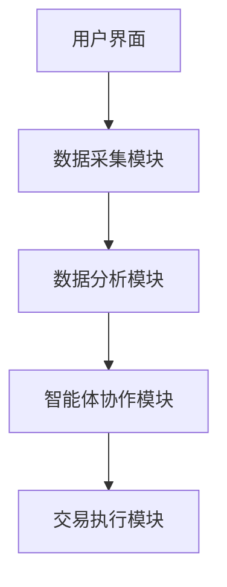

                 


# 多智能体协作进行跨市场套利

> 关键词：多智能体系统、跨市场套利、分布式计算、博弈论模型、一致性算法、ER实体关系图

> 摘要：本文探讨了多智能体协作在跨市场套利中的应用，详细分析了多智能体系统的原理、跨市场套利的核心模型，以及实现这些模型的具体算法。通过构建ER实体关系图和系统架构图，展示了如何利用多智能体协作进行套利机会检测、风险评估和交易执行。文章最后通过Python代码实现了一个实际案例，验证了多智能体协作在跨市场套利中的有效性和优势。

---

## 第1章: 多智能体协作与跨市场套利概述

### 1.1 多智能体系统的定义与特点

多智能体系统（Multi-Agent System, MAS）由多个智能体组成，这些智能体能够自主决策、协作完成任务。其特点包括：

- **自主性**：每个智能体独立决策。
- **反应性**：能感知环境并实时调整行为。
- **协作性**：通过通信和协作完成复杂任务。
- **学习能力**：能从经验中学习和优化。

### 1.2 跨市场套利的定义与特点

跨市场套利是指在不同市场之间利用价格差异进行无风险或低风险交易。其特点包括：

- **价格差异**：利用不同市场的价格波动。
- **低风险**：通常通过套利机制降低风险。
- **跨市场性**：涉及多个市场的交易。

### 1.3 多智能体协作在跨市场套利中的作用

多智能体协作通过分布式决策和信息共享，提高套利效率和降低风险。具体作用包括：

- **分布式决策**：多个智能体协同决策，避免单点故障。
- **信息共享**：实时共享市场数据，快速发现套利机会。
- **风险分散**：通过协作降低市场波动带来的风险。

---

## 第2章: 多智能体协作的原理与模型

### 2.1 多智能体协作的基本原理

多智能体协作需要智能体之间的通信和信息共享。核心机制包括：

- **通信协议**：定义智能体之间信息交换的格式和方式。
- **协调机制**：确保智能体协同工作，避免冲突。

### 2.2 跨市场套利的核心模型

跨市场套利的核心模型包括：

- **价差模型**：检测不同市场之间的价格差异。
- **套利机会检测模型**：识别可操作的套利机会。
- **风险评估模型**：评估套利交易的风险。

### 2.3 多智能体协作的ER实体关系图

ER实体关系图展示了多智能体协作中的关键实体及其关系：

```mermaid
er
  entity 智能体 {
    类别：字符串
    状态：字符串
  }
  entity 市场 {
    市场ID：整数
    价格：数值
  }
  entity 交易 {
    交易ID：整数
    时间：时间戳
    利润：数值
  }
  entity 套利机会 {
    机会ID：整数
    市场对：市场对
    价格差：数值
  }

  智能体 -> 市场：监控
  智能体 -> 交易：执行
  智能体 -> 套利机会：检测
```

---

## 第3章: 多智能体协作算法的数学模型与实现

### 3.1 分布式一致性算法

分布式一致性算法确保多个智能体状态一致。数学模型：

$$\text{一致性条件} = \text{所有智能体状态一致}$$

实现步骤：

1. 初始化：每个智能体设置初始状态。
2. 通信：智能体之间交换状态信息。
3. 状态更新：基于一致性的算法调整状态。

### 3.2 博弈论模型

博弈论模型用于智能体之间的协作决策。数学模型：

$$\text{纳什均衡} = \text{所有智能体策略稳定}$$

实现步骤：

1. 状态评估：每个智能体评估当前市场状态。
2. 策略选择：基于纳什均衡选择最优策略。
3. 执行交易：根据策略执行套利交易。

### 3.3 算法实现的Python代码示例

以下代码实现一个多智能体协作的套利系统：

```python
import threading
import time

class Agent:
    def __init__(self, market):
        self.market = market
        self.price = 0
        self.strategy = None

    def update_price(self, new_price):
        self.price = new_price

    def execute_trade(self):
        if self.strategy:
            # 执行交易逻辑
            pass

class Market:
    def __init__(self, name):
        self.name = name
        self.agents = []
        self.prices = {}

    def add_agent(self, agent):
        self.agents.append(agent)

    def update_prices(self, prices):
        self.prices = prices
        for agent in self.agents:
            agent.update_price(prices.get(self.name, 0))

class TradingSystem:
    def __init__(self, markets):
        self.markets = markets
        self.agents = []

    def create_agents(self, num_agents):
        for _ in range(num_agents):
            agent = Agent(self.markets[0])
            self.agents.append(agent)
            self.markets[0].add_agent(agent)

    def run_agents(self):
        for agent in self.agents:
            thread = threading.Thread(target=agent.execute_trade)
            thread.start()

# 示例用法
if __name__ == "__main__":
    markets = ["market1", "market2"]
    system = TradingSystem(markets)
    system.create_agents(2)
    system.run_agents()
```

---

## 第4章: 系统分析与架构设计

### 4.1 系统功能设计

系统功能模块包括：

- 数据采集：实时采集市场数据。
- 数据分析：检测套利机会。
- 交易执行：智能体协作执行交易。

### 4.2 系统架构设计

系统架构图：



### 4.3 接口设计

接口设计：

- 数据采集模块：提供市场数据接口。
- 分析模块：提供套利机会接口。
- 交易模块：提供交易执行接口。

---

## 第5章: 项目实战

### 5.1 环境安装

安装必要的库：

```bash
pip install numpy pandas requests threading
```

### 5.2 核心实现

实现多智能体协作的套利系统：

```python
import requests
import threading

class MarketAgent:
    def __init__(self, market):
        self.market = market
        self.prices = {}

    def get_price(self):
        # 模拟API请求
        response = requests.get(f"http://api.{self.market}.com/price")
        return response.json()['price']

    def monitor_price(self):
        while True:
            price = self.get_price()
            print(f"{self.market}: {price}")
            time.sleep(1)

class TradingAgent:
    def __init__(self, market1, market2):
        self.market1 = market1
        self.market2 = market2
        self.agent1 = MarketAgent(market1)
        self.agent2 = MarketAgent(market2)

    def detect_arbitrage_opportunity(self):
        price1 = self.agent1.get_price()
        price2 = self.agent2.get_price()
        if price1 * 1.01 < price2:
            return True
        return False

    def execute_trade(self):
        if self.detect_arbitrage_opportunity():
            print(f"Detect arbitrage opportunity between {self.market1} and {self.market2}")
            # 执行交易逻辑
            pass

# 示例用法
if __name__ == "__main__":
    agent = TradingAgent("market1", "market2")
    t = threading.Thread(target=agent.monitor_price)
    t.start()
```

---

## 第6章: 最佳实践与小结

### 6.1 最佳实践

- **监控延迟**：确保数据采集的实时性。
- **风险控制**：设定止损点和止盈点。
- **市场选择**：选择流动性高的市场。

### 6.2 小结

多智能体协作在跨市场套利中的应用展示了其高效性和优势。通过合理的系统设计和算法实现，可以显著提高套利效率和降低风险。

---

## 附录

### 附录A: 参考文献

1. 维基百科：多智能体系统
2. 维基百科：套利
3. 维基百科：一致性算法

### 附录B: 相关技术资料

1. 一致性算法的实现
2. 博弈论在金融中的应用

---

## 作者

作者：AI天才研究院/AI Genius Institute & 禅与计算机程序设计艺术 /Zen And The Art of Computer Programming

