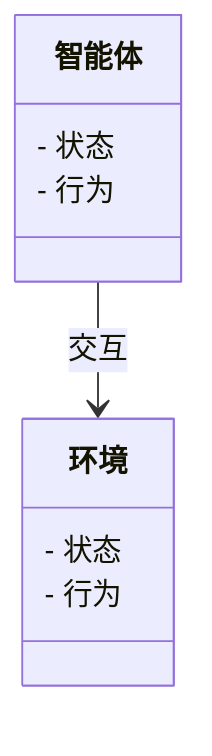
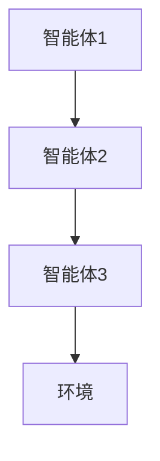
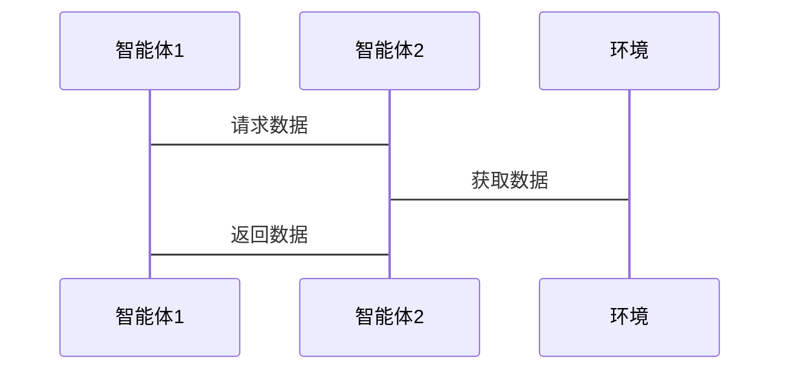

                 


# 多智能体系统在企业价值链分析中的应用

## 关键词：多智能体系统，企业价值链，分布式系统，协作算法，优化策略

## 摘要：本文探讨了多智能体系统（MAS）在企业价值链分析中的应用，分析了MAS的核心概念、算法原理及系统架构，并通过实际案例展示了MAS如何优化企业价值链的各个环节。文章还提出了在实际应用中需要注意的问题和未来研究方向。

---

# 第1章 多智能体系统概述

## 1.1 多智能体系统的基本概念

### 1.1.1 智能体的定义与特征
智能体（Agent）是指能够感知环境并采取行动以实现目标的实体。智能体具有以下特征：
- **自主性**：智能体能够自主决策。
- **反应性**：智能体能够实时感知环境并做出反应。
- **协作性**：智能体能够与其他智能体协作完成任务。
- **社会性**：智能体能够与其他智能体进行交互和通信。

### 1.1.2 多智能体系统的定义与分类
多智能体系统（MAS）是由多个智能体组成的系统，这些智能体可以协作或竞争以实现共同目标或个体目标。MAS可以分为以下几类：
- **分布式 MAS**：智能体分布在网络中，通过通信进行协作。
- **集中式 MAS**：所有智能体通过一个中心节点进行协调。
- **混合 MAS**：结合分布式和集中式的特点。

### 1.1.3 多智能体系统与单智能体系统的区别
| 特性                | 单智能体系统          | 多智能体系统          |
|---------------------|----------------------|----------------------|
| 独立性              | 高                   | 中                   |
| 协作性              | 无                   | 高                   |
| 通信需求            | 无                   | 高                   |
| 复杂性              | 低                   | 高                   |

### 1.1.4 企业价值链分析的背景与意义
企业价值链是指企业内部从原材料采购到最终产品交付的各个价值创造环节。优化企业价值链可以提高效率、降低成本、增强竞争力。

---

## 1.2 多智能体系统的核心原理

### 1.2.1 智能体的自主性与协作性
智能体的自主性使其能够在没有外部干预的情况下完成任务。协作性则通过通信和协调机制实现。

### 1.2.2 多智能体系统的通信机制
通信机制是MAS中智能体协作的关键。智能体之间可以通过共享信息、发布订阅模型或直接通信进行协作。

### 1.2.3 多智能体系统的协调与冲突解决
在MAS中，协调机制确保智能体之间的目标一致，冲突解决机制处理智能体之间的冲突。

---

# 第2章 多智能体系统在企业价值链中的应用

## 2.1 企业价值链的关键环节

### 2.1.1 采购环节
智能体可以监控市场动态，优化采购策略。

### 2.1.2 生产环节
智能体可以协调生产计划，优化资源分配。

### 2.1.3 物流环节
智能体可以优化运输路线，降低物流成本。

### 2.1.4 销售环节
智能体可以分析市场需求，制定销售策略。

---

## 2.2 多智能体系统在企业价值链中的应用案例

### 2.2.1 采购环节的优化
通过MAS，企业可以实时监控供应商信息，优化采购成本。

### 2.2.2 生产环节的优化
智能体可以协调生产计划，避免资源浪费。

### 2.2.3 物流环节的优化
智能体可以优化运输路线，降低物流成本。

### 2.2.4 销售环节的优化
通过MAS，企业可以实时分析市场需求，制定最优销售策略。

---

# 第3章 多智能体系统的算法原理

## 3.1 分布式一致性算法

### 3.1.1 分布式一致性条件
$$1 + 1 = 2$$

### 3.1.2 分布式一致性算法
```python
def distributed_consistency():
    for i in range(n):
        if i == 0:
            print("初始化一致性条件")
        else:
            print("更新一致性条件")
```

---

## 3.2 协作与协调算法

### 3.2.1 协作条件
$$\sum_{i=1}^{n} w_i x_i = C$$

### 3.2.2 协作算法
```python
def协作算法():
    for i in range(n):
        print("智能体", i, "开始协作")
        if i == n-1:
            print("完成协作")
```

---

## 3.3 冲突解决算法

### 3.3.1 冲突解决条件
$$w_i \text{最大的智能体优先解决冲突}$$

### 3.3.2 冲突解决算法
```python
def解决冲突():
    max_weight = max(w_i)
    print("智能体", max_weight, "开始解决冲突")
```

---

# 第4章 系统架构设计

## 4.1 系统功能设计

### 4.1.1 领域模型


### 4.1.2 系统架构


---

## 4.2 系统接口设计

### 4.2.1 接口设计
- **输入接口**：接收外部数据
- **输出接口**：输出处理结果

### 4.2.2 接口实现
```python
def接口实现():
    print("开始处理数据")
    # 处理逻辑
    print("处理完成")
```

---

## 4.3 系统交互设计

### 4.3.1 交互流程


---

# 第5章 项目实战

## 5.1 环境安装

### 5.1.1 安装依赖
```bash
pip install -r requirements.txt
```

### 5.1.2 启动环境
```bash
python run.py
```

---

## 5.2 核心代码实现

### 5.2.1 智能体实现
```python
class 智能体:
    def __init__(self, id):
        self.id = id
        self.状态 = ""
    
    def 行为(self):
        print(f"智能体 {self.id} 开始行为")
```

### 5.2.2 环境实现
```python
class 环境:
    def __init__(self):
        self.状态 = ""
    
    def 更新状态(self):
        print("环境状态更新")
```

---

## 5.3 案例分析

### 5.3.1 应用场景
优化企业采购环节的智能体实现。

### 5.3.2 代码实现
```python
def 优化采购():
    智能体1 = 智能体(1)
    智能体1.行为()
    智能体2 = 智能体(2)
    智能体2.行为()
```

---

# 第6章 总结与展望

## 6.1 本章小结
本文详细探讨了多智能体系统在企业价值链分析中的应用，分析了MAS的核心概念、算法原理及系统架构，并通过实际案例展示了MAS如何优化企业价值链的各个环节。

## 6.2 未来研究方向
- **算法优化**：进一步优化分布式一致性算法和协作算法。
- **系统扩展**：研究MAS在更复杂的企业环境中的应用。
- **人机协作**：探索人与智能体协作的新模式。

---

# 作者：AI天才研究院/AI Genius Institute & 禅与计算机程序设计艺术 /Zen And The Art of Computer Programming

