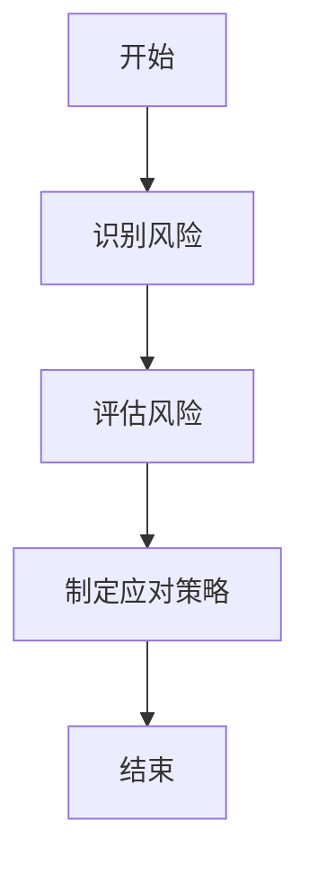

                 


# 多智能体系统在全球供应链风险分析中的角色

> 关键词：多智能体系统，供应链风险分析，分布式计算，博弈论，系统架构

> 摘要：本文探讨了多智能体系统在全球供应链风险分析中的应用，分析了其核心概念、算法原理、系统架构，并通过实际案例展示了其在供应链优化中的优势。文章还总结了多智能体系统的最佳实践，为供应链风险管理提供了新的视角。

---

## 第一部分: 多智能体系统与供应链风险分析概述

### 第1章: 多智能体系统与供应链风险分析的背景

#### 1.1 多智能体系统的定义与特点
多智能体系统（Multi-Agent System, MAS）是由多个智能体组成的分布式系统，这些智能体能够通过协作完成复杂任务。以下是多智能体系统的特点：

- **智能性**：每个智能体都能感知环境并做出决策。
- **自主性**：智能体能够自主行动，无需外部干预。
- **协作性**：智能体之间通过通信和协调完成共同目标。
- **分布性**：智能体分布在不同的位置，通常通过网络连接。

#### 1.2 供应链风险分析的基本概念
供应链风险分析是指识别、评估和应对供应链中的潜在风险，以确保供应链的稳定性和高效性。常见的供应链风险包括：

- **供应风险**：供应商无法按时交付。
- **需求风险**：需求预测不准确。
- **物流风险**：运输延迟或中断。
- **合规风险**：法律法规变化导致的不合规。

#### 1.3 多智能体系统在供应链风险分析中的角色
多智能体系统在供应链风险分析中扮演着关键角色，主要体现在以下几个方面：

- **实时监控**：通过多个智能体实时监控供应链的各个节点，及时发现潜在风险。
- **分布式决策**：智能体能够自主决策，快速应对突发风险。
- **协作优化**：通过智能体之间的协作，优化供应链的整体运作效率。

---

### 第2章: 多智能体系统的核心概念与理论基础

#### 2.1 多智能体系统的核心概念
- **智能体**：智能体是具有感知和行动能力的实体，能够独立决策。
- **多智能体系统**：由多个智能体组成的分布式系统，通过协作完成任务。
- **通信与协调**：智能体之间通过通信协议交换信息，协调行动。

#### 2.2 多智能体系统的理论基础
- **分布式计算**：多智能体系统基于分布式计算，通过网络进行通信和协作。
- **博弈论**：用于分析智能体之间的互动和决策，帮助优化系统性能。
- **状态机模型**：描述智能体的状态转换，用于处理动态环境中的事件。

#### 2.3 多智能体系统的数学模型与公式
多智能体系统可以用状态机模型表示，如下所示：

$$
\text{状态转换} = \text{输入} \rightarrow \text{状态变化} \rightarrow \text{输出}
$$

智能体的决策过程可以用以下公式表示：

$$
\text{决策} = f(\text{状态}, \text{输入}, \text{目标})
$$

---

### 第3章: 多智能体系统在供应链风险分析中的算法原理

#### 3.1 分布式计算与供应链风险分析
- **分布式计算**：通过多个智能体分布在不同节点，实时监控供应链状态。
- **通信协议**：智能体之间通过通信协议交换信息，确保数据一致性和准确性。

#### 3.2 博弈论模型与供应链风险分析
- **博弈论模型**：用于分析智能体之间的互动，优化决策。
- **纳什均衡**：在供应链风险分析中，找到各智能体的最优策略。

#### 3.3 风险评估算法
- **风险评估算法**：通过分析供应链中的潜在风险，评估其影响程度。
- **算法流程图**：使用Mermaid绘制算法流程图，如下所示：



---

## 第二部分: 多智能体系统在供应链风险分析中的应用

### 第4章: 系统分析与架构设计

#### 4.1 供应链风险分析的场景描述
供应链风险分析需要考虑多个因素，如供应商可靠性、市场需求波动等。通过多智能体系统，可以实时监控这些因素，及时发现潜在风险。

#### 4.2 系统功能设计
- **风险识别**：智能体识别供应链中的潜在风险。
- **风险评估**：评估风险的影响程度。
- **风险预警**：通过预警机制，提醒相关人员采取措施。

#### 4.3 系统架构设计
- **分层架构**：分为感知层、决策层和执行层。
- **通信架构**：智能体之间通过网络通信，确保信息共享。

---

### 第5章: 项目实战与案例分析

#### 5.1 项目背景与目标
项目目标是通过多智能体系统优化供应链风险分析，提升供应链的整体效率。

#### 5.2 核心代码实现
以下是核心代码实现：

```python
class Agent:
    def __init__(self, id):
        self.id = id
        self.state = "idle"
    
    def感知(self, 环境):
        # 根据环境变化调整状态
        pass
    
    def行动(self):
        # 根据当前状态采取行动
        pass
```

#### 5.3 实际案例分析
通过案例分析，验证多智能体系统在供应链风险分析中的有效性。例如，某汽车制造商通过多智能体系统实时监控供应链中的潜在风险，成功降低了供应链中断的风险。

---

## 第三部分: 总结与展望

### 第6章: 总结与最佳实践
- **总结**：多智能体系统在供应链风险分析中具有显著优势，能够实时监控和优化供应链。
- **最佳实践**：选择合适的智能体数量和算法，确保系统高效运行。

### 第7章: 未来展望
未来，随着人工智能和物联网技术的发展，多智能体系统在供应链风险分析中的应用将更加广泛，进一步提升供应链的智能化水平。

---

## 作者信息

作者：AI天才研究院/AI Genius Institute & 禅与计算机程序设计艺术 /Zen And The Art of Computer Programming

---

通过以上结构，文章详细介绍了多智能体系统在供应链风险分析中的应用，结合理论、算法和实际案例，为读者提供了全面的视角。

