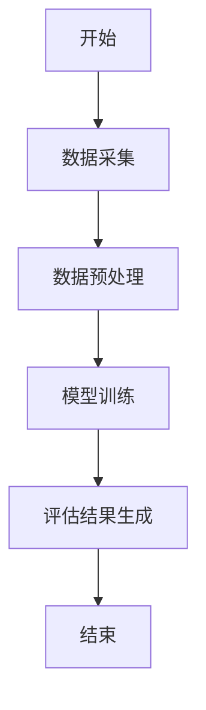
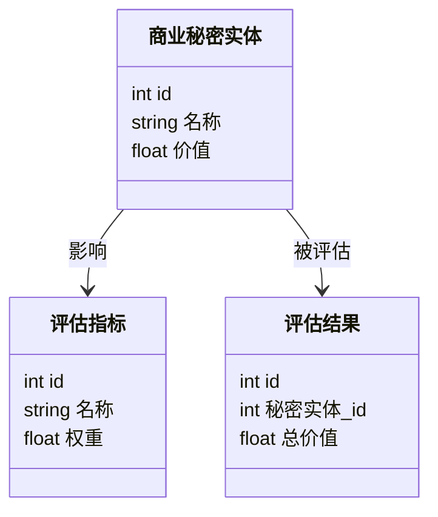
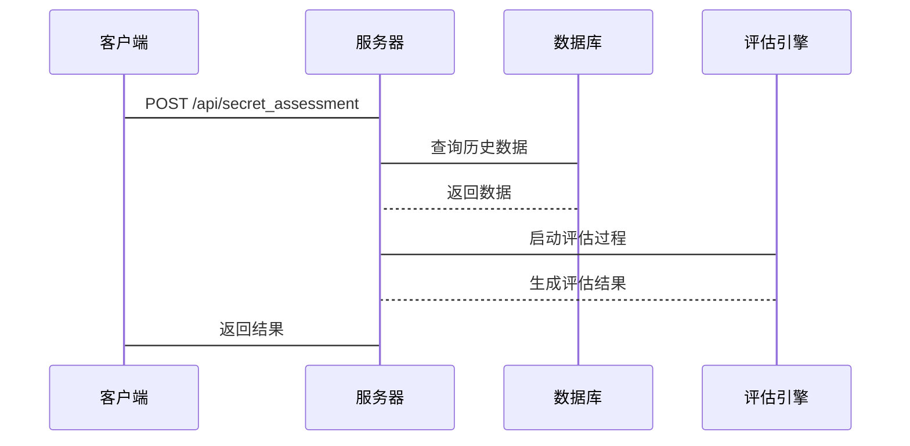

                 


# 多智能体系统在商业秘密价值评估中的应用：挖掘隐藏资产

> 关键词：商业秘密，多智能体系统，价值评估，数据挖掘，风险控制，人工智能

> 摘要：本文探讨了多智能体系统在商业秘密价值评估中的应用，分析了商业秘密的定义、重要性及其评估的挑战，介绍了多智能体系统的原理和优势，详细阐述了其在数据收集、模型构建、风险评估等方面的具体应用，并通过实际案例展示了系统的实现过程。文章最后总结了多智能体系统在商业秘密评估中的优势，并提出了最佳实践建议。

## 第一部分: 多智能体系统与商业秘密概述

### 第1章: 商业秘密与多智能体系统概述

#### 1.1 商业秘密的基本概念

##### 1.1.1 商业秘密的定义与特征

商业秘密是指在商业活动中，不为外界所知悉、能为权利人带来经济利益、具有实用性并经权利人采取保密措施的技术信息和经营信息。其核心特征包括秘密性、价值性和可保护性。

##### 1.1.2 商业秘密的分类与价值评估

商业秘密主要分为技术类和经营类两大类，技术类包括专利、技术诀窍等，经营类包括商业模式、客户信息等。价值评估需考虑其对企业的实际贡献和潜在价值。

##### 1.1.3 商业秘密保护的法律框架

主要涉及《反不正当竞争法》和《民事诉讼法》，强调商业秘密的法律保护和侵权责任。

#### 1.2 多智能体系统的基本概念

##### 1.2.1 多智能体系统的定义与特点

多智能体系统（Multi-Agent System, MAS）由多个智能体构成，每个智能体具备自主性、反应性、协作性和学习性，能够协同完成复杂任务。

##### 1.2.2 多智能体系统的组成与结构

包括智能体、通信机制、协作机制和决策机制，各部分协同工作以实现系统目标。

##### 1.2.3 多智能体系统与单智能体系统的区别

多智能体系统通过多个智能体协作解决问题，单智能体系统则由单一实体完成任务，多智能体系统在复杂问题处理上更具优势。

#### 1.3 商业秘密价值评估的背景与挑战

##### 1.3.1 商业秘密价值评估的必要性

准确评估商业秘密的价值有助于企业在收购、融资等活动中做出明智决策。

##### 1.3.2 传统商业秘密价值评估方法的局限性

传统方法依赖专家经验，主观性强，难以量化，且难以应对大数据环境下的复杂评估需求。

##### 1.3.3 多智能体系统在商业秘密价值评估中的优势

多智能体系统能够高效处理海量数据，提供精准评估结果，并具备良好的扩展性和适应性。

### 第2章: 多智能体系统的核心概念与原理

#### 2.1 多智能体系统的原理

##### 2.1.1 多智能体系统的通信机制

智能体之间通过消息传递进行通信，确保信息共享和协作。

##### 2.1.2 多智能体系统的协作机制

通过任务分配、协调和冲突解决实现协作。

##### 2.1.3 多智能体系统的决策机制

基于分布式决策和群体智能，各智能体协同做出最优决策。

#### 2.2 多智能体系统的属性特征对比

##### 2.2.1 实体关系图（ER图）分析

使用Mermaid绘制的ER图展示了商业秘密评估中的实体关系，包括商业秘密实体、评估指标等。

```mermaid
erDiagram
    customer[CUSTOMER] {
        +int id
        +string name
    }
    secret(SECRET) {
        +int id
        +string name
        +float value
    }
    assessment(ASSESSMENT) {
        +int id
        +int secret_id
        +int customer_id
    }
    customer --> secret : 拥有
    customer --> assessment : 评估
    secret --> assessment : 被评估
```

##### 2.2.2 信息流分析

信息流从数据源流向评估模块，经过处理后生成评估结果。

##### 2.2.3 任务分配与协同

多智能体系统通过任务分配算法实现智能体间的协同工作，如使用协商机制解决冲突。

#### 2.3 多智能体系统的算法原理

##### 2.3.1 多智能体系统的核心算法

基于分布式计算和群体智能的算法，如协商算法和分布式协调算法。

##### 2.3.2 算法流程图（Mermaid）



##### 2.3.3 算法实现代码示例

```python
class Agent:
    def __init__(self, id):
        self.id = id
        self.data = None
    def receive(self, message):
        self.data = message
    def process(self):
        # 数据处理逻辑
        pass
```

### 第3章: 多智能体系统在商业秘密价值评估中的应用

#### 3.1 商业秘密价值评估的流程

##### 3.1.1 数据采集与处理

从企业内部数据库和外部市场数据中获取相关数据，进行清洗和预处理。

##### 3.1.2 价值评估模型构建

基于机器学习和统计分析的方法，构建商业秘密价值评估模型。

##### 3.1.3 风险评估与控制

识别潜在风险因素，制定风险控制策略。

#### 3.2 多智能体系统在商业秘密价值评估中的具体应用

##### 3.2.1 数据挖掘与分析

利用多智能体系统的分布式计算能力，高效分析海量数据，提取关键特征。

##### 3.2.2 价值评估模型的优化

通过智能体间的协作，优化模型参数，提高评估精度。

##### 3.2.3 风险评估与控制策略

智能体实时监控风险因素，动态调整评估策略，确保评估结果的准确性。

### 第4章: 系统架构与设计

#### 4.1 系统架构设计

##### 4.1.1 系统模块划分

包括数据采集模块、评估模块、风险控制模块和用户界面模块。

##### 4.1.2 系统功能设计（领域模型Mermaid类图）



##### 4.1.3 系统架构设计（Mermaid架构图）

```mermaid
containerDiagram
    container 服务器 {
        component 数据库
        component 评估引擎
    }
    container 客户端 {
        component 用户界面
    }
    客户端 --> 服务器 : 请求
    服务器 --> 客户端 : 响应
```

#### 4.2 系统接口设计

##### 4.2.1 系统接口定义

定义RESTful API接口，如`/api/secret_assessment`用于提交评估请求。

##### 4.2.2 接口交互流程（Mermaid序列图）



#### 4.3 系统交互设计

##### 4.3.1 用户与系统交互流程

用户提交评估请求，系统处理后返回结果。

##### 4.3.2 系统内部模块交互流程

各模块协同工作，确保评估过程高效完成。

### 第5章: 项目实战与案例分析

#### 5.1 项目环境安装与配置

##### 5.1.1 开发环境搭建

安装Python、Jupyter Notebook和相关库如scikit-learn、pandas。

##### 5.1.2 工具链安装与配置

安装Mermaid CLI和相关可视化工具。

#### 5.2 系统核心实现

##### 5.2.1 数据采集与处理代码示例

```python
import pandas as pd
data = pd.read_csv('secrets.csv')
print(data.head())
```

##### 5.2.2 价值评估模型实现代码示例

```python
from sklearn.model

