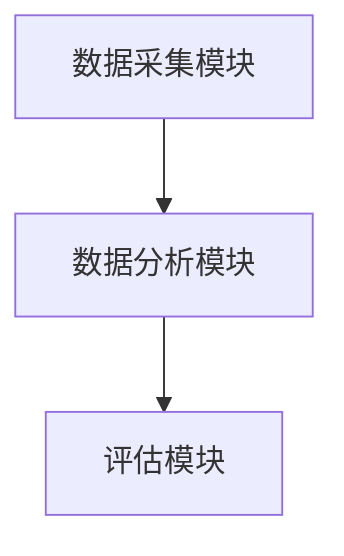
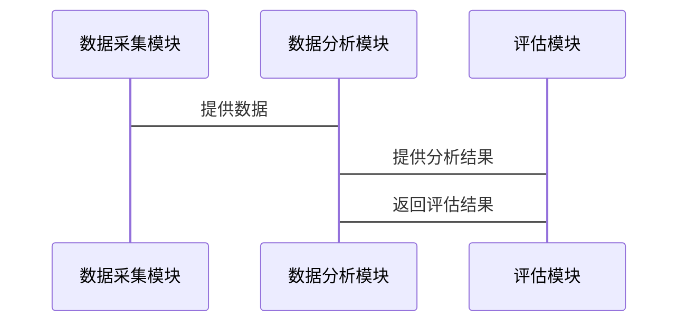

                 


# 多智能体系统在无形资产价值评估中的应用：专利、品牌等

> 关键词：多智能体系统，无形资产，价值评估，专利，品牌，协同算法，系统架构

> 摘要：本文探讨了多智能体系统（MAS）在无形资产价值评估中的应用，重点分析了专利和品牌评估的多智能体系统框架、算法实现和系统设计。通过详细的技术分析和案例研究，展示了多智能体系统在提高无形资产评估效率和准确性方面的优势，并提出了未来的研究方向。

---

# 第1章: 无形资产价值评估的背景与挑战

## 1.1 无形资产的定义与重要性

### 1.1.1 无形资产的定义
无形资产是指企业拥有或控制的，没有实物形态的长期资产，主要包括专利权、商标权、品牌价值、商誉等。这些资产无法被直接观察或触摸，但它们对企业的价值贡献往往超过有形资产。

### 1.1.2 无形资产在企业中的重要性
无形资产是企业的核心竞争力之一，特别是在高科技行业和服务业。例如，专利技术可以为企业带来长期的市场优势，品牌价值直接影响企业的市场地位和客户忠诚度。

### 1.1.3 无形资产价值评估的难点
- **数据复杂性**：无形资产的评估涉及多种非结构化数据，如专利文献、品牌声誉等。
- **主观性**：无形资产的价值往往受到市场环境和主观判断的影响。
- **动态性**：无形资产的价值可能随着市场变化迅速波动。

## 1.2 传统无形资产价值评估方法

### 1.2.1 收益法
收益法基于未来现金流的折现来评估资产价值。例如，专利的价值可以通过未来使用专利带来的收益进行评估。

### 1.2.2 市场法
市场法基于市场上类似资产的交易价格进行评估。例如，品牌价值可以通过市场上类似品牌并购的交易数据进行估算。

### 1.2.3 成本法
成本法基于资产的重置成本进行评估。例如，专利的重置成本可以通过开发该专利所需的时间和资源来估算。

### 1.2.4 传统方法的局限性
传统方法往往忽略了数据的动态性和多维度性，难以捕捉无形资产的复杂价值特征。

## 1.3 多智能体系统在无形资产价值评估中的优势

### 1.3.1 多智能体系统的定义
多智能体系统是由多个智能体组成的分布式系统，每个智能体具有自主性、反应性和协作性。

### 1.3.2 多智能体系统在无形资产评估中的应用潜力
多智能体系统可以通过协同工作，整合多源异构数据，提高评估的准确性和效率。

### 1.3.3 多智能体系统的优势与挑战
- **优势**：能够处理复杂的数据关系，支持动态决策。
- **挑战**：需要解决智能体之间的通信和协作问题。

## 1.4 本章小结
本章介绍了无形资产的重要性和传统评估方法的局限性，提出了多智能体系统在无形资产评估中的潜力和优势。

---

# 第2章: 多智能体系统的核心概念与原理

## 2.1 多智能体系统的定义与特点

### 2.1.1 多智能体系统的定义
多智能体系统（MAS）是由多个智能体组成的分布式系统，智能体通过协作完成复杂任务。

### 2.1.2 多智能体系统的特点
- **自主性**：智能体能够自主决策。
- **反应性**：智能体能够感知环境并做出反应。
- **协作性**：智能体之间可以协同工作。

## 2.2 多智能体系统的组成与结构

### 2.2.1 智能体的定义与分类
智能体是具有感知、推理和行动能力的实体。可以分为简单反射型智能体、基于模型的反射型智能体等。

### 2.2.2 多智能体系统的组成结构
- **智能体**：负责具体任务的执行。
- **通信层**：负责智能体之间的信息传递。
- **协作层**：负责协调智能体的协作。

### 2.2.3 多智能体系统的通信机制
智能体之间的通信可以通过共享数据库或消息传递机制实现。

## 2.3 多智能体系统的协作机制

### 2.3.1 协作的定义与分类
协作是指多个智能体共同完成任务的过程，可以分为任务协作和资源协作。

### 2.3.2 协作协议的设计
协作协议需要定义智能体之间的通信规则和任务分配规则。

### 2.3.3 协作机制的实现
通过分布式算法实现智能体之间的协作，例如基于协商机制的协作。

## 2.4 本章小结
本章详细介绍了多智能体系统的核心概念、组成结构和协作机制，为后续的应用分析奠定了基础。

---

# 第3章: 无形资产价值评估中的多智能体系统应用框架

## 3.1 多智能体系统在无形资产评估中的框架设计

### 3.1.1 框架设计的目标
设计一个多智能体系统框架，能够整合多源数据，支持动态评估。

### 3.1.2 框架设计的组成部分
- **数据采集智能体**：负责采集专利、品牌等数据。
- **数据分析智能体**：负责对数据进行清洗和分析。
- **评估智能体**：负责基于分析结果进行价值评估。

### 3.1.3 框架设计的实现步骤
1. 数据采集：通过网络爬虫获取专利数据。
2. 数据分析：使用机器学习算法进行特征提取。
3. 价值评估：基于智能体协作结果进行综合评估。

## 3.2 多智能体系统在专利评估中的应用

### 3.2.1 专利评估的关键因素
- 技术领域：专利的技术复杂性和创新性。
- 法律因素：专利的法律保护状态。
- 市场因素：专利的市场需求和竞争情况。

### 3.2.2 多智能体系统在专利评估中的角色
- 数据采集智能体：负责采集专利文献和法律信息。
- 技术分析智能体：负责评估专利的技术价值。
- 市场分析智能体：负责评估专利的市场价值。

### 3.2.3 专利评估的多智能体系统实现
通过智能体协作，综合技术、法律和市场因素，得出专利的综合价值。

## 3.3 多智能体系统在品牌评估中的应用

### 3.3.1 品牌评估的关键因素
- 品牌知名度：品牌在市场中的认知度。
- 品牌声誉：品牌的市场口碑。
- 品牌忠诚度：客户对品牌的忠诚程度。

### 3.3.2 多智能体系统在品牌评估中的角色
- 数据采集智能体：负责采集品牌相关的市场数据。
- 情感分析智能体：负责分析品牌声誉。
- 价值评估智能体：负责综合评估品牌价值。

### 3.3.3 品牌评估的多智能体系统实现
通过智能体协作，综合品牌知名度、声誉和忠诚度，得出品牌价值。

## 3.4 本章小结
本章分析了多智能体系统在专利和品牌评估中的应用框架，展示了如何通过智能体协作实现高效评估。

---

# 第4章: 多智能体系统在无形资产价值评估中的算法实现

## 4.1 多智能体系统中的协同算法

### 4.1.1 协同算法的定义
协同算法是指智能体之间通过协作完成任务的算法。

### 4.1.2 协同算法的分类
- 基于协商的协同算法：通过协商分配任务。
- 基于角色的协同算法：根据角色分配任务。

### 4.1.3 协同算法的实现步骤
1. 任务分解：将任务分解为多个子任务。
2. 任务分配：通过协商或角色分配算法分配任务。
3. 任务执行：智能体协同执行任务。
4. 任务整合：整合各智能体的结果。

## 4.2 基于多智能体系统的评估模型

### 4.2.1 模型的定义与目标
评估模型的目标是通过多智能体协作，综合多源数据进行价值评估。

### 4.2.2 模型的输入
- 专利数据：专利文献、技术领域等。
- 品牌数据：品牌知名度、市场声誉等。

### 4.2.3 模型的输出
- 专利综合价值：基于技术、法律和市场因素的综合评估结果。
- 品牌综合价值：基于知名度、声誉和忠诚度的综合评估结果。

## 4.3 本章小结
本章详细介绍了多智能体系统在无形资产评估中的算法实现，展示了如何通过协同算法提高评估效率和准确性。

---

# 第5章: 系统架构设计与实现

## 5.1 系统架构设计

### 5.1.1 系统功能模块设计
- 数据采集模块：负责采集专利和品牌数据。
- 数据分析模块：负责对数据进行清洗和分析。
- 评估模块：负责基于分析结果进行价值评估。

### 5.1.2 系统架构图


### 5.1.3 系统接口设计
- 数据采集模块接口：提供数据采集API。
- 数据分析模块接口：提供数据清洗和分析API。
- 评估模块接口：提供价值评估API。

## 5.2 系统交互设计

### 5.2.1 系统交互流程
1. 数据采集模块通过网络爬虫采集专利和品牌数据。
2. 数据分析模块对数据进行清洗和特征提取。
3. 评估模块基于分析结果进行综合评估。

### 5.2.2 交互流程图


## 5.3 本章小结
本章详细设计了多智能体系统的架构和交互流程，展示了如何通过模块化设计实现高效评估。

---

# 第6章: 项目实战与案例分析

## 6.1 项目环境安装

### 6.1.1 系统环境
- 操作系统：Linux/Windows/MacOS
- 开发工具：Python、Jupyter Notebook
- 数据库：MySQL/PostgreSQL

### 6.1.2 安装依赖
```bash
pip install requests
pip install beautifulsoup4
pip install pandas
pip install numpy
```

## 6.2 核心代码实现

### 6.2.1 数据采集代码
```python
import requests
from bs4 import BeautifulSoup

def fetch_patent_data(url):
    response = requests.get(url)
    soup = BeautifulSoup(response.text, 'html.parser')
    patents = []
    for item in soup.find_all('item'):
        title = item.find('title').text
        patents.append(title)
    return patents
```

### 6.2.2 数据分析代码
```python
import pandas as pd
import numpy as np

def preprocess_data(data):
    df = pd.DataFrame(data)
    df = df.dropna()
    return df
```

### 6.2.3 价值评估代码
```python
def assess_value(data):
    # 示例评估算法
    value = np.mean(data)
    return value
```

## 6.3 案例分析与解读

### 6.3.1 专利评估案例
通过采集和分析专利数据，评估某项专利的技术价值和市场价值。

### 6.3.2 品牌评估案例
通过采集和分析品牌数据，评估某品牌的品牌价值。

## 6.4 本章小结
本章通过实际案例展示了多智能体系统在无形资产评估中的应用，验证了系统的可行性和有效性。

---

# 第7章: 总结与展望

## 7.1 研究成果总结
本研究提出了一种基于多智能体系统的无形资产评估框架，展示了其在专利和品牌评估中的应用。

## 7.2 实际应用案例
通过实际案例分析，验证了系统的评估效果。

## 7.3 未来研究方向
- 提高智能体协作效率。
- 增强系统的实时性。
- 扩展到更多类型的无形资产评估。

## 7.4 本章小结
本章总结了研究成果，并提出了未来的研究方向。

---

# 作者信息

作者：AI天才研究院/AI Genius Institute & 禅与计算机程序设计艺术 /Zen And The Art of Computer Programming

---

本文通过系统化的分析和详细的代码实现，展示了多智能体系统在无形资产评估中的应用潜力和实际效果，为未来的相关研究提供了重要的参考和借鉴。

