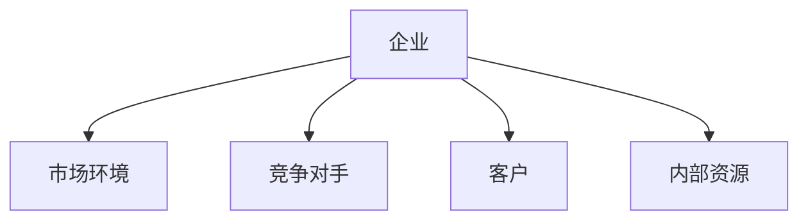
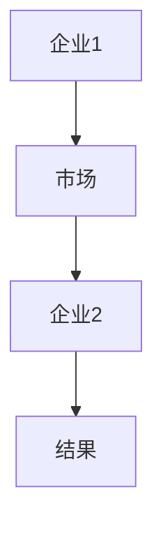
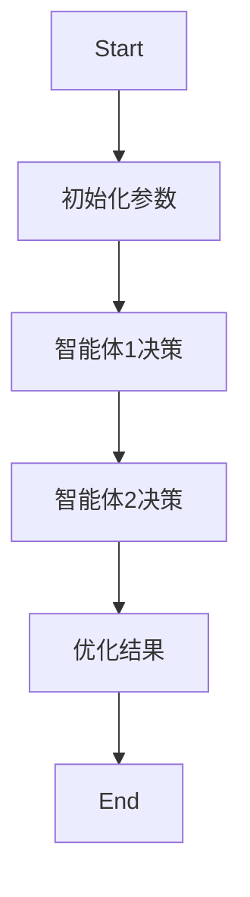
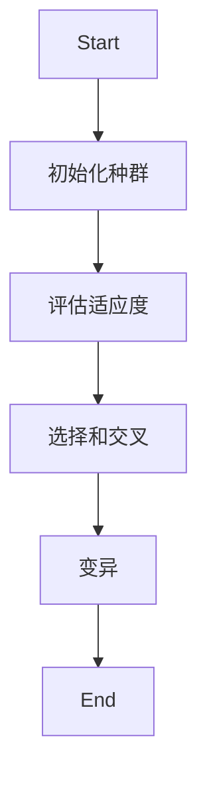
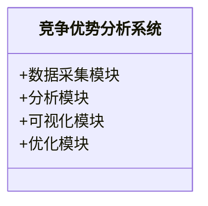
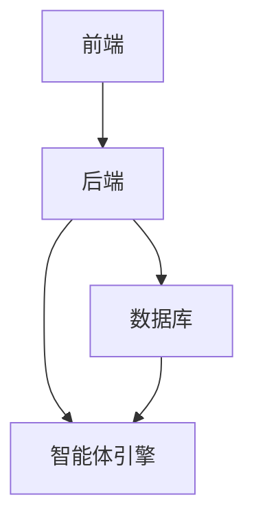
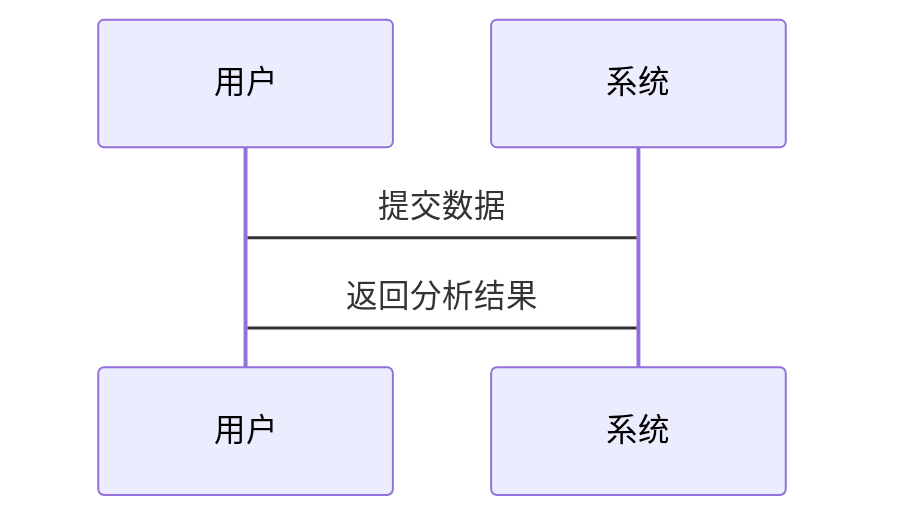

                 


# 多智能体系统在竞争优势分析中的应用：寻找护城河

## 关键词：多智能体系统、竞争优势分析、护城河、博弈论、协同优化、系统架构

## 摘要：  
在现代商业竞争中，竞争优势是企业生存和发展的关键。多智能体系统（Multi-Agent Systems, MAS）作为一种新兴的技术，能够通过分布式智能和协同优化为企业竞争优势分析提供强大的支持。本文将详细探讨多智能体系统在竞争优势分析中的应用，揭示其在构建企业护城河中的潜力。通过理论分析、算法实现和项目实战，本文旨在为企业提供一种新的竞争优势分析方法，帮助企业在复杂多变的市场环境中找到制胜之道。

---

## 第一部分：多智能体系统与竞争优势分析的背景

### 第1章：多智能体系统与竞争优势分析概述

#### 1.1 多智能体系统的基本概念
多智能体系统（MAS）是由多个智能体（Agent）组成的分布式系统，这些智能体能够通过协作和竞争完成复杂任务。智能体具备以下特点：
- **自主性**：智能体能够自主决策。
- **反应性**：能够感知环境并做出实时响应。
- **社交能力**：能够与其他智能体或人类进行交互。
- **协作性**：能够通过协作完成共同目标。

**多智能体系统与单智能体系统的区别**：

| 属性        | 单智能体系统               | 多智能体系统               |
|-------------|--------------------------|--------------------------|
| 决策中心化   | 决策集中于单一实体         | 决策分散，多个智能体协作   |
| 任务处理    | 单一智能体完成所有任务     | 多个智能体协同完成任务     |
| 效率         | 可能受限于单一决策中心     | 通过协作提高整体效率       |
| 复杂性       | 系统简单，易于管理         | 系统复杂，管理难度较大       |

#### 1.2 竞争优势分析的重要性
竞争优势是企业在市场中立足的关键。竞争优势分析涉及对企业资源、能力、战略和外部环境的全面评估。以下是竞争优势分析的几个关键点：
- **资源分析**：评估企业内部资源和能力。
- **外部环境分析**：包括行业趋势、竞争对手分析和市场环境。
- **战略定位**：确定企业在市场中的定位和竞争优势。

#### 1.3 护城河的定义与构建
护城河是企业在竞争中建立的独特优势，使其难以被竞争对手复制或超越。护城河可以分为以下几类：
1. **成本优势**：通过规模效应或流程优化降低成本。
2. **品牌优势**：强大的品牌影响力吸引客户。
3. **技术优势**：拥有独特的技术或专利。
4. **网络效应**：用户越多，平台越有价值。

---

## 第二部分：多智能体系统的理论基础

### 第2章：多智能体系统的核心概念

#### 2.1 智能体的属性与行为
智能体的行为是多智能体系统的核心。以下是智能体的主要属性：
- **知识库**：存储智能体的背景知识。
- **目标设定**：智能体根据目标采取行动。
- **决策机制**：基于感知和知识做出决策。
- **行动执行**：通过行动与环境互动。

#### 2.2 竞争优势的多智能体模型
竞争优势的多智能体模型将企业视为多个智能体的协作系统。以下是一个简单的多智能体模型：



#### 2.3 护城河的多智能体构建
护城河的构建需要多智能体系统的协同优化。以下是构建护城河的步骤：
1. **识别核心资源**：确定企业的核心资源和能力。
2. **优化资源配置**：通过多智能体系统的协作优化资源配置。
3. **动态调整**：根据市场变化动态调整护城河策略。

---

## 第三部分：多智能体系统的算法原理

### 第3章：多智能体系统的算法与实现

#### 3.1 竞争优势分析的算法原理
竞争优势分析的算法包括博弈论、协同优化和进化算法。以下是博弈论的简单模型：



#### 3.2 协同优化算法
协同优化算法通过多个智能体的协作实现资源的最优分配。以下是协同优化算法的流程图：



#### 3.3 进化算法
进化算法通过模拟自然选择的过程优化解决方案。以下是进化算法的流程图：



---

## 第四部分：多智能体系统的系统架构与实现

### 第4章：系统架构与实现

#### 4.1 项目介绍
本项目旨在利用多智能体系统进行竞争优势分析，帮助企业构建护城河。

#### 4.2 系统功能设计
以下是系统的功能模块：



#### 4.3 系统架构设计
以下是系统的架构图：



#### 4.4 系统接口设计
以下是系统的接口设计：



---

## 第五部分：项目实战

### 第5章：项目实战

#### 5.1 环境配置
以下是环境配置：

```bash
# 安装Python依赖
pip install numpy matplotlib
```

#### 5.2 核心代码实现
以下是Python代码实现：

```python
import numpy as np
import matplotlib.pyplot as plt

# 博弈论模型
def game_theory_analysis(players, strategies):
    payoff_matrix = np.zeros((len(players), len(strategies)))
    for i in range(len(players)):
        for j in range(len(strategies)):
            payoff_matrix[i][j] = np.random.randint(0, 100)
    return payoff_matrix

# 协同优化算法
def collaborative_optimization(players, resources):
    # 初始化参数
    # 算法实现
    pass

# 可视化
def visualize_results(results):
    plt.plot(results)
    plt.show()

# 测试
players = 3
strategies = 4
resources = 5

payoff = game_theory_analysis(players, strategies)
results = collaborative_optimization(players, resources)
visualize_results(results)
```

---

## 第六部分：总结与展望

### 第6章：总结与展望

#### 6.1 总结
多智能体系统在竞争优势分析中的应用为企业提供了新的思路。通过多智能体系统的协同优化，企业可以更好地构建护城河，提升竞争力。

#### 6.2 展望
未来，随着人工智能技术的发展，多智能体系统在竞争优势分析中的应用将更加广泛。企业可以利用多智能体系统实现更高效的资源优化和战略制定。

#### 6.3 最佳实践
- **数据质量**：确保数据的准确性和完整性。
- **算法选择**：根据具体情况选择合适的算法。
- **持续优化**：定期评估和优化竞争优势分析模型。

---

## 作者信息

作者：AI天才研究院/AI Genius Institute & 禅与计算机程序设计艺术 /Zen And The Art of Computer Programming

