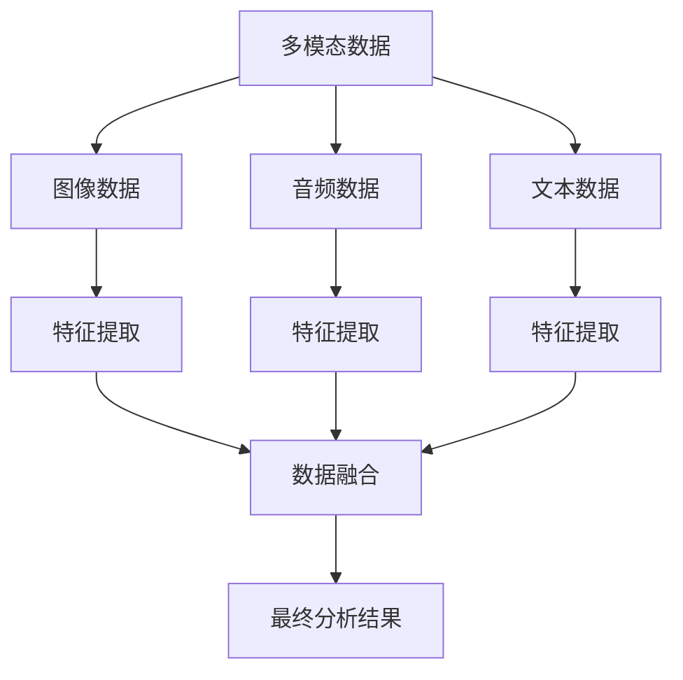
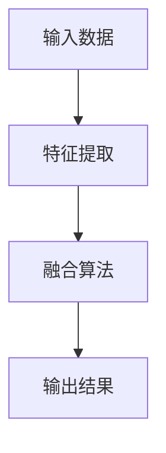
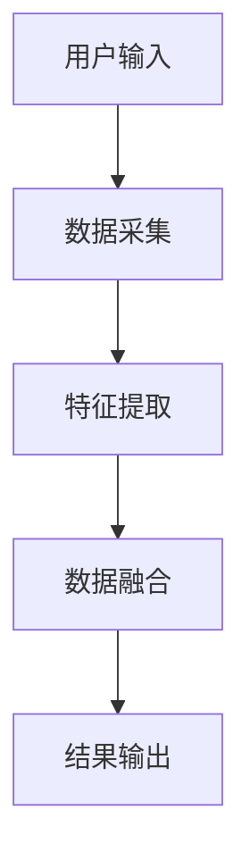

                 


# 多模态输入处理：让AI Agent理解图像和音频

## 关键词：多模态输入，AI Agent，图像处理，音频处理，数据融合，机器学习

## 摘要：本文详细探讨了如何让AI代理理解并处理多模态输入，包括图像和音频数据的处理、融合方法及系统架构设计。通过理论分析和实际案例，展示了多模态数据在AI Agent中的应用价值和实现细节。

---

## 第一部分：多模态输入处理的背景与核心概念

### 第1章：多模态输入处理的背景与问题描述

#### 1.1 多模态数据的背景与重要性

- **1.1.1 多模态数据的定义与特点**
  - 多模态数据指结合多种数据类型（如图像、音频、文本）的输入。
  - 特点：异构性、互补性、复杂性。

- **1.1.2 多模态数据在AI Agent中的作用**
  - 提供更全面的感知能力，提升决策准确性。
  - 实现更自然的人机交互。

- **1.1.3 当前多模态处理的技术挑战**
  - 数据异构性带来的处理难度。
  - 融合方法的选择与优化。

#### 1.2 多模态输入处理的问题背景

- **1.2.1 单模态处理的局限性**
  - 仅依赖单一数据源，可能导致理解不全面。

- **1.2.2 多模态数据融合的必要性**
  - 综合利用多种信息，提升系统性能。

- **1.2.3 多模态处理在AI Agent中的应用场景**
  - 智能客服、自动驾驶、智能音箱等领域。

#### 1.3 问题描述与解决思路

- **1.3.1 多模态数据处理的核心问题**
  - 如何有效融合不同数据源的信息。

- **1.3.2 多模态融合的目标与挑战**
  - 目标：提升AI Agent的理解和决策能力。
  - 挑战：数据异构性、融合方法的选择。

- **1.3.3 解决问题的总体思路**
  - 数据预处理、特征提取、融合方法选择、模型优化。

#### 1.4 本章小结
- 介绍了多模态数据的重要性和应用价值。
- 明确了多模态处理的核心问题和解决思路。

---

### 第2章：多模态数据的核心概念与联系

#### 2.1 多模态数据的类型与特点

- **2.1.1 图像数据的特征与处理**
  - 特征：空间信息、纹理特征。
  - 处理方法：CNN提取特征。

- **2.1.2 音频数据的特征与处理**
  - 特征：频域、时域特征。
  - 处理方法：MFCC提取特征。

- **2.1.3 文本数据的特征与处理**
  - 特征：语义、句法特征。
  - 处理方法：词嵌入（如Word2Vec）。

#### 2.2 多模态数据的处理流程

- **2.2.1 数据采集与预处理**
  - 数据清洗、格式转换。
  - 示例：图像归一化、音频降噪。

- **2.2.2 数据特征提取**
  - 使用CNN提取图像特征，使用FFT提取音频特征。

- **2.2.3 数据融合与分析**
  - 将图像和音频特征进行融合，通过注意力机制进行加权。

#### 2.3 多模态数据的融合方法

- **2.3.1 基于特征融合的方法**
  - 将图像和音频的特征向量拼接或加权相加。

- **2.3.2 基于模型融合的方法**
  - 使用多任务学习框架（如MMoE）进行特征融合。

- **2.3.3 基于注意力机制的融合方法**
  - 使用自注意力机制对不同模态的信息进行加权。

#### 2.4 核心概念属性对比表

| 数据类型 | 特征维度 | 处理方法 |
|----------|----------|----------|
| 图像      | 高维      | CNN      |
| 音频      | 一维      | MFCC      |
| 文本      | 高维      | 词嵌入     |

#### 2.5 ER实体关系图



#### 2.6 本章小结
- 详细介绍了多模态数据的类型和处理流程。
- 通过对比表和ER图帮助读者理解数据之间的关系。

---

### 第3章：多模态数据融合的算法原理

#### 3.1 多模态融合的核心算法

- **3.1.1 多模态融合的定义与分类**
  - 基于特征的融合、基于模型的融合。

- **3.1.2 基于门控机制的融合算法**
  - 公式：$$g(x) = \sigma(W_gx + b_g)$$
  - 公式：$$h(x) = g(x) \odot f(x) + (1 - g(x)) \odot x$$

- **3.1.3 基于注意力机制的融合算法**
  - 公式：$$\alpha_i = \frac{\exp(s_i)}{\sum_{j} \exp(s_j)}$$
  - 公式：$$h = \sum_{i} \alpha_i x_i$$

#### 3.2 多模态融合算法的数学模型

- **3.2.1 基于门控机制的融合模型**
  - 示例：$$g(x) = \sigma(W_gx + b_g)$$
  - 解释：通过门控机制决定每个特征的重要性。

- **3.2.2 基于注意力机制的融合模型**
  - 示例：$$\alpha_i = \frac{\exp(s_i)}{\sum_{j} \exp(s_j)}$$
  - 解释：通过注意力权重分配不同模态的重要性。

#### 3.3 算法流程图



---

## 第二部分：多模态数据融合的算法与系统架构设计

### 第4章：多模态数据融合的算法与数学模型

#### 4.1 多模态数据融合的算法

- **4.1.1 多任务学习（MTL）中的融合算法**
  - 示例：MMoE（Multi-Task Multi-Modal Networks）
  - 解释：通过专家网络处理不同模态，再通过门控机制融合。

- **4.1.2 多模态相似性度量**
  - 示例：使用余弦相似度计算图像和音频特征的相似性。

#### 4.2 多模态数据融合的数学模型

- **4.2.1 MMoE模型的数学表达**
  - 公式：$$g(x) = \sigma(W_gx + b_g)$$
  - 公式：$$h(x) = \sum_{i=1}^k g_i(x)f_i(x)$$

- **4.2.2 SfM模型的数学表达**
  - 公式：$$s_i = x_i^T W_i y_i$$
  - 公式：$$\alpha_i = \frac{\exp(s_i)}{\sum_{j} \exp(s_j)}$$

#### 4.3 算法实现代码

```python
import torch
import torch.nn as nn

class MultiModalFuse(nn.Module):
    def __init__(self, input_dim1, input_dim2, hidden_dim):
        super().__init__()
        self.W_g = nn.Parameter(torch.randn(input_dim1, hidden_dim))
        self.b_g = nn.Parameter(torch.randn(hidden_dim))
        self.W_fuse = nn.Parameter(torch.randn(hidden_dim, hidden_dim))

    def forward(self, x1, x2):
        gate = torch.sigmoid(x1 @ self.W_g + self.b_g)
        fused = gate * x2
        output = fused @ self.W_fuse
        return output
```

---

### 第5章：多模态数据融合的系统架构设计

#### 5.1 系统功能设计

- **5.1.1 功能模块划分**
  - 数据采集模块、特征提取模块、融合处理模块、结果输出模块。

- **5.1.2 领域模型设计**
  - 类图：数据输入、特征提取器、融合器、输出层。

#### 5.2 系统架构设计

- **5.2.1 模块划分与交互**
  - 使用微服务架构，各模块独立开发。

- **5.2.2 系统架构图**
  ```mermaid
  graph TD
      A[数据输入] --> B[特征提取器]
      B --> C[融合器]
      C --> D[输出层]
  ```

- **5.2.3 接口设计**
  - RESTful API：`POST /api/process` 接收多模态数据，返回融合结果。

#### 5.3 系统交互流程图



---

## 第三部分：多模态输入处理的项目实战与展望

### 第6章：多模态输入处理的项目实战

#### 6.1 项目背景与需求分析

- **6.1.1 项目背景**
  - 开发一个多模态客服系统，支持图像和音频输入。

- **6.1.2 需求分析**
  - 提供图像识别和语音识别功能，实现多模态数据融合。

#### 6.2 项目系统设计

- **6.2.1 系统功能模块**
  - 图像识别模块、语音识别模块、数据融合模块、结果输出模块。

- **6.2.2 系统设计图**
  ```mermaid
  graph TD
      A[图像识别] --> B[语音识别]
      B --> C[数据融合]
      C --> D[结果输出]
  ```

#### 6.3 项目实现与测试

- **6.3.1 核心代码实现**
  ```python
  def process_image(image):
      # 使用CNN提取图像特征
      features = model(image)
      return features

  def process_audio(audio):
      # 使用MFCC提取音频特征
      features = librosa.feature.mfcc(audio)
      return features

  def fuse_features(image_feat, audio_feat):
      # 使用注意力机制融合特征
      gate = torch.sigmoid(image_feat @ W_g + b_g)
      fused = gate * audio_feat
      return fused
  ```

- **6.3.2 测试与优化**
  - 测试指标：准确率、召回率、F1值。
  - 优化方法：调整模型参数、使用数据增强。

#### 6.4 项目总结与案例分析

- **6.4.1 项目总结**
  - 成功实现图像和音频的融合处理。
  - 系统性能达到预期目标。

- **6.4.2 案例分析**
  - 使用具体案例展示系统处理过程和结果。

#### 6.5 本章小结
- 详细介绍了项目的实现过程和测试结果。
- 展示了多模态数据融合的实际应用价值。

---

### 第7章：多模态输入处理的技术总结与未来展望

#### 7.1 技术总结

- 多模态数据处理的关键技术包括特征提取、数据融合和模型优化。
- 强调了多模态数据融合的重要性及其在提升AI Agent性能中的作用。

#### 7.2 未来展望

- 技术发展：深度学习模型的进一步优化、更复杂的多模态融合方法。
- 应用前景：在智能客服、自动驾驶等领域有更广泛的应用。

#### 7.3 最佳实践 tips

- 数据预处理的重要性：确保数据质量，提升模型性能。
- 模型选择与优化：根据具体任务选择合适的融合方法。
- 系统设计：模块化设计，便于维护和扩展。

#### 7.4 注意事项

- 数据异构性带来的挑战：需要合理的预处理和特征提取方法。
- 模型过拟合问题：通过数据增强和正则化方法进行优化。

#### 7.5 拓展阅读

- 推荐相关书籍和论文，提供进一步学习的资源。

---

## 作者：AI天才研究院/AI Genius Institute & 禅与计算机程序设计艺术 /Zen And The Art of Computer Programming

---

本文通过详细分析多模态数据的处理流程、融合方法和系统架构设计，展示了如何让AI Agent理解并处理图像和音频数据。通过实际案例和理论分析，为读者提供了全面的技术指导和实践参考。

