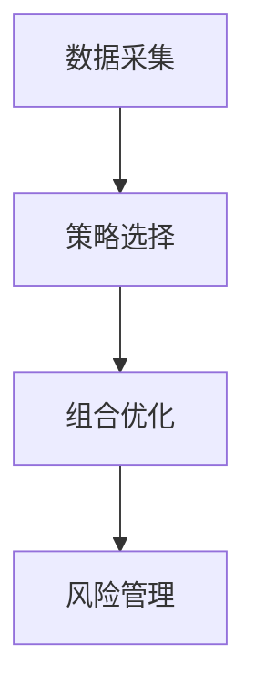
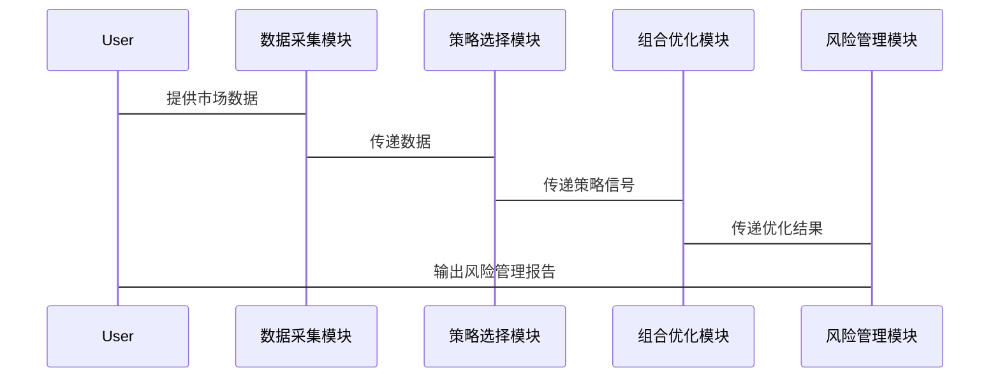

                 

# 多策略投资组合：综合运用不同投资方法

## 关键词：多策略投资、投资组合、投资策略、风险分散、资产配置

## 摘要：多策略投资组合是一种结合多种投资策略的综合性投资方法，旨在通过优化策略组合来实现收益与风险的最佳平衡。本文将从多策略投资的背景与概念出发，详细分析不同投资策略的类型与特点，探讨多策略投资组合的数学模型与算法原理，结合系统架构设计与项目实战，深入剖析多策略投资组合的实现过程，并总结最佳实践与注意事项。

---

## 第一部分: 多策略投资组合概述

### 第1章: 多策略投资组合的背景与概念

#### 1.1 多策略投资的背景
##### 1.1.1 投资市场的复杂性与不确定性
投资市场是一个复杂且不确定的环境，受多种因素影响，包括经济周期、政策变化、市场情绪等。单一投资策略往往难以应对市场的波动，无法在不同市场环境下稳定获取收益。因此，多策略投资应运而生，通过结合多种策略，投资者可以在不同市场条件下灵活调整投资组合，降低风险并提高收益。

##### 1.1.2 多策略投资的兴起
随着金融市场的不断发展，投资者对多样化投资策略的需求日益增加。多策略投资通过整合不同类型的策略（如趋势跟踪、均值回归、价值投资等），能够在不同市场环境下优化收益和风险。此外，技术的进步（如大数据分析和算法交易）也为多策略投资的实施提供了更多可能性。

##### 1.1.3 多策略投资与传统投资的区别
传统投资通常依赖于单一策略或少量策略的组合，而多策略投资则强调广泛使用多种策略，并通过数学优化方法来动态调整策略权重。多策略投资更注重策略之间的协同效应和风险分散，能够在复杂市场环境中保持稳定性。

#### 1.2 多策略投资的核心概念
##### 1.2.1 多策略投资的定义
多策略投资是指在投资组合中同时运用多种不同策略，通过策略之间的互补性和协同效应，实现收益的最大化和风险的最小化。多策略投资的核心在于策略的选择、权重分配和动态调整。

##### 1.2.2 多策略投资的特征
- **多样性**：同时运用多种策略，覆盖不同的市场环境和资产类别。
- **灵活性**：根据市场变化动态调整策略权重。
- **风险分散**：通过策略间的互补性降低投资组合的整体风险。
- **收益增强**：不同策略在不同市场环境下表现各异，通过优化组合可以提升整体收益。

##### 1.2.3 多策略投资的边界与外延
多策略投资的边界在于策略的选择和组合优化，而外延则包括策略的实施、监控和调整。多策略投资可以应用于股票、债券、期货等多种资产类别，也可以结合量化交易和人工判断。

#### 1.3 多策略投资的策略类型
##### 1.3.1 主流投资策略概述
- **趋势跟踪策略**：基于价格趋势进行投资，常见于商品期货和股票市场。
- **均值回归策略**：假设价格会回归长期均值，常见于股票和外汇市场。
- **价值投资策略**：基于对公司基本面的分析，寻找被低估的资产。
- **对冲策略**：通过做多和做空相结合，降低市场风险。
- **其他创新策略**：如因子投资、算法交易等。

##### 1.3.2 趋势跟踪策略
趋势跟踪策略通过技术指标（如移动平均线、MACD等）识别价格趋势，适合在趋势性较强的市场中使用。

##### 1.3.3 均值回归策略
均值回归策略假设价格会围绕长期均值波动，常见于股票和外汇市场，适合在市场波动较大时使用。

##### 1.3.4 价值投资策略
价值投资策略基于对公司基本面的分析，寻找被市场低估的资产，适合长期投资。

##### 1.3.5 对冲策略
对冲策略通过同时做多和做空相关资产，降低市场风险，常用于对冲基金。

##### 1.3.6 其他创新策略
如因子投资策略、算法交易策略等，基于大数据和量化模型进行投资。

---

### 第2章: 多策略投资组合的核心概念与联系

#### 2.1 多策略投资组合的数学模型
##### 2.1.1 投资组合的收益与风险模型
投资组合的收益可以用期望收益率表示，风险可以用方差或标准差衡量。多策略投资组合的目标是在收益与风险之间找到最佳平衡点。

##### 2.1.2 马科维茨均值-方差模型
马科维茨均值-方差模型是多策略投资组合优化的基础，通过最小化投资组合的方差（风险）来实现收益最大化。公式如下：
$$\text{min} \sum_{i=1}^n w_i^2 \sigma_i^2 + 2 w_i w_j \sigma_{ij}$$
$$\text{s.t.} \sum_{i=1}^n w_i = 1$$
其中，$w_i$ 是第 $i$ 个策略的权重，$\sigma_i^2$ 是第 $i$ 个策略的方差，$\sigma_{ij}$ 是第 $i$ 个和第 $j$ 个策略之间的协方差。

##### 2.1.3 CAPM与APT模型
CAPM（资本资产定价模型）和APT（ arbitrage pricing theory）模型提供了资产定价的理论框架，可用于多策略投资组合的收益预测和风险评估。

#### 2.2 策略之间的关系分析
##### 2.2.1 策略间的相关性分析
策略间的相关性影响投资组合的风险。相关性较高的策略可能导致投资组合的波动性增加，而相关性较低的策略可以有效分散风险。

##### 2.2.2 策略间的协同效应
协同效应是指不同策略在某些市场条件下能够相互增强收益，例如在趋势跟踪策略表现不佳时，均值回归策略可能表现较好。

##### 2.2.3 策略间的风险分散效应
通过组合不同类型的策略，可以有效分散投资风险，降低投资组合的波动性。

#### 2.3 策略与市场的关系
##### 2.3.1 策略的有效性与市场环境
不同策略在不同市场环境下的表现差异显著。例如，趋势跟踪策略在牛市中表现较好，而在熊市中可能表现不佳。

##### 2.3.2 策略在不同市场周期的表现
不同策略在经济周期的各个阶段（如复苏、过热、滞胀、衰退）中的表现不同，需要根据市场环境动态调整策略权重。

##### 2.3.3 策略的适应性与可扩展性
策略的适应性是指其在不同市场环境下的表现，可扩展性是指策略能否应对资产规模的变化。

---

### 第3章: 多策略投资组合的算法原理

#### 3.1 多策略组合优化算法
##### 3.1.1 现代投资组合理论（MPT）算法
MPT算法通过优化策略权重，使投资组合的收益最大，同时风险最小。常用的优化方法包括拉格朗日乘数法和遗传算法。

##### 3.1.2 非线性优化算法
非线性优化算法用于解决复杂的优化问题，如约束条件下的全局优化。

##### 3.1.3 遗传算法与模拟退火算法
遗传算法和模拟退火算法是一种全局优化方法，适用于复杂的多策略投资组合优化问题。

#### 3.2 策略权重分配算法
##### 3.2.1 等权重分配
将相同权重分配给所有策略，简单但可能无法优化收益与风险。

##### 3.2.2 风险调整后权重分配
根据策略的风险调整权重，使投资组合的风险最小化。

##### 3.2.3 基于策略表现的动态权重分配
根据策略的历史表现动态调整权重，适合市场环境变化较大的情况。

#### 3.3 策略筛选与排序算法
##### 3.3.1 策略表现评估指标
常用的指标包括夏普比率、索特比率和最大回撤等。

##### 3.3.2 策略筛选的马科维茨优化
使用马科维茨均值-方差模型筛选最优策略组合。

##### 3.3.3 策略排序的层次分析法
层次分析法（AHP）用于多策略组合的权重分配，考虑多个因素的综合影响。

---

### 第4章: 多策略投资组合的系统分析与架构设计

#### 4.1 投资组合管理系统架构
##### 4.1.1 系统功能模块划分
- 数据采集模块：获取市场数据和策略信号。
- 策略选择模块：筛选和排序策略。
- 组合优化模块：优化策略权重。
- 风险管理模块：监控和调整投资组合风险。

##### 4.1.2 系统功能流程图

##### 4.1.3 系统架构设计
采用分层架构，包括数据层、业务逻辑层和用户界面层。

#### 4.2 系统接口与交互设计
##### 4.2.1 系统输入接口设计
- 数据接口：接收市场数据和策略信号。
- 用户输入：动态调整策略权重和风险管理参数。

##### 4.2.2 系统输出接口设计
- 输出组合优化结果。
- 输出风险管理报告。

##### 4.2.3 系统交互流程图

---

### 第5章: 多策略投资组合的项目实战

#### 5.1 项目环境搭建
##### 5.1.1 Python环境安装
安装Python和相关库（如NumPy、Pandas、Scipy等）。

##### 5.1.2 数据获取与处理
通过API获取市场数据，清洗和预处理数据。

##### 5.1.3 算法库安装
安装优化算法库（如Scipy.optimize）和机器学习库（如sklearn）。

#### 5.2 系统核心实现
##### 5.2.1 策略选择与权重分配代码实现
使用马科维茨优化算法选择策略组合，并根据策略表现动态调整权重。

##### 5.2.2 投资组合优化算法实现
实现非线性优化算法，优化投资组合的收益与风险。

##### 5.2.3 系统交互界面设计
设计用户友好的交互界面，方便用户调整策略和监控投资组合。

#### 5.3 项目案例分析
##### 5.3.1 案例背景介绍
以股票投资为例，介绍多策略投资组合的应用场景。

##### 5.3.2 数据分析与策略选择
通过数据分析选择适合的策略组合，并进行优化。

##### 5.3.3 投资组合优化与结果展示
展示优化后的投资组合收益与风险，并进行回测和验证。

---

### 第6章: 多策略投资组合的最佳实践与总结

#### 6.1 最佳实践 tips
- 策略选择要多样化，涵盖不同市场环境和资产类别。
- 动态调整策略权重，适应市场变化。
- 注意策略之间的相关性，避免过度集中风险。

---

## 作者：AI天才研究院/AI Genius Institute & 禅与计算机程序设计艺术 /Zen And The Art of Computer Programming

---

**摘要：** 通过本文的详细讲解，读者可以全面理解多策略投资组合的核心概念、算法原理和系统架构设计。文章结合理论与实践，为投资者提供了一套科学的投资方法，帮助其在复杂多变的市场环境中实现收益与风险的最佳平衡。

