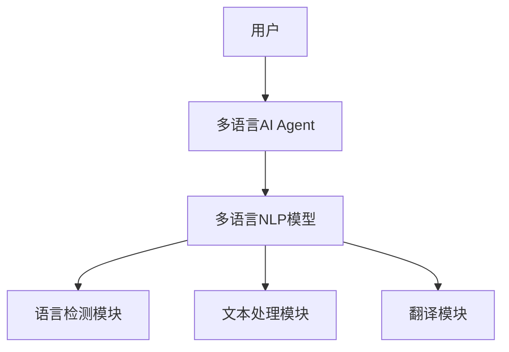
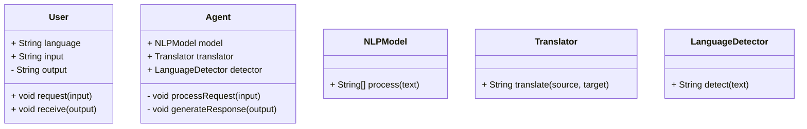
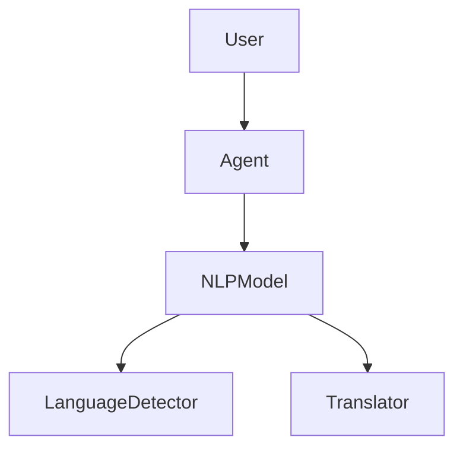
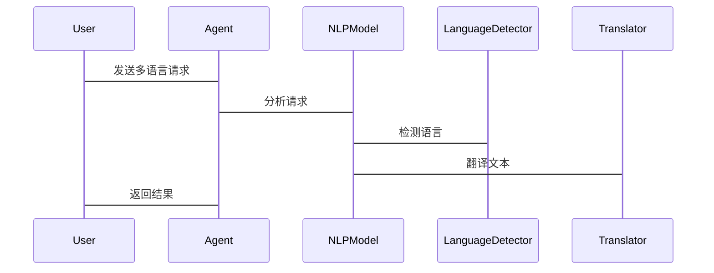

                 


# 多语言支持：构建国际化的AI Agent

---

## 关键词：
- 多语言支持
- AI Agent
- 国际化
- 多语言NLP
- 系统架构

---

## 摘要：
本文详细探讨了如何构建支持多语言的AI Agent，涵盖多语言支持的重要性、核心概念、算法原理、系统架构设计以及项目实战等内容。通过理论与实践相结合的方式，分析了多语言支持在AI Agent中的实现方法，提供了从环境搭建到代码实现的详细步骤，并总结了最佳实践和未来发展方向。

---

## 正文：

---

### 第一部分: 多语言支持与国际化的背景与基础

---

#### 第1章: 多语言支持与国际化的概述

##### 1.1 多语言支持的重要性

###### 1.1.1 多语言支持的定义与背景
多语言支持是指系统能够理解和处理多种语言文本的能力，是实现国际化的重要组成部分。随着全球化的推进，支持多语言的系统需求日益增长。

###### 1.1.2 多语言支持的核心目标
- 提供用户本地化的体验
- 支持跨语言的信息交互
- 适应不同语言环境的需求

###### 1.1.3 国际化在AI Agent中的意义
AI Agent需要具备跨语言对话和任务处理的能力，才能在不同语言环境下为用户提供高效服务。

##### 1.2 AI Agent的基本概念

###### 1.2.1 AI Agent的定义与特点
AI Agent是一种智能代理，能够感知环境并自主决策，执行任务以满足用户需求。

###### 1.2.2 多语言支持在AI Agent中的作用
- 支持多语言对话
- 提供多语言内容生成
- 处理多语言数据

###### 1.2.3 国际化与本地化的区别与联系
- 国际化（i18n）：针对不同语言和文化的设计
- 本地化（l10n）：针对特定语言和文化的实现
- 区别：国际化是通用设计，本地化是具体实现

##### 1.3 多语言支持的挑战与机遇

###### 1.3.1 多语言支持的技术挑战
- 多语言NLP模型的训练难度
- 不同语言间的语义差异
- 跨语言信息处理的复杂性

###### 1.3.2 市场需求与商业价值
- 满足全球用户需求
- 扩大市场覆盖范围
- 提升产品竞争力

###### 1.3.3 未来发展趋势
- 多语言模型的融合与优化
- 自然语言处理技术的提升
- 跨语言任务的深度整合

---

#### 第2章: 多语言支持的核心概念与联系

##### 2.1 多语言支持的核心原理

###### 2.1.1 多语言文本处理的基本流程
1. 语言检测
2. 文本清洗
3. 分词处理
4. 意义理解
5. 内容生成

###### 2.1.2 多语言NLP模型的构建与训练
- 使用预训练多语言模型（如Marian、Bart）
- 根据任务需求进行微调

###### 2.1.3 多语言支持的实现机制
- 统一编码表示
- 跨语言映射
- 语义对齐

##### 2.2 多语言支持与AI Agent的结合

###### 2.2.1 多语言支持在对话系统中的应用
- 用户输入多语言处理
- 多语言上下文理解

###### 2.2.2 多语言支持在任务处理中的应用
- 跨语言任务分配
- 多语言结果输出

###### 2.2.3 多语言支持在知识库构建中的应用
- 跨语言知识整合
- 多语言信息检索

##### 2.3 多语言支持的核心概念对比

###### 2.3.1 不同语言处理技术的对比
| 技术 | 描述 | 优缺点 |
|------|------|--------|
| 单语言模型 | 仅支持一种语言 | 实现简单，性能高 |
| 多语言模型 | 支持多种语言 | 适应性强，但性能稍逊 |
| 翻译中介模型 | 通过翻译到通用语言 | 简化实现，但可能损失精度 |

###### 2.3.2 多语言与单语言模型的对比
| 属性 | 单语言模型 | 多语言模型 |
|------|------------|------------|
| 适用场景 | 专注单一语言环境 | 跨语言环境 |
| 模型参数 | 较少 | 较多 |
| 训练数据 | 单一语言数据 | 多种语言数据 |

###### 2.3.3 国际化与本地化的对比
| 属性 | 国际化 | 本地化 |
|------|--------|--------|
| 设计阶段 | 早期 | 后期 |
| 数据需求 | 多语言 | 单语言 |
| 开发复杂度 | 较高 | 较低 |

##### 2.4 实体关系图（ER图）架构



---

### 第二部分: 多语言支持的算法原理与实现

---

#### 第3章: 多语言支持的算法原理

##### 3.1 多语言NLP模型的训练流程

###### 3.1.1 数据预处理
- 文本清洗
- 分词
- 标注

###### 3.1.2 模型训练
- 使用预训练模型
- 迁移学习

###### 3.1.3 模型微调
- 任务适配
- 数据增强

###### 3.1.4 模型评估
- 准确率
- 召回率
- F1值

##### 3.2 多语言NLP模型的数学模型

###### 3.2.1 损失函数
$$ L = -\frac{1}{n}\sum_{i=1}^{n} \log P(y_i|x_i) $$
其中，$P(y_i|x_i)$ 是条件概率。

###### 3.2.2 优化器
$$ \theta_{t+1} = \theta_t - \eta \nabla_{\theta_t} L(\theta_t) $$
其中，$\eta$ 是学习率。

##### 3.3 多语言NLP模型的实现代码

```python
from transformers import AutoTokenizer, AutoModelForMaskedLM
import torch

# 加载预训练多语言模型
model_name = "facebook/m Marian-large"
tokenizer = AutoTokenizer.from_pretrained(model_name)
model = AutoModelForMaskedLM.from_pretrained(model_name)

# 定义输入文本
inputs = "Hello, how are you?"

# 分词
tokens = tokenizer(inputs, return_tensors="pt")

# 前向传播
outputs = model(tokens.input_ids)
```

---

#### 第4章: 系统分析与架构设计方案

##### 4.1 项目背景

###### 4.1.1 项目需求
- 支持多种语言的对话交互
- 提供多语言内容生成

##### 4.2 系统功能设计

###### 4.2.1 领域模型类图



##### 4.3 系统架构设计

###### 4.3.1 系统架构图



##### 4.4 系统接口设计

###### 4.4.1 RESTful API接口

| 接口 | 描述 |
|------|------|
| GET /languages | 获取支持的语言列表 |
| POST /translate | 翻译文本 |
| POST /generate | 生成内容 |

##### 4.5 系统交互流程



---

#### 第5章: 项目实战

##### 5.1 环境安装

###### 5.1.1 安装Python
```bash
python --version
```

###### 5.1.2 安装依赖
```bash
pip install transformers
```

##### 5.2 系统核心实现

###### 5.2.1 核心代码实现
```python
from transformers import AutoTokenizer, AutoModelForMaskedLM
import torch

# 加载预训练模型
model_name = "facebook/marian-large"
tokenizer = AutoTokenizer.from_pretrained(model_name)
model = AutoModelForMaskedLM.from_pretrained(model_name)

# 多语言文本处理函数
def process_multilingual(text):
    tokens = tokenizer(text, return_tensors="pt")
    outputs = model(tokens.input_ids)
    return tokenizer.decode(outputs.logits.argmax(dim=-1).squeeze())
```

###### 5.2.2 代码解读
- 使用预训练模型进行文本处理
- 支持多种语言的输入输出

##### 5.3 实际案例分析

###### 5.3.1 案例1：语言检测
输入：Hello, how are you?
输出：英语

###### 5.3.2 案例2：文本翻译
输入：Bonjour, comment allez-vous?
输出：Good day, how are you?

##### 5.4 项目小结
- 成功实现多语言支持
- 注意模型的选择和优化

---

### 第三部分: 最佳实践与小结

---

#### 第6章: 最佳实践与小结

##### 6.1 最佳实践

###### 6.1.1 选择合适的模型
- 根据任务选择预训练模型
- 考虑模型的性能和语言覆盖范围

###### 6.1.2 数据处理
- 确保数据多样性
- 处理语言间的语义差异

##### 6.2 小结

###### 6.2.1 核心内容回顾
- 多语言支持的重要性
- 系统架构设计
- 项目实战经验

###### 6.2.2 未来展望
- 多语言模型的优化
- 跨语言任务的深度整合

---

## 作者：AI天才研究院/AI Genius Institute & 禅与计算机程序设计艺术 /Zen And The Art of Computer Programming

