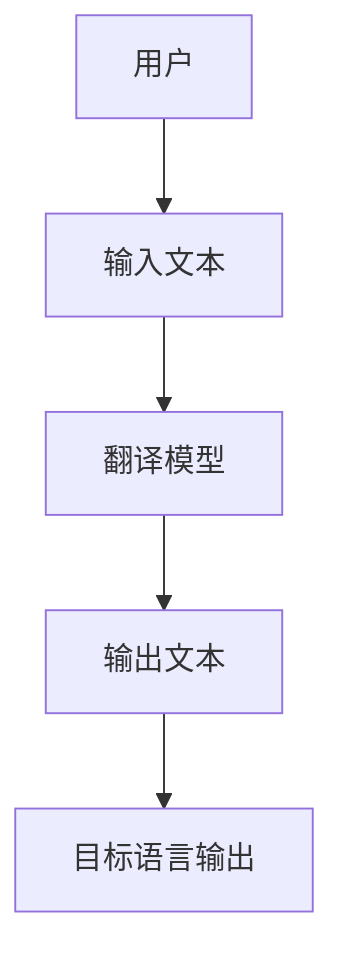
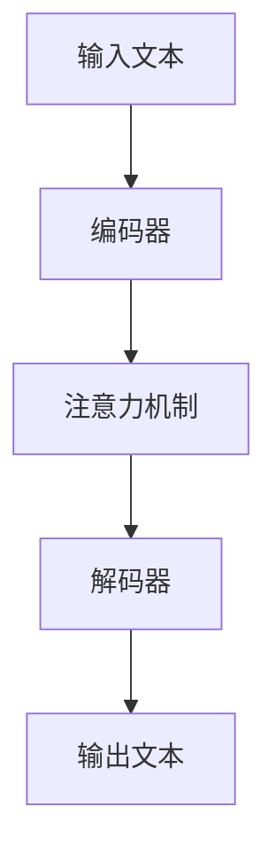
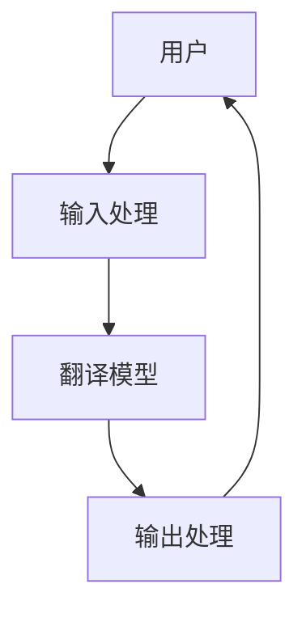

                 


```markdown
# 多语言翻译：构建跨语言AI Agent

> 关键词：多语言翻译，AI Agent，跨语言处理，神经机器翻译，系统架构设计，数学模型，项目实战

> 摘要：本文详细探讨了多语言翻译与AI Agent的结合，从背景介绍、核心概念、算法原理到系统架构设计和项目实战，全面分析了如何构建一个高效的跨语言AI Agent。文章结合实际案例，通过Mermaid图和数学公式，深入讲解了翻译模型的实现原理和系统设计，为读者提供了从理论到实践的完整指导。

---

# 第一部分: 多语言翻译与AI Agent的背景介绍

## 第1章: 多语言翻译的背景与挑战

### 1.1 多语言翻译的历史与发展

#### 1.1.1 从传统翻译到AI翻译的演变
- 传统翻译的局限性
- 人工智能技术对翻译的革新
- 神经机器翻译的崛起

#### 1.1.2 多语言翻译的核心问题与挑战
- 翻译的准确性和流畅性
- 多语言数据的获取与处理
- 稀缺语言的翻译问题

#### 1.1.3 当前技术趋势与未来展望
- 大模型在翻译中的应用
- 跨语言翻译的未来发展方向

### 1.2 AI Agent的基本概念与特点

#### 1.2.1 AI Agent的定义与分类
- AI Agent的定义
- 分类：简单反射型、基于模型的、实用的、推理的、社交的
- 跨语言AI Agent的特殊性

#### 1.2.2 AI Agent的核心能力与应用场景
- 自然语言处理
- 多语言理解与生成
- 问题解决与决策能力

#### 1.2.3 跨语言AI Agent的独特优势
- 跨越语言障碍的能力
- 实时翻译与交互能力
- 多语种支持的广泛性

### 1.3 跨语言翻译与AI Agent的结合

#### 1.3.1 跨语言翻译的定义与技术难点
- 跨语言翻译的定义
- 翻译模型的训练与优化
- 不同语言之间的语义差异

#### 1.3.2 AI Agent在多语言翻译中的作用
- 作为翻译引擎的核心
- 支持多语言交互的能力
- 提供实时翻译服务

#### 1.3.3 跨语言翻译对AI Agent能力的需求
- 高精度翻译能力
- 多语言切换的流畅性
- 处理复杂语境的能力

### 1.4 本章小结
- 总结多语言翻译与AI Agent的结合背景
- 强调构建跨语言AI Agent的重要性和挑战

---

# 第二部分: 跨语言翻译的核心概念与联系

## 第2章: 跨语言翻译模型的核心原理

### 2.1 跨语言翻译模型的基本原理

#### 2.1.1 翻译模型的输入输出关系
- 输入：源语言文本
- 输出：目标语言文本
- 中间过程：编码-解码机制

#### 2.1.2 跨语言翻译的实现机制
- 神经机器翻译的流程
- 跨语言注意力机制
- 模型的跨语言迁移能力

#### 2.1.3 跨语言翻译模型的训练方法
- 跨语言预训练
- 跨语言微调
- 使用多语言数据增强

### 2.2 跨语言翻译与AI Agent的关系

#### 2.2.1 跨语言翻译作为AI Agent的能力之一
- 翻译能力是AI Agent的核心技能
- 支持多语言交互
- 提供翻译服务的能力

#### 2.2.2 AI Agent如何调用翻译模型
- 接口设计
- 调用流程
- 翻译结果的处理与反馈

#### 2.2.3 跨语言翻译对AI Agent整体性能的影响
- 翻译的准确率影响用户体验
- 翻译速度影响实时性
- 多语言支持影响应用场景

### 2.3 跨语言翻译模型的核心要素对比

#### 2.3.1 不同翻译模型的性能对比
- 统计机器翻译 vs 神经机器翻译
- 预训练模型 vs 从零训练模型
- 小语种 vs 大语种翻译效果

#### 2.3.2 模型参数对翻译效果的影响
- 参数量与翻译质量的关系
- 模型深度与翻译准确性的关系
- 训练数据质量与翻译效果的关系

#### 2.3.3 翻译速度与准确率的权衡
- 高准确率模型的计算成本
- 高速模型的精度损失
- 实际应用中的折中策略

### 2.4 跨语言翻译的ER实体关系图



### 2.5 本章小结
- 详细阐述了跨语言翻译模型的核心原理
- 分析了AI Agent与翻译模型的关系
- 对比了不同翻译模型的性能和参数影响

---

# 第三部分: 跨语言翻译算法原理与数学模型

## 第3章: 跨语言翻译算法原理

### 3.1 翻译算法的基本原理

#### 3.1.1 统计机器翻译的基本原理
- 统计语言模型
- 词对齐算法
- 翻译规则的生成

#### 3.1.2 神经机器翻译的基本原理
- 编码器-解码器架构
- 注意力机制
- 词嵌入与序列建模

#### 3.1.3 大模型在翻译中的应用
- Transformer架构
- 自注意力机制
- 并行计算的优势

### 3.2 跨语言翻译的主流算法

#### 3.2.1 神经机器翻译算法
- 基于Transformer的模型
- 多语言翻译模型的训练策略
- 跨语言注意力机制的实现

#### 3.2.2 基于预训练语言模型的翻译算法
- 使用如BERT、GPT等模型进行微调
- 多语言预训练模型的应用
- 预训练与微调的结合

#### 3.2.3 跨语言翻译的优化算法
- 参数初始化策略
- 跨语言迁移学习
- 超参数优化与模型调优

### 3.3 跨语言翻译的数学模型

#### 3.3.1 Transformer模型的数学表达
- 编码器的多头注意力机制
- 解码器的自注意力机制
- 前馈网络的结构

#### 3.3.2 注意力机制的公式推导
- 注意力权重的计算
- 查询、键、值的矩阵运算
- 注意力输出的生成

#### 3.3.3 跨语言翻译模型的损失函数
- 交叉熵损失函数
- 跨语言翻译的损失函数设计
- 正则化项的引入

### 3.4 跨语言翻译算法的流程图



### 3.5 本章小结
- 深入讲解了翻译算法的基本原理
- 介绍了主流的神经机器翻译算法
- 推导了数学模型并分析了其工作流程

---

# 第四部分: 跨语言AI Agent的系统分析与架构设计

## 第4章: 跨语言AI Agent的系统架构设计

### 4.1 系统功能设计

#### 4.1.1 系统功能模块划分
- 用户输入处理模块
- 翻译模型调用模块
- 输出结果处理模块
- 多语言支持模块

#### 4.1.2 系统功能流程
- 用户输入 -> 输入处理 -> 翻译模型 -> 输出结果 -> 用户反馈
- 系统的异步处理能力
- 多语言切换的实现

### 4.2 系统架构设计

#### 4.2.1 系统架构图



#### 4.2.2 模块之间的接口设计
- 输入处理模块与翻译模型的接口
- 翻译模型与输出处理模块的接口
- 系统管理模块与各个功能模块的接口

### 4.3 系统交互设计

#### 4.3.1 系统交互流程图


#### 4.3.2 多语言切换的交互流程
- 用户选择目标语言
- 系统调用相应的翻译模型
- 输出翻译结果

### 4.4 本章小结
- 详细描述了跨语言AI Agent的系统架构设计
- 绘制了系统的架构图和交互流程图
- 强调了模块化设计的重要性

---

# 第五部分: 跨语言AI Agent的项目实战

## 第5章: 跨语言AI Agent的实现与案例分析

### 5.1 项目环境安装

#### 5.1.1 安装Python环境
- 安装Python 3.8+
- 安装Jupyter Notebook

#### 5.1.2 安装必要的库
- TensorFlow/PyTorch
- Transformers库
- SentencePiece

#### 5.1.3 安装依赖项
- 使用pip install命令安装所需的依赖

### 5.2 系统核心实现源代码

#### 5.2.1 翻译模型的加载与调用
```python
from transformers import AutoTokenizer, AutoModelForSeq2Seq
tokenizer = AutoTokenizer.from_pretrained("facebook/m2m-large-4m")
model = AutoModelForSeq2Seq.from_pretrained("facebook/m2m-large-4m")
```

#### 5.2.2 翻译函数的实现
```python
def translate(source_text, target_lang):
    inputs = tokenizer(source_text, return_tensors="pt")
    outputs = model.generate(**inputs, forced_bos_token_id=tokenizer.get_lang_id(target_lang))
    return tokenizer.decode(outputs[0], skip_special_tokens=True)
```

#### 5.2.3 系统交互界面的实现
```python
def main():
    while True:
        source_lang = input("请输入源语言：")
        target_lang = input("请输入目标语言：")
        text = input("请输入要翻译的文本：")
        translated = translate(text, target_lang)
        print(f"翻译结果：{translated}")
```

### 5.3 代码应用解读与分析

#### 5.3.1 翻译模型的选择与加载
- 使用预训练的多语言模型
- 加载模型权重和tokenizer
- 处理多语言的id映射

#### 5.3.2 翻译函数的实现细节
- 输入文本的编码与解码
- 调用模型生成翻译结果
- 处理翻译过程中的异常情况

### 5.4 实际案例分析和详细讲解剖析

#### 5.4.1 案例一：中英互译
- 输入中文：“你好，今天天气怎么样？”
- 输出英文：“Hello, how is the weather today?”

#### 5.4.2 案例二：英中互译
- 输入英文：“The cat is on the mat.”
- 输出中文：“猫在垫子上。”

### 5.5 项目小结
- 总结了项目实现的关键步骤
- 分析了代码实现的细节
- 提供了实际案例的详细讲解

---

# 第六部分: 最佳实践、总结与展望

## 第6章: 最佳实践与总结

### 6.1 最佳实践

#### 6.1.1 翻译模型的选择与优化
- 根据需求选择合适的模型
- 调整模型参数以优化性能
- 使用数据增强提升翻译质量

#### 6.1.2 系统架构设计的优化
- 模块化设计便于维护和扩展
- 使用异步处理提升性能
- 采用缓存机制减少重复计算

#### 6.1.3 多语言支持的实现技巧
- 处理稀有语言时的特殊策略
- 跨语言模型的训练与微调
- 处理语言间的语义差异

### 6.2 小结

#### 6.2.1 本章总结
- 回顾了全文的主要内容
- 强调了构建跨语言AI Agent的重要性和复杂性
- 总结了实现过程中需要注意的关键点

#### 6.2.2 未来展望
- 更多语言的支持与优化
- 翻译模型的实时更新与进化
- 多模态翻译的探索与实践

### 6.3 注意事项

#### 6.3.1 翻译模型的训练与优化
- 数据质量的重要性
- 模型训练的计算资源需求
- 跨语言翻译的准确性与流畅性

#### 6.3.2 系统架构设计的注意事项
- 模块之间的耦合度控制
- 系统的可扩展性设计
- 系统的安全性与稳定性

### 6.4 拓展阅读

#### 6.4.1 推荐书籍与论文
- 《神经机器翻译实战》
- 《多语言自然语言处理》
- 最新研究论文

#### 6.4.2 技术博客与在线资源
- 开源项目的GitHub仓库
- 技术社区的讨论与分享
- 在线课程与教程

### 6.5 本章小结
- 总结了构建跨语言AI Agent的关键点
- 提供了最佳实践的建议
- 展望了未来的发展方向

---

# 作者：AI天才研究院/AI Genius Institute & 禅与计算机程序设计艺术 /Zen And The Art of Computer Programming
```

