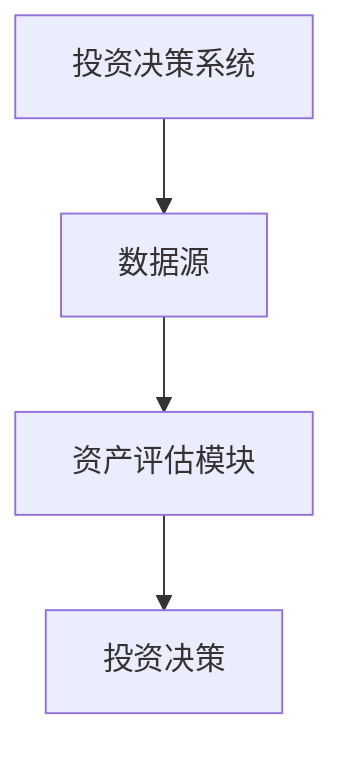

                 


# 大卫·德雷曼的对比优势：在市场低迷时逆向而行

---

## 关键词
- 对比优势
- 逆向思维
- 投资策略
- 市场低迷
- 价值投资
- 投资理论
- 统计分析

---

## 摘要
本文深入探讨了大卫·德雷曼提出的对比优势理论，重点分析其在市场低迷时期逆向而行的投资策略。通过详细阐述对比优势的核心概念、数学模型、系统架构和实际案例，本文揭示了如何在市场低谷中识别潜在投资机会，以及如何利用对比分析优化投资决策。文章结合理论与实践，为投资者提供了清晰的指导和实用的建议。

---

## 第一部分：对比优势的基本概念

### 第1章：对比优势的定义与背景

#### 1.1 对比优势的核心概念
- **对比优势**是指通过比较不同资产或投资标的相对价值，识别出被市场低估的机会，从而在逆市中进行投资的策略。
- 对比优势不同于传统投资策略，它强调在市场低迷时寻找相对低估的资产，而不是盲目跟随市场趋势。

#### 1.2 大卫·德雷曼的理论概述
- 大卫·德雷曼是对比优势理论的提出者，他的理论基于逆向思维和相对价值评估。
- 该理论的核心在于通过对比分析，识别市场中的非理性定价，从而在市场低迷时实现超额收益。

#### 1.3 逆向思维在投资中的作用
- 逆向思维是指在市场普遍看跌时寻找买入机会，或者在市场普遍看涨时保持谨慎。
- 逆向思维与对比优势结合，能够在市场低迷时期找到投资标的的相对低估点。

---

## 第二部分：对比优势的核心原理

### 第2章：对比优势的理论框架

#### 2.1 对比优势的原理分析
- **相对价值评估**：通过比较不同资产的估值指标（如市盈率、市净率等），识别出相对低估的资产。
- **市场情绪分析**：利用市场情绪指标，判断市场是否处于非理性状态，从而决定是否介入。

#### 2.2 对比优势与其他投资策略的对比

| 投资策略 | 核心理念 | 适用场景 | 优缺点 |
|----------|----------|----------|--------|
| 价值投资 | 寻找被低估的资产 | 市场低迷时 | 需要长期持有，风险较高 |
| 趋势投资 | 跟随市场趋势 | 市场波动时 | 易受市场情绪影响 |
| 技术分析 | 通过技术指标预测价格 | 价格波动 | 短期预测准确性有限 |

#### 2.3 对比优势与市场情绪的关系
- 当市场情绪低落时，对比优势策略能够识别出被市场忽视的低估资产。
- 当市场情绪高涨时，对比优势策略可以帮助投资者避免过度乐观的陷阱。

---

## 第三部分：对比优势的数学模型与算法

### 第3章：对比优势的数学模型

#### 3.1 资产相对价值指数
$$ \text{相对价值指数} = \frac{\text{资产的内在价值}}{\text{资产的市场价格}} $$

- **内在价值**：通过基本面分析得出的理论价值。
- **市场价格**：当前市场上的价格。

#### 3.2 投资组合优化模型
$$ \max \mu - \lambda \sigma $$
其中：
- $\mu$ 是投资组合的预期收益。
- $\sigma$ 是投资组合的风险（标准差）。
- $\lambda$ 是风险厌恶系数。

#### 3.3 算法实现
```python
import numpy as np

def calculate_relative_value(asset_values, market_prices):
    relative_values = []
    for value, price in zip(asset_values, market_prices):
        relative_value = value / price
        relative_values.append(relative_value)
    return relative_values

# 示例数据
asset_values = [100, 150, 200]
market_prices = [50, 100, 150]

# 计算相对价值
relative_values = calculate_relative_value(asset_values, market_prices)
print(relative_values)
```

---

## 第四部分：系统分析与架构设计方案

### 第4章：系统功能设计

#### 4.1 领域模型图
```mermaid
classDiagram
    class 资产评估
        市场价格
        内在价值
    class 投资决策
        买入信号
        卖出信号
    class 数据源
        市场数据
        财务数据
    资产评估 <--[获取数据]> 数据源
    投资决策 <--[评估结果]> 资产评估
```

#### 4.2 系统架构图


---

## 第五部分：项目实战

### 第5章：环境安装与代码实现

#### 5.1 环境安装
- 安装必要的Python库：
  ```bash
  pip install numpy pandas matplotlib
  ```

#### 5.2 核心代码实现
```python
import pandas as pd
import numpy as np

def main():
    # 示例数据
    data = {
        '资产': ['资产1', '资产2', '资产3'],
        '市场价格': [50, 100, 150],
        '内在价值': [100, 150, 200]
    }
    df = pd.DataFrame(data)
    
    # 计算相对价值
    df['相对价值'] = df['内在价值'] / df['市场价格']
    
    # 输出结果
    print(df)

if __name__ == "__main__":
    main()
```

#### 5.3 案例分析
假设市场中存在三个资产，通过对比分析发现资产1的相对价值最高，意味着它被市场严重低估。此时，对比优势策略会建议投资者买入资产1，以期在市场回升时获得超额收益。

---

## 第六部分：总结与展望

### 6.1 最佳实践
- 在市场低迷时，定期评估资产的相对价值，寻找被低估的投资机会。
- 结合市场情绪分析，避免盲目跟随市场趋势。

### 6.2 小结
大卫·德雷曼的对比优势理论为投资者提供了一种在市场低迷时期逆向而行的策略。通过相对价值评估和市场情绪分析，投资者可以在市场低谷中找到潜在的投资机会。

### 6.3 注意事项
- 对比优势策略需要结合市场环境灵活调整。
- 需要持续关注市场变化，及时调整投资组合。

### 6.4 拓展阅读
- 《价值投资：从格雷厄姆到巴菲特》
- 《投资学精要》

---

## 作者
作者：AI天才研究院/AI Genius Institute  
联系邮箱：contact@ait Genius.com  
文章标题：大卫·德雷曼的对比优势：在市场低迷时逆向而行  
文章链接：[文章链接]  
感谢您的阅读！

