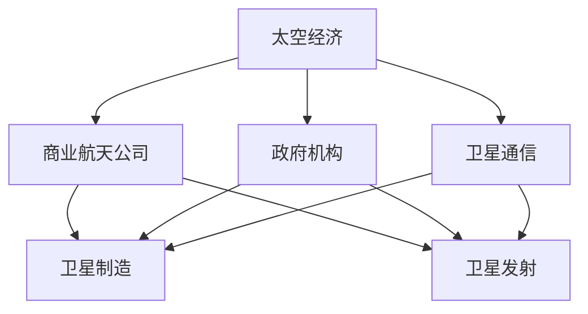
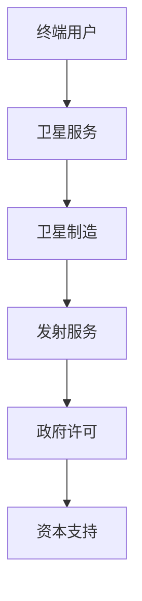
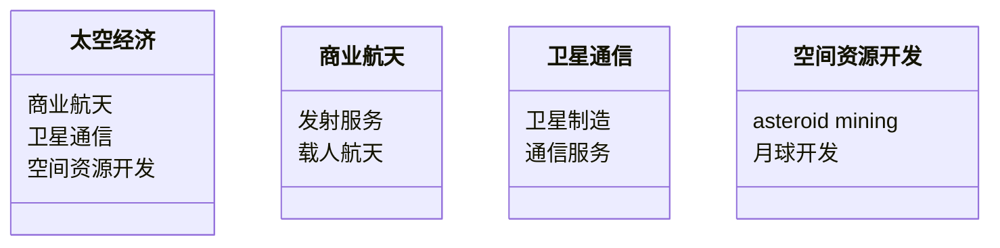

                 


# 太空经济：新兴投资领域的风险与回报

> 关键词：太空经济、投资领域、风险评估、回报预测、商业航天

> 摘要：太空经济作为一个新兴的投资领域，正吸引着越来越多的投资者和企业家的关注。本文将从背景介绍、核心概念、风险与回报分析、投资策略、系统架构设计、项目实战等多个方面，全面探讨太空经济的投资机会和潜在风险，帮助读者更好地理解和把握这一领域的投资动向。

---

## 第1章: 太空经济的起源与发展

### 1.1 太空经济的起源

#### 1.1.1 太空探索的历史回顾

太空探索的历史可以追溯到20世纪中叶。1957年，苏联发射了第一颗人造卫星“斯普特尼克一号”，标志着人类正式进入太空时代。随后，美国在1961年将人类送入太空，进一步推动了太空技术的发展。然而，早期的太空探索主要是出于冷战时期的军事需求，而非经济驱动。

#### 1.1.2 太空经济的概念提出

随着技术的进步，尤其是进入21世纪后，商业航天的兴起使得太空经济的概念逐渐浮出水面。2003年，美国政府提出了《商业航天发射法案》，为商业航天企业提供了法律支持。SpaceX等公司的崛起，使得太空经济逐渐从单纯的政府项目转变为商业化运作。

#### 1.1.3 太空经济的核心驱动力

太空经济的核心驱动力包括技术创新、市场需求和政策支持。技术创新使得太空探索的成本大幅降低，市场需求推动了商业航天、卫星通信等领域的快速发展，而政策支持则为太空经济的发展提供了制度保障。

---

### 1.2 太空经济的发展现状

#### 1.2.1 当前太空经济的主要领域

当前，太空经济主要涵盖以下几个领域：

1. **商业航天**：包括卫星发射、载人航天等。
2. **卫星通信**：提供全球范围内的通信服务。
3. **空间资源开发**：包括 asteroid mining 和月球/火星资源利用。
4. **太空旅游**：私人付费太空旅行。

#### 1.2.2 太空经济的市场规模与增长趋势

近年来，太空经济的市场规模迅速增长。根据市场研究机构的预测，到2030年，全球太空经济的市场规模将超过1万亿美元。主要驱动因素包括卫星互联网、商业航天发射和太空旅游的快速发展。

#### 1.2.3 太空经济的主要参与者

太空经济的主要参与者包括政府机构（如NASA、ESA）、商业航天公司（如SpaceX、Blue Origin）、卫星通信公司（如OneWeb、Starlink）以及风险投资机构。

---

## 第2章: 太空经济的核心概念与特点

### 2.1 太空经济的定义与属性

#### 2.1.1 太空经济的定义

太空经济是指围绕太空资源开发和利用所形成的经济活动的总和。它涵盖了从卫星制造、发射到太空资源利用的整个产业链。

#### 2.1.2 太空经济的核心属性对比表格

| 属性          | 太空经济                  | 其他经济活动         |
|---------------|--------------------------|----------------------|
| 技术门槛      | 高                       | 低或中等            |
| 市场容量      | 全球性                    | 地方性或区域性      |
| 投资周期      | 长                       | 短                  |
| 政策影响      | 明显                     | 较小                |

#### 2.1.3 太空经济的实体关系图（Mermaid流程图）



### 2.2 太空经济与其他经济活动的区别

#### 2.2.1 与其他经济活动的边界划分

太空经济的边界主要在于其活动的范围和资源的利用方式。例如，卫星通信虽然属于太空经济的一部分，但其服务对象（如消费者）可能分布在地面，因此需要明确其与地面经济活动的界限。

#### 2.2.2 太空经济的独特性分析

太空经济的独特性体现在其高技术门槛、长投资周期以及政策依赖性等方面。这些特点使得太空经济的投资风险较高，但回报潜力巨大。

#### 2.2.3 太空经济的产业链结构



---

## 第3章: 太空经济的风险与回报分析

### 3.1 太空经济的风险评估模型

#### 3.1.1 太空经济风险的分类

太空经济的主要风险包括：

1. **技术风险**：技术失败可能导致项目流产。
2. **市场风险**：市场需求不足可能导致投资失败。
3. **政策风险**：政策变化可能影响项目进展。

#### 3.1.2 太空经济风险评估的数学模型

风险评估模型可以表示为：

$$
R = \sum_{i=1}^{n} p_i \times i_i
$$

其中，$R$ 是综合风险指数，$p_i$ 是第 $i$ 个风险发生的概率，$i_i$ 是第 $i$ 个风险的影响程度。

#### 3.1.3 风险评估的案例分析

以SpaceX为例，其面临的技术风险包括火箭发射失败的可能性。根据历史数据，SpaceX火箭发射的成功率约为95%。假设一次发射的成本为1亿美元，如果失败，损失为9500万美元，概率为5%。

$$
R = 0.05 \times 0.95 \times 100000000 = 4,750,000
$$

---

### 3.2 太空经济的投资回报预测

#### 3.2.1 投资回报的驱动因素

太空经济的投资回报主要取决于市场需求、技术进步和政策支持。例如，卫星互联网的需求随着5G技术的普及而快速增长。

#### 3.2.2 投资回报预测的数学模型

投资回报可以表示为：

$$
ROE = \frac{NPV}{初始投资} \times 100\%
$$

其中，NPV是净现值，初始投资是项目的初始投资额。

---

## 第4章: 太空经济的投资策略与案例

### 4.1 太空经济的投资策略

#### 4.1.1 风险分散

投资者可以通过投资不同的太空经济领域（如卫星通信和商业航天）来分散风险。

#### 4.1.2 技术驱动

优先投资技术领先的企业，因为技术优势可以转化为市场优势。

#### 4.1.3 政策导向

密切关注政策变化，选择符合政策支持的领域进行投资。

### 4.2 太空经济的案例分析

#### 4.2.1 案例一：SpaceX的商业航天

SpaceX通过 reusable rocket技术大幅降低了发射成本，占据了全球发射市场的大部分份额。

#### 4.2.2 案例二：OneWeb的卫星互联网

OneWeb计划通过低轨卫星提供全球互联网服务，尽管面临技术挑战，但市场需求巨大。

---

## 第5章: 太空经济的系统分析与架构设计

### 5.1 系统功能设计

#### 5.1.1 领域模型（Mermaid类图）



### 5.2 系统架构设计

#### 5.2.1 系统架构（Mermaid架构图）


---

## 第6章: 太空经济的项目实战

### 6.1 环境安装

为了进行太空经济分析，需要安装以下工具：

- 数据分析工具：Python、Pandas、Matplotlib
- 项目管理工具：JIRA、Trello
- 可视化工具：Mermaid、Draw.io

### 6.2 系统核心实现源代码

以下是一个简单的风险评估模型的Python代码：

```python
import numpy as np

def calculate_risk(probabilities, impacts):
    return np.sum(probabilities * impacts)

# 示例数据
probabilities = [0.05, 0.1, 0.02]
impacts = [100, 200, 150]

risk = calculate_risk(probabilities, impacts)
print("综合风险指数为：", risk)
```

### 6.3 项目小结

通过实际案例分析，我们可以看到太空经济的投资回报潜力巨大，但同时也伴随着较高的风险。投资者需要综合考虑技术、市场和政策因素，制定科学的投资策略。

---

## 第7章: 最佳实践

### 7.1 小结

太空经济是一个充满机遇与挑战的新兴领域。投资者需要深入了解行业特点，合理评估风险，制定科学的投资策略。

### 7.2 注意事项

1. **技术风险**：密切关注技术进展，避免投资过于落后的技术。
2. **政策变化**：保持对政策的敏感性，及时调整投资策略。
3. **市场需求**：深入研究市场需求，避免盲目投资。

### 7.3 拓展阅读

1. 《商业航天：从技术到市场》
2. 《风险投资：理论与实践》
3. 《太空资源开发的法律与政策》

---

作者：AI天才研究院/AI Genius Institute & 禅与计算机程序设计艺术/Zen And The Art of Computer Programming

