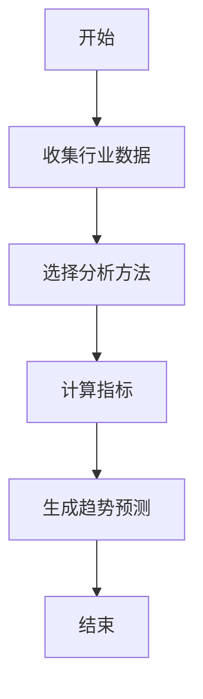
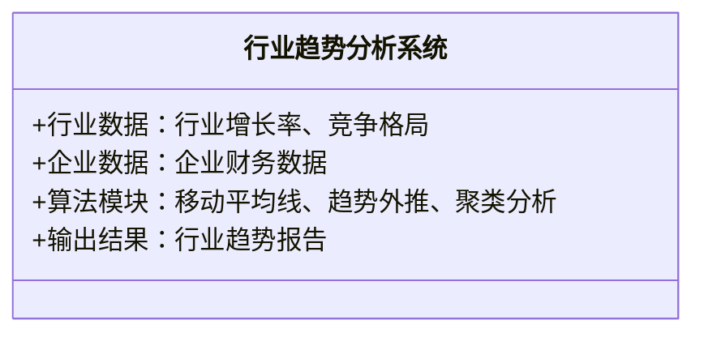
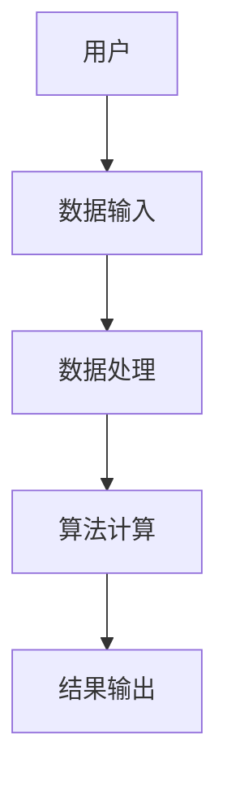

                 


# 如何像彼得·林奇一样分析行业趋势

---

## 关键词  
彼得·林奇，行业趋势，投资分析，基本面分析，技术分析，趋势预测  

---

## 摘要  
本文通过分析彼得·林奇的投资哲学和行业趋势分析方法，结合技术分析、基本面分析和系统设计，深入探讨如何像彼得·林奇一样进行行业趋势预测。文章从背景介绍、核心概念、算法原理、数学模型、系统架构设计、项目实战到最佳实践，逐步展开，帮助读者掌握行业趋势分析的核心方法和实际应用。

---

## 第1章: 彼得·林奇与行业趋势分析概述  

### 1.1 彼得·林奇的背景与投资哲学  
彼得·林奇是全球著名的职业基金经理，以其独特的投资哲学闻名。他的成功不仅在于选股能力，更在于对行业趋势的深刻洞察。林奇认为，行业趋势是投资决策的核心，而行业趋势的分析需要结合基本面和技术面的双重因素。  

#### 1.1.1 彼得·林奇的生平简介  
彼得·林奇（Peter Lynch）是富达基金（Fidelity Funds）的传奇经理人，管理的麦哲伦基金（Magellan Fund）在任职期间创造了年均29%的复合增长率。他以“业余投资者”自称，强调投资的逻辑性和可操作性。  

#### 1.1.2 林奇的投资哲学与成功案例  
林奇的投资哲学的核心是：  
1. **长期视角**：关注企业的长期发展趋势，而非短期波动。  
2. **行业洞察**：深入分析行业结构、竞争格局和宏观经济环境。  
3. **基本面与技术面结合**：通过基本面分析确定投资标的，用技术分析辅助决策。  

例如，林奇在20世纪80年代初买入莲花公司（莲花1-2-3软件）时，正是看中了软件行业的增长潜力和公司独特的竞争优势。  

#### 1.1.3 为什么学习林奇的行业趋势分析方法  
林奇的成功证明了行业趋势分析的重要性。通过学习他的方法，投资者可以更好地识别行业机会，降低投资风险，提升决策的科学性。  

---

### 1.2 行业趋势分析的核心概念  
行业趋势分析是通过研究行业的发展趋势，预测未来的变化方向和强度。林奇的分析方法强调以下几点：  
1. **行业生命周期**：分析行业所处的阶段（幼稚期、成长期、成熟期、衰退期）。  
2. **竞争结构**：研究行业内主要竞争者的市场份额、成本结构和竞争优势。  
3. **宏观经济影响**：关注宏观经济政策、利率、通货膨胀等对行业的影响。  

#### 1.2.1 行业趋势分析的定义  
行业趋势分析是对行业内各企业的经营状况、市场动态和外部环境的综合研究，旨在发现行业发展的规律和未来方向。  

#### 1.2.2 林奇分析行业趋势的独特方法  
林奇的独特之处在于，他不仅关注行业整体趋势，还善于从微观层面分析企业的竞争优势。例如，他会重点关注企业的市场份额、利润率、研发投入和管理团队等指标。  

#### 1.2.3 行业趋势分析的边界与外延  
行业趋势分析的边界包括行业内部的竞争格局和企业基本面，外延则涉及宏观经济环境和政策变化。  

---

### 1.3 林奇分析框架的核心要素  

#### 1.3.1 企业基本面分析  
基本面分析是林奇方法的核心，包括对企业财务状况、盈利能力、成长能力和分红能力的分析。  

| 项目                | 定义与关注点                     |
|---------------------|---------------------------------|
| 财务状况            | 资产负债表、现金流               |
| 盈利能力            | 净利润、毛利率、净利率           |
| 成长能力            | 收入增长率、净利润增长率         |
| 分红能力            | 股息率、分红稳定性               |

#### 1.3.2 行业竞争结构分析  
行业竞争结构分析是林奇方法的重要组成部分，包括行业集中度、进入壁垒和竞争格局的分析。  

#### 1.3.3 宏观经济与行业周期分析  
林奇非常注重宏观经济对行业的影响。例如，他会在经济衰退时寻找那些能够保持增长的行业，如医疗、公用事业等。  

---

## 第2章: 行业趋势分析的核心概念与联系  

### 2.1 核心概念原理  

#### 2.1.1 行业趋势的核心驱动因素  
行业趋势的核心驱动因素包括市场需求、技术创新、政策变化和经济周期。  

#### 2.1.2 林奇分析框架中的关键变量  
林奇分析框架中的关键变量包括：  
- 行业增长率  
- 市场容量  
- 竞争格局  

#### 2.1.3 行业趋势分析的数学模型  
行业趋势分析可以通过回归模型来预测未来趋势。例如，使用线性回归模型预测行业增长率。  

---

### 2.2 核心概念对比表格  
以下是对行业趋势分析和传统技术分析的对比：  

| 项目                | 行业趋势分析                | 技术分析                  |
|---------------------|-----------------------------|---------------------------|
| 分析对象            | 行业整体趋势                | 个股或指数的价格走势      |
| 分析方法            | 基于基本面和技术面          | 基于价格和成交量          |
| 分析目标            | 发现行业机会                | 发现交易机会              |
| 适用场景            | 长期投资决策                | 短期交易决策              |

---

### 2.3 ER实体关系图  
以下是行业趋势分析的ER实体关系图：  

```mermaid
erd
    entity 行业 {
        key 名称
        attribute 竞争格局
        attribute 市场容量
        attribute 行业增长率
    }
    entity 企业 {
        key 名称
        attribute 净利润
        attribute 毛利率
        attribute 市场份额
    }
    行业 --> 企业 : 包含关系
```

---

## 第3章: 行业趋势分析的算法原理  

### 3.1 算法原理概述  

#### 3.1.1 基于基本面的行业趋势预测  
基本面预测算法通过对企业财务数据的分析，预测行业趋势。例如，使用财务指标（如净利润增长率）来预测行业未来的增长潜力。  

#### 3.1.2 基于技术分析的趋势外推法  
趋势外推法通过分析历史价格走势，预测未来趋势。例如，使用移动平均线（MA）来判断市场的买卖信号。  

#### 3.1.3 基于聚类分析的行业周期识别  
聚类分析可以识别行业所处的周期阶段。例如，通过分析企业的利润率和市场份额，判断行业是否处于成熟期或衰退期。  

---

### 3.2 算法流程图  



---

### 3.3 算法实现代码  

```python
import pandas as pd
import numpy as np

# 示例数据：行业增长率
data = pd.DataFrame({
    '行业': ['科技', '金融', '医疗', '能源'],
    '增长率': [15, 8, 12, 5]
})

# 计算行业趋势
def calculate_trend(data):
    # 计算行业平均增长率
    avg_growth = data['增长率'].mean()
    # 判断趋势
    if avg_growth > 10:
        return "增长"
    elif avg_growth > 5:
        return "稳定"
    else:
        return "衰退"

trend = calculate_trend(data)
print(f"行业趋势：{trend}")
```

---

## 第4章: 行业趋势分析的数学模型与公式  

### 4.1 移动平均线模型  

#### 移动平均线公式  
$$MA_t = \frac{1}{n}\sum_{i=1}^{n}P_{t-i}$$  

#### 示例：计算某行业的5日移动平均线  
假设某行业过去5天的价格分别为10、12、15、13、14，则：  
$$MA_5 = \frac{10 + 12 + 15 + 13 + 14}{5} = 13.4$$  

---

### 4.2 趋势外推模型  

#### 趋势外推公式  
$$Trend_{t} = a + bt$$  

#### 示例：预测行业未来3年的趋势  
假设a=10，b=2，则：  
第1年：$Trend_1 = 10 + 2(1) = 12$  
第2年：$Trend_2 = 10 + 2(2) = 14$  
第3年：$Trend_3 = 10 + 2(3) = 16$  

---

### 4.3 聚类分析模型  

#### 聚类分析的数学基础  
距离公式：  
$$d(x, y) = \sqrt{(x_1 - y_1)^2 + (x_2 - y_2)^2}$$  

相似性度量：  
$$similarity(x, y) = 1 - \frac{d(x, y)}{max\_distance}$$  

---

## 第5章: 行业趋势分析的系统架构设计  

### 5.1 系统分析与设计  

#### 5.1.1 系统功能设计  



#### 5.1.2 系统架构设计  



---

## 第6章: 项目实战  

### 6.1 环境安装  
安装Python和必要的库（如pandas、numpy、scikit-learn）。  

### 6.2 系统核心实现源代码  

```python
import pandas as pd
import numpy as np
from sklearn.cluster import KMeans

# 示例数据：行业数据
data = pd.DataFrame({
    '行业': ['科技', '金融', '医疗', '能源'],
    '增长率': [15, 8, 12, 5],
    '利润率': [20, 12, 18, 7]
})

# 聚类分析
X = data[['增长率', '利润率']]
kmeans = KMeans(n_clusters=3)
kmeans.fit(X)
data['行业阶段'] = kmeans.predict(X)

print(data)
```

### 6.3 代码应用解读与分析  
上述代码通过聚类分析将行业分为三个阶段：增长期、稳定期和衰退期。  

---

## 第7章: 最佳实践  

### 7.1 小结  
通过本文的学习，读者可以掌握彼得·林奇的行业趋势分析方法，并将其应用于实际投资中。  

### 7.2 注意事项  
1. 行业趋势分析需要结合具体行业特点，不可一概而论。  
2. 投资决策应综合考虑多方面因素，避免单一依赖某一种方法。  

### 7.3 拓展阅读  
推荐阅读彼得·林奇的《彼得·林奇的成功投资》和《股市信徒》。  

---

## 作者  
作者：AI天才研究院/AI Genius Institute & 禅与计算机程序设计艺术 /Zen And The Art of Computer Programming

