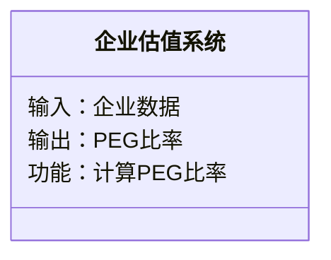

                 


# 如何利用PEG比率进行企业估值

## 关键词：PEG比率、企业估值、市盈率、盈利增长率、投资分析

## 摘要：  
PEG（Price/Earnings to Growth）比率是一种常用的估值指标，用于衡量企业的内在价值。本文将从PEG的定义、计算方法、应用场景、局限性等方面展开，深入分析如何利用PEG比率进行企业估值，并通过实际案例和系统设计，帮助读者掌握PEG比率的应用技巧。

---

## 第一部分：PEG比率的背景与基础

### 第1章：PEG比率的定义与背景

#### 1.1 企业估值的核心问题  
企业估值是投资决策的核心环节，主要解决以下问题：  
- 该企业的内在价值是多少？  
- 该企业的股票价格是否被高估或低估？  
- 投资该企业是否具有长期收益潜力？  

传统的估值方法（如市盈率P/E、市净率P/B等）存在一定的局限性，难以全面反映企业的增长潜力和内在价值。PEG比率的出现，弥补了这些不足，成为投资分析中的重要工具。

#### 1.2 PEG比率的核心概念  

##### 1.2.1 市盈率（P/E）的定义与作用  
市盈率是股票价格与每股收益（EPS）的比率，公式为：  
$$ P/E = \frac{\text{股价}}{\text{每股收益}} $$  

市盈率反映了市场对企业盈利能力的定价，但无法直接衡量企业的增长潜力。例如，一家高增长企业的高P/E可能被市场看好，而一家低增长企业的低P/E可能被市场低估。

##### 1.2.2 企业盈利增长率（Earnings Growth）的衡量  
盈利增长率是企业净利润的年复合增长率，公式为：  
$$ \text{盈利增长率} = \frac{\text{本期净利润} - \text{上期净利润}}{\text{上期净利润}} \times 100\% $$  

盈利增长率反映了企业的盈利能力提升速度，是PEG比率的重要组成部分。

##### 1.2.3 PEG比率的定义与公式  
PEG比率是市盈率与盈利增长率的比值，公式为：  
$$ PEG = \frac{P/E}{\text{盈利增长率}} $$  

PEG比率衡量了市盈率相对于企业盈利增长率的合理性。如果PEG < 1，说明企业可能被低估；如果PEG > 1，则可能被高估。

---

## 第二部分：PEG比率的计算与应用

### 第2章：PEG比率的计算方法

#### 2.1 市盈率（P/E）的计算  

##### 2.1.1 市盈率的公式与计算步骤  
以某公司为例：  
- 股价（P）= 50元  
- 每股收益（EPS）= 5元  
- P/E = 50 / 5 = 10  

##### 2.1.2 市盈率的行业基准与比较  
不同行业的市盈率基准值不同，例如科技行业通常高于传统制造业。投资者需要结合行业特性进行横向比较。

#### 2.2 盈利增长率的计算  

##### 2.2.1 净利润增长率的计算方法  
以某公司为例：  
- 上年净利润 = 1000万元  
- 本年净利润 = 1200万元  
- 净利润增长率 = (1200 - 1000) / 1000 × 100% = 20%  

##### 2.2.2 营业收入增长率的计算方法  
以某公司为例：  
- 上年营业收入 = 5000万元  
- 本年营业收入 = 6000万元  
- 营业收入增长率 = (6000 - 5000) / 5000 × 100% = 20%  

#### 2.3 PEG比率的综合计算  

##### 2.3.1 PEG比率的公式推导  
以某公司为例：  
- P/E = 20  
- 盈利增长率 = 15%  
- PEG = 20 / 0.15 ≈ 1.33  

##### 2.3.2 PEG比率的实际计算案例  
以某公司为例：  
- 股价 = 100元  
- 每股收益（EPS）= 10元  
- P/E = 100 / 10 = 10  
- 净利润增长率 = 25%  
- PEG = 10 / 0.25 = 4  

##### 2.3.3 PEG比率的标准化处理  
PEG比率的行业基准值通常为1，如果PEG < 1，说明企业可能被低估；如果PEG > 1，说明可能被高估。

---

## 第三部分：PEG比率的局限性与风险

### 第4章：PEG比率的局限性分析  

#### 4.1 PEG比率的局限性  
PEG比率存在以下局限性：  
- 无法反映企业的财务杠杆和资本结构。  
- 未考虑非经常性损益的影响。  
- 适用于高增长企业的局限性。  

#### 4.2 如何克服PEG比率的局限性  
投资者可以通过以下方式弥补PEG比率的不足：  
- 结合其他估值指标（如市净率、股息率等）。  
- 结合企业的财务报表分析（如ROE、ROA等）。  
- 结合行业特性和企业生命周期进行分析。  

---

## 第四部分：系统分析与架构设计方案

### 第5章：企业估值系统的架构设计  

#### 5.1 问题场景介绍  
本文将构建一个企业估值系统，用于计算和分析PEG比率。  

#### 5.2 系统功能设计  

##### 5.2.1 领域模型（Mermaid 类图）  



##### 5.2.2 系统架构设计（Mermaid 架构图）  


##### 5.2.3 系统接口设计  
- 输入接口：企业数据（股价、净利润、营业收入等）。  
- 输出接口：PEG比率计算结果。  

##### 5.2.4 系统交互设计（Mermaid 序列图）  

```mermaid
sequenceDiagram
    用户 -> 企业估值系统: 输入企业数据
    企业估值系统 -> 数据层: 获取企业数据
    数据层 -> 业务逻辑层: 计算PEG比率
    业务逻辑层 -> 表现层: 输出PEG比率
    用户 <- 表现层: 显示PEG比率结果
```

---

## 第五部分：项目实战

### 第6章：基于PEG比率的企业估值实战  

#### 6.1 项目环境安装  
- 需要Python编程语言和Pandas库。  

#### 6.2 核心实现代码  

##### 6.2.1 数据输入与处理  

```python
import pandas as pd

# 示例数据
data = {
    '公司': ['公司A', '公司B', '公司C'],
    '股价': [50, 60, 70],
    '净利润': [10, 15, 20],
    '营业收入': [500, 600, 700]
}

df = pd.DataFrame(data)
```

##### 6.2.2 PEG比率计算  

```python
def calculate_pe_ratio(price, net_income):
    pe = price / net_income
    return pe

def calculate_growth_rate(last_year, current_year):
    growth_rate = (current_year - last_year) / last_year * 100
    return growth_rate

def calculate_peg_ratio(pe, growth_rate):
    peg = pe / (growth_rate / 100)
    return peg

# 示例计算
for company in df['公司']:
    pe = calculate_pe_ratio(df['股价'][i], df['净利润'][i])
    growth = calculate_growth_rate(df['营业收入'][i-1], df['营业收入'][i])
    peg = calculate_peg_ratio(pe, growth)
    print(f"{company}的PEG比率为：{peg}")
```

##### 6.2.3 结果分析与解读  
通过代码计算出各公司的PEG比率，并结合行业基准值进行分析。

---

## 第六部分：总结与展望

### 第7章：PEG比率的应用总结  

#### 7.1 小结  
PEG比率是一种有效的估值工具，但需要结合企业实际情况和行业特性进行分析。  

#### 7.2 注意事项  
- 数据来源要可靠。  
- 计算过程中要注意单位和基准值的调整。  
- 避免单一指标决策，结合多种估值方法。  

#### 7.3 拓展阅读  
建议阅读《投资学》、《股票投资策略》等相关书籍，深入了解其他估值方法。

---

## 作者：AI天才研究院 & 禅与计算机程序设计艺术  
本文由AI天才研究院与禅与计算机程序设计艺术联合撰写，转载请注明出处。  

--- 

**注**：本文为示例内容，实际撰写时需要根据具体需求补充更多细节和案例。

