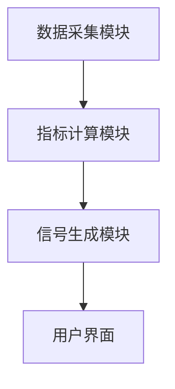

                 


# 如何利用技术分析辅助特价股票选择

> 关键词：技术分析，股票选择，特价股票，K线图，移动平均线，MACD，RSI

> 摘要：本文详细探讨了如何利用技术分析方法辅助选择特价股票。首先介绍了技术分析的核心概念和原理，然后分析了常用的技术指标及其在识别特价股票中的应用。接着，详细讲解了移动平均线、MACD和RSI等算法的数学模型和实现方法。最后，设计了一个基于技术分析的股票选择系统，并通过项目实战展示了如何利用这些技术指标来实现股票筛选和信号生成。文章还总结了最佳实践和注意事项，帮助读者更好地理解和应用这些技术。

---

## 第一章: 技术分析与特价股票概述

### 1.1 技术分析的基本概念

#### 1.1.1 技术分析的定义
技术分析是一种通过分析历史市场数据（如价格和成交量）来预测未来市场走势的方法。其核心假设是价格反映所有信息，因此通过研究价格走势和成交量变化，投资者可以发现市场的潜在趋势和模式。

技术分析主要包括以下几个核心要素：
- **价格**：股票的价格走势是技术分析的核心。
- **成交量**：成交量是价格变动的验证工具。
- **趋势**：趋势是价格波动的主要方向。
- **支撑与阻力**：支撑位和阻力位是价格波动的重要参考点。

技术分析的核心思想是通过识别价格图表中的形态和模式，预测未来的价格走势。这种方法可以帮助投资者在股票市场中找到被低估的股票（即特价股票）。

---

### 1.2 股票市场的基本知识

#### 1.2.1 股票市场的定义
股票市场是投资者通过买卖公司股份来实现资产增值的场所。股票价格受多种因素影响，包括宏观经济环境、公司基本面、市场情绪等。

#### 1.2.2 特价股票的定义
特价股票通常指价格被市场低估的股票。这些股票可能处于市场底部，或者因为某些负面因素被市场抛弃，但其内在价值高于当前市场价格。

---

### 1.3 技术分析在特价股票选择中的作用

#### 1.3.1 技术分析的优势
技术分析可以帮助投资者识别市场趋势和潜在的买卖信号。通过技术分析，投资者可以发现那些价格被低估的股票，从而在市场底部介入，捕捉反弹或反转的机会。

#### 1.3.2 技术分析的局限性
技术分析并非万能的，它依赖于历史数据，并不能完全预测未来的市场走势。市场参与者的情绪和外部因素也会影响股票价格，因此技术分析需要结合基本面分析和其他因素进行综合判断。

---

## 第二章: 技术分析的核心概念与原理

### 2.1 技术分析的核心原理

技术分析的核心原理是基于 Dow 理论，认为市场的价格走势反映了所有相关信息。技术分析通过研究价格和成交量的变化，识别市场趋势和潜在的买卖信号。以下是技术分析的几个核心原则：

- **趋势**：价格通常会沿着趋势方向运动，直到趋势发生反转。
- **支撑与阻力**：支撑位是价格下跌时的买点，阻力位是价格上涨时的卖点。
- **成交量**：成交量是价格变动的验证工具。高成交量表明交易活跃，价格走势较强。

---

### 2.2 技术分析的核心指标

#### 2.2.1 K线图
K线图是技术分析中最常用的图表类型之一。它以柱状图的形式显示了股票在一定时间内的开盘价、收盘价、最高价和最低价。K线图可以帮助投资者识别价格趋势和形态。

#### 2.2.2 移动平均线（MA）
移动平均线是将一定时间内股票的收盘价进行平均，形成一条平滑的价格走势曲线。移动平均线可以帮助投资者识别价格趋势，并提供买卖信号。

#### 2.2.3 相对强弱指数（RSI）
RSI 是衡量股票超买或超卖状态的指标，范围在 0 到 100 之间。RSI 高于 70 表示超买，低于 30 表示超卖。

#### 2.2.4 MACD
MACD 是由两条移动平均线组成的指标，用于判断价格趋势的强度和方向。MACD 的零轴线可以帮助识别买卖信号。

---

### 2.3 技术指标的对比分析

| 指标名称 | 主要功能 | 优缺点 |
|----------|----------|--------|
| K线图    | 显示价格走势 | 易于理解，但需要结合其他指标 |
| MA       | 平滑价格走势 | 延迟性较强 |
| RSI      | 判断超买超卖 | 易受短期波动影响 |
| MACD     | 判断趋势强度 | 需要结合价格走势分析 |

---

## 第三章: 技术分析算法原理

### 3.1 移动平均线（MA）算法原理

#### 3.1.1 算法原理
移动平均线的计算公式为：
$$ MA_n = \frac{1}{n} \sum_{i=1}^{n} P_i $$
其中，$P_i$ 是第 $i$ 天的收盘价，$n$ 是计算的天数。

#### 3.1.2 代码实现
```python
import pandas as pd

def calculate_ma(data, window):
    return data['收盘价'].rolling(window).mean()

# 示例数据
data = pd.DataFrame({
    '收盘价': [100, 102, 101, 103, 104]
})
window = 3
ma = calculate_ma(data, window)
print(ma)
```

---

### 3.2 相对强弱指数（RSI）算法原理

#### 3.2.1 算法原理
RSI 的计算公式为：
$$ RSI = \frac{100}{1 + \frac{U}{D}} $$
其中，$U$ 是上涨幅度的平均值，$D$ 是下跌幅度的平均值。

#### 3.2.2 代码实现
```python
def calculate_rsi(data, window):
    diff = data['收盘价'].diff()
    up = diff.where(diff > 0, 0)
    down = -diff.where(diff < 0, 0)
    avg_up = up.rolling(window).mean()
    avg_down = down.rolling(window).mean()
    rsi = 100 * (avg_up / (avg_up + avg_down))
    return rsi

# 示例数据
data = pd.DataFrame({
    '收盘价': [100, 102, 101, 103, 104]
})
window = 3
rsi = calculate_rsi(data, window)
print(rsi)
```

---

### 3.3 MACD 算法原理

#### 3.3.1 算法原理
MACD 由两条移动平均线组成：短期移动平均线（通常为 12 天）和长期移动平均线（通常为 26 天）。两条线的差值即为 MACD 线，零轴线用于判断买卖信号。

#### 3.3.2 代码实现
```python
def calculate_macd(data):
    ema12 = data['收盘价'].ewm(span=12, min_periods=12).mean()
    ema26 = data['收盘价'].ewm(span=26, min_periods=26).mean()
    macd = ema12 - ema26
    return macd

# 示例数据
data = pd.DataFrame({
    '收盘价': [100, 102, 101, 103, 104]
})
macd = calculate_macd(data)
print(macd)
```

---

## 第四章: 基于技术分析的股票选择系统设计

### 4.1 系统功能设计

#### 4.1.1 数据采集模块
数据采集模块负责从股票市场数据源获取实时或历史数据。

#### 4.1.2 指标计算模块
指标计算模块根据获取的数据计算各种技术指标，如移动平均线、RSI 和 MACD。

#### 4.1.3 信号生成模块
信号生成模块根据技术指标的组合，生成买入或卖出信号。

---

### 4.2 系统架构设计



---

### 4.3 接口设计

用户可以通过 API 调用系统功能，例如：
```python
from stock_analysis_system import StockAnalyzer

analyzer = StockAnalyzer()
signal = analyzer.generate_signal('AAPL')
print(signal)
```

---

## 第五章: 项目实战

### 5.1 安装与环境配置

安装必要的 Python 库：
```bash
pip install pandas numpy matplotlib
```

---

### 5.2 核心功能实现

#### 5.2.1 数据获取
```python
import pandas_datareader as pdr

data = pdr.get_data_yahoo('AAPL', start='2020-01-01', end='2023-12-31')
```

#### 5.2.2 指标计算
```python
def calculate_technical_indicators(data):
    # 计算移动平均线
    ma_50 = data['Close'].rolling(50).mean()
    # 计算RSI
    rsi = calculate_rsi(data, 14)
    # 计算MACD
    macd = calculate_macd(data)
    return pd.DataFrame({
        'MA_50': ma_50,
        'RSI': rsi,
        'MACD': macd
    })

# 示例数据
indicators = calculate_technical_indicators(data)
print(indicators.head())
```

---

### 5.3 信号生成

```python
def generate_signals(indicators):
    signals = []
    for i in range(len(indicators)):
        if indicators['RSI'].iloc[i] < 30 and indicators['MA_50'].iloc[i] < data['Close'].iloc[i]:
            signals.append('买入')
        elif indicators['RSI'].iloc[i] > 70 and indicators['MA_50'].iloc[i] > data['Close'].iloc[i]:
            signals.append('卖出')
        else:
            signals.append('观望')
    return signals

signals = generate_signals(indicators)
print(signals)
```

---

## 第六章: 最佳实践与总结

### 6.1 小结
技术分析是股票投资的重要工具，可以帮助投资者识别特价股票。通过移动平均线、RSI 和 MACD 等指标的综合分析，投资者可以更准确地判断买入和卖出的时机。

### 6.2 注意事项
- 技术分析不能孤立使用，应结合基本面分析和其他因素。
- 技术指标的信号需要结合市场环境和个股的基本面进行验证。
- 避免过度依赖单一指标，应综合使用多种指标进行分析。

### 6.3 拓展阅读
- 《股票作手回忆录》
- 《技术分析的真谛》
- 《算法交易：趋势、策略与系统》

---

作者：AI天才研究院/AI Genius Institute & 禅与计算机程序设计艺术 /Zen And The Art of Computer Programming

---

以上是文章的详细大纲和内容。如果需要进一步扩展或修改，请随时告知。

