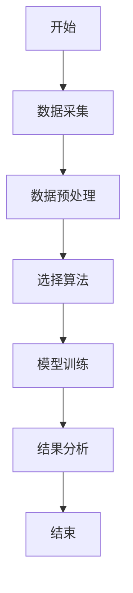
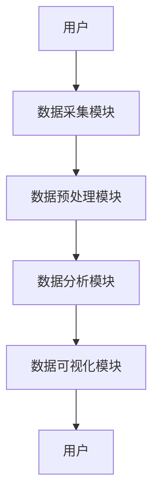
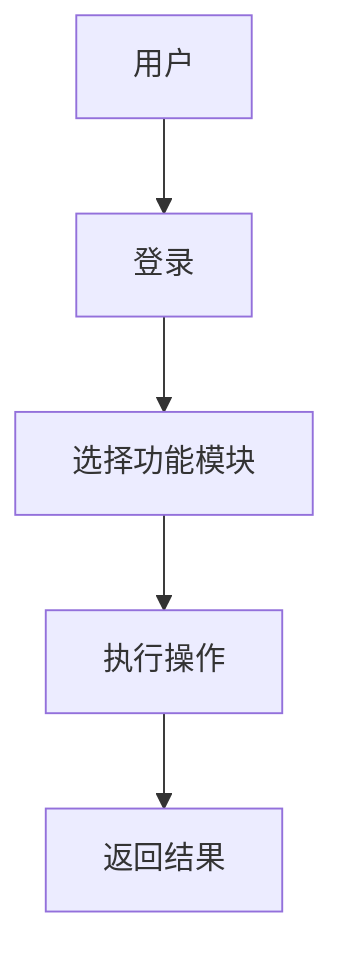

                 


# 如何利用特价股票投资应对全球经济数字化分化

## 关键词：全球经济，数字化分化，特价股票，投资策略，风险管理

## 摘要：随着全球经济向数字化方向发展，数字化分化现象日益明显，特价股票作为一种投资工具，在应对这种分化中发挥着重要作用。本文详细探讨了如何通过特价股票投资来应对全球经济数字化分化的问题，分析了其核心概念、算法原理、系统架构设计以及实际项目案例，为投资者提供了科学的投资策略和风险管理方法。

---

## 第1章 全球经济数字化分化的背景

### 1.1 经济数字化分化的概念与特征
#### 1.1.1 经济数字化分化的定义
经济数字化分化是指随着信息技术的快速发展，全球经济逐渐呈现出数字化特征，不同国家、行业和个人在数字化进程中的差异越来越大。

#### 1.1.2 数字化对全球经济格局的影响
数字化技术的应用改变了传统经济模式，推动了产业结构优化和升级，同时也加剧了经济资源的不均衡分配。

#### 1.1.3 数字化分化的表现形式与趋势
数字化分化主要表现在数字经济与实体经济的深度融合、数字技术对传统产业的颠覆性影响以及数字鸿沟的扩大化等方面。

### 1.2 特价股票投资的基本概念
#### 1.2.1 特价股票的定义与特点
特价股票是指价格相对较低，具有较大上涨潜力的股票，通常在市场波动较大时出现。

#### 1.2.2 特价股票与普通股票的区别
- 投资风险：特价股票风险较高，普通股票相对稳定。
- 投资回报：特价股票回报潜力大，普通股票回报较为稳定。
- 适用场景：特价股票适合风险偏好较高的投资者，普通股票适合稳健投资者。

#### 1.2.3 特价股票投资的适用场景
在经济波动较大或市场低迷时，特价股票投资具有较大的机会。

### 1.3 经济数字化分化与特价股票投资的关系
#### 1.3.1 数字化分化对股票市场的冲击
数字化分化加剧了市场的不稳定性，导致股票价格波动加剧。

#### 1.3.2 特价股票在数字化分化中的投资机会
数字化分化使得一些传统行业股票价格被低估，成为特价股票投资的机会。

#### 1.3.3 特价股票投资应对数字化分化的策略
通过分析数字化分化带来的市场变化，制定灵活的投资策略，抓住特价股票的投资机会。

---

## 第2章 特价股票投资的核心概念与联系

### 2.1 经济数字化分化的原理
#### 2.1.1 数字化分化的驱动因素
- 技术进步：数字技术的发展推动了经济的数字化转型。
- 产业结构变化：传统行业逐步被数字化替代，新兴行业崛起。
- 全球化与区域化：全球化的深入和区域化差异导致的经济分化。

#### 2.1.2 数字化分化对行业的影响
- 高科技行业崛起：数字化技术的应用推动了高科技行业的快速发展。
- 传统行业转型：传统行业通过数字化转型提升竞争力。
- 数字鸿沟扩大化：数字技术的应用加剧了经济资源分配的不均。

#### 2.1.3 数字化分化的经济模型
通过构建经济数字化分化的模型，分析其对股票市场的具体影响。

### 2.2 特价股票的特点与属性对比
#### 2.2.1 特价股票的核心属性
- 低估值：市盈率、市净率等指标低于行业平均水平。
- 高增长潜力：公司未来具有较大的增长空间。
- 高风险：价格波动较大，风险较高。

#### 2.2.2 特价股票与普通股票的对比分析
通过表格对比分析特价股票和普通股票在价格、风险、收益等方面的主要差异。

#### 2.2.3 特价股票的分类与应用场景
根据市场周期、行业特点等，对特价股票进行分类，并分析其适用场景。

### 2.3 经济数字化分化与特价股票的关系
#### 2.3.1 数字化分化对特价股票的影响
- 价格波动加剧：数字化分化导致市场不确定性增加，股票价格波动加剧。
- 投资机会增加：数字化分化使得部分股票价格被低估，成为投资机会。
- 投资风险增大：数字化分化加剧了市场的波动性，增加了投资风险。

#### 2.3.2 特价股票在数字化分化中的角色
特价股票在数字化分化背景下，成为投资者应对市场不确定性的重要工具。

#### 2.3.3 数字化分化对特价股票投资策略的影响
投资者需要根据数字化分化的特点，调整投资策略，抓住投资机会，规避投资风险。

---

## 第3章 特价股票投资的算法原理

### 3.1 投资策略的数学模型
#### 3.1.1 投资组合优化的数学模型
通过构建数学模型，优化投资组合，实现风险与收益的平衡。

#### 3.1.2 风险与收益的数学关系
通过公式和图表，分析风险与收益之间的关系，为投资决策提供依据。

#### 3.1.3 特价股票投资的数学公式
利用数学公式，量化分析特价股票的投资价值。

### 3.2 投资策略的算法实现
#### 3.2.1 技术分析算法
- 移动平均线（MA）：通过计算股票价格的移动平均值，判断价格趋势。
- 相对强弱指数（RSI）：通过计算股票价格的相对强弱，判断超买超卖状态。
- MACD指标：通过计算两条指数移动平均线的差值，判断价格趋势。

#### 3.2.2 基本面分析算法
- 市盈率（P/E）：通过计算股价与每股收益的比率，判断股票的价值。
- 市净率（P/B）：通过计算股价与每股净资产的比率，判断股票的价值。
- 资产负债率：通过分析公司的财务状况，判断公司的偿债能力。

#### 3.2.3 组合优化算法
- Markowitz优化模型：通过优化投资组合的风险和收益，实现投资收益最大化。
- 前沿优化算法：通过计算有效前沿，选择最优的投资组合。

### 3.3 算法的流程图


---

## 第4章 特价股票投资的系统分析与架构设计

### 4.1 系统功能设计
#### 4.1.1 数据采集模块
- 数据来源：股票市场数据、公司财务数据、行业趋势数据。
- 数据格式：结构化数据、非结构化数据。
- 数据存储：数据库、数据仓库。

#### 4.1.2 数据分析模块
- 技术分析：移动平均线、RSI、MACD等指标分析。
- 基本面分析：市盈率、市净率、资产负债率等财务指标分析。
- 组合优化：Markowitz优化模型、前沿优化算法等。

#### 4.1.3 可视化模块
- 数据可视化：K线图、散点图、柱状图等。
- 结果展示：投资组合优化结果、风险收益分析结果。

### 4.2 系统架构设计


### 4.3 系统接口设计
- 数据接口：API接口设计，实现数据的导入和导出。
- 用户接口：图形用户界面设计，方便用户操作。

### 4.4 系统交互流程


---

## 第5章 特价股票投资的项目实战

### 5.1 环境配置
- 技术环境：Python、R、MATLAB等。
- 数据源：股票市场数据、公司财务数据、行业趋势数据。
- 工具安装：安装数据分析工具、可视化工具、优化算法库。

### 5.2 核心代码实现
#### 5.2.1 技术分析代码
```python
import pandas as pd
import numpy as np

# 移动平均线计算
def compute_ma(data, window):
    return data['收盘价'].rolling(window).mean()

# 相对强弱指数计算
def compute_rsi(data, window):
    delta = data['收盘价'] - data['收盘价'].shift(1)
    up = delta.where(delta > 0, 0)
    down = delta.where(delta < 0, 0)
    rs = up.rolling(window).mean() / down.rolling(window).mean()
    rsi = 100 - (100 - (rs.rolling(window).mean() / 1))
    return rsi
```

#### 5.2.2 基本面分析代码
```python
import pandas as pd

# 市盈率计算
def compute_pe(data):
    pe = data['收盘价'] / data['每股收益']
    return pe

# 市净率计算
def compute_pb(data):
    pb = data['收盘价'] / data['每股净资产']
    return pb
```

#### 5.2.3 组合优化代码
```python
import numpy as np
from scipy.optimize import minimize

# Markowitz优化模型
def optimize_portfolio(weights, returns, covariance):
    n = len(weights)
    # 定义目标函数
    def objective(x):
        return np.dot(x.T, np.dot(covariance, x))
    # 定义约束条件
    constraints = [
        {'type': 'eq', 'fun': lambda x: np.sum(x) - 1}
    ]
    # 求解优化问题
    result = minimize(objective, np.ones(n)/n, method='SLSQP', constraints=constraints)
    return result.x

# 应用优化模型
weights = optimize_portfolio(weights, returns, covariance)
```

### 5.3 案例分析
- 案例背景：选择一个具体的市场环境，分析特价股票的投资机会。
- 数据分析：通过技术分析和基本面分析，选择合适的特价股票。
- 投资策略：制定投资策略，实现投资收益最大化。

### 5.4 项目小结
总结项目实施过程中的经验与教训，提出改进建议。

---

## 第6章 特价股票投资的最佳实践与小结

### 6.1 投资策略建议
- 风险管理：设置止损点、分散投资、定期评估投资组合。
- 技术分析：结合技术指标和基本面分析，制定科学的投资策略。
- 时机选择：根据市场波动和公司基本面，选择合适的投资时机。

### 6.2 风险管理
- 风险评估：通过VaR、CVaR等方法，评估投资组合的风险。
- 风险控制：设置止损点、调整投资比例、及时止损。

### 6.3 未来研究方向
- 数字化分化的深入研究：分析数字化分化对股票市场的长期影响。
- 投资策略优化：探索新的投资策略和算法，提高投资收益。

### 6.4 小结
总结全文，强调特价股票投资在应对全球经济数字化分化中的重要性，提出未来的研究方向和实践建议。

---

## 作者：AI天才研究院/AI Genius Institute & 禅与计算机程序设计艺术/Zen And The Art of Computer Programming

---

通过以上目录和内容安排，我们可以系统地分析如何利用特价股票投资应对全球经济数字化分化的问题，从理论到实践，从分析到实施，全面探讨投资策略和风险管理方法。

