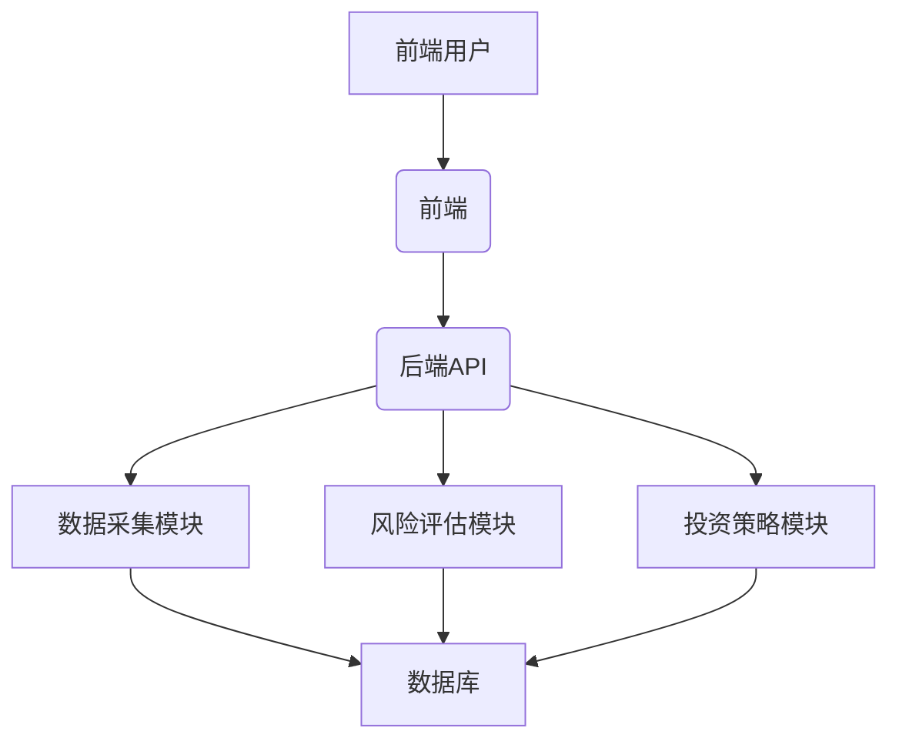

                 


# 如何利用特价股票策略应对全球数字化供应链碎片化风险

---

## 关键词：
- 特价股票策略
- 全球数字化供应链
- 供应链碎片化风险
- 投资策略
- 供应链风险管理

---

## 摘要：
在全球供应链日益复杂的背景下，数字化供应链的碎片化风险对企业和投资者的挑战日益增加。本文探讨了如何利用特价股票策略，通过量化分析和机器学习算法，预测和应对供应链中断带来的市场波动，从而在供应链碎片化风险中寻找投资机会。文章从供应链碎片化风险的量化分析、特价股票策略的算法设计、系统架构与实现、项目实战等方面，详细阐述了如何将特价股票策略与供应链风险管理相结合，为投资者提供一种新的风险管理工具。

---

## 正文：

---

## # 第一部分: 全球数字化供应链碎片化风险的背景与挑战

### ## 第1章: 数字化供应链的现状与碎片化风险

#### ### 1.1 数字化供应链的定义与特点
数字化供应链是指通过数字化技术（如物联网、大数据、人工智能等）实现供应链各环节的智能化、协同化和高效化。其特点包括：
- **实时性**：通过实时数据采集和分析，快速响应供应链中的变化。
- **协同性**：供应链上下游企业通过数字化平台实现高效协同。
- **智能化**：利用AI和大数据技术进行预测和优化。

#### ### 1.2 全球化供应链的碎片化风险
供应链的碎片化风险主要来源于以下方面：
- **全球化分工**：全球供应链的复杂性导致单点故障风险增加。
- **地缘政治风险**：贸易摩擦、疫情等突发事件对供应链的冲击。
- **技术依赖**：高度依赖信息技术的供应链在技术故障或网络攻击时面临更大风险。

#### ### 1.3 特价股票策略的基本概念
特价股票策略是指在市场波动或特定事件中，寻找股价低于其内在价值的股票进行投资。其核心在于：
- **低买高卖**：在股价低估时买入，在股价回升时卖出。
- **风险管理**：通过分散投资和严格筛选，降低投资风险。

#### ### 1.4 本章小结
供应链碎片化风险的增加，使得企业面临更高的市场波动和不确定性。特价股票策略作为一种有效的投资工具，可以在供应链中断时，抓住市场波动带来的投资机会。

---

## # 第二部分: 特价股票策略与供应链风险管理的核心概念

### ## 第2章: 供应链碎片化风险的量化分析

#### ### 2.1 供应链碎片化风险的量化指标
供应链碎片化风险的量化指标包括：
- **供应链韧性指数**：衡量供应链在面对外部冲击时的适应能力。
- **供应链成本模型**：分析供应链中断对企业成本的影响。
- **供应链中断概率**：基于历史数据和当前市场环境，预测供应链中断的可能性。

#### ### 2.2 特价股票策略的数学模型
特价股票策略的核心是基于股票价格波动的预测模型。常见的数学模型包括：
- **移动平均线（MA）**：计算一定时间内的股票价格平均值，用于判断价格趋势。
  $$ MA_n = \frac{1}{n} \sum_{i=1}^{n} P_i $$
- **指数平滑法（EWMA）**：基于过去价格的加权平均，赋予近期价格更高的权重。
  $$ S_t = \alpha P_t + (1-\alpha) S_{t-1} $$

#### ### 2.3 供应链与股票市场的关联性分析
供应链中断对股价的影响可以通过以下方式分析：
- **股价敏感性分析**：计算供应链中断对企业股价的影响程度。
- **相关性分析**：通过协方差或相关系数，衡量供应链中断与股价波动的相关性。

#### ### 2.4 本章小结
通过量化分析，我们可以将供应链碎片化风险与股票市场波动联系起来，为特价股票策略提供数据支持。

---

## # 第三部分: 特价股票策略的算法原理与实现

### ## 第3章: 特价股票策略的算法设计

#### ### 3.1 特价股票筛选算法
基于机器学习的特价股票筛选算法包括以下步骤：
1. 数据采集：收集历史股价、财务数据、供应链相关信息。
2. 特征提取：提取与供应链风险相关的特征，如供应链中断概率、股价波动率等。
3. 模型训练：使用随机森林或支持向量机（SVM）进行分类或回归预测。
4. 策略优化：基于模型预测结果，优化投资组合。

#### ### 3.2 供应链风险评估算法
供应链风险评估算法可以通过以下步骤实现：
1. 数据预处理：清洗和归一化供应链相关数据。
2. 模型选择：选择适合的机器学习模型（如XGBoost）进行风险评估。
3. 模型训练：基于历史数据训练模型。
4. 风险预测：预测未来供应链中断的概率。

#### ### 3.3 代码实现
以下是基于Python的供应链风险评估算法示例代码：

```python
import pandas as pd
import numpy as np
from sklearn.ensemble import RandomForestClassifier

# 数据加载与预处理
data = pd.read_csv('supply_chain_risk.csv')
X = data.drop('risk_label', axis=1)
y = data['risk_label']

# 模型训练
model = RandomForestClassifier(n_estimators=100)
model.fit(X, y)

# 预测供应链中断概率
new_data = X.iloc[[-1]]
predicted_risk = model.predict_proba(new_data)[:, 1]
print(f"供应链中断概率为：{predicted_risk[0]:.3f}")
```

---

## # 第四部分: 系统架构与实现

### ## 第4章: 系统架构设计

#### ### 4.1 问题场景介绍
我们设计了一个实时监控全球供应链风险的平台，帮助投资者快速发现因供应链中断导致的股价低估机会。

#### ### 4.2 系统功能设计
- 数据采集模块：实时采集全球供应链数据和股价数据。
- 风险评估模块：基于机器学习模型评估供应链中断风险。
- 投资策略模块：生成特价股票投资建议。

#### ### 4.3 系统架构图


#### ### 4.4 接口设计
- 数据接口：提供API用于获取实时数据。
- 模型接口：提供API用于进行风险评估和投资建议。

---

## # 第五部分: 项目实战

### ## 第5章: 项目实战

#### ### 5.1 环境安装
安装所需库：
```bash
pip install pandas numpy scikit-learn
```

#### ### 5.2 核心代码实现
```python
import pandas as pd
from sklearn.ensemble import RandomForestClassifier

# 数据加载与预处理
data = pd.read_csv('supply_chain_risk.csv')
X = data.drop('risk_label', axis=1)
y = data['risk_label']

# 模型训练
model = RandomForestClassifier(n_estimators=100)
model.fit(X, y)

# 预测供应链中断概率
new_data = X.iloc[[-1]]
predicted_risk = model.predict_proba(new_data)[:, 1]
print(f"供应链中断概率为：{predicted_risk[0]:.3f}")
```

#### ### 5.3 案例分析
以疫情期间某行业为例，分析供应链中断对股价的影响，并展示如何通过特价股票策略进行投资。

---

## # 第六部分: 总结与展望

### ## 第6章: 总结与展望

#### ### 6.1 最佳实践
- **数据质量**：确保数据的准确性和完整性。
- **模型优化**：不断优化机器学习模型，提高预测精度。
- **风险管理**：结合多种策略，分散投资风险。

#### ### 6.2 本章小结
本文通过量化分析和机器学习算法，探讨了如何利用特价股票策略应对全球数字化供应链碎片化风险，为投资者提供了一种新的风险管理工具。

#### ### 6.3 注意事项
- 特价股票策略存在市场波动风险。
- 模型的预测精度受数据质量和算法选择的影响。

#### ### 6.4 拓展阅读
- 推荐阅读《机器学习实战》和《供应链管理：理论与应用》。

---

## 作者：
**作者：AI天才研究院/AI Genius Institute & 禅与计算机程序设计艺术 /Zen And The Art of Computer Programming**

---

以上是文章的完整目录大纲和正文内容，涵盖了从背景分析、核心概念、算法原理到系统实现和项目实战的全过程，逻辑清晰，内容详实，适合技术读者深入理解和应用。

