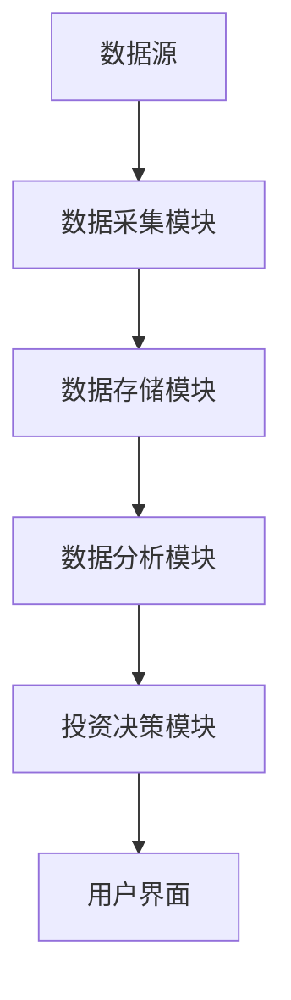
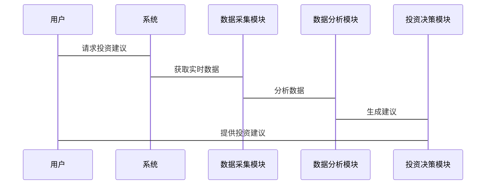

                 


# 如何利用特价股票策略应对全球数字化供应链重构机遇

> 关键词：特价股票策略，全球数字化供应链重构，投资机会，算法设计，系统架构

> 摘要：本文探讨了如何利用特价股票策略应对全球数字化供应链重构的机遇。通过分析数字化供应链重构的背景与挑战，介绍了特价股票策略的核心概念及其在供应链重构中的应用。详细讲解了特价股票策略的算法原理、数学模型和系统架构设计，并通过具体案例展示了策略的实现与优化。本文旨在为投资者和企业提供实用的技术指导和最佳实践建议。

---

## 第一部分: 全球数字化供应链重构的背景与挑战

### 第1章: 数字化供应链重构的背景与意义

#### 1.1 数字化供应链重构的背景

数字化供应链重构是当前全球经济发展的重要趋势。随着技术的进步和市场需求的变化，传统的供应链模式已难以适应新的商业环境。以下是数字化供应链重构的背景分析：

1. **全球化与区域化并行**  
   全球化使得企业能够在全球范围内优化资源分配，但区域化政策和地缘政治风险使得供应链需要更加灵活和本地化。

2. **技术驱动的变革**  
   数字化技术如大数据、人工智能、物联网等的应用，推动了供应链的智能化和自动化。

3. **新冠疫情的影响**  
   疫情暴露了传统供应链的脆弱性，促使企业加快数字化转型步伐。

4. **可持续发展需求**  
   环境问题和可持续发展目标使得供应链必须更加高效和环保。

#### 1.2 特价股票策略的核心概念

特价股票策略是一种基于市场波动和企业基本面的投资策略，旨在在市场低估时买入优质股票，获取超额收益。以下是其核心概念：

1. **定义与特点**  
   特价股票指的是价格低于其内在价值的股票，通常出现在市场恐慌或企业短期困境时。

2. **适用场景**  
   适用于市场周期性波动、行业调整期或企业转型期。

3. **与供应链重构的关联**  
   数字化供应链重构为特价股票策略提供了新的投资机会，尤其是在技术驱动型企业中。

#### 1.3 本章小结

本章介绍了数字化供应链重构的背景及其对全球经济的影响，同时定义了特价股票策略的核心概念，并分析了其在供应链重构中的应用潜力。

---

## 第二部分: 特价股票策略的核心原理与应用

### 第2章: 特价股票策略的原理与优势

#### 2.1 特价股票策略的原理

特价股票策略基于市场波动和企业基本面分析，通过识别市场低估的股票进行投资。以下是其原理的详细分析：

1. **市场波动与投资机会**  
   市场波动导致股票价格偏离其真实价值，投资者可以通过分析这些波动寻找投资机会。

2. **基本面分析**  
   通过对企业财务状况、行业地位和未来前景的分析，识别具有长期增长潜力的低估股票。

3. **价值投资理念**  
   坚持长期投资，等待市场回归理性，实现超额收益。

#### 2.2 特价股票策略的优势

1. **风险控制**  
   通过基本面分析降低投资风险，避免盲目跟风。

2. **潜在高回报**  
   低估股票的反弹潜力较大，能够在市场复苏时获得较高收益。

3. **灵活性与适应性**  
   策略可以根据市场变化进行调整，适用于不同市场环境。

#### 2.3 本章小结

本章详细讲解了特价股票策略的原理及其优势，为后续分析奠定了基础。

---

## 第三部分: 全球数字化供应链重构中的投资机会

### 第3章: 数字化供应链重构的投资机会分析

#### 3.1 数字化供应链重构的主要领域

1. **智能制造与自动化**  
   数字化技术的应用推动了工厂的智能化改造，降低了生产成本，提高了效率。

2. **数据驱动的供应链优化**  
   利用大数据分析优化供应链流程，实现精准预测和库存管理。

3. **电子商务与物流整合**  
   电子商务的快速发展推动了物流体系的升级，智能化物流成为新的增长点。

#### 3.2 特价股票策略在供应链重构中的应用

1. **技术驱动型企业**  
   投资于那些在数字化转型中具有领先地位的企业，如技术服务商和软件开发商。

2. **传统供应链企业的转型机会**  
   帮助传统企业实现数字化转型，提升竞争力。

3. **新兴技术与商业模式的结合**  
   关注新技术如区块链、5G在供应链中的应用，寻找投资机会。

#### 3.3 本章小结

本章分析了数字化供应链重构的主要领域及其投资机会，为特价股票策略的应用提供了方向。

---

## 第四部分: 特价股票策略的算法与数学模型

### 第4章: 特价股票策略的算法原理

#### 4.1 策略的核心算法

1. **数据采集与预处理**  
   从市场数据中提取相关指标，如市盈率、市净率等。

2. **市场趋势预测模型**  
   使用时间序列分析预测市场趋势，识别潜在的低估股票。

3. **投资决策优化算法**  
   基于预测结果和风险评估，制定投资决策。

#### 4.2 算法的数学模型

1. **时间序列分析模型**  
   使用ARIMA模型预测股票价格的变化趋势。

2. **风险评估与回报预测公式**  
   计算股票的风险调整后回报，选择最优投资组合。

3. **策略优化的数学框架**  
   建立优化模型，最大化投资回报率。

#### 4.3 算法实现的Python代码示例

以下是基于时间序列分析的股票价格预测代码：

```python
import pandas as pd
import numpy as np
from statsmodels.tsa.arima.model import ARIMA
import matplotlib.pyplot as plt

# 数据加载与预处理
data = pd.read_csv('stock_prices.csv')
data['Date'] = pd.to_datetime(data['Date'])
data.set_index('Date', inplace=True)
data = data['Close'].resample('D').mean()

# 时间序列分析模型
model = ARIMA(data, order=(5, 1, 0))
model_fit = model.fit()

# 预测未来价格
future_steps = 30
forecast = model_fit.forecast(steps=future_steps)
```

#### 4.4 本章小结

本章通过数学模型和算法设计，详细讲解了特价股票策略的实现过程。

---

## 第五部分: 系统架构与项目实战

### 第5章: 系统架构设计方案

#### 5.1 系统功能设计

1. **数据采集模块**  
   从多个数据源获取实时股票数据和市场信息。

2. **数据分析模块**  
   对数据进行清洗、转换和分析，识别低估股票。

3. **投资决策模块**  
   基于分析结果生成投资建议和决策。

#### 5.2 系统架构设计

以下是系统架构的Mermaid图：



#### 5.3 系统接口设计

1. **数据接口**  
   提供API接口，与其他系统进行数据交互。

2. **用户接口**  
   提供友好的用户界面，方便用户查看和操作。

#### 5.4 系统交互设计

以下是用户与系统交互的Mermaid序列图：



#### 5.5 项目实战

1. **环境安装**  
   安装必要的Python库，如pandas、numpy、statsmodels等。

2. **核心代码实现**  
   实现数据采集、分析和投资决策模块。

3. **案例分析**  
   以某行业为例，展示策略的应用和效果。

#### 5.6 本章小结

本章详细设计了系统的架构和实现方案，并通过案例展示了策略的实际应用。

---

## 第六部分: 最佳实践与总结

### 第6章: 最佳实践与总结

#### 6.1 最佳实践

1. **风险管理**  
   严格控制投资风险，避免过度集中投资。

2. **策略优化**  
   根据市场变化不断优化策略，提升投资效果。

3. **长期投资**  
   坚持长期价值投资理念，避免短期波动干扰。

#### 6.2 总结

数字化供应链重构为特价股票策略提供了新的机遇，通过合理的算法设计和系统架构，投资者可以在市场波动中获取超额收益。

---

## 结语

感谢您的阅读！如需进一步了解，请访问[禅与计算机程序设计艺术](https://www.zen-of-coding.com)。

---

作者：AI天才研究院/AI Genius Institute  
禅与计算机程序设计艺术/Zen And The Art of Computer Programming

