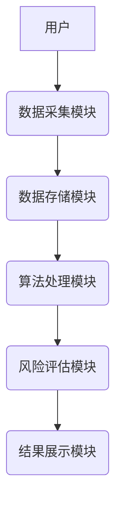
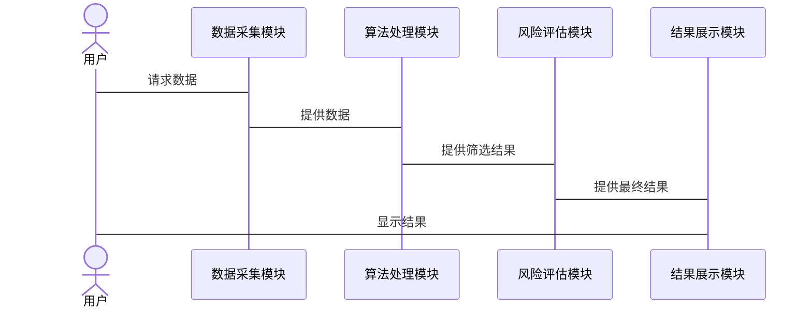

                 


# 如何利用特价股票策略应对去全球化风险

## 关键词：去全球化风险，特价股票，风险管理，投资策略，股票市场波动

## 摘要：  
随着全球化的逆转，去全球化趋势对经济和金融市场产生了深远影响。本文深入探讨了如何利用特价股票策略来应对去全球化带来的风险。通过分析去全球化对股票市场的冲击，我们提出了基于特价股票的投资策略，并结合数学模型和算法优化，详细讲解了如何在风险中寻找投资机会。文章还通过实际案例分析了特价股票策略的实现过程，并提供了系统设计与架构方案，为投资者应对去全球化风险提供了理论支持和实践指导。

---

# 第一部分: 特价股票策略与去全球化风险概述

## 第1章: 特价股票策略的背景与意义

### 1.1 去全球化的背景与影响  
- **1.1.1 去全球化的概念与驱动因素**  
  - 全球化是指跨国界的经济、文化和社会一体化过程，而去全球化则是指这一过程的逆转。其主要驱动因素包括地缘政治冲突、贸易保护主义抬头、供应链本地化趋势等。  
  - 去全球化对经济的影响包括国际贸易减少、跨国企业运营成本上升、全球供应链断裂等。  

- **1.1.2 去全球化对经济和市场的冲击**  
  - 去全球化导致跨国公司面临更高的贸易壁垒和不确定性，进而影响企业盈利能力。  
  - 股票市场方面，去全球化可能导致某些行业的股票价格大幅波动，尤其是那些依赖全球供应链的行业。  

- **1.1.3 去全球化与股票市场的关联**  
  - 去全球化加剧了市场的不确定性和波动性，投资者需要寻找新的策略来应对这种变化。  

### 1.2 特价股票策略的核心概念  
- **1.2.1 特价股票的定义与特点**  
  - 特价股票是指价格远低于其内在价值的股票。  
  - 其特点包括低估值、高分红率、高安全边际等。  

- **1.2.2 特价股票策略的适用场景**  
  - 在市场波动较大时，特价股票策略尤其适用，因为它能够在市场低估时寻找优质资产。  
  - 适用于应对去全球化风险的场景，因为去全球化可能导致某些行业的股票价格被市场低估。  

- **1.2.3 特价股票策略的优势与局限性**  
  - **优势**：  
    - 低估值股票具有较高的安全边际，能够在市场复苏时带来超额收益。  
    - 适用于长期投资，能够在市场波动中稳定收益。  
  - **局限性**：  
    - 需要较高的市场分析能力，识别真正的低价股票需要专业知识。  
    - 短期内可能面临股价继续下跌的风险。  

### 1.3 特价股票策略在风险管理中的作用  
- **1.3.1 风险管理的基本概念**  
  - 风险管理是指通过识别、评估和应对风险来降低其对投资组合的负面影响。  

- **1.3.2 特价股票策略如何降低投资风险**  
  - 通过选择低估值股票，投资者可以避免市场高估带来的风险。  
  - 在市场下跌时，低估值股票的跌幅通常小于高估值股票。  

- **1.3.3 特价股票策略的长期与短期效果**  
  - 长期来看，特价股票策略能够在市场周期中稳定收益。  
  - 短期来看，市场波动可能会影响策略的效果，但通过合理的组合管理可以降低短期风险。  

---

## 第2章: 特价股票策略的核心原理  

### 2.1 特价股票策略的基本原理  
- **2.1.1 市场波动与投资机会**  
  - 市场波动是投资机会的来源，尤其是去全球化引发的市场波动为特价股票策略提供了机会。  

- **2.1.2 特价股票的识别方法**  
  - 通过估值指标（如市盈率、市净率）识别低估值股票。  
  - 分析公司的基本面，选择具有稳定盈利能力和良好财务状况的公司。  

- **2.1.3 投资者心理与市场行为**  
  - 投资者心理偏差（如恐惧和贪婪）会导致市场波动，为特价股票策略提供机会。  

### 2.2 特价股票策略的数学模型  

#### 2.2.1 市场价格波动模型  
- 使用随机游走模型描述市场价格波动：  
  $$ P_{t} = P_{t-1} + \epsilon $$  
  其中，$\epsilon$ 是随机扰动项。  

#### 2.2.2 投资收益计算公式  
- 特价股票的投资收益可以通过以下公式计算：  
  $$ R = \frac{P_{final} - P_{initial}}{P_{initial}} \times 100\% $$  

#### 2.2.3 风险评估与收益优化  
- 风险调整后的收益可以通过夏普比率衡量：  
  $$ \text{夏普比率} = \frac{E[R_p - R_f]}{\sigma_p} $$  
  其中，$E[R_p - R_f]$ 是投资组合的超额收益期望值，$\sigma_p$ 是投资组合的收益波动率。  

### 2.3 特价股票策略的算法实现  

#### 2.3.1 数据收集与预处理  
- 数据来源：历史股价、财务数据、行业指标等。  
- 数据清洗：处理缺失值、异常值。  

#### 2.3.2 算法选择与实现  
- 使用多因子模型筛选低估值股票：  
  $$ \text{因子} = \frac{\text{市盈率}}{\text{行业平均市盈率}} $$  

#### 2.3.3 算法优化与改进  
- 引入机器学习算法（如随机森林）优化股票筛选过程。  

---

## 第3章: 去全球化风险的系统分析  

### 3.1 去全球化风险的来源与特征  
- **3.1.1 供应链断裂风险**  
  - 供应链断裂可能导致企业成本上升，进而影响股价。  

- **3.1.2 贸易壁垒增加**  
  - 贸易壁垒增加可能导致出口企业收入下降，股价下跌。  

- **3.1.3 地缘政治冲突**  
  - 地缘政治冲突可能引发市场恐慌，导致股价波动。  

### 3.2 去全球化风险对股票市场的影响  
- **3.2.1 行业层面的影响**  
  - 部分行业（如制造业、贸易）可能受到较大冲击。  

- **3.2.2 公司层面的影响**  
  - 公司的收入、利润和现金流可能受到影响。  

- **3.2.3 市场整体波动性**  
  - 去全球化可能导致市场波动性增加。  

### 3.3 去全球化风险的量化与评估  
- **3.3.1 风险量化指标**  
  - 使用VaR（Value at Risk）衡量市场风险。  

- **3.3.2 风险评估模型**  
  - 使用Copula模型分析相关资产之间的依赖关系。  

- **3.3.3 风险与收益的平衡**  
  - 通过风险调整后的收益优化投资组合。  

---

## 第4章: 特价股票策略在风险管理中的应用  

### 4.1 特价股票策略的组合优化  
- **4.1.1 投资组合构建原理**  
  - 通过多因子模型优化投资组合，降低风险。  

- **4.1.2 特价股票在组合中的作用**  
  - 特价股票作为低风险资产，能够降低投资组合的整体风险。  

- **4.1.3 组合优化的数学模型**  
  - 使用现代投资组合理论（MPT）优化投资组合：  
    $$ \text{目标函数} = \min \sigma_p^2 \quad \text{subject to} \quad \mathbf{w}^T \mathbf{1} = 1 $$  

### 4.2 特价股票策略的风险对冲  
- **4.2.1 风险对冲的基本概念**  
  - 通过做空相关资产或购买保险产品对冲风险。  

- **4.2.2 特价股票策略的对冲机制**  
  - 通过配置低相关性的资产降低投资组合的风险。  

- **4.2.3 对冲效果的评估与优化**  
  - 使用回测分析评估对冲策略的有效性。  

### 4.3 特价股票策略的动态调整  
- **4.3.1 动态调整的必要性**  
  - 市场环境变化需要动态调整投资组合。  

- **4.3.2 动态调整的实现方法**  
  - 定期重新评估股票估值，调整投资组合。  

---

## 第5章: 系统设计与架构方案  

### 5.1 项目背景与目标  
- 项目目标：开发一个基于特价股票策略的风险管理系统。  

### 5.2 系统功能设计  
- **功能模块**：  
  - 数据采集模块：收集历史股价、财务数据。  
  - 算法处理模块：筛选低估值股票。  
  - 风险评估模块：评估投资组合风险。  

### 5.3 系统架构设计  



### 5.4 系统接口设计  
- API接口：  
  - 数据接口：提供历史数据查询功能。  
  - 算法接口：提供股票筛选服务。  

### 5.5 系统交互设计  



---

## 第6章: 项目实战与展望  

### 6.1 环境安装与配置  
- **工具安装**：  
  - Python 3.8+  
  - 数据处理库（Pandas、NumPy）  
  - 可视化库（Matplotlib、Seaborn）  

### 6.2 核心代码实现  

```python
import pandas as pd
import numpy as np

def calculate_value_at_risk(returns, confidence_level=0.95):
    # 计算VaR
    return np.quantile(returns, 1 - confidence_level)

def screen_cheap_stocks(prices, financials):
    # 筛选低估值股票
    df = pd.merge(prices, financials, on='stock_id')
    df['pe_ratio'] = df['price'] / df['eps']
    return df[df['pe_ratio'] < df['pe_ratio'].quantile(0.25)]
```

### 6.3 案例分析与解读  
- **案例分析**：  
  - 选择某行业的几只股票，应用特价股票策略进行筛选。  
  - 计算投资组合的VaR，评估风险。  

### 6.4 项目小结  
- 通过项目实战，验证了特价股票策略的有效性。  
- 系统设计为投资者提供了高效的风险管理工具。  

---

## 第7章: 总结与展望  

### 7.1 本章总结  
- 本文详细探讨了如何利用特价股票策略应对去全球化风险。  
- 通过数学模型和系统设计，为投资者提供了理论支持和实践指导。  

### 7.2 未来展望  
- 进一步研究机器学习算法在股票筛选中的应用。  
- 探索更多风险管理策略，应对复杂的市场环境。  

---

## 作者：AI天才研究院/AI Genius Institute & 禅与计算机程序设计艺术 /Zen And The Art of Computer Programming

