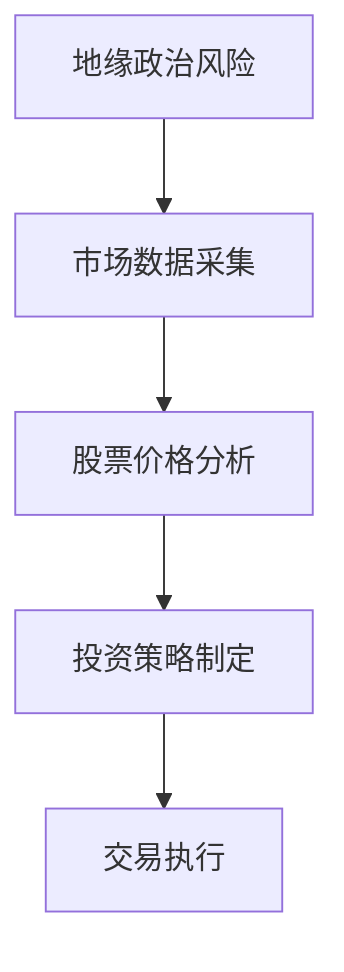
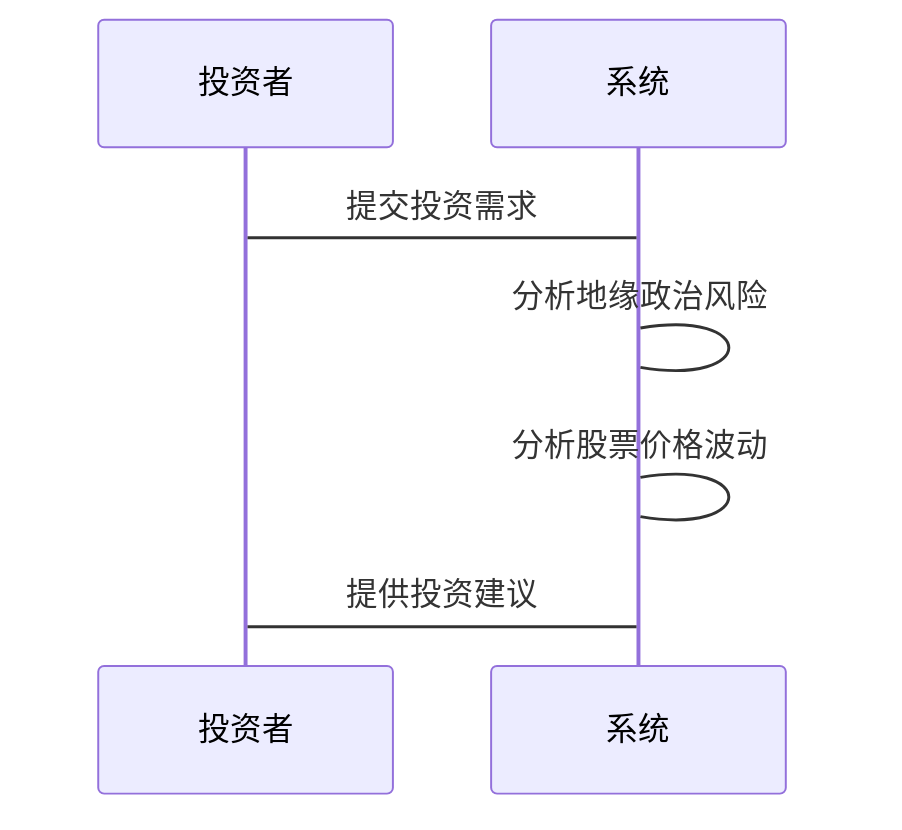

                 


# 如何利用特价股票策略应对地缘政治风险

## 关键词：地缘政治风险、特价股票、投资策略、风险管理、市场分析

## 摘要：地缘政治风险是影响金融市场的重要因素，特别是股票市场。本文将探讨如何利用特价股票策略来应对地缘政治风险。通过分析地缘政治风险的定义、来源及其对股票市场的影响机制，结合特价股票的特点和优势，提出具体的策略和方法。文章还将详细讲解如何通过系统架构和数学模型来优化投资决策，结合实际案例分析，为投资者提供切实可行的指导。

---

## 正文

### # 第一部分：地缘政治风险的基础知识

#### ## 第1章：地缘政治风险的定义与特征

##### ### 1.1 地缘政治风险的定义
地缘政治风险是指由于地理位置、国家间关系、资源分配、文化差异等因素引发的政治冲突、经济制裁、军事对抗等事件，这些事件可能对全球经济、金融市场和企业经营产生负面影响。地缘政治风险通常涉及国家之间的竞争、领土争端、资源争夺、恐怖主义活动、贸易摩擦等。

##### ### 1.2 地缘政治风险的来源
地缘政治风险的来源多种多样，主要包括以下几个方面：
1. **国际冲突与战争**：如主权争端、边界冲突、宗教矛盾等。
2. **政治动荡与政权更迭**：如政权颠覆、政变、选举争议等。
3. **经济制裁与贸易争端**：如关税战、制裁措施、贸易限制等。
4. **地区安全问题与资源争夺**：如能源资源争夺、水资源争端等。

##### ### 1.3 地缘政治风险的分类
地缘政治风险可以根据不同的标准进行分类，以下是常见的分类方式：
1. **区域性风险**：如中东地区的冲突、欧洲的能源安全问题等。
2. **全球性风险**：如全球性的贸易摩擦、经济制裁等。
3. **特定国家风险**：如美国与伊朗的冲突、中美贸易摩擦等。
4. **行业性风险**：如能源行业的资源争夺、科技行业的技术封锁等。

#### ## 第2章：地缘政治风险对股票市场的影响机制

##### ### 2.1 地缘政治事件对股市的直接影响
地缘政治事件通常会导致市场情绪的剧烈波动，从而直接影响股票价格。以下是地缘政治事件对股市的直接影响机制：
1. **市场情绪波动**：地缘政治事件会引发投资者的恐慌情绪，导致股市下跌。
2. **股票价格的短期剧烈波动**：如战争爆发、制裁实施等事件会引发相关股票价格的大幅波动。
3. **市场流动性变化**：地缘政治风险上升时，投资者可能会撤离股市，导致市场流动性下降。

##### ### 2.2 地缘政治风险对股市的间接影响
地缘政治风险对股市的间接影响主要体现在以下几个方面：
1. **经济政策调整**：政府可能会采取货币宽松政策、财政刺激措施等来应对地缘政治风险，这些政策会影响股市。
2. **企业盈利预期变化**：地缘政治风险可能会影响企业的供应链、市场需求、利润率等，从而影响企业的盈利预期。
3. **投资者行为改变**：投资者可能会转向避险资产，如黄金、债券等，导致股市资金外流。

##### ### 2.3 地缘政治风险与股票市场的相关性分析
地缘政治风险与股票市场的相关性可以通过历史数据和统计分析来研究。以下是相关性分析的关键点：
1. **历史案例分析**：如20世纪70年代的石油危机、2001年的“9·11”事件、2014年的乌克兰危机等。
2. **数据统计与相关性研究**：通过统计地缘政治事件与股票市场的相关性系数，分析其相关性强度和方向。

---

### # 第二部分：特价股票策略的概述

#### ## 第3章：特价股票的定义与特点

##### ### 3.1 特价股票的定义
特价股票是指价格相对较低的股票，通常是指那些价格在1美元以下的股票。这些股票通常来自小公司或处于困境中的公司。特价股票的特点包括：
1. **低价特性**：价格通常低于普通股票。
2. **高波动性**：价格波动较大，可能在短时间内出现大幅波动。
3. **高风险高回报**：投资风险较高，但潜在回报也较大。

##### ### 3.2 特价股票的市场特性
特价股票的市场特性主要体现在以下几个方面：
1. **市场流动性**：通常流动性较低，交易量较小。
2. **价格敏感性**：对市场情绪的变化非常敏感。
3. **投资风险**：由于公司基本面较差，投资风险较高。

##### ### 3.3 特价股票与普通股票的对比
以下是特价股票与普通股票的对比分析：

| 特性                | 特价股票                | 普通股票                |
|---------------------|-------------------------|-------------------------|
| 价格                | 通常低于1美元          | 通常高于1美元          |
| 市场流动性           | 较低                   | 较高                   |
| 投资风险            | 高                     | 较低                   |
| 波动性               | 高                     | 较低                   |
| 潜在回报            | 高                     | 较低                   |

---

### # 第三部分：地缘政治风险与特价股票策略的结合

#### ## 第4章：地缘政治风险对特价股票的影响

##### ### 4.1 地缘政治事件对特价股票的直接影响
地缘政治事件对特价股票的直接影响主要体现在以下几个方面：
1. **市场情绪波动**：地缘政治事件会导致投资者情绪波动，从而影响特价股票的价格。
2. **价格波动**：特价股票的价格通常较为敏感，地缘政治事件可能导致其价格的剧烈波动。

##### ### 4.2 地缘政治风险对特价股票的间接影响
地缘政治风险对特价股票的间接影响主要体现在以下几个方面：
1. **经济政策调整**：政府可能会采取货币宽松政策，导致货币贬值，从而影响特价股票的价格。
2. **企业盈利预期变化**：地缘政治风险可能会影响企业的供应链、市场需求等，从而影响企业的盈利预期，进而影响股票价格。

---

### # 第四部分：利用特价股票策略应对地缘政治风险的系统架构设计

#### ## 第5章：系统分析与架构设计

##### ### 5.1 问题场景介绍
在地缘政治风险的背景下，投资者需要制定有效的策略来应对市场波动。特价股票因其价格低、波动大、风险高等特点，可以作为一种有效的投资工具。

##### ### 5.2 系统功能设计
以下是系统功能设计的要点：
1. **市场数据采集**：采集地缘政治事件的相关数据，如战争、制裁、贸易摩擦等。
2. **股票价格分析**：分析特价股票的价格波动与地缘政治风险的关系。
3. **投资策略制定**：根据分析结果制定投资策略，如买入低价股票、卖出高价股票等。

##### ### 5.3 系统架构设计
以下是系统架构设计的Mermaid图：



##### ### 5.4 系统接口设计
以下是系统接口设计的要点：
1. **数据接口**：与市场数据源对接，获取地缘政治事件和股票价格数据。
2. **用户接口**：提供用户友好的界面，供投资者查看分析结果和制定投资策略。

##### ### 5.5 系统交互设计
以下是系统交互设计的Mermaid图：



---

### # 第五部分：项目实战

#### ## 第6章：项目实战

##### ### 6.1 环境安装
以下是项目实战的环境安装步骤：
1. **安装Python**：下载并安装Python 3.x。
2. **安装数据采集工具**：如使用`requests`库和`pandas`库进行数据采集和分析。
3. **安装可视化工具**：如使用`matplotlib`和`seaborn`进行数据可视化。

##### ### 6.2 核心代码实现
以下是核心代码实现的示例：

```python
import pandas as pd
import matplotlib.pyplot as plt

# 数据采集
def fetch_data(country):
    # 从API获取数据
    data = pd.DataFrame({'country': [country], 'price': [0.0], 'date': [pd.Timestamp('now')]})
    return data

# 数据分析
def analyze_data(data):
    data['price_change'] = data['price'].diff()
    return data

# 数据可视化
def visualize_data(data):
    plt.figure(figsize=(10, 5))
    plt.plot(data['date'], data['price'], label='Stock Price')
    plt.title('Stock Price Analysis')
    plt.xlabel('Date')
    plt.ylabel('Price')
    plt.legend()
    plt.show()

# 主函数
def main():
    country = 'USA'
    data = fetch_data(country)
    data = analyze_data(data)
    visualize_data(data)

if __name__ == '__main__':
    main()
```

##### ### 6.3 案例分析
以下是案例分析的详细步骤：
1. **选择地缘政治事件**：如中美贸易摩擦。
2. **数据采集**：采集相关股票的价格数据。
3. **数据分析**：分析地缘政治事件对股票价格的影响。
4. **制定策略**：根据分析结果制定投资策略。

##### ### 6.4 项目小结
通过项目实战，我们可以看到，特价股票策略在应对地缘政治风险中具有一定的优势。然而，投资者需要具备一定的市场分析能力和风险管理能力，才能有效应对市场的不确定性。

---

### # 第六部分：总结

#### ## 第7章：总结

##### ### 7.1 最佳实践 tips
1. **分散投资**：避免将所有资金投入到单一股票或领域。
2. **风险管理**：设定止损点，避免过度损失。
3. **持续学习**：关注地缘政治风险的变化，及时调整投资策略。

##### ### 7.2 小结
本文详细探讨了如何利用特价股票策略应对地缘政治风险。通过分析地缘政治风险的定义、来源及其对股票市场的影响机制，结合特价股票的特点和优势，提出具体的策略和方法。文章还通过系统架构和实际案例分析，为投资者提供了切实可行的指导。

##### ### 7.3 注意事项
1. **市场风险**：特价股票价格波动较大，投资需谨慎。
2. **政策风险**：地缘政治风险可能引发政策变化，影响投资结果。
3. **信息滞后**：数据采集和分析可能存在滞后性，影响投资决策。

##### ### 7.4 拓展阅读
1. 《风险管理与投资策略》
2. 《地缘政治经济学》
3. 《股票投资实战技巧》

---

## 作者：AI天才研究院/AI Genius Institute & 禅与计算机程序设计艺术 /Zen And The Art of Computer Programming

如需进一步了解或咨询，请联系：
邮箱：[contact@ai-genius.com](mailto:contact@ai-genius.com)  
网址：[www.ai-genius.com](http://www.ai-genius.com)

