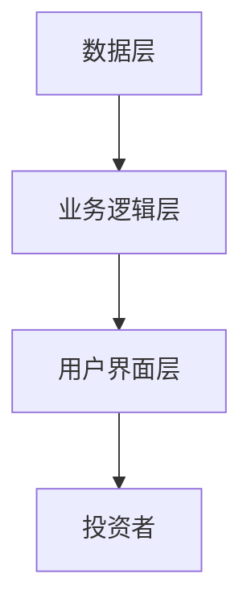
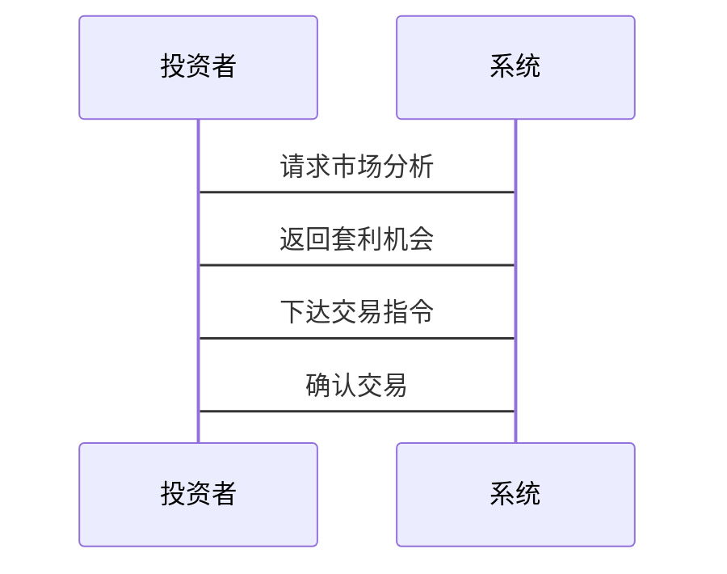

                 


# 如何利用特价股票策略应对市场泡沫

> **关键词**：市场泡沫、特价股票、投资策略、套利机会、风险管理  
> **摘要**：本文将详细探讨如何利用特价股票策略应对市场泡沫。通过分析市场泡沫的定义、特性以及特价股票的特点，本文提出了一套基于数学模型和系统架构的策略，并通过实战案例和系统设计提供了一套完整的解决方案，帮助投资者在市场泡沫中抓住套利机会，实现稳健投资。

---

## 第1章: 市场泡沫与特价股票概述

### 1.1 市场泡沫的定义与特征
市场泡沫是指金融市场中资产价格远高于其实际价值的现象。通常，市场泡沫的形成与投资者情绪、市场流动性过剩以及市场参与者的非理性行为密切相关。

#### 市场泡沫的主要特征
- **价格虚高**：资产价格脱离其基本面价值。
- **高波动性**：价格波动剧烈，短期内可能出现大幅上涨或下跌。
- **非理性行为**：投资者基于情绪而非理性决策。
- **流动性驱动**：大量资金流入导致价格膨胀。

#### 市场泡沫的形成机制
市场泡沫的形成通常经历以下几个阶段：
1. **积累阶段**：投资者对资产的需求增加，价格开始上涨。
2. **膨胀阶段**：价格快速上涨，吸引更多投资者入场。
3. **破裂阶段**：价格突然下跌，投资者恐慌性抛售。

### 1.2 特价股票的定义与特点
特价股票是指价格较低的股票，通常具有较高的波动性和潜在的套利机会。

#### 特价股票的主要特点
- **低价特性**：股价远低于市场平均水平。
- **高波动性**：股价波动较大，短期内可能有显著变化。
- **高风险高回报**：潜在回报高，但风险也较大。

#### 特价股票与普通股票的区别
| 属性         | 特价股票             | 普通股票             |
|--------------|----------------------|----------------------|
| 价格         | 通常低于市场平均价   | 价格较为稳定         |
| 波动性       | 高                   | 较低                 |
| 投资风险     | 高                   | 中等                 |
| 投资回报     | 高                   | 中等                 |

### 1.3 市场泡沫与特价股票的关系
市场泡沫期间，特价股票通常具有较大的套利机会。当泡沫破裂时，特价股票可能成为抄底的最佳选择。

---

## 第2章: 特价股票策略的核心原理

### 2.1 特价股票策略的基本原理
特价股票策略的核心在于利用市场波动和套利机会。通过分析市场情绪和价格波动，投资者可以在市场泡沫期间找到低价股票，等待其回归合理价值时获利。

#### 价格波动的规律
价格波动通常遵循一定的统计规律。通过分析历史数据，可以预测未来的价格波动趋势。

#### 市场情绪对股价的影响
市场情绪是影响股价的重要因素。投资者的非理性行为可能导致股价偏离实际价值。

#### 特价股票的套利机会
套利机会通常出现在市场泡沫期间。当泡沫破裂时，股价可能大幅下跌，投资者可以通过低价买入特价股票，等待其回升时卖出获利。

### 2.2 市场泡沫中的投资机会
#### 泡沫阶段的识别方法
- **估值分析**：比较当前股价与实际价值，判断是否存在泡沫。
- **市场情绪指标**：通过投资者情绪指标（如恐慌指数）判断市场是否处于泡沫阶段。

#### 特价股票在泡沫中的表现
- **股价波动加剧**：泡沫期间，特价股票的股价波动较大，可能在短期内出现大幅上涨或下跌。
- **套利机会增加**：当泡沫破裂时，特价股票可能成为抄底的最佳选择。

#### 泡沫破裂前的信号
- **成交量急剧下降**：市场交易量减少，表明投资者开始离场。
- **恐慌情绪蔓延**：投资者恐慌性抛售，导致股价大幅下跌。

### 2.3 特价股票策略的优缺点
#### 优点
- **高回报潜力**：特价股票在泡沫破裂后可能大幅反弹，带来丰厚回报。
- **套利机会多**：在市场波动较大的情况下，套利机会增加。

#### 缺点
- **高风险**：股价波动大，可能导致较大损失。
- **需要精准判断**：策略的成功依赖于对市场泡沫的准确判断。

---

## 第3章: 特价股票策略的数学模型与算法

### 3.1 特价股票策略的数学模型
#### 股价波动模型
股价波动可以用随机游走模型来描述：
$$ P_{t} = P_{t-1} + \epsilon $$
其中，$\epsilon$ 是随机误差项，表示市场的不确定性。

#### 市场情绪模型
市场情绪可以用投资者情绪指数（如恐慌指数）来衡量。假设市场情绪指数为 $M_t$，则：
$$ M_t = \alpha M_{t-1} + \beta \epsilon_t $$
其中，$\alpha$ 是情绪的持续性系数，$\beta$ 是情绪波动的强度系数。

#### 套利机会计算公式
套利机会可以通过比较当前股价与实际价值来确定。假设实际价值为 $V_t$，则套利空间为：
$$ \text{套利空间} = V_t - P_t $$

### 3.2 市场泡沫识别的算法
#### 泡沫识别指标
- **市盈率（P/E）**：比较当前市盈率与历史平均水平，判断是否存在泡沫。
- **市净率（P/B）**：比较当前市净率与历史平均水平，判断是否存在泡沫。

#### 泡沫阶段划分
将市场泡沫分为三个阶段：
1. **积累阶段**：市盈率和市净率开始上升。
2. **膨胀阶段**：市盈率和市净率远高于历史平均水平。
3. **破裂阶段**：市盈率和市净率急剧下降。

#### 泡沫破裂预测模型
使用时间序列模型预测市场泡沫破裂的时间。常用模型包括ARIMA（自回归积分滑动平均模型）。

### 3.3 特价股票选择的算法
#### 选股标准
- **低价标准**：股价低于市场平均值。
- **高波动性标准**：波动率高于市场平均水平。

#### 价格波动预测
使用GARCH（广义自回归条件异方差模型）预测股价波动。

#### 套利机会评估
计算套利空间，判断是否值得投资。

---

## 第4章: 特价股票策略的系统架构设计

### 4.1 系统功能设计
#### 数据采集模块
- 采集市场数据，包括股价、成交量、市场情绪指标等。

#### 策略分析模块
- 分析市场数据，识别套利机会。
- 计算套利空间，生成交易信号。

#### 交易执行模块
- 根据交易信号执行买卖操作。
- 管理仓位，控制风险。

#### 风险监控模块
- 监控市场风险，及时调整策略。

### 4.2 系统架构设计
使用分层架构设计系统：
1. **数据层**：存储市场数据和交易记录。
2. **业务逻辑层**：实现市场分析和策略生成。
3. **用户界面层**：提供可视化界面，供投资者操作。

#### 系统架构图


### 4.3 系统接口设计
- **数据接口**：与数据源对接，获取市场数据。
- **交易接口**：与交易系统对接，执行交易指令。

### 4.4 系统交互设计
使用Mermaid序列图描述系统交互流程：


---

## 第5章: 特价股票策略的实战与案例分析

### 5.1 环境搭建
- 安装Python环境，如Anaconda。
- 安装相关库，如Pandas、NumPy、Matplotlib。

### 5.2 核心实现源代码
```python
import pandas as pd
import numpy as np
import matplotlib.pyplot as plt

# 示例数据
data = pd.DataFrame({
    '日期': ['2023-01-01', '2023-01-02', '2023-01-03', '2023-01-04'],
    '股价': [10, 12, 9, 11],
    '市盈率': [20, 25, 18, 22],
    '市净率': [1.5, 2, 1.2, 1.6]
})

# 计算套利空间
data['实际价值'] = data['股价'] * data['市盈率'] / 100
data['套利空间'] = data['实际价值'] - data['股价']

print(data)
```

### 5.3 案例分析
#### 成功案例
假设某股票在市场泡沫期间股价被高估，套利空间较大。投资者在泡沫破裂前低价买入，泡沫破裂后高价卖出，获得丰厚回报。

#### 失败案例
投资者误判市场泡沫阶段，过早买入特价股票，导致股价进一步下跌，造成损失。

### 5.4 项目小结
通过实战案例，验证了特价股票策略的有效性。投资者需要结合市场环境和自身风险承受能力，合理运用策略。

---

## 第6章: 总结与附录

### 6.1 总结
本文详细探讨了如何利用特价股票策略应对市场泡沫，提出了基于数学模型和系统架构的解决方案。通过实战案例和系统设计，为投资者提供了一套完整的投资策略。

### 6.2 附录
#### 术语表
- **市场泡沫**：资产价格远高于其实际价值的现象。
- **特价股票**：价格较低的股票，通常具有较高的波动性和套利机会。

#### 进一步阅读
推荐阅读《投资学基础》和《金融风险管理》。

---

## 作者：AI天才研究院/AI Genius Institute & 禅与计算机程序设计艺术 /Zen And The Art of Computer Programming

---

**注**：本文内容仅为理论探讨，实际投资需谨慎，建议读者在投资前充分了解市场风险，并咨询专业顾问。

