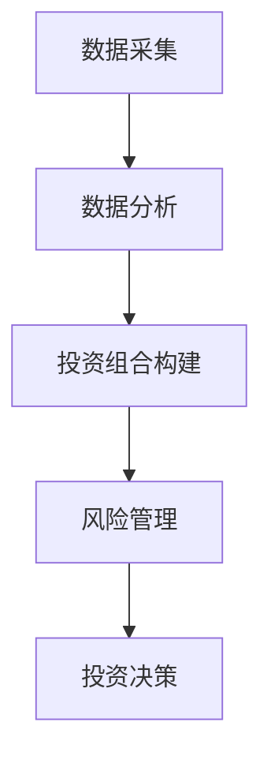
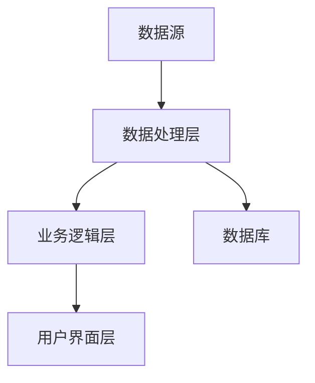
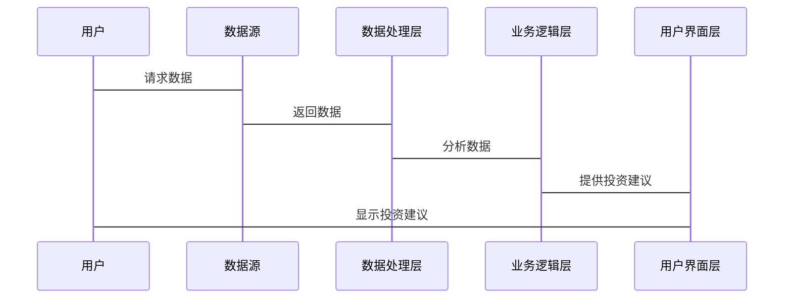

                 


# 如何利用特价股票策略应对市场泡沫

## 关键词：市场泡沫、特价股票、投资策略、风险管理、股票分析、价值投资

## 摘要：本文详细探讨了如何利用特价股票策略来应对市场泡沫。通过分析市场泡沫的定义、形成机制以及特价股票的特征，本文提出了基于特价股票的策略，包括选股标准、投资组合构建和风险管理。文章还结合实际案例，系统地讲解了如何在市场泡沫中利用特价股票策略进行投资，并通过数学模型和系统架构设计，进一步优化了策略的实施。本文旨在帮助投资者在市场波动中保持稳健的投资收益。

---

# 第一部分: 市场泡沫与特价股票策略背景

## # 第1章: 市场泡沫的定义与特征

### 1.1 市场泡沫的定义
#### 1.1.1 市场泡沫的定义与概念
市场泡沫是指资产价格脱离其内在价值的非理性上涨现象。这种现象通常发生在投资者对市场情绪过于乐观时，导致资产价格被高估。市场泡沫的形成与投资者的心理预期、信息不对称以及市场的流动性密切相关。

#### 1.1.2 市场泡沫的形成机制
市场泡沫的形成是一个复杂的过程，通常包括以下几个阶段：
1. **初始阶段**：投资者对市场的乐观情绪开始蔓延，导致资产需求增加，价格上升。
2. **膨胀阶段**：更多的投资者被吸引进入市场，价格继续上涨，市场参与者开始追涨杀跌。
3. **顶峰阶段**：价格达到顶峰，市场参与者意识到价格过高，但仍在继续投资，期望价格进一步上涨。
4. **破裂阶段**：市场泡沫破裂，价格迅速下跌，投资者恐慌性抛售资产。

#### 1.1.3 市场泡沫的周期性特征
市场泡沫具有明显的周期性特征，通常包括以下几个阶段：
1. **繁荣阶段**：市场参与者信心高涨，资产价格迅速上涨。
2. **泡沫阶段**：价格严重偏离内在价值，市场参与者行为变得非理性。
3. **崩盘阶段**：市场泡沫破裂，价格急剧下跌，投资者信心受挫。
4. **复苏阶段**：市场逐渐恢复，投资者重新评估资产价值，寻找新的投资机会。

### 1.2 特价股票的定义与特征
#### 1.2.1 特价股票的定义
特价股票是指市场价格远低于其内在价值的股票。这些股票通常被市场忽视或低估，具有较大的增值潜力。

#### 1.2.2 特价股票的筛选标准
1. **低市盈率（P/E）**：市盈率低于行业平均水平。
2. **低市净率（P/B）**：市净率低于行业平均水平。
3. **高股息率**：股息率较高，表明公司愿意将利润分配给股东。
4. **稳定的盈利能力**：公司具有稳定的盈利能力，且财务状况良好。
5. **低估值指数**：通过多种估值指标（如市盈率、市净率、EV/EBITDA等）综合评估，发现价格被低估的股票。

#### 1.2.3 特价股票与市场周期的关系
在市场繁荣阶段，特价股票通常被市场忽视，价格被低估；在市场泡沫阶段，特价股票可能会被市场逐渐发现，价格开始回升；在市场崩盘阶段，特价股票由于其低估值特性，通常能够抵御市场的大幅下跌；在市场复苏阶段，特价股票往往成为市场的热点，价格大幅上涨。

---

## # 第2章: 市场泡沫中的投资机会

### 2.1 市场泡沫对投资者的影响
#### 2.1.1 市场泡沫对个人投资者的影响
市场泡沫期间，个人投资者可能会受到非理性情绪的影响，盲目追涨杀跌，导致投资损失。此外，市场泡沫的破裂往往会导致资产价格的大幅下跌，个人投资者可能面临较大的财务风险。

#### 2.1.2 市场泡沫对机构投资者的影响
机构投资者在市场泡沫期间通常会面临更大的压力，因为机构投资者需要管理大量的资金，且需要在市场泡沫期间保持较高的透明度和合规性。此外，市场泡沫的破裂可能对机构投资者的声誉和资金池造成较大的冲击。

#### 2.1.3 市场泡沫对市场的整体影响
市场泡沫的形成和破裂对整个市场具有深远的影响，可能导致市场的剧烈波动，影响市场的稳定性。此外，市场泡沫的破裂可能会引发连锁反应，导致更多的投资者陷入困境。

### 2.2 特价股票在市场泡沫中的优势
#### 2.2.1 特价股票的低估值优势
特价股票由于其价格被低估，通常能够在市场泡沫期间抵御市场的非理性波动，表现出较强的稳定性。

#### 2.2.2 特价股票在市场波动中的稳定性
在市场波动加剧的情况下，特价股票由于其低估值特性，通常能够表现出较强的抗跌性，为投资者提供较为稳定的投资回报。

#### 2.2.3 特价股票的长期投资价值
特价股票通常具有较高的长期投资价值，因为其价格被低估，具有较大的增值潜力。在市场泡沫破裂后，特价股票往往能够迅速回升，为投资者带来丰厚的回报。

---

## # 第3章: 特价股票策略的核心原理

### 3.1 特价股票策略的基本原理
#### 3.1.1 特价股票策略的理论基础
特价股票策略的核心思想是基于价值投资理念，通过筛选市场价格低于其内在价值的股票，实现长期稳健的投资回报。这种策略强调对公司的基本面分析，注重公司的盈利能力、财务状况和行业地位。

#### 3.1.2 特价股票策略的核心思想
1. **价值导向**：注重股票的内在价值，而非市场的短期波动。
2. **长期投资**：基于公司的长期盈利能力进行投资，而非短期的价格波动。
3. **风险控制**：通过精选低估值股票，降低投资风险，提高投资回报。

#### 3.1.3 特价股票策略的适用场景
1. **市场泡沫阶段**：在市场泡沫阶段，特价股票通常被市场忽视，具有较大的增值潜力。
2. **市场调整阶段**：在市场调整阶段，特价股票由于其低估值特性，通常能够表现出较强的抗跌性。
3. **市场复苏阶段**：在市场复苏阶段，特价股票往往能够迅速回升，为投资者带来丰厚的回报。

### 3.2 特价股票策略的数学模型
#### 3.2.1 市盈率（P/E）的计算公式
$$ P/E = \frac{Price}{Earnings} $$
其中，$Price$ 是股票的市场价格，$Earnings$ 是公司的每股收益。

#### 3.2.2 市净率（P/B）的计算公式
$$ P/B = \frac{Price}{Book\ Value} $$
其中，$Price$ 是股票的市场价格，$Book\ Value$ 是公司的每股账面价值。

#### 3.2.3 市价与内在价值的比较
$$ Intrinsic\ Value = \frac{Earnings}{Interest\ Rate} $$
其中，$Earnings$ 是公司的净利润，$Interest\ Rate$ 是市场无风险利率。

通过比较股票的市场价格与内在价值，可以判断股票是否被低估或高估。如果市场价格低于内在价值，说明股票具有较大的增值潜力，适合进行投资。

---

## # 第4章: 特价股票策略的系统分析与架构设计

### 4.1 系统功能设计
#### 4.1.1 系统功能模块
1. **数据采集模块**：采集股票市场数据，包括价格、市盈率、市净率等。
2. **数据分析模块**：对股票数据进行分析，筛选出符合条件的特价股票。
3. **投资组合模块**：根据筛选结果，构建投资组合，优化资产配置。
4. **风险管理模块**：监控市场波动，及时调整投资策略，降低投资风险。

#### 4.1.2 系统功能流程图


### 4.2 系统架构设计
#### 4.2.1 系统架构图


#### 4.2.2 系统接口设计
1. 数据接口：与数据源（如股票交易系统、数据供应商）进行数据交互。
2. 用户接口：与用户进行交互，提供投资建议和投资报告。

#### 4.2.3 系统交互序列图


---

## # 第5章: 项目实战与案例分析

### 5.1 环境安装
1. **安装Python环境**：安装Python 3.8及以上版本。
2. **安装数据分析库**：安装Pandas、NumPy、Matplotlib等库。
3. **安装可视化工具**：安装Plotly或Seaborn等可视化工具。

### 5.2 核心代码实现
#### 5.2.1 数据采集
```python
import pandas as pd
import requests
from bs4 import BeautifulSoup

url = "https://finance.yahoo.com/quotes"
response = requests.get(url)
soup = BeautifulSoup(response.text, 'html.parser')
data = pd.read_html(soup.prettify())
```

#### 5.2.2 数据分析
```python
def calculate_pe_ratio(price, earnings):
    return price / earnings

def calculate_pb_ratio(price, book_value):
    return price / book_value

data['PE Ratio'] = data.apply(lambda x: calculate_pe_ratio(x['Price'], x['Earnings']), axis=1)
data['PB Ratio'] = data.apply(lambda x: calculate_pb_ratio(x['Price'], x['Book Value']), axis=1)
```

#### 5.2.3 投资组合构建
```python
# 筛选低市盈率和低市净率的股票
low_pe_stocks = data[data['PE Ratio'] < data['PE Ratio'].mean()]
low_pb_stocks = data[data['PB Ratio'] < data['PB Ratio'].mean()]

# 筛选同时满足低市盈率和低市净率的股票
special_stocks = low_pe_stocks[low_pe_stocks['PB Ratio'] < low_pe_stocks['PB Ratio'].mean()]
```

#### 5.2.4 风险管理
```python
import numpy as np

# 计算投资组合的波动率
portfolios = special_stocks['Price'].sample(1000, replace=True)
returns = np.log(portfolios / portfolios.shift(1))
volatility = returns.std()
```

### 5.3 案例分析
#### 5.3.1 案例背景
假设当前市场处于泡沫阶段，投资者希望通过特价股票策略进行投资。

#### 5.3.2 数据分析
通过数据分析，筛选出一批低市盈率、低市净率的股票，并构建投资组合。

#### 5.3.3 投资组合优化
通过优化投资组合，降低投资风险，提高投资回报。

#### 5.3.4 投资效果评估
通过回测和风险分析，评估投资组合的收益和风险。

---

## # 第6章: 风险管理与策略优化

### 6.1 市场泡沫中的风险管理
#### 6.1.1 风险识别
1. **市场风险**：市场波动对投资组合的影响。
2. **流动性风险**：市场流动性不足导致无法及时买卖资产。
3. **信用风险**：公司财务状况恶化导致投资损失。

#### 6.1.2 风险控制
1. **分散投资**：通过投资多个行业和地区的股票，降低投资风险。
2. **止损策略**：设定止损点，及时卖出亏损的股票，避免进一步损失。
3. **动态调整**：根据市场变化，及时调整投资组合，优化资产配置。

### 6.2 特价股票策略的优化
#### 6.2.1 策略优化方法
1. **动态筛选**：根据市场变化，动态调整特价股票的筛选标准。
2. **多因子模型**：结合多个因子（如市盈率、市净率、股息率等）进行股票筛选。
3. **风险调整**：通过风险调整，优化投资组合的收益和风险比。

#### 6.2.2 策略优化案例
通过优化策略，投资者可以在市场泡沫期间获得更高的投资回报，同时降低投资风险。

---

## # 第7章: 未来展望与总结

### 7.1 未来展望
随着市场的发展和技术的进步，特价股票策略将更加智能化和自动化。未来，投资者可以通过人工智能和大数据技术，更加精准地筛选特价股票，优化投资组合，提高投资回报。

### 7.2 总结
本文详细探讨了如何利用特价股票策略应对市场泡沫。通过分析市场泡沫的定义、形成机制以及特价股票的特征，本文提出了基于特价股票的策略，包括选股标准、投资组合构建和风险管理。文章还结合实际案例，系统地讲解了如何在市场泡沫中利用特价股票策略进行投资，并通过数学模型和系统架构设计，进一步优化了策略的实施。本文旨在帮助投资者在市场波动中保持稳健的投资收益。

---

## 作者：AI天才研究院/AI Genius Institute & 禅与计算机程序设计艺术 /Zen And The Art of Computer Programming

