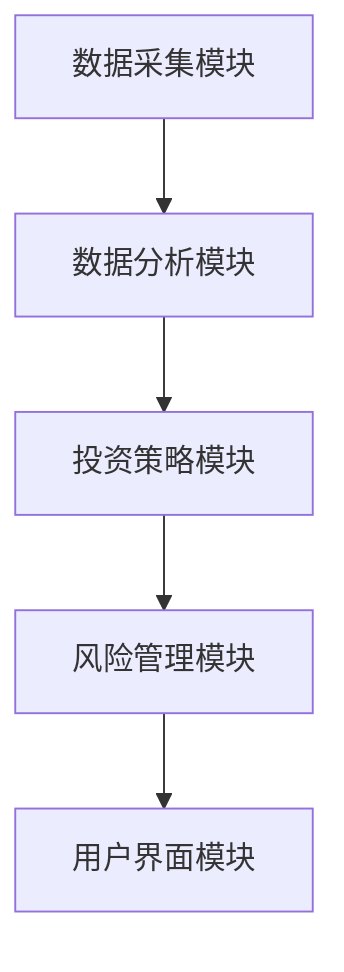

                 

# 如何利用特价股票策略应对市场泡沫风险

> 关键词：市场泡沫、特价股票、投资策略、风险管理、股票分析、数学模型、系统架构

> 摘要：本文详细探讨了如何利用特价股票策略应对市场泡沫风险。首先，我们从市场泡沫的定义、形成机制以及其对投资的影响入手，深入分析了特价股票的特征及其在市场泡沫中的优势。接着，我们介绍了多种特价股票策略，包括逆向投资、价值投资和波段交易，并结合数学模型和实际案例进行了详细讲解。最后，我们提出了一个基于系统架构的股票分析方案，并通过代码实现和实战案例，展示了如何在实际投资中应用这些策略。本文旨在为投资者提供一套应对市场泡沫风险的系统化解决方案。

---

# 第1章: 市场泡沫与特价股票概述

## 1.1 市场泡沫的定义与特征

### 1.1.1 市场泡沫的定义
市场泡沫是指资产价格在短期内快速上涨，远远超出其实际价值，最终导致价格虚高，难以持续的现象。市场泡沫通常发生在市场参与者对资产未来收益预期过高的情况下。

### 1.1.2 市场泡沫的形成机制
市场泡沫的形成通常与市场情绪、资金流动性过剩和市场参与者的非理性行为有关。投资者在市场繁荣时期倾向于过度乐观，导致资产价格被推高，最终引发泡沫破裂。

### 1.1.3 市场泡沫的周期性特征
市场泡沫具有明显的周期性特征，通常经历以下几个阶段：
1. **积累阶段**：市场参与者逐渐意识到某种资产的潜在价值，开始大量买入。
2. **膨胀阶段**：资产价格快速上涨，吸引更多投资者参与。
3. **顶峰阶段**：价格达到峰值，市场参与者开始出现分歧，部分投资者开始获利了结。
4. **破裂阶段**：市场情绪转向悲观，价格快速下跌，泡沫破裂。

---

## 1.2 特价股票的定义与特点

### 1.2.1 特价股票的定义
特价股票是指市场价格远低于其内在价值的股票。这类股票通常被市场低估，具有较高的潜在回报率。

### 1.2.2 特价股票的市场特征
1. **低估值**：特价股票的市盈率（P/E）和市净率（P/B）通常远低于行业平均水平。
2. **高波动性**：由于市场对这类股票的关注度较低，其价格波动性较高。
3. **周期性**：特价股票的价格往往与市场周期密切相关，在市场低迷时期更容易出现特价股票。

### 1.2.3 特价股票与市场泡沫的关系
在市场泡沫期间，许多股票的价格被推高至远高于其实际价值，而特价股票则因被市场忽视或低估，成为投资者在泡沫破裂后获利的重要机会。

---

## 1.3 市场泡沫中的投资机会

### 1.3.1 市场泡沫中的投机机会
在市场泡沫期间，投资者可以通过短线交易或杠杆投资获利。然而，这种策略风险较高，需要对市场情绪和价格波动有深刻理解。

### 1.3.2 特价股票在市场泡沫中的优势
在市场泡沫期间，特价股票因其低估值和高波动性，成为投资者对冲风险的重要工具。当市场泡沫破裂时，特价股票通常会反弹，为投资者带来超额收益。

### 1.3.3 投资者如何利用特价股票应对市场风险
投资者可以通过以下方式利用特价股票应对市场风险：
1. **分散投资**：将资金分配到多个特价股票中，降低单一股票的风险。
2. **长期持有**：耐心持有特价股票，等待市场回归理性。
3. **结合其他策略**：将特价股票策略与其他投资策略结合，如价值投资和趋势跟踪。

---

## 1.4 本章小结
本章介绍了市场泡沫的定义、形成机制及其对投资的影响。同时，我们探讨了特价股票的定义、特点及其在市场泡沫中的优势。通过这些分析，我们可以更好地理解如何利用特价股票应对市场泡沫风险。

---

# 第2章: 市场泡沫中的风险识别

## 2.1 市场泡沫风险的识别方法

### 2.1.1 市场估值指标分析
通过分析市盈率（P/E）、市净率（P/B）等估值指标，识别市场是否被高估。

### 2.1.2 市场情绪分析
通过分析投资者情绪指数、市场成交额等指标，判断市场是否处于过热状态。

### 2.1.3 市场资金流动分析
通过分析资金流入流出情况，判断市场是否存在过度投机行为。

---

## 2.2 特价股票的筛选标准

### 2.2.1 市盈率（P/E）分析
选择市盈率低于行业平均水平的股票。

### 2.2.2 市净率（P/B）分析
选择市净率低于1的股票。

### 2.2.3 股息率分析
选择股息率较高的股票。

---

## 2.3 市场泡沫中的风险对冲策略

### 2.3.1 空头策略
通过做空高估的股票，对冲市场泡沫带来的下行风险。

### 2.3.2 买入低价股票策略
通过买入低估的特价股票，利用市场反弹获利。

### 2.3.3 分散投资策略
将资金分配到多个行业和资产类别中，降低单一资产的风险。

---

## 2.4 本章小结
本章详细介绍了市场泡沫风险的识别方法，并提出了几种有效的风险对冲策略。通过这些方法，投资者可以在市场泡沫期间更好地保护自己的投资组合。

---

# 第3章: 市场泡沫中的数学模型与算法

## 3.1 市场估值模型

### 3.1.1 市盈率模型
市盈率（P/E）= 股价 / 每股净利润

### 3.1.2 市净率模型
市净率（P/B）= 股价 / 每股净资产

### 3.1.3 股息贴现模型
股息贴现模型（DDM）= 永久股息 / （贴现率 - 股息增长率）

---

## 3.2 市场情绪模型

### 3.2.1 市场情绪指数
市场情绪指数可以通过分析市场成交额、换手率等指标来计算。

### 3.2.2 市场恐慌指数
市场恐慌指数（VIX）是衡量市场波动性的指标。

### 3.2.3 市场情绪与股价关系模型
股价与市场情绪通常呈现正相关关系，市场情绪越高，股价越高。

---

## 3.3 市场风险模型

### 3.3.1 风险价值模型（VaR）
VaR = max(0, 投资组合价值 - 抵押品价值)

### 3.3.2 风险调整回报模型
风险调整回报 = 预期回报 - 风险溢价

### 3.3.3 压力测试模型
压力测试模型用于评估投资组合在极端市场条件下的表现。

---

## 3.4 本章小结
本章通过数学模型和算法，帮助投资者更好地理解和应对市场泡沫风险。通过这些模型，投资者可以更准确地评估市场估值、市场情绪和投资组合风险。

---

# 第4章: 特价股票投资系统的架构设计

## 4.1 系统功能模块划分

### 4.1.1 数据采集模块
负责采集股票市场数据，包括股价、成交量、市场情绪等。

### 4.1.2 数据分析模块
负责对采集的数据进行清洗、处理和分析，生成投资信号。

### 4.1.3 投资策略模块
根据分析结果，制定投资策略，包括买入、卖出和持有等决策。

### 4.1.4 风险管理模块
负责对投资组合进行风险评估和管理，确保投资目标的实现。

---

## 4.2 系统架构设计

### 4.2.1 分层架构设计
系统架构分为数据层、业务逻辑层和用户界面层。

### 4.2.2 模块间交互设计
模块间通过接口进行交互，确保系统的高效运行。

### 4.2.3 系统流程图

---

## 4.3 系统接口设计

### 4.3.1 数据接口
负责与数据源（如股票交易所）进行数据交互。

### 4.3.2 用户接口
负责与用户进行交互，展示系统结果。

### 4.3.3 报告生成接口
负责生成投资报告和风险评估报告。

---

## 4.4 本章小结
本章详细介绍了特价股票投资系统的架构设计，包括功能模块划分、系统架构设计和接口设计。通过这些设计，投资者可以更好地管理和优化自己的投资组合。

---

# 第5章: 特价股票策略的实战应用

## 5.1 实战案例一：逆向投资策略

### 5.1.1 案例背景
假设市场处于泡沫阶段，某股票的市盈率远高于行业平均水平。

### 5.1.2 策略实施
通过分析发现该股票的实际盈利能力较高，但市场对其关注度较低，因此决定买入该股票。

### 5.1.3 实战结果
当市场泡沫破裂时，该股票价格迅速下跌，但随后因低估而反弹，为投资者带来超额收益。

---

## 5.2 实战案例二：价值投资策略

### 5.2.1 案例背景
某股票的市净率远低于行业平均水平，但市场对其未来增长潜力持悲观态度。

### 5.2.2 策略实施
通过分析发现该股票具有较高的成长潜力，因此决定长期持有该股票。

### 5.2.3 实战结果
随着市场逐渐恢复理性，该股票价格稳步上涨，为投资者带来长期收益。

---

## 5.3 实战案例三：波段交易策略

### 5.3.1 案例背景
某股票的价格波动性较高，市场参与者对其未来走势存在较大分歧。

### 5.3.2 策略实施
通过技术分析发现该股票存在短期上涨潜力，因此决定进行短线交易。

### 5.3.3 实战结果
通过波段交易策略，投资者在短期内获利，同时降低了长期持有的风险。

---

## 5.4 本章小结
本章通过三个实战案例，展示了如何利用特价股票策略应对市场泡沫风险。这些案例涵盖了逆向投资、价值投资和波段交易三种不同的策略，为投资者提供了丰富的参考。

---

# 第6章: 总结与展望

## 6.1 总结
本文详细探讨了如何利用特价股票策略应对市场泡沫风险。通过分析市场泡沫的形成机制、特价股票的特征以及多种投资策略，我们为投资者提供了一套系统化的解决方案。

## 6.2 未来展望
随着市场环境的变化，特价股票策略也将面临新的挑战和机遇。未来，我们可以通过引入更多的数学模型和算法，进一步优化投资策略，提高投资回报率。

---

# 附录: 最佳实践 Tips

1. **分散投资**：将资金分配到多个行业和资产类别中，降低单一资产的风险。
2. **长期持有**：耐心持有特价股票，等待市场回归理性。
3. **结合其他策略**：将特价股票策略与其他投资策略结合，如趋势跟踪和套利交易。
4. **定期评估**：定期评估投资组合的表现，及时调整投资策略。

---

# 作者：AI天才研究院/AI Genius Institute & 禅与计算机程序设计艺术 /Zen And The Art of Computer Programming

