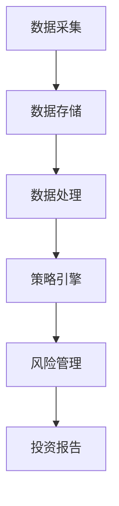

                 


# 如何利用特价股票策略应对市场流动性风险

> **关键词**：流动性风险、特价股票策略、风险管理、投资策略、市场分析

> **摘要**：本文详细探讨了如何利用特价股票策略来应对市场流动性风险。通过分析流动性风险的定义、表现形式及其对投资者的影响，本文提出了基于特价股票的投资策略，结合数学模型和系统设计，提供了应对流动性风险的具体方法和实战案例。

---

## 第一部分：市场流动性风险与特价股票策略概述

### 第1章：市场流动性风险的基础知识

#### 1.1 什么是市场流动性风险
- **1.1.1 流动性风险的定义**
  - 流动性风险是指资产在不损失价值的情况下快速变现的能力。当市场流动性不足时，投资者可能难以以合理价格买卖资产。
  
- **1.1.2 流动性风险的表现形式**
  - 交易量骤减，买卖价差扩大。
  - 资产价格波动加剧，难以预测。
  - 投资者被迫抛售资产，导致价格进一步下跌。

- **1.1.3 流动性风险的来源**
  - 市场恐慌情绪。
  - 机构投资者的大规模撤资。
  - 市场结构的变化，如高频交易减少。

#### 1.2 为什么需要应对市场流动性风险
- **1.2.1 流动性风险对投资者的影响**
  - 资产贬值，投资回报下降。
  - 投资者被迫以低价卖出资产。
  - 影响投资组合的整体表现。

- **1.2.2 流动性风险对市场的系统性影响**
  - 市场波动加剧，影响整体经济。
  - 投资者信心下降，导致市场进一步下跌。
  - 增加金融体系的不稳定性。

- **1.2.3 如何量化流动性风险**
  - 使用VaR（Value at Risk）模型评估潜在损失。
  - 分析历史市场数据，识别流动性风险的触发点。

---

### 第2章：特价股票策略的基本原理

#### 2.1 特价股票策略的定义
- **2.1.1 特价股票的定义**
  - 特价股票是指价格远低于其内在价值的股票。
  - 通常出现在市场低迷或公司暂时遇到困境时。

- **2.1.2 特价股票的特征**
  - 价格被市场低估。
  - 公司基本面良好，具备恢复潜力。
  - 交易量可能较低，但价格波动可能较大。

- **2.1.3 特价股票与市场流动性风险的关系**
  - 在市场流动性不足时，特价股票可能被低估。
  - 投资者可以通过低价买入，等待市场恢复流动性时卖出获利。

#### 2.2 特价股票策略的优势
- **2.2.1 低价买入的优势**
  - 以低于内在价值的价格买入股票，具备上涨空间。
  - 减少市场波动对投资组合的影响。

- **2.2.2 等待市场恢复流动性后的获利机会**
  - 当市场流动性恢复时，股票价格上涨，投资者可以获利。
  - 利用市场的短期波动，捕捉超额收益。

- **2.2.3 分散投资风险的作用**
  - 通过投资多个特价股票，分散单一股票的风险。
  - 减少市场流动性不足对整体投资组合的影响。

#### 2.3 特价股票策略的劣势
- **2.3.1 长期持有的风险**
  - 需要较长时间等待市场恢复流动性。
  - 在此期间，市场可能继续下跌，影响投资收益。

- **2.3.2 市场持续低迷的可能性**
  - 如果市场长期低迷，特价股票可能难以回升。
  - 需要对市场趋势有准确的判断，否则可能亏损。

- **2.3.3 特价股票的流动性问题**
  - 部分特价股票交易量较低，买卖价差较大。
  - 可能影响投资者的实际收益。

---

## 第二部分：特价股票策略的核心概念与联系

### 第3章：特价股票策略的核心概念

#### 3.1 特价股票策略的核心原理
- **3.1.1 低价买入的逻辑**
  - 购买价格低于内在价值，具备上涨空间。
  - 通过分析公司基本面，识别低估股票。

- **3.1.2 等待市场恢复的时机**
  - 市场流动性不足时，股票价格被低估。
  - 等待市场恢复流动性后，股价回升，获利。

- **3.1.3 利用市场波动的策略**
  - 在市场波动中，寻找低价买入的机会。
  - 通过技术分析，判断买入和卖出时机。

#### 3.2 特价股票策略与风险管理
- **3.2.1 风险评估的核心要素**
  - 公司基本面：收入、利润、负债等。
  - 行业前景：行业趋势和竞争环境。
  - 宏观经济：经济周期和政策影响。

- **3.2.2 风险控制的实施方法**
  - 设置止损点，限制潜在亏损。
  - 分散投资，降低单一股票风险。
  - 定期评估投资组合，调整持仓。

#### 3.3 特价股票策略的数学模型
- **3.3.1 流动性风险评估模型**
  - 使用流动性风险指数（LRI）评估市场流动性风险。
  - 公式：$$LRI = \frac{买卖价差}{平均价格} \times 100$$

- **3.3.2 安全边际计算**
  - 安全边际 = 内在价值 - 市场价格。
  - 公式：$$\text{安全边际} = \text{内在价值} - \text{市场价格}$$

- **3.3.3 风险定价模型**
  - 使用CAPM模型评估股票的预期收益。
  - 公式：$$\text{预期收益} = r_f + \beta (r_m - r_f)$$

---

### 第4章：特价股票策略的系统设计

#### 4.1 系统功能设计
- **4.1.1 系统模块**
  - 数据采集模块：获取市场数据和公司基本面信息。
  - 策略引擎模块：执行特价股票策略。
  - 风险管理模块：监控和控制风险。
  - 报告生成模块：生成投资报告。

- **4.1.2 数据接口设计**
  - 数据来源：股票市场数据、公司财报、宏观经济指标。
  - 数据格式：结构化数据，便于处理和分析。

- **4.1.3 系统架构设计**
  - 分层架构：数据层、业务逻辑层、用户界面层。
  - 技术选型：使用Python、Pandas、Matplotlib等工具。

#### 4.2 系统架构图


---

## 第三部分：项目实战与总结

### 第5章：项目实战

#### 5.1 环境安装
- 安装必要的Python库：pandas、numpy、matplotlib、backtrader。

#### 5.2 核心实现代码
```python
import pandas as pd
import numpy as np
import matplotlib.pyplot as plt

# 示例：计算流动性风险指数
def calculate_lri(ask, bid, avg_price):
    lri = (ask - bid) / avg_price * 100
    return lri

# 示例：计算安全边际
def calculate_margin_of_safety(intrinsic_value, market_price):
    return intrinsic_value - market_price

# 示例：计算预期收益（CAPM）
def expected_return(risk_free_rate, beta, market_return, market_rate):
    return risk_free_rate + beta * (market_return - risk_free_rate)
```

#### 5.3 实际案例分析
- **案例：2020年新冠疫情市场**
  - 市场流动性不足，许多股票价格被低估。
  - 投资者买入特价股票，等待市场恢复后卖出获利。

#### 5.4 总结与反思
- 特价股票策略在应对流动性风险方面具有优势。
- 需要结合市场实际情况，灵活调整策略。
- 风险管理是策略成功的关键。

---

## 第四部分：总结与展望

### 第6章：总结与展望

#### 6.1 总结
- 特价股票策略通过低价买入和等待市场恢复流动性，有效应对流动性风险。
- 结合数学模型和系统设计，可以提高策略的科学性和可操作性。

#### 6.2 展望
- 进一步研究市场流动性风险的其他应对策略。
- 探索人工智能技术在特价股票策略中的应用。

---

## 附录

### 附录A：工具与资源

- Python库：pandas、numpy、matplotlib。
- 数据源：Yahoo Finance、Google Finance、东方财富网。
- 进一步阅读：《投资学》（书籍推荐）。

---

**作者：AI天才研究院/AI Genius Institute & 禅与计算机程序设计艺术/Zen And The Art of Computer Programming**

