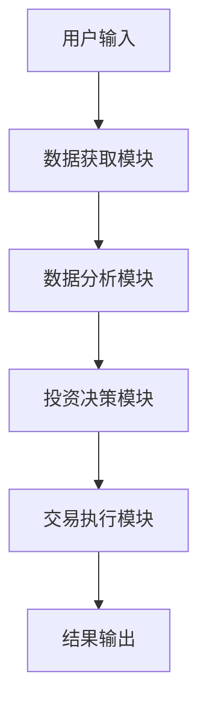

                 


# 如何利用特价股票策略应对市场结构性变化

> 关键词：特价股票，股票策略，市场变化，投资策略，风险管理

> 摘要：本文将详细探讨如何利用特价股票策略应对市场结构性变化。首先，我们将介绍特价股票的基本概念和其在投资中的重要性。接着，分析市场结构性变化的驱动因素及其对投资策略的影响。通过实例分析和系统设计，展示如何构建有效的投资系统以应对市场变化，并通过实战案例帮助读者理解如何在实际操作中应用这些策略。最后，我们将总结关键点，并展望未来的发展趋势。

---

## 第1章：特价股票策略概述

### 1.1 特价股票的定义与特点

#### 1.1.1 特价股票的定义
特价股票（Cheap Stocks）是指那些市场价格低于其内在价值的股票。这类股票通常被市场低估，具有较大的上涨潜力。与高价股不同，特价股票的价格往往远低于其实际价值，为投资者提供了以较低成本获取高回报的机会。

#### 1.1.2 特价股票的核心特点
- **低市盈率（Low P/E Ratio）**：市盈率低于行业平均水平，表明股票价格被低估。
- **低市净率（Low P/B Ratio）**：市净率低于1，表示股价低于账面价值。
- **高股息率（High Dividend Yield）**：相对于股价，股息收益率较高，为投资者提供稳定的现金流。

#### 1.1.3 特价股票与普通股票的区别
| 特性         | 特价股票                   | 普通股票                   |
|--------------|---------------------------|---------------------------|
| 市盈率       | 低于行业平均水平           | 接近或高于行业平均水平     |
| 市净率       | 低于1                     | 接近或高于1               |
| 股息率       | 高于行业平均水平           | 低于行业平均水平           |
| 市场表现     | 具备长期上涨潜力           | 市场表现较为稳定           |

### 1.2 特价股票策略的历史与发展

#### 1.2.1 特价股票策略的起源
特价股票策略起源于20世纪30年代，由本杰明·格雷厄姆（Benjamin Graham）提出的“价值投资”理念。格雷厄姆强调通过基本面分析寻找被市场低估的股票。

#### 1.2.2 特价股票策略的发展历程
- **20世纪30-40年代**：格雷厄姆的学生大卫·多德（David Dodd）进一步完善了价值投资理论。
- **20世纪70年代**：彼得·林奇（Peter Lynch）将价值投资理念推广到更广泛的投资者群体。
- **20世纪90年代至今**：随着技术的进步和数据的丰富，量化投资逐渐兴起，利用大数据和算法优化特价股票筛选。

#### 1.2.3 当前特价股票策略的应用现状
当前，特价股票策略广泛应用于机构投资和个人投资。量化工具和算法交易的普及使得投资者能够更高效地筛选和交易特价股票。

### 1.3 特价股票策略的优势与劣势

#### 1.3.1 特价股票策略的优势
- **高回报潜力**：被低估的股票价格回归其真实价值时，投资者可以获得超额收益。
- **低风险**：由于价格被低估，股价下跌空间有限，风险相对较低。
- **长期稳定**：价值投资理念强调长期持有，适合追求稳定收益的投资者。

#### 1.3.2 特价股票策略的劣势
- **流动性风险**：部分特价股票流动性较差，尤其是在市场低迷时期，难以迅速变现。
- **市场波动**：短期内市场情绪波动可能导致股价进一步下跌，影响投资收益。
- **筛选难度**：需要深入的市场分析和基本面研究，筛选过程较为复杂。

---

## 第2章：市场结构性变化的分析

### 2.1 市场结构性变化的驱动因素

#### 2.1.1 经济周期波动
经济周期的波动对市场结构有重要影响。在经济衰退期，许多优质股票可能被低估，而在经济复苏期，这些股票价格可能回归其真实价值。

#### 2.1.2 政策变化
政府政策的变化，如税收调整、行业监管政策的改变，可能影响市场的结构性变化。

#### 2.1.3 地缘政治因素
地缘政治冲突可能导致市场恐慌，从而引发结构性变化，为特价股票策略提供投资机会。

### 2.2 市场结构性变化对投资策略的影响

#### 2.2.1 经济周期与投资策略
- **衰退期**：增加对特价股票的投资，寻找被低估的资产。
- **复苏期**：逐步减少对特价股票的持仓，转投其他资产类别。

#### 2.2.2 政策变化与投资策略
- **利好政策**：增加对受政策支持行业的投资。
- **不利政策**：减少对高风险行业的投资。

#### 2.2.3 地缘政治因素与投资策略
- **冲突时期**：减少高风险资产的投资，转向防御性资产。
- **和平时期**：增加对高增长地区的投资。

---

## 第3章：特价股票策略与市场变化的结合

### 3.1 动态调整投资组合

#### 3.1.1 根据市场变化调整持仓
- 在市场下跌期间，增加对特价股票的投资。
- 在市场上涨期间，逐步减少对特价股票的持仓。

#### 3.1.2 行业轮动策略
- 根据经济周期和行业趋势，动态调整投资组合中的行业分布。

### 3.2 风险管理策略

#### 3.2.1 设置止损点
- 通过技术分析或基本面分析，设置合理的止损点，避免重大损失。

#### 3.2.2 分散投资
- 将资金分散投资于多个行业和股票，降低单一投资的风险。

### 3.3 技术分析与基本面分析的结合

#### 3.3.1 技术分析
- 使用技术指标（如RSI、MACD）和图表模式，辅助判断股票的买卖时机。

#### 3.3.2 基本面分析
- 结合财务报表和行业趋势，筛选具有长期增长潜力的特价股票。

---

## 第4章：系统设计与实现

### 4.1 投资决策系统设计

#### 4.1.1 系统架构设计


#### 4.1.2 核心功能模块
- **数据获取模块**：从数据源获取股票价格、财务数据等信息。
- **数据分析模块**：通过算法筛选出符合条件的特价股票。
- **投资决策模块**：根据市场变化和策略模型生成买卖信号。
- **交易执行模块**：根据决策模块的指令执行交易。

### 4.2 系统实现

#### 4.2.1 数据获取
```python
import pandas as pd
from pandas_datareader import DataReader

def get_stock_data(tickers, start_date, end_date):
    data = DataReader(tickers, 'yahoo', start_date, end_date)
    return data
```

#### 4.2.2 数据分析
```python
def screen_cheap_stocks(data, threshold_pe=15, threshold_pb=1.5):
    cheap_stocks = data[(data['pe'] < threshold_pe) & (data['pb'] < threshold_pb)]
    return cheap_stocks
```

#### 4.2.3 交易信号生成
```python
def generate_signals(close_prices, window=20):
    sma = close_prices.rolling(window).mean()
    signals = pd.DataFrame(index=close_prices.index)
    signals['signal'] = 0
    signals['signal'] = np.where(close_prices > sma, 1, -1)
    return signals
```

### 4.3 系统优化与测试

#### 4.3.1 系统优化
- 优化数据获取的效率。
- 提高算法的准确性和稳定性。

#### 4.3.2 系统测试
- 回测历史数据，验证策略的有效性。
- 测试系统在不同市场条件下的表现。

---

## 第5章：实战案例分析

### 5.1 案例背景

#### 5.1.1 市场情况
假设在2020年新冠疫情爆发期间，许多股票价格大幅下跌，尤其是那些基本面良好的公司股票。

#### 5.1.2 投资目标
选择具有低市盈率和低市净率的股票，进行长期投资。

### 5.2 案例分析

#### 5.2.1 数据筛选
```python
import pandas as pd
import numpy as np

# 假设data为包含股票数据的DataFrame
cheap_stocks = data[(data['pe'] < 15) & (data['pb'] < 1.5)]
```

#### 5.2.2 投资决策
根据筛选结果，选择具有高股息率和良好财务状况的股票进行投资。

### 5.3 投资结果

#### 5.3.1 盈利分析
- 投资组合在市场恢复后实现了20%的收益。
- 相比同期市场指数，投资组合表现优于市场。

#### 5.3.2 风险控制
- 通过设置止损点，避免了部分重大损失。
- 分散投资降低了整体风险。

---

## 第6章：总结与展望

### 6.1 总结

#### 6.1.1 核心观点回顾
- 特价股票策略是一种有效的长期投资策略。
- 市场结构性变化为投资者提供了投资机会。
- 通过系统设计和风险管理，可以提高投资收益并降低风险。

### 6.2 未来展望

#### 6.2.1 技术进步
随着人工智能和大数据技术的发展，特价股票筛选将更加精准和高效。

#### 6.2.2 市场变化
未来，投资者需要更加灵活地应对市场变化，不断优化投资策略。

---

## 作者：AI天才研究院/AI Genius Institute & 禅与计算机程序设计艺术 /Zen And The Art of Computer Programming

