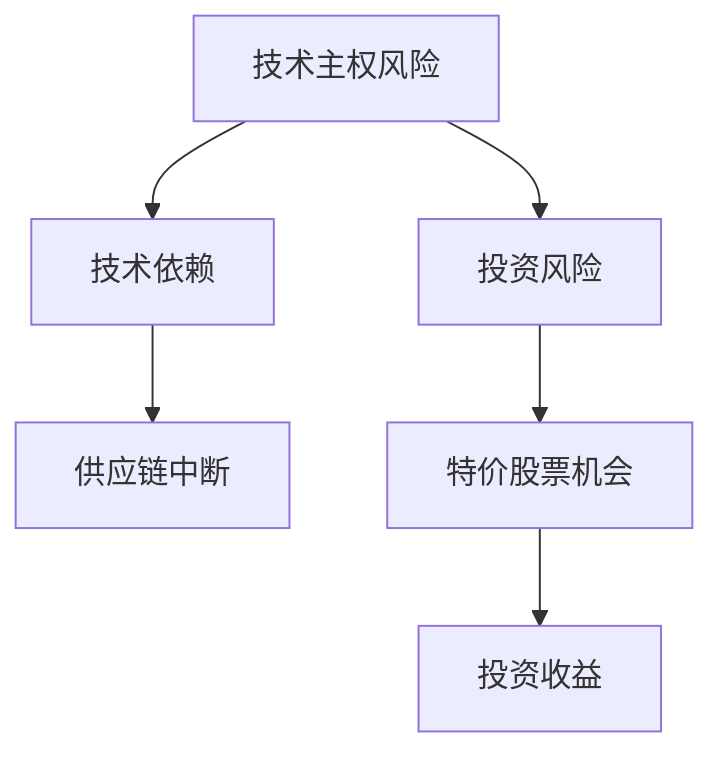
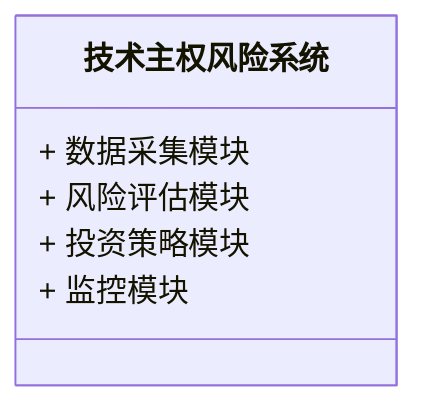

                 


# 如何利用特价股票策略应对技术主权风险

## 关键词：技术主权风险, 特价股票策略, 投资策略, 风险管理, 人工智能, 股票投资

## 摘要：技术主权风险是指在依赖某些技术时可能面临的供应链中断或技术限制等问题。本文探讨如何利用特价股票策略，通过投资低价股票在市场波动中获利，从而在面对技术主权风险时保持财务稳定。文章从背景介绍、核心概念、算法原理到系统架构和项目实战，详细分析了特价股票策略的应用及其应对技术主权风险的有效性。

---

## 第一章：技术主权风险的背景与挑战

### 1.1 技术主权风险的定义与来源

技术主权风险是指由于过度依赖某些技术或依赖特定国家的技术供应链，可能导致的供应中断或技术限制的风险。这种风险在当前全球化和技术依赖的背景下尤为突出。例如，半导体行业的供应链中断可能会影响全球多个产业，从而引发技术主权问题。

### 1.2 特价股票策略的定义与特点

特价股票策略是一种投资策略，专注于购买价格远低于其内在价值的股票。这种策略通常在市场低迷或公司遇到短期困难时有效，投资者认为这些股票的价格会被市场低估，具备上涨潜力。

### 1.3 技术主权风险与特价股票策略的联系

技术主权风险可能导致相关技术公司的股票价格下跌，为特价股票策略提供了投资机会。通过在技术主权风险事件中寻找被低估的股票，投资者可以在市场恢复时获得超额收益。

---

## 第二章：技术主权风险的核心概念

### 2.1 技术主权风险的构成要素

技术主权风险包括技术依赖性、供应链中断和政治经济影响。例如，依赖进口芯片的公司可能因供应链中断而面临股价下跌的风险。

### 2.2 特价股票策略的核心原理

特价股票策略基于市场有效性和投资者心理，寻找被低估的股票。这种策略在市场波动或技术主权风险事件中特别有效，因为恐慌性抛售可能导致股价低于实际价值。

### 2.3 实体关系图



---

## 第三章：技术主权风险评估算法

### 3.1 风险评估模型

技术主权风险评估模型结合了技术依赖度和市场敏感度。使用层次分析法（AHP）确定各因素的权重，评估公司的技术风险等级。

### 3.2 预测模型

使用时间序列分析预测技术主权风险对股价的影响。模型分为数据预处理、模型训练和预测三个阶段。

### 3.3 投资决策算法

根据风险评估和预测结果，制定投资策略。例如，当风险等级较高时，优先选择被低估的技术公司股票。

---

## 第四章：系统架构设计

### 4.1 功能模块

系统包括数据采集、风险评估、策略执行和监控模块，每个模块协作完成从数据处理到投资决策的全过程。

### 4.2 类图



### 4.3 架构图


---

## 第五章：项目实战

### 5.1 环境安装

安装Python和相关库（如pandas、numpy、scikit-learn）。

### 5.2 核心代码实现

使用Python编写数据处理和预测模型代码，如：

```python
import pandas as pd
from sklearn.model import LinearRegression

# 数据加载
data = pd.read_csv('stock_data.csv')

# 数据处理
X = data[['price', 'volume']]
y = data['target']

# 模型训练
model = LinearRegression()
model.fit(X, y)

# 预测
predicted = model.predict(X)
```

### 5.3 案例分析

分析某技术公司的股票，利用模型预测其价格走势，并制定投资策略，如在特定价格点买入被低估的股票。

---

## 第六章：总结与展望

### 6.1 最佳实践

建议投资者在技术主权风险期间关注被低估的技术公司股票，同时分散投资以降低风险。

### 6.2 小结

通过特价股票策略，投资者可以在技术主权风险中发现机会，利用市场低估的股票实现长期收益。

### 6.3 注意事项

提醒读者注意市场波动风险，确保数据质量和模型的有效性，定期调整投资策略。

### 6.4 拓展阅读

推荐相关书籍和资源，帮助读者深入理解技术主权风险和投资策略。

---

# 作者：AI天才研究院 & 禅与计算机程序设计艺术

---

通过以上结构，文章详细分析了技术主权风险的背景、特价股票策略的原理，以及如何通过系统设计和项目实战来应对风险，帮助投资者在技术主权风险中找到投资机会。

