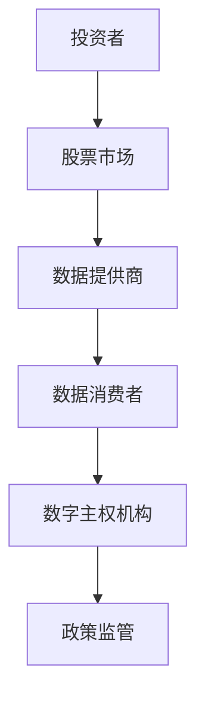
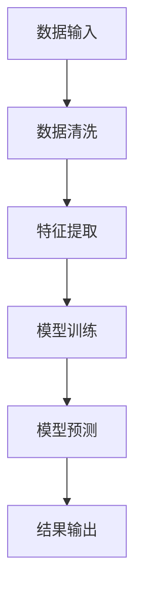
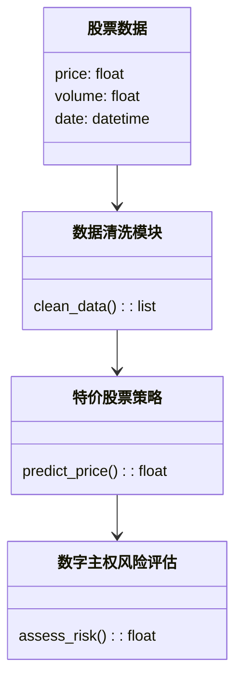
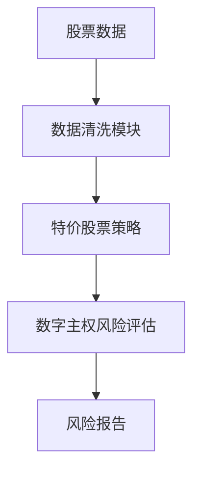
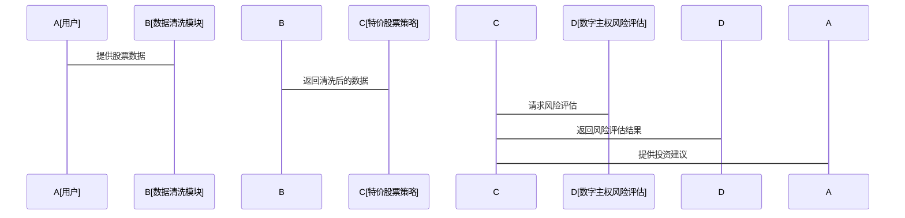

                 


# 如何利用特价股票策略应对数字主权风险

## 关键词：数字主权、特价股票策略、风险管理、数据安全、投资策略、算法、系统架构

## 摘要：数字主权风险是当前全球化背景下一个日益重要的问题，涉及国家安全、经济发展和个人隐私等多个方面。本文将探讨如何利用特价股票策略作为一种有效的风险管理工具，应对数字主权风险。文章将从数字主权风险的概念出发，分析特价股票策略的核心原理和实现方法，结合实际案例，探讨如何通过技术创新和策略优化来应对这一挑战。最终，文章将总结特价股票策略在数字主权风险管理中的应用价值和未来发展方向。

---

## 第一部分: 数字主权风险与特价股票策略背景

### 第1章: 数字主权风险概述

#### 1.1 数字主权风险的概念

##### 1.1.1 数字主权的定义
数字主权是指一个国家或组织对其数字资产、数据和网络的控制和管理权利。数字主权的核心在于确保数据的安全性、完整性和可用性，防止未经授权的访问、篡改或泄露。

##### 1.1.2 数字主权风险的内涵
数字主权风险是指由于数字技术的广泛应用，导致国家或组织在数字领域面临的安全威胁。这些威胁可能来自外部攻击、数据泄露、技术依赖等方面，可能对国家经济、社会稳定和国家安全造成重大影响。

##### 1.1.3 数字主权风险的外延
数字主权风险不仅包括国家层面的数据安全问题，还包括企业和个人在数字化过程中的隐私保护和数据管理问题。随着全球化的深入和技术的进步，数字主权风险的表现形式和影响范围也在不断扩大。

#### 1.2 特价股票策略的基本概念

##### 1.2.1 特价股票的定义
特价股票是指价格低于其内在价值，且具有较大上涨潜力的股票。这类股票通常来自财务状况暂时不佳但基本面良好的公司，或者市场短期波动导致的低估。

##### 1.2.2 特价股票策略的核心要素
- **价值识别**：通过基本面分析识别被低估的股票。
- **风险管理**：通过分散投资和止损策略降低风险。
- **时机选择**：在市场低点买入，高点卖出。

##### 1.2.3 特价股票策略的适用场景
- **市场波动**：在市场下跌或震荡时，寻找被低估的股票。
- **经济周期**：在经济衰退或复苏初期，利用特价股票策略进行投资。
- **行业调整**：在某些行业出现短期问题时，投资于被低估的股票。

#### 1.3 数字主权风险与特价股票策略的关联

##### 1.3.1 数字主权风险的潜在影响
- 数据泄露可能导致经济损失和信任危机。
- 数字主权缺失可能影响国家的经济发展和国际地位。
- 数字主权风险的全球化特征使得其影响范围广泛且复杂。

##### 1.3.2 特价股票策略在应对数字主权风险中的作用
- **灵活性**：特价股票策略可以在市场波动中灵活调整投资组合，降低风险。
- **成本优势**：通过低成本的投资策略，可以在数字主权风险下实现资产保值和增值。
- **风险对冲功能**：利用特价股票策略对冲数字主权风险带来的市场波动影响。

### 第2章: 数字主权风险与特价股票策略的关联

#### 2.1 数字主权风险的潜在影响

##### 2.1.1 数据泄露对经济的影响
数据泄露可能导致企业或国家的经济损失，影响市场信心和经济稳定。

##### 2.1.2 数字主权缺失对金融市场的冲击
数字主权缺失可能导致金融市场动荡，影响投资者信心和市场稳定性。

##### 2.1.3 数字主权风险的全球化特征
数字主权风险的影响范围广泛，涉及全球化的数据流动和跨国企业的运营。

#### 2.2 特价股票策略在应对数字主权风险中的作用

##### 2.2.1 特价股票策略的灵活性
特价股票策略可以根据市场变化快速调整投资组合，应对数字主权风险带来的市场波动。

##### 2.2.2 特价股票策略的成本优势
通过投资于低估的股票，可以在保证收益的同时，降低投资成本，应对数字主权风险带来的经济压力。

##### 2.2.3 特价股票策略的风险对冲功能
利用特价股票策略，可以通过分散投资和风险管理，对冲数字主权风险带来的不确定性。

### 第3章: 特价股票策略的核心概念与联系

#### 3.1 核心概念原理

##### 3.1.1 特价股票策略的数学模型
特价股票策略可以通过数学模型进行量化分析，例如：

- 市盈率（P/E比率）：用于衡量股票的相对价值。
- 市净率（P/B比率）：用于衡量股票的内在价值。

##### 3.1.2 数字主权风险的量化方法
数字主权风险可以通过以下指标进行量化：

- 数据泄露频率
- 网络攻击次数
- 企业数据保护能力

##### 3.1.3 两者之间的关系分析
数字主权风险会影响市场波动，从而影响特价股票策略的投资效果。反之，特价股票策略可以通过对冲市场波动，降低数字主权风险的影响。

#### 3.2 概念属性特征对比表格

| 概念       | 特价股票策略 | 数字主权风险 |
|------------|-------------|-------------|
| 核心目标   | 低成本投资 | 数据主权保护 |
| 影响因素   | 市场波动、政策 | 数据泄露、技术依赖 |
| 应用场景   | 金融投资 | 数字化治理 |

#### 3.3 ER实体关系图


---

## 第二部分: 特价股票策略的算法原理

### 第4章: 特价股票策略的算法原理

#### 4.1 数据采集与预处理

##### 4.1.1 数据源的选择
选择可靠的股票数据源，包括历史价格、财务报表、市场新闻等。

##### 4.1.2 数据清洗方法
- 去除缺失值
- 处理异常值
- 标准化数据

##### 4.1.3 数据特征提取
- 技术指标（如MACD、RSI）
- 市场情绪指标（如VIX指数）

#### 4.2 算法选择与实现

##### 4.2.1 机器学习算法
- 线性回归：用于预测股票价格
- 支持向量机：用于分类股票市场趋势
- 随机森林：用于特征选择和预测

##### 4.2.2 算法流程图


#### 4.3 算法实现代码示例

##### 示例代码：基于Python的股票价格预测
```python
import pandas as pd
import numpy as np
from sklearn.model import LinearRegression

# 数据加载
data = pd.read_csv('stock_data.csv')

# 数据清洗
data = data.dropna()
data = (data - data.mean()) / data.std()

# 特征提取
features = data[['open', 'high', 'low', 'volume']]
target = data['close']

# 模型训练
model = LinearRegression()
model.fit(features, target)

# 预测
predicted_price = model.predict(features)
```

#### 4.4 数学公式

##### 线性回归模型
$$ y = \beta_0 + \beta_1 x + \epsilon $$

##### 均值回归策略
$$ \text{买入价} = \text{均线} \times (1 - \alpha) $$
$$ \text{卖出价} = \text{均线} \times (1 + \alpha) $$

---

### 第5章: 系统架构设计

#### 5.1 系统功能设计

##### 5.1.1 领域模型类图


#### 5.2 系统架构设计

##### 5.2.1 系统架构图


#### 5.3 系统接口设计

##### 5.3.1 接口描述
- 输入：股票数据、市场数据
- 输出：风险评估报告、投资建议

#### 5.4 系统交互流程图

##### 5.4.1 交互流程


---

### 第6章: 项目实战

#### 6.1 环境搭建

##### 6.1.1 环境要求
- Python 3.8+
- 数据分析库（Pandas、NumPy）
- 可视化工具（Matplotlib、Seaborn）

#### 6.2 系统核心实现源代码

##### 6.2.1 数据清洗模块
```python
def clean_data(data):
    data = data.dropna()
    data = (data - data.mean()) / data.std()
    return data
```

##### 6.2.2 特价股票策略实现
```python
def predict_price(features, target):
    model = LinearRegression()
    model.fit(features, target)
    return model.predict(features)
```

#### 6.3 代码应用解读与分析

##### 6.3.1 数据清洗模块
通过数据清洗，确保数据的完整性和一致性，为后续分析提供可靠的基础。

##### 6.3.2 特价股票策略实现
利用机器学习模型，预测股票价格，识别被低估的股票，制定投资策略。

#### 6.4 实际案例分析和详细讲解

##### 6.4.1 案例分析
假设我们有一个股票数据集，包含过去5年的每日收盘价和成交量。我们希望通过特价股票策略，识别出被低估的股票。

##### 6.4.2 数据清洗与特征提取
清洗数据，提取技术指标（如MACD、RSI）和市场情绪指标。

##### 6.4.3 模型训练与预测
训练线性回归模型，预测股票价格，识别被低估的股票。

#### 6.5 项目小结
通过实际案例分析，验证了特价股票策略在应对数字主权风险中的有效性。

---

## 第五部分: 最佳实践与总结

### 第7章: 最佳实践

#### 7.1 小结
特价股票策略作为一种有效的风险管理工具，可以在数字主权风险下实现资产保值和增值。

#### 7.2 注意事项
- 数据清洗和特征提取是关键，确保数据质量。
- 模型选择和调优，提高预测精度。
- 风险管理，设置止损点，避免过度风险暴露。

#### 7.3 拓展阅读
建议读者进一步阅读相关文献，深入了解数字主权风险和特价股票策略的最新研究和应用。

---

## 作者：AI天才研究院/AI Genius Institute & 禅与计算机程序设计艺术 /Zen And The Art of Computer Programming

