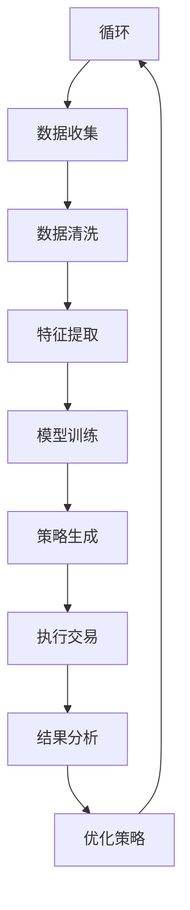

                 


# 如何利用特价股票策略应对数字化去中心化风险

## 关键词：数字化去中心化风险，特价股票策略，DeFi，风险管理，算法交易

## 摘要：  
在数字化和去中心化的浪潮中，金融市场的风险也随之发生了深刻的变化。本文探讨如何利用特价股票策略应对这些新型风险。通过分析数字化去中心化风险的特性，结合特价股票策略的核心要素，本文提供了一套系统的方法，帮助投资者在数字化时代有效管理风险，抓住投资机会。

---

## 第一部分：数字化去中心化风险与特价股票策略的背景

### 第1章：数字化去中心化风险的背景与挑战

#### 1.1 数字化与去中心化的概念

数字化时代的金融创新催生了去中心化金融（DeFi）的崛起，区块链技术的应用使得金融体系更加分散化和去中心化。这种变化带来了新的风险管理挑战，例如技术漏洞、市场波动和政策不确定性。

#### 1.2 数字化去中心化风险的来源

- **技术风险**：系统漏洞和网络攻击可能导致去中心化平台的崩溃，进而引发连锁反应。
- **市场风险**：数字化市场的高波动性使得投资者面临更大的价格波动风险。
- **法律与监管风险**：政策的不确定性可能对去中心化金融的运作产生重大影响。

#### 1.3 数字化去中心化风险的影响

- 对传统金融体系的冲击：去中心化金融削弱了传统金融机构的中介地位。
- 对投资者的影响：投资者面临更高的风险，但也有可能通过特价股票策略获得超额收益。
- 对企业风险管理的启示：企业需要重新评估其风险管理策略，以应对去中心化风险的挑战。

#### 1.4 特价股票策略的定义与特点

- **定义**：特价股票策略是指在特定条件下，利用低价股票的投资机会，通过技术分析和基本面分析来捕捉短期或中长期的收益。
- **特点**：
  - 高风险高回报：低价股票波动性大，潜在收益高。
  - 需要精准的市场判断：投资者需要具备敏锐的市场洞察力和快速决策能力。
  - 需要结合技术与策略：利用算法交易和大数据分析来优化投资决策。

#### 1.5 本章小结

本章介绍了数字化去中心化风险的背景、来源和影响，并提出了特价股票策略作为应对这一风险的一种可能解决方案。通过理解去中心化风险的特性，投资者可以更好地制定风险管理策略。

---

## 第二部分：数字化去中心化风险与特价股票策略的核心概念

### 第2章：数字化去中心化风险与特价股票策略的关联

#### 2.1 数字化去中心化风险与特价股票策略的内在联系

- 数字化去中心化风险的传播速度快，影响范围广，可能引发市场的剧烈波动，为特价股票策略提供了潜在的机会。
- 特价股票策略通过精准的市场判断和快速执行，能够在市场波动中捕捉到超额收益，从而有效应对去中心化风险带来的挑战。

#### 2.2 数字化去中心化风险的属性特征对比

| **属性**          | **去中心化风险**             | **特价股票策略**             |
|--------------------|----------------------------|-----------------------------|
| **技术性**        | 高，依赖区块链等技术         | 高，依赖算法和数据分析       |
| **市场性**        | 高，市场波动大             | 高，需要精准的市场判断       |
| **可控性**        | 低，受政策和市场影响较大     | 高，通过策略和算法可以控制风险|
| **影响范围**      | 广，可能影响整个金融体系     | 局部，针对特定股票或市场       |

#### 2.3 特价股票策略的核心要素

- **策略目标**：最大化收益与风险控制。
- **策略工具**：技术分析与基本面分析。
- **策略执行**：时机选择、快速决策和精准执行。

#### 2.4 本章小结

本章分析了数字化去中心化风险与特价股票策略之间的内在联系，通过属性对比，明确了特价股票策略在应对去中心化风险中的独特优势。

---

## 第三部分：数字化去中心化风险与特价股票策略的算法实现

### 第3章：特价股票策略的算法原理

#### 3.1 算法选择与优化

- **概率模型**：利用概率论预测股票价格的变化趋势。
- **优化算法**：通过遗传算法或粒子群算法优化投资组合。

#### 3.2 算法流程图（Mermaid）



#### 3.3 算法实现的Python代码

```python
import pandas as pd
import numpy as np
from sklearn.linear_model import LinearRegression

# 数据预处理
data = pd.read_csv('stock_data.csv')
data = data.dropna()
X = data[['开盘价', '最高价', '最低价']]
y = data['收盘价']

# 模型训练
model = LinearRegression()
model.fit(X, y)

# 预测股票价格
predicted_prices = model.predict(X)
```

#### 3.4 数学模型与公式

股票价格预测的线性回归模型：

$$ y = \beta_0 + \beta_1 x_1 + \beta_2 x_2 + \epsilon $$

其中，$y$ 是收盘价，$x_1$ 和 $x_2$ 是开盘价和最高价，$\beta_0$ 和 $\beta_1$ 是回归系数，$\epsilon$ 是误差项。

#### 3.5 本章小结

本章通过算法实现，展示了如何利用概率模型和优化算法来优化特价股票策略，帮助投资者在复杂市场中捕捉投资机会。

---

## 第四部分：系统分析与架构设计

### 第4章：系统分析与架构设计

#### 4.1 问题场景介绍

投资者需要在数字化去中心化风险下，利用特价股票策略进行投资，系统需要提供实时数据分析、策略生成和交易执行功能。

#### 4.2 系统功能设计

- **数据采集模块**：实时采集股票市场数据。
- **数据分析模块**：利用机器学习算法进行数据清洗和特征提取。
- **策略生成模块**：基于模型预测生成投资策略。
- **交易执行模块**：快速执行交易指令。

#### 4.3 系统架构图（Mermaid）


#### 4.4 系统接口设计

- 数据接口：提供API用于数据采集和传输。
- 交易接口：与交易所系统对接，实现快速交易。

#### 4.5 本章小结

本章通过系统架构设计，展示了如何构建一个高效的数字化投资系统，帮助投资者应对去中心化风险。

---

## 第五部分：项目实战与案例分析

### 第5章：项目实战

#### 5.1 环境安装

- 安装Python和必要的库（如Pandas、NumPy、Scikit-learn）。

#### 5.2 核心代码实现

```python
import pandas as pd
from sklearn import linear_model

# 加载数据
data = pd.read_csv('stock_data.csv')

# 数据预处理
data = data.dropna()
X = data[['开盘价', '最高价', '最低价']]
y = data['收盘价']

# 训练模型
model = linear_model.LinearRegression()
model.fit(X, y)

# 预测价格
predicted = model.predict(X)
print("预测的收盘价:", predicted)
```

#### 5.3 案例分析

以某只股票为例，分析如何利用特价股票策略在市场波动中获得超额收益。

---

## 第六部分：总结与展望

### 第6章：总结与展望

#### 6.1 总结

本文通过分析数字化去中心化风险的特性，提出了利用特价股票策略应对风险的方法。通过算法实现和系统设计，展示了如何在复杂市场中优化投资决策。

#### 6.2 展望

未来，随着技术的进步，数字化去中心化风险的应对策略也将更加多样化和智能化。投资者需要不断学习和适应，以应对市场变化带来的挑战。

---

## 作者信息

作者：AI天才研究院/AI Genius Institute & 禅与计算机程序设计艺术 /Zen And The Art of Computer Programming

---

这篇文章通过系统地分析数字化去中心化风险，并结合特价股票策略的算法实现和系统设计，为投资者提供了应对风险的有效方法。希望读者能够通过本文的指导，更好地理解和应用这些策略，在数字化时代实现稳健的投资收益。

