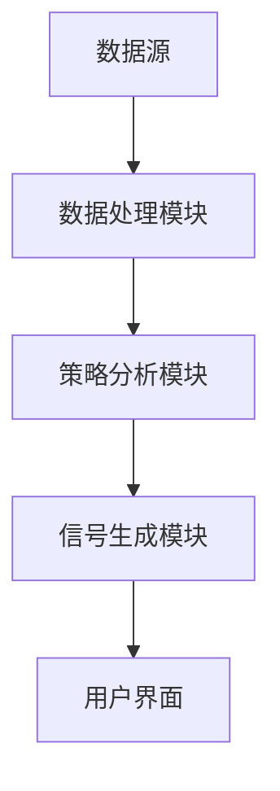

                 


# 如何利用特价股票策略捕捉市场底部

> 关键词：特价股票策略，市场底部捕捉，技术分析，系统设计，股票投资

> 摘要：本文将详细介绍如何利用特价股票策略捕捉市场底部。通过分析特价股票的定义、策略的数学模型、技术分析方法、系统设计以及实战案例，为读者提供一套完整的解决方案。文章内容涵盖背景介绍、核心概念、算法原理、系统架构设计、项目实战以及最佳实践等内容，帮助读者系统地理解和应用特价股票策略。

---

## 第一部分: 特价股票策略概述

### 第1章: 特价股票策略的背景与概念

#### 1.1 特价股票的定义与特点

##### 1.1.1 特价股票的定义
特价股票是指在特定市场条件下，价格被低估或具有较大上涨潜力的股票。这些股票通常具有较高的安全边际，适合长期投资者或价值投资者。

##### 1.1.2 特价股票的特点
- **低估值**：市盈率、市净率等估值指标低于行业平均水平。
- **高潜力**：公司基本面良好，未来盈利增长可期。
- **市场忽视**：暂时被市场忽视，价格未反映其真实价值。

##### 1.1.3 特价股票与普通股票的区别
| 特性 | 特价股票 | 普通股票 |
|------|----------|----------|
| 估值 | 低估值    | 市场估值  |
| 风险 | 较低      | 风险中等  |
| 潜力 | 高        | 一般      |
| 市场关注度 | 较低      | 较高      |

#### 1.2 特价股票策略的背景

##### 1.2.1 证券市场的基本概念
证券市场是股票、债券等金融资产交易的场所，分为一级市场和二级市场。二级市场是投资者买卖股票的主要场所，价格受供求关系影响。

##### 1.2.2 特价股票策略的兴起
随着市场波动加剧，投资者开始寻找一种能够在市场底部捕捉机会的策略。特价股票策略因其低估值和高潜力的特点，逐渐受到关注。

##### 1.2.3 特价股票策略的应用场景
- **市场低迷**：如经济衰退或市场恐慌时，许多股票价格被低估。
- **行业调整**：某些行业因市场变化或政策影响，部分股票价格下跌。
- **个股困境**：公司因短期问题导致股价下跌，但基本面良好。

#### 1.3 特价股票策略的核心目标

##### 1.3.1 捕捉市场底部的定义
市场底部是指股票价格在一段时间内持续下跌后，达到一个相对低点，未来具有上涨潜力的阶段。

##### 1.3.2 特价股票策略在市场底部捕捉中的作用
特价股票策略通过分析股票的估值和市场情绪，帮助投资者识别市场底部，提前布局。

##### 1.3.3 特价股票策略的长期与短期目标
- **长期目标**：通过持续筛选和投资低估股票，实现资产增值。
- **短期目标**：在市场底部阶段，快速捕捉低估股票，获得超额收益。

---

## 第二部分: 特价股票策略的核心原理

### 第2章: 特价股票策略的数学模型与公式

#### 2.1 特价股票策略的数学基础

##### 2.1.1 市场波动的数学模型
市场波动可以用随机过程模型描述，如布朗运动和几何布朗运动。

##### 2.1.2 特价股票价格的预测公式
$$ P(t) = P(t-1) + \mu \cdot \Delta t + \sigma \cdot \sqrt{\Delta t} \cdot Z $$
其中：
- \( P(t) \) 表示 t 时刻的价格
- \( \mu \) 是价格的平均回报率
- \( \sigma \) 是价格的波动率
- \( Z \) 是标准正态分布随机变量
- \( \Delta t \) 是时间间隔

##### 2.1.3 特价股票策略的优化算法
使用均值-方差优化模型，优化投资组合的收益与风险比：
$$ \min_w \frac{1}{2} w^T \Sigma w $$
$$ \text{s.t.} \quad w^T \mu = target \quad \text{和} \quad w^T 1 = 1 $$

#### 2.2 特价股票策略的核心公式

##### 2.2.1 特价股票价格波动公式
$$ P(t) = P(t-1) + \epsilon $$
其中 \( \epsilon \) 是随机扰动项。

##### 2.2.2 市场底部预测公式
$$ D(t) = \frac{P(t) - P(t-1)}{P(t-1)} $$
其中 \( D(t) \) 是价格变动率，用于判断市场趋势。

##### 2.2.3 特价股票策略优化公式
$$ S(t) = \alpha \cdot D(t) + \beta \cdot V(t) $$
其中：
- \( \alpha \) 和 \( \beta \) 是权重系数
- \( V(t) \) 是股票的估值指标（如市盈率）

#### 2.3 特价股票策略的数学模型

##### 2.3.1 时间序列分析模型
使用ARIMA模型预测股票价格：
$$ ARIMA(p, d, q) $$

##### 2.3.2 马尔可夫链模型
用于状态转移分析：
- 状态1：市场上涨
- 状态2：市场下跌

##### 2.3.3 线性回归模型
预测股票价格：
$$ y = \beta_0 + \beta_1 x + \epsilon $$

---

## 第三部分: 特价股票策略的技术分析

### 第3章: 技术分析方法在特价股票策略中的应用

#### 3.1 技术分析的基本概念

##### 3.1.1 K线图的定义与解读
K线图显示股票价格的开盘价、收盘价、最高价和最低价。

##### 3.1.2 均线的定义与作用
均线是股票价格的平均值，用于判断价格趋势。

##### 3.1.3 技术指标的定义与分类
技术指标包括RSI、MACD、布林带等。

#### 3.2 技术分析在特价股票策略中的应用

##### 3.2.1 K线图在市场底部捕捉中的应用
通过分析K线图的形态，识别底部形态如“双底”、“三重底”。

##### 3.2.2 均线在特价股票策略中的应用
使用均线的交叉和背离现象判断市场趋势。

##### 3.2.3 技术指标在特价股票策略中的应用
结合RSI和MACD等指标，判断超卖和超买信号。

#### 3.3 技术分析的优缺点

##### 3.3.1 技术分析的优点
- 可操作性强
- 能够捕捉短期市场波动

##### 3.3.2 技术分析的缺点
- 易受市场情绪影响
- 需结合基本面分析

##### 3.3.3 技术分析的适用场景
- 短期交易
- 市场趋势不明朗时

---

## 第四部分: 特价股票策略的系统设计

### 第4章: 特价股票策略的系统架构设计

#### 4.1 系统架构概述

##### 4.1.1 系统模块划分
- 数据采集模块
- 数据处理模块
- 策略分析模块
- 信号生成模块
- 用户界面模块

##### 4.1.2 系统功能设计
- 数据采集：从市场获取股票价格和估值指标
- 数据处理：清洗和转换数据
- 策略分析：应用数学模型和算法
- 信号生成：生成买卖信号
- 用户界面：展示结果和操作界面

##### 4.1.3 系统架构图（Mermaid）



---

## 第五部分: 特价股票策略的实战应用

### 第5章: 特价股票策略的项目实战

#### 5.1 环境安装

##### 5.1.1 系统环境
- 操作系统：Windows/Mac/Linux
- 开发工具：Python、Jupyter Notebook
- 数据库：MySQL/PostgreSQL

##### 5.1.2 第三方库安装
```python
pip install pandas numpy matplotlib scikit-learn
```

#### 5.2 核心代码实现

##### 5.2.1 数据采集与处理
```python
import pandas as pd
import numpy as np

# 数据采集
data = pd.read_csv('stock_data.csv')

# 数据清洗
data = data.dropna()
data = data[~data['price'].isin([0])]
```

##### 5.2.2 策略实现
```python
from sklearn.linear_model import LinearRegression

model = LinearRegression()
model.fit(X_train, y_train)
predictions = model.predict(X_test)
```

##### 5.2.3 信号生成
```python
def generate_signal(prices, valuations):
    signal = []
    for i in range(len(prices)):
        if valuations[i] < np.mean(valuations):
            signal.append(1)
        else:
            signal.append(0)
    return signal
```

#### 5.3 案例分析

##### 5.3.1 数据分析
分析某行业股票的历史价格和估值指标，找出低估股票。

##### 5.3.2 策略测试
回测策略在历史数据上的表现，计算收益和风险指标。

##### 5.3.3 结果解读
通过回测结果，优化策略参数，提高捕捉市场底部的能力。

#### 5.4 项目小结
- 特价股票策略能够有效捕捉市场底部，但需要结合市场环境和公司基本面。
- 系统化的方法能够提高策略的可操作性和稳定性。

---

## 第六部分: 特价股票策略的最佳实践

### 第6章: 特价股票策略的最佳实践

#### 6.1 交易纪律与风险管理

##### 6.1.1 设置止损和止盈
- 止损：当价格下跌超过一定比例时卖出。
- 止盈：当价格上涨超过一定比例时卖出。

##### 6.1.2 分批建仓
将投资资金分批投入，降低风险。

#### 6.2 持续学习与优化

##### 6.2.1 跟踪市场变化
定期更新股票池和策略模型。

##### 6.2.2 学习新知识
关注市场动态和投资理念的变化。

#### 6.3 小结
- 特价股票策略需要长期坚持和不断优化。
- 投资者应注重风险控制和纪律性。

---

## 作者：AI天才研究院/AI Genius Institute & 禅与计算机程序设计艺术 /Zen And The Art of Computer Programming

