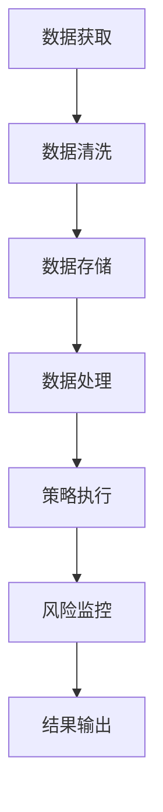
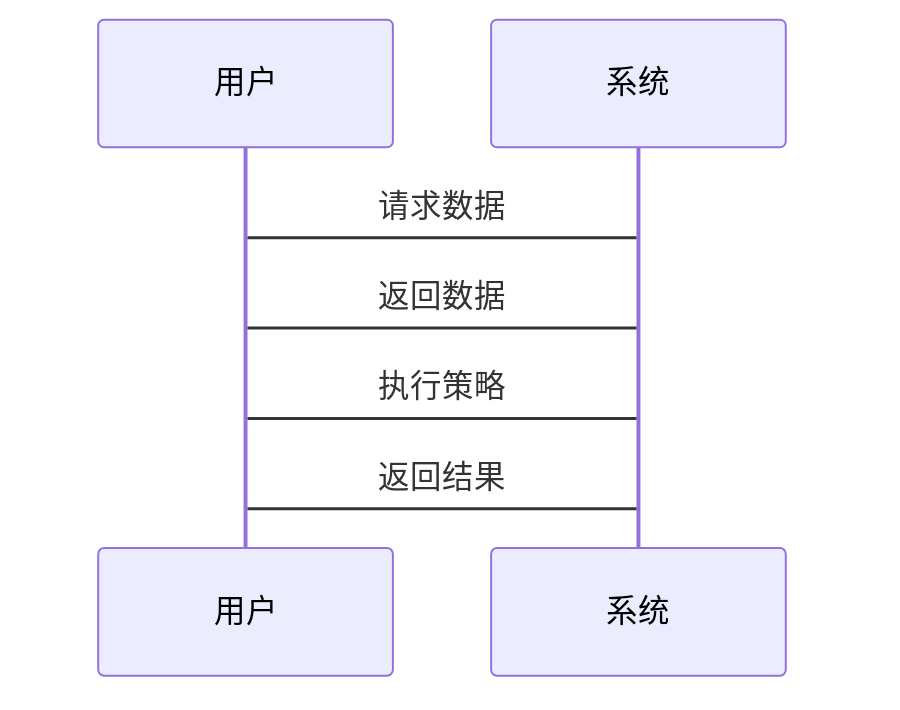

                 

# 如何利用特价股票策略构建全球宏观主题基金

## 关键词：特价股票策略, 全球宏观主题基金, 股票投资, 宏观经济, 量化投资

## 摘要

本文详细探讨了如何利用特价股票策略构建全球宏观主题基金。首先，文章介绍了特价股票策略和全球宏观主题基金的基本概念和特点。然后，深入分析了特价股票策略的核心原理，包括市场波动、估值指标和市场情绪等。接着，文章详细讲解了全球宏观主题基金的构建方法，包括宏观经济主题的识别、投资组合的优化和风险管理。通过结合量化分析和系统设计，文章提供了一套完整的解决方案，并通过实际案例展示了如何将特价股票策略应用于全球宏观主题基金的构建中。最后，文章总结了关键点，并展望了未来的发展趋势。

---

# 第一部分: 特价股票策略与全球宏观主题基金概述

## 第1章: 特价股票策略与全球宏观主题基金概述

### 1.1 特价股票策略的定义与特点

#### 1.1.1 什么是特价股票策略
特价股票策略是一种基于市场波动和估值差异的投资策略，旨在通过识别被低估的股票，利用短期价格波动或长期价值回归实现超额收益。这种策略通常关注那些因市场情绪、突发事件或行业周期性变化而被市场低估的股票。

#### 1.1.2 特价股票策略的核心特点
- **低估值**：依赖于对市盈率（P/E）、市净率（P/B）、股息率等估值指标的分析，寻找价格低于内在价值的股票。
- **市场情绪驱动**：利用市场恐慌或过度乐观的情绪，捕捉短期价格波动机会。
- **周期性**：适用于行业周期性波动的股票，通过识别周期性底部寻找投资机会。

#### 1.1.3 特价股票策略的优势与局限性
- **优势**：能够在市场下跌或震荡时期捕捉低估机会，适合长期价值投资者。
- **局限性**：对市场波动敏感，短期风险较高；需要较强的市场分析能力和选股能力。

### 1.2 全球宏观主题基金的概念与特点

#### 1.2.1 全球宏观主题基金的定义
全球宏观主题基金是一种以宏观经济趋势和行业周期为驱动，投资于全球范围内与特定主题相关的股票或资产的基金。其核心在于捕捉全球经济结构变化、行业趋势和政策导向带来的投资机会。

#### 1.2.2 全球宏观主题基金的投资策略
- **主题驱动**：聚焦于特定宏观经济主题，如科技革命、绿色能源、人口老龄化等，投资相关行业的龙头企业。
- **全球化视角**：在全球范围内配置资产，分散风险，捕捉不同市场的投资机会。
- **长期持有**：注重长期趋势，避免短期波动干扰，追求主题的持续增长收益。

#### 1.2.3 全球宏观主题基金的风险与收益
- **收益**：通过长期趋势和主题投资，实现资产的稳定增值。
- **风险**：受宏观经济政策、行业周期和地缘政治风险影响较大，市场波动可能导致短期回撤。

### 1.3 特价股票策略与全球宏观主题基金的结合

#### 1.3.1 特价股票策略在全球宏观主题基金中的作用
- **优化投资组合**：通过筛选被低估的股票，降低投资成本，提高收益空间。
- **捕捉短期机会**：在全球宏观经济波动中，快速识别因市场情绪或突发事件导致的低估股票，实现超额收益。
- **增强抗风险能力**：通过低价买入高价值股票，降低市场波动对基金净值的影响。

#### 1.3.2 特价股票策略与宏观经济主题的匹配
- **行业周期与估值匹配**：在全球宏观经济周期中，识别处于底部行业的低估股票。
- **主题与估值的结合**：将宏观经济主题与股票估值指标相结合，筛选出符合主题且估值合理的股票。
- **动态调整**：根据宏观经济变化和市场波动，动态调整投资标的，确保基金收益与宏观经济主题的契合。

#### 1.3.3 特价股票策略在全球化投资中的应用
- **跨国配置**：在全球范围内寻找被低估的股票，分散投资风险。
- **区域市场机会**：利用不同国家或地区的经济周期差异，捕捉区域市场中的低估股票。
- **全球化视角下的主题投资**：将全球宏观经济主题与特价股票策略结合，实现全球化视角下的主题投资。

### 1.4 本章小结

---

# 第二部分: 特价股票策略的核心原理与分析

## 第2章: 特价股票策略的核心原理

### 2.1 特价股票的识别与筛选

#### 2.1.1 市场波动与特价股票的产生
- 市场波动：短期价格波动可能导致股票价格偏离其内在价值。
- 市场情绪：投资者情绪的波动可能导致某些股票被市场低估或高估。

#### 2.1.2 市盈率、市净率等估值指标的分析
- 市盈率（P/E）：价格与收益的比率，用于衡量股票的估值水平。
- 市净率（P/B）：价格与净资产的比率，适用于评估资产密集型行业。
- 股息率：股息与股票价格的比率，用于衡量股票的收益能力。

#### 2.1.3 市场情绪与特价股票的机会
- 恐慌性抛售：市场恐慌可能导致股票价格大幅下跌，为投资者提供低价买入的机会。
- 乐观性回调：市场过度乐观可能导致股票价格虚高，为投资者提供短期卖出的机会。

### 2.2 特价股票策略的数学模型

#### 2.2.1 估值模型的建立
- 市盈率模型：$$ \text{合理股价} = \text{市盈率} \times \text{每股收益} $$
- 市净率模型：$$ \text{合理股价} = \text{市净率} \times \text{每股净资产} $$
- 内在价值模型：$$ \text{内在价值} = \text{未来现金流的现值} $$

#### 2.2.2 市场情绪模型的构建
- 市场情绪指数：$$ \text{市场情绪指数} = \alpha \times \text{成交量} + \beta \times \text{价格波动} + \gamma \times \text{投资者情绪调查} $$
- 情绪驱动的估值偏差：$$ \text{估值偏差} = \text{市场情绪指数} \times \text{波动率} $$

#### 2.2.3 风险调整后的收益模型
- 风险调整后的收益：$$ \text{风险调整后收益} = \text{超额收益} - \text{风险溢价} \times \text{波动率} $$

### 2.3 特价股票策略的风险分析

#### 2.3.1 市场风险的来源
- 宏观经济波动：如利率变化、通货膨胀、经济周期等。
- 行业风险：如行业政策变化、技术革新等。

#### 2.3.2 个股风险的评估
- 股票流动性风险：$$ \text{流动性风险} = \frac{1}{\text{平均日成交量}} \times \text{投资金额} $$
- 股票信用风险：$$ \text{信用风险} = \text{公司违约概率} \times \text{投资金额} $$

#### 2.3.3 操作风险的控制
- 交易成本：$$ \text{交易成本} = \text{买卖价差} + \text{佣金} + \text{税费} $$
- 操作失误：如交易执行错误、信息滞后等。

### 2.4 本章小结

---

## 第3章: 特价股票策略的量化分析与系统设计

### 3.1 特价股票策略的量化分析

#### 3.1.1 数据获取与清洗
- 数据来源：股票价格、财务数据、宏观经济指标。
- 数据清洗：处理缺失值、异常值和重复数据。

#### 3.1.2 量化筛选模型
- 筛选规则：
  1. 市盈率低于行业平均水平。
  2. 市净率低于历史平均水平。
  3. 股息率高于行业平均水平。
- 筛选流程：
  1. 获取行业数据。
  2. 计算估值指标。
  3. 对比历史数据，筛选低估股票。

#### 3.1.3 回测与优化
- 回测方法：
  1. 计算策略的收益率。
  2. 计算策略的最大回撤。
  3. 计算策略的夏普比率。
- 优化方法：
  1. 调整筛选指标的权重。
  2. 调整策略的持有期。
  3. 调整组合的规模。

### 3.2 特价股票策略的系统设计

#### 3.2.1 系统架构
- 数据层：
  - 数据源：股票数据库、宏观经济数据库。
  - 数据处理：清洗、转换、存储。
- 策略层：
  - 策略选择：根据市场情况选择策略。
  - 策略执行：根据筛选规则执行交易。
- 风险控制层：
  - 风险监控：监控市场风险、操作风险。
  - 风险控制：设置止损、止盈。

#### 3.2.2 数据流图

#### 3.2.3 系统交互图

### 3.3 本章小结

---

# 第三部分: 全球宏观主题基金的构建与分析

## 第4章: 全球宏观主题基金的构建与分析

### 4.1 宏观经济主题的识别

#### 4.1.1 宏观经济指标的分析
- 经济增长指标：GDP、工业增加值。
- 通货膨胀指标：CPI、PPI。
- 利率指标：基准利率、国债收益率。

#### 4.1.2 行业趋势的判断
- 科技行业：人工智能、5G、云计算。
- 绿色能源：太阳能、风能、电动汽车。
- 医疗健康：老龄化、医疗技术进步。

#### 4.1.3 地缘政治风险的评估
- 地缘政治事件：战争、贸易摩擦、政策变化。
- 地区风险：新兴市场、发达国家市场。

### 4.2 宏观经济主题的筛选与组合优化

#### 4.2.1 主题投资策略
- 主题识别：识别全球范围内具有长期增长潜力的主题。
- 主题筛选：根据宏观经济指标和行业趋势，筛选出具有投资价值的主题。
- 主题权重分配：根据主题的市场规模和增长潜力，分配投资权重。

#### 4.2.2 组合优化
- 风险分散：通过投资不同主题的股票，分散风险。
- 收益优化：通过优化投资组合的收益-风险比，提高整体收益。

### 4.3 特价股票策略在主题基金中的应用

#### 4.3.1 特价股票的行业分布
- 根据宏观经济主题，筛选出相关行业的低估股票。
- 根据行业周期，选择处于底部行业的股票。

#### 4.3.2 特价股票的地域分布
- 根据地缘政治风险，选择风险较低的地区。
- 根据经济发展阶段，选择具有增长潜力的地区。

### 4.4 本章小结

---

## 第5章: 全球宏观主题基金的风险管理与优化

### 5.1 风险管理策略

#### 5.1.1 风险识别
- 市场风险：股票价格波动、宏观经济波动。
- 信用风险：公司违约风险。
- 操作风险：交易错误、系统故障。

#### 5.1.2 风险控制
- 交易风险控制：设置止损、止盈。
- 组合风险控制：分散投资、动态调整。
- 系统风险控制：监控系统运行，及时修复故障。

### 5.2 风险优化策略

#### 5.2.1 风险调整后的收益优化
- 计算风险调整后的收益：$$ \text{风险调整后收益} = \text{超额收益} - \text{风险溢价} \times \text{波动率} $$
- 根据风险调整后的收益，优化投资组合。

#### 5.2.2 动态风险监控
- 实时监控市场风险：$$ \text{市场风险} = \text{资产波动率} \times \text{投资金额} $$
- 动态调整投资组合：根据市场变化，及时调整投资组合。

### 5.3 本章小结

---

## 第6章: 特价股票策略与全球宏观主题基金的结合与展望

### 6.1 结合策略的优势

#### 6.1.1 特价股票策略的优势
- 低估值、高收益。
- 短期机会、长期价值。

#### 6.1.2 全球宏观主题基金的优势
- 全球化视角、分散风险。
- 主题驱动、长期增长。

### 6.2 结合策略的挑战

#### 6.2.1 市场波动风险
- 全球宏观经济波动可能导致股票价格大幅波动。
- 特价股票策略可能受到市场情绪的影响。

#### 6.2.2 投资组合管理
- 需要动态调整投资组合，以应对市场变化。
- 需要复杂的系统支持，以实现高效的投资管理。

### 6.3 未来的发展趋势

#### 6.3.1 人工智能的应用
- 利用AI技术，提高股票筛选的效率和准确性。
- 利用AI技术，预测市场波动和经济趋势。

#### 6.3.2 区块链技术的应用
- 利用区块链技术，提高交易的透明度和安全性。
- 利用区块链技术，实现智能合约，自动执行交易。

#### 6.3.3 全球化与本地化的结合
- 更加注重全球化视角，同时结合本地化的投资策略。
- 利用全球化资源，实现更加高效的投资管理。

### 6.4 本章小结

---

## 作者：AI天才研究院/AI Genius Institute & 禅与计算机程序设计艺术 /Zen And The Art of Computer Programming

