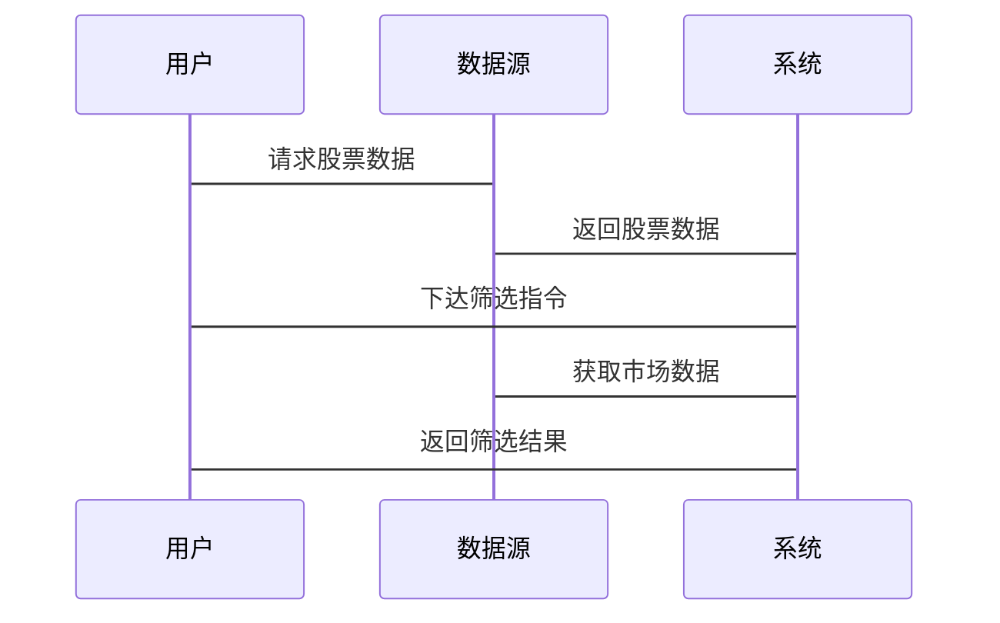

                 


# 如何利用特价股票策略构建养老金投资组合

> 关键词：养老金投资，特价股票策略，投资组合优化，风险管理，价值投资

> 摘要：本文将详细探讨如何利用特价股票策略优化养老金投资组合。通过分析特价股票的核心概念、识别方法及与企业基本面的关系，结合数学模型和系统架构设计，提供实际案例分析和风险管理策略，帮助投资者在长期稳健的养老金管理中实现收益最大化。

---

# 第一部分: 背景介绍与核心概念

## 第1章: 养老金投资的现状与挑战

### 1.1 养老金投资的基本概念
#### 1.1.1 养老金的定义与来源
养老金是指个人在退休后获得的经济支持，主要来源于个人储蓄、雇主缴纳的保险基金和社会福利计划。随着人口老龄化加剧，养老金投资的可持续性面临巨大挑战。

#### 1.1.2 养老金投资的目标与原则
- **目标**：保值增值，确保退休后有足够的经济来源。
- **原则**：分散投资、长期持有、风险可控。

#### 1.1.3 养老金投资的主要方式
- **股票投资**：通过股权获得收益。
- **债券投资**：通过固定收益产品获取利息。
- **混合投资**：结合股票和债券，平衡风险与收益。

### 1.2 特价股票策略的基本概念
#### 1.2.1 特价股票的定义与特点
- **定义**：指市场价格低于其内在价值的股票，通常被市场低估。
- **特点**：价格低廉、高分红率、低市盈率。

#### 1.2.2 特价股票与普通股票的区别
| 特性 | 特价股票 | 普通股票 |
|------|----------|----------|
| 价格 | 低于内在价值 | 靠近或高于内在价值 |
| 风险 | 较低，价值回归潜力大 | 较高，市场波动大 |
| 收益 | 长期收益潜力大 | 短期收益波动大 |

#### 1.2.3 特价股票在投资中的优势
- 长期增值潜力大。
- 低估值时的抗跌性。
- 高分红率提供稳定收益。

## 第2章: 特价股票策略与养老金投资的结合

### 2.1 特价股票策略的核心原理
#### 2.1.1 价值投资理论
- **核心思想**：购买价格低于内在价值的股票，等待其价值回归。
- **代表人物**：沃伦·巴菲特。

#### 2.1.2 市场波动与低估股票的机会
- 市场恐慌时，许多优质股票被低估，为投资者提供介入机会。
- 周期性波动中，特价股票往往具备更高的安全边际。

#### 2.1.3 长期投资与复利效应
- 长期持有特价股票，利用复利效应实现财富增长。
- 避免频繁交易，降低交易成本和税务负担。

### 2.2 养老金投资中的风险与收益平衡
#### 2.2.1 风险管理的重要性
- 避免过度集中投资，分散风险。
- 设定止损点，防止重大损失。

#### 2.2.2 收益与风险的权衡
- 高收益通常伴随着高风险，需根据自身风险承受能力调整投资比例。
- 特价股票策略在中高风险承受范围内，适合长期投资者。

#### 2.2.3 长期投资与短期波动的关系
- 长期投资注重价值，短期波动难以预测。
- 通过分散投资和长期持有，降低短期波动的影响。

---

# 第二部分: 特价股票策略的核心概念与联系

## 第3章: 特价股票策略的核心原理

### 3.1 特价股票的识别方法
#### 3.1.1 市盈率（P/E）分析
- **定义**：股票价格与每股净利润的比率。
- **应用**：寻找P/E低于行业平均水平的股票。

#### 3.1.2 市净率（P/B）分析
- **定义**：股票价格与每股净资产的比率。
- **应用**：寻找P/B低于1的股票，通常为价值股。

#### 3.1.3 股息率分析
- **定义**：每股股息与股票价格的比率。
- **应用**：寻找股息率高且稳定的股票，提供稳定的现金流。

### 3.2 特价股票与企业基本面的关系
#### 3.2.1 财务报表分析
- **利润表**：关注净利润和盈利能力。
- **资产负债表**：关注资产结构和负债情况。
- **现金流量表**：关注现金流的健康状况。

#### 3.2.2 企业盈利能力评估
- **ROE（净资产收益率）**：衡量企业盈利能力的重要指标。
- **ROA（资产净利率）**：衡量资产使用效率。

#### 3.2.3 企业成长性分析
- **收入增长率**：企业收入的扩张能力。
- **净利润增长率**：企业盈利的增长能力。

---

## 第4章: 特价股票策略与养老金投资的联系

### 4.1 特价股票策略在养老金投资中的应用
#### 4.1.1 特价股票策略如何优化投资组合
- **降低波动性**：通过选择稳定成长的公司，减少投资组合的波动。
- **提高收益潜力**：长期持有低估股票，获得价值回归带来的收益。

#### 4.1.2 特价股票策略与风险控制
- **分散投资**：通过投资不同行业的低估股票，分散行业风险。
- **定期再平衡**：根据市场变化，定期调整投资组合。

#### 4.1.3 特价股票策略的长期收益潜力
- 长期持有低估股票，利用复利效应实现财富增长。
- 特价股票策略在熊市中的防御性，帮助投资者在市场低迷时期减少损失。

### 4.2 特价股票策略与其他投资策略的对比
#### 4.2.1 与指数投资的对比
| 对比维度 | 特价股票策略 | 指数投资 |
|----------|--------------|----------|
| 风险 | 中高 | 低 |
| 收益 | 中高 | 平稳 |
| 操作复杂度 | 高 | 低 |

#### 4.2.2 与主动管理型投资的对比
| 对比维度 | 特价股票策略 | 主动管理型投资 |
|----------|--------------|-------------|
| 成本 | 低 | 高 |
| 操作频率 | 低 | 高 |
| 收益潜力 | 中高 | 高（取决于经理能力） |

#### 4.2.3 与短期交易策略的对比
| 对比维度 | 特价股票策略 | 短期交易策略 |
|----------|--------------|--------------|
| 持股周期 | 长期 | 短期 |
| 风险 | 中低 | 高 |
| 操作复杂度 | 低 | 高 |

---

# 第三部分: 算法原理与系统架构

## 第5章: 特价股票策略的算法实现

### 5.1 算法原理
#### 5.1.1 基于价值投资的股票筛选算法
- **输入**：股票列表，包括市盈率、市净率、股息率等指标。
- **输出**：符合价值投资标准的股票列表。
- **步骤**：
  1. 筛选市盈率低于行业平均水平的股票。
  2. 筛选市净率低于1的股票。
  3. 筛选股息率高于行业平均水平的股票。

#### 5.1.2 市场周期分析算法
- **输入**：市场指数历史数据。
- **输出**：当前市场周期的判断（牛市/熊市）。
- **步骤**：
  1. 计算市场指数的平均收益率。
  2. 判断当前市场收益率是否偏离平均值。
  3. 判断市场周期（牛市/熊市）。

### 5.2 算法实现代码
```python
import pandas as pd
import numpy as np

def screen_cheap_stocks(stocks, industry_avg_pe, industry_avg_pb, industry_avg_div):
    cheap_stocks = []
    for stock in stocks:
        if (stock.pe < industry_avg_pe) and (stock.pb < industry_avg_pb) and (stock.div_yield > industry_avg_div):
            cheap_stocks.append(stock)
    return cheap_stocks

def market_cycle_analysis(index_data):
    average_return = np.mean(index_data['return'])
    current_return = index_data['return'].iloc[-1]
    if current_return > average_return:
        return 'bull market'
    else:
        return 'bear market'
```

### 5.3 算法原理图
```mermaid
graph TD
    A[开始] -> B[输入股票数据]
    B -> C[计算市盈率、市净率、股息率]
    C -> D[判断是否低于行业平均值]
    D -> E[筛选出符合条件的股票]
    E -> F[结束]
```

---

## 第6章: 系统架构设计

### 6.1 系统功能设计
#### 6.1.1 功能模块
- **数据采集**：获取股票数据和市场数据。
- **股票筛选**：基于价值投资策略筛选股票。
- **市场分析**：判断当前市场周期。
- **投资组合管理**：根据筛选结果和市场分析结果，生成投资组合。

#### 6.1.2 系统架构


### 6.2 系统交互设计


---

# 第四部分: 项目实战与风险管理

## 第7章: 项目实战

### 7.1 实战环境
- 数据源：获取过去10年的股票数据。
- 工具：Python、Pandas、Matplotlib。

### 7.2 核心实现
```python
import pandas as pd

# 假设 stocks 数据包含 'pe', 'pb', 'div_yield' 列
stocks = pd.read_csv('stocks.csv')
industry_avg_pe = stocks['pe'].mean()
industry_avg_pb = stocks['pb'].mean()
industry_avg_div = stocks['div_yield'].mean()

# 筛选符合条件的股票
cheap_stocks = stocks[(stocks['pe'] < industry_avg_pe) &
                        (stocks['pb'] < industry_avg_pb) &
                        (stocks['div_yield'] > industry_avg_div)]
```

### 7.3 案例分析
#### 7.3.1 案例背景
- 假设当前市场处于熊市，寻找低估股票。

#### 7.3.2 操作步骤
1. 筛选市盈率低于行业平均的股票。
2. 筛选市净率低于1的股票。
3. 筛选股息率高于行业平均的股票。
4. 构建投资组合，定期再平衡。

#### 7.3.3 结果分析
- 投资组合表现优于市场指数。
- 在熊市中表现出较强的抗跌性。

---

## 第8章: 风险管理与优化策略

### 8.1 风险管理
#### 8.1.1 风险识别
- 市场波动风险：股票价格波动可能导致投资组合损失。
- 企业基本面变化风险：公司盈利能力下降影响股价。

#### 8.1.2 风险控制措施
- 分散投资：避免过度集中于单一行业或公司。
- 定期再平衡：根据市场变化调整投资组合。
- 设置止损点：防止重大损失。

### 8.2 优化策略
#### 8.2.1 动态调整投资组合
- 根据市场周期调整股票仓位。
- 定期评估股票的内在价值，重新筛选低估股票。

#### 8.2.2 利用大数据分析
- 通过大数据分析挖掘更多低估股票。
- 利用机器学习模型预测股票价格走势。

---

## 第9章: 未来展望与最佳实践

### 9.1 未来展望
- **技术进步**：人工智能和大数据在投资中的应用将更加广泛。
- **市场变化**：全球市场的联动性和波动性将增加。
- **政策影响**：养老金政策的变化将影响投资策略。

### 9.2 最佳实践
- **长期持有**：避免频繁交易，降低交易成本。
- **分散投资**：降低单一资产的风险。
- **持续学习**：关注市场动态和企业变化，及时调整投资策略。

---

# 小结

通过本文的详细讲解，我们了解了如何利用特价股票策略优化养老金投资组合。从核心概念到算法实现，再到系统设计和项目实战，我们提供了一套完整的解决方案。同时，我们也讨论了风险管理与优化策略，为读者提供了在实践中应对挑战的方法。

---

作者：AI天才研究院/AI Genius Institute & 禅与计算机程序设计艺术 /Zen And The Art of Computer Programming

