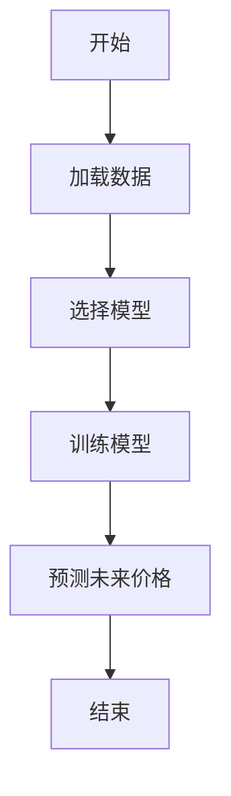
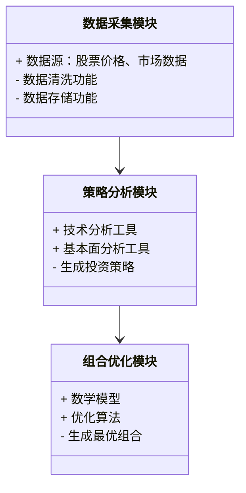
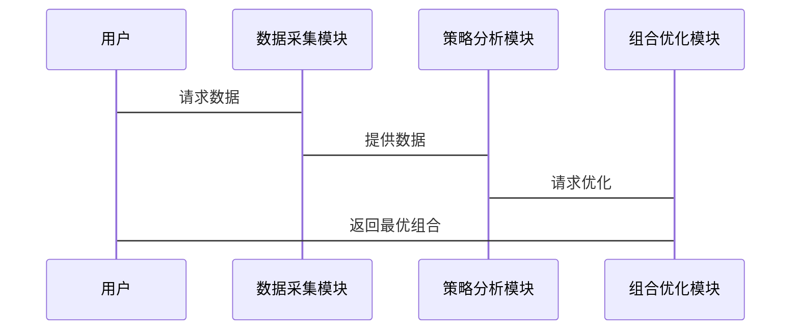

                 


# 如何利用特价股票策略构建多元资产对冲组合

---

## 关键词：特价股票、对冲组合、资产配置、风险控制、量化投资

---

## 摘要：  
本文详细探讨了如何利用特价股票策略构建多元资产对冲组合。首先介绍了特价股票的基本概念和市场特点，然后分析了对冲策略的核心思想及其在资产配置中的作用。接着，从数学模型和算法的角度，详细讲解了特价股票策略的实现方法，并结合实际案例展示了如何设计和优化对冲组合。最后，总结了构建多元资产对冲组合的关键要点和最佳实践。

---

## 第1章: 特价股票策略概述

### 1.1 特价股票的基本概念

#### 1.1.1 什么是特价股票  
特价股票是指在特定市场条件下，价格远低于其内在价值的股票。这类股票通常具有较高的潜在回报，但同时也伴随着较高的风险。特价股票的出现往往与市场波动、公司基本面变化或市场情绪等因素有关。

#### 1.1.2 特价股票的市场特点  
- **低估值**：特价股票的市场价格通常低于其账面价值或内在价值。  
- **高波动性**：特价股票的价格波动较大，既有上涨的潜力，也有可能进一步下跌。  
- **风险较高**：由于价格低廉，投资者可能会误判其价值，导致潜在损失。  

#### 1.1.3 特价股票与普通股票的区别  
- **风险**：特价股票的风险较高，而普通股票的风险相对较低。  
- **回报潜力**：特价股票的回报潜力较大，而普通股票的回报较为稳定。  
- **市场定位**：特价股票通常出现在市场低迷或公司基本面较差的时期，而普通股票则分布在不同市场环境下。  

### 1.2 特价股票策略的背景与应用

#### 1.2.1 特价股票策略的起源  
特价股票策略起源于价值投资理论，强调以低于内在价值的价格买入股票，等待其价值回归。这种策略在市场低迷或公司遇到短期困难时尤为有效。

#### 1.2.2 特价股票在投资组合中的作用  
- **分散风险**：通过买入特价股票，投资者可以在市场下跌时获得相对较高的回报。  
- **提高收益**：特价股票的高波动性可能带来超额收益。  
- **对冲风险**：在对冲组合中，特价股票可以用来抵消其他资产的下行风险。  

#### 1.2.3 特价股票策略的适用场景  
- **市场低迷**：在市场整体下跌时，买入特价股票可以抓住反弹机会。  
- **公司困境**：当公司面临短期困难但具有长期价值时，特价股票可能是一个好的投资标的。  
- **套利机会**：通过发现市场中的套利机会，投资者可以利用特价股票策略获利。  

### 1.3 特价股票策略的核心要素

#### 1.3.1 价格波动分析  
价格波动是特价股票策略的核心，投资者需要分析股票的历史波动性和未来波动趋势，以判断其潜在的收益和风险。

#### 1.3.2 市场情绪的影响  
市场情绪对特价股票的影响较大，投资者需要通过技术分析和市场情绪指标来判断市场的买卖信号。

#### 1.3.3 交易策略的选择  
投资者需要根据市场环境和个人风险偏好选择适合的交易策略，如价值投资、趋势跟踪或套利策略。

### 1.4 本章小结  
本章详细介绍了特价股票的基本概念、市场特点及其在投资组合中的作用。通过分析特价股票策略的核心要素，读者可以更好地理解如何在实际投资中应用这种策略。

---

## 第2章: 多元资产对冲组合的构建

### 2.1 多元资产配置的重要性

#### 2.1.1 多元化投资的基本概念  
多元化投资是指将资金分配到不同资产类别、行业或地区，以降低投资组合的整体风险。

#### 2.1.2 多元化与风险控制的关系  
多元化投资通过分散投资来降低特定资产或市场的风险，从而提高投资组合的稳定性。

#### 2.1.3 多元资产配置的优缺点  
- **优点**：风险分散、收益稳定。  
- **缺点**：可能需要更多的时间和资源来管理和监控不同资产。  

### 2.2 对冲策略的核心思想

#### 2.2.1 对冲的基本定义  
对冲是指通过买入和卖出相关资产来抵消市场风险，从而锁定部分或全部的市场波动。

#### 2.2.2 对冲在资产配置中的作用  
对冲策略可以帮助投资者在市场下跌时保护投资组合，同时在市场上涨时获得超额收益。

#### 2.2.3 对冲策略的分类与选择  
- **完全对冲**：通过完全抵消市场风险来锁定收益。  
- **部分对冲**：通过部分抵消市场风险来提高收益。  
- **动态对冲**：根据市场变化动态调整对冲比例。  

### 2.3 特价股票在对冲组合中的应用

#### 2.3.1 特价股票作为对冲工具的优势  
- **高杠杆效应**：特价股票的高波动性使其具有较高的杠杆效应。  
- **低相关性**：特价股票与其他资产的相关性较低，有助于分散风险。  

#### 2.3.2 特价股票与其他资产的配比  
投资者可以根据市场环境和个人风险偏好选择合适的配比，如将特价股票与其他固定收益资产或商品资产进行配比。

#### 2.3.3 对冲组合的风险管理  
- **风险分散**：通过多样化投资降低特定资产的风险。  
- **动态调整**：根据市场变化及时调整对冲比例和资产配比。  

### 2.4 本章小结  
本章详细探讨了多元资产对冲组合的构建方法，分析了特价股票在对冲组合中的应用及其优势。通过合理配置不同资产，投资者可以在不同市场环境下实现风险控制和收益最大化。

---

## 第3章: 特价股票策略的数学模型与算法

### 3.1 特价股票策略的数学模型

#### 3.1.1 时间序列分析  
时间序列分析是一种通过分析历史数据来预测未来趋势的方法。常用模型包括ARIMA和GARCH模型。

#### 3.1.2 随机游走模型  
随机游走模型假设股票价格的变化是随机的，无法通过技术分析预测未来价格。

#### 3.1.3 马尔可夫链模型  
马尔可夫链模型用于分析股票价格的状态转移，帮助投资者识别市场趋势的变化。

### 3.2 对冲组合的优化模型

#### 3.2.1 均值-方差优化模型  
均值-方差优化模型通过最小化投资组合的方差来实现风险最小化，同时考虑收益最大化。

#### 3.2.2 风险中性组合模型  
风险中性组合模型通过调整资产配比，使投资组合的风险与市场一致，从而实现超额收益。

#### 3.2.3 距离最小化模型  
距离最小化模型通过最小化投资组合与目标组合的距离来实现最优配置。

### 3.3 算法实现与代码示例

#### 3.3.1 时间序列分析的Python代码  
```python
import pandas as pd
import numpy as np
from statsmodels.tsa.arima.model import ARIMA

# 假设我们有一个股票价格数据集
data = pd.read_csv('stock_prices.csv')
data['date'] = pd.to_datetime(data['date'])
data.set_index('date', inplace=True)

# 使用ARIMA模型进行预测
model = ARIMA(data['price'], order=(1, 1, 1))
model_fit = model.fit()

# 预测未来的价格
future_dates = pd.date_range('2024-01-01', periods=10)
forecast = model_fit.forecast(steps=10)
print(forecast)
```

#### 3.3.2 对冲组合优化的数学公式  
$$ \text{目标函数} = \min \sum_{i=1}^{n} w_i^2 $$
$$ \text{约束条件} = \sum_{i=1}^{n} w_i = 1 $$

其中，$w_i$ 是第 $i$ 个资产的权重。

#### 3.3.3 算法流程图（使用 mermaid）  


### 3.4 本章小结  
本章通过数学模型和算法详细讲解了特价股票策略的实现方法，包括时间序列分析、对冲组合优化模型以及具体的代码实现。这些模型和算法为投资者提供了科学的决策依据。

---

## 第4章: 系统分析与架构设计

### 4.1 对冲系统的设计与实现

#### 4.1.1 系统功能模块划分  
- **数据采集模块**：负责采集股票价格、市场数据等信息。  
- **策略分析模块**：对数据进行分析，生成投资策略。  
- **组合优化模块**：根据分析结果优化投资组合。  

#### 4.1.2 系统架构设计  


#### 4.1.3 系统接口设计  
- **数据接口**：定义数据格式和接口协议。  
- **策略接口**：定义策略的输入输出格式。  
- **输出接口**：定义输出结果的格式。  

#### 4.1.4 系统交互流程图  


### 4.2 本章小结  
本章通过系统分析与架构设计，详细描述了对冲系统的功能模块、架构设计和接口设计。通过清晰的模块划分和系统交互图，读者可以更好地理解系统的整体结构和运行流程。

---

## 作者：AI天才研究院/AI Genius Institute & 禅与计算机程序设计艺术 /Zen And The Art of Computer Programming

