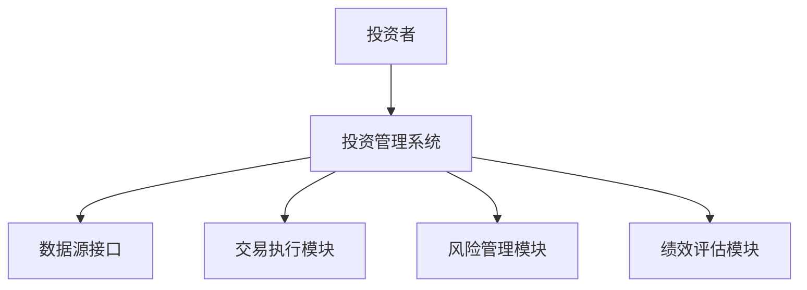
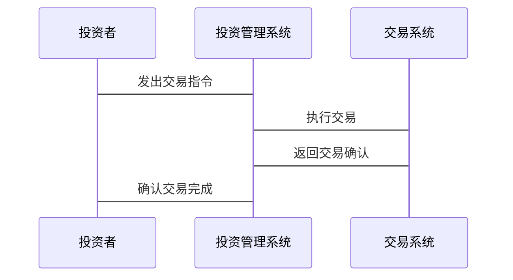
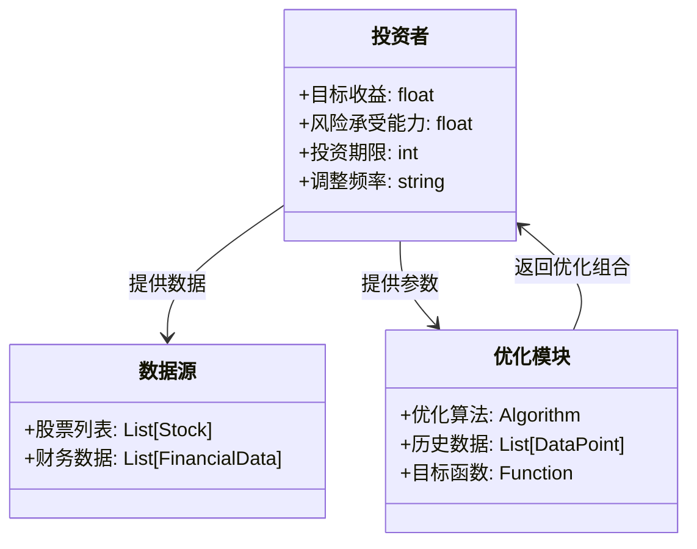
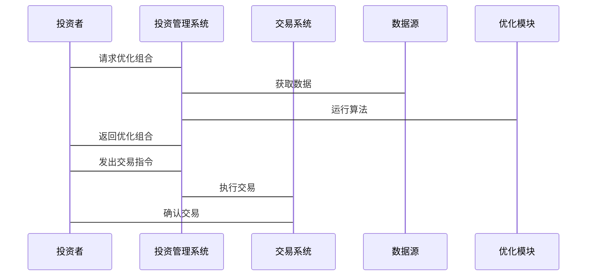

                 


# 如何利用特价股票策略构建跨周期资产配置组合

> 关键词：特价股票策略、资产配置、市场周期、投资组合、风险管理

> 摘要：本文将详细探讨如何利用特价股票策略构建跨周期的资产配置组合。通过分析市场周期、识别特价股票、优化投资组合、量化分析及系统设计，为投资者提供一套科学的投资策略。结合数学模型和实际案例，本文将帮助投资者在不同市场环境下，实现稳健的资产配置。

---

## 第一部分: 特价股票策略的背景与基础

### 第1章: 特价股票策略概述

#### 1.1 特价股票的定义与特点

##### 1.1.1 特价股票的定义
特价股票是指在市场低迷或股票价格被低估时，以低于其内在价值的价格买入的股票。这类股票通常具有较高的安全边际，能够在市场复苏时带来超额收益。

##### 1.1.2 特价股票的核心特点
- **低估值**：市盈率（P/E）或市净率（P/B）低于行业平均水平。
- **高股息率**：部分特价股票提供较高的股息回报。
- **优质公司**：通常为行业龙头或具有强大竞争优势的公司。

##### 1.1.3 特价股票与普通股票的区别
| 特性 | 特价股票 | 普通股票 |
|------|----------|----------|
| 估值 | 低       | 市场价   |
| 风险 | 较低     | 较高     |
| 收益 | 有望翻倍 | 随市场波动 |

#### 1.2 市场周期与资产配置

##### 1.2.1 市场周期的基本概念
市场周期包括牛市、熊市和震荡市三种状态，投资者需根据周期调整资产配置。

##### 1.2.2 不同周期下的投资策略
- **牛市**：增加权益资产配置。
- **熊市**：寻找特价股票，增加防御性资产。
- **震荡市**：平衡资产配置，减少波动性资产。

##### 1.2.3 资产配置的基本原理
资产配置是将资金分配到不同资产类别（股票、债券、现金等），以分散风险并优化收益。

#### 1.3 特价股票策略的有效性

##### 1.3.1 特价股票策略的理论基础
基于价值投资理念，巴菲特定律：价格低于内在价值时买入，高于时卖出。

##### 1.3.2 理论与实践的结合
通过历史数据分析，特价股票策略在长周期内表现优于市场平均水平。

##### 1.3.3 策略的优缺点分析
- **优点**：风险低、收益稳定。
- **缺点**：需要较长持有时间，期间可能面临市场波动。

---

### 第2章: 特价股票策略的核心概念

#### 2.1 特价股票的识别与筛选

##### 2.1.1 特价股票的筛选标准
- **低市盈率**：P/E < 行业平均值。
- **低市净率**：P/B < 2。
- **高ROE**：净资产收益率 > 10%。

##### 2.1.2 市盈率与市净率的分析
市盈率（P/E）= 股价 / 每股收益  
市净率（P/B）= 股价 / 每股净资产  

##### 2.1.3 财务指标的评估方法
- 利润表：关注收入和利润增长。
- 资产负债表：关注资产负债结构。
- 现金流量表：关注现金流健康。

#### 2.2 投资组合的构建与优化

##### 2.2.1 投资组合的基本构成
- 确定投资目标和风险承受能力。
- 分配资产比例：如股票、债券、现金。
- 定期调整组合以适应市场变化。

#### 2.3 市场周期与投资机会

##### 2.3.1 牛市、熊市与震荡市的区别
- **牛市**：市场上涨，风险低。
- **熊市**：市场下跌，风险高。
- **震荡市**：市场波动大，风险中等。

##### 2.3.2 不同周期下的投资机会
- **牛市**：增加股票配置。
- **熊市**：寻找特价股票。
- **震荡市**：平衡资产配置。

##### 2.3.3 周期性波动对资产配置的影响
通过动态调整资产配置，降低市场波动对组合的影响。

---

## 第二部分: 特价股票策略的核心原理

### 第3章: 特价股票策略的数学模型与量化分析

#### 3.1 股票估值的数学模型

##### 3.1.1 市盈率模型
$$市盈率 = \frac{股价}{每股收益}$$

##### 3.1.2 市净率模型
$$市净率 = \frac{股价}{每股净资产}$$

##### 3.1.3 内在价值模型
$$内在价值 = \sum_{t=1}^{\infty} \frac{现金流}{(1 + r)^t}$$

#### 3.2 投资组合优化的数学模型

##### 3.2.1 均值-方差优化模型
$$\min_w \sigma^2(w) \quad \text{subject to} \quad w^T \mu = r, \quad w^T 1 = 1$$

##### 3.2.2 风险调整后的收益优化
$$夏普比率 = \frac{E[r - r_f]}{\sigma}$$

#### 3.3 技术分析与量化策略

##### 3.3.1 移动平均线策略
$$MA_n = \frac{1}{n} \sum_{i=1}^n P_i$$

##### 3.3.2 相对强弱指数策略
$$RSI = \frac{100 \times (N - D)}{N}$$

### 第4章: 特价股票策略的系统设计

#### 4.1 系统架构设计

##### 4.1.1 系统架构图


##### 4.1.2 数据源接口
- 数据源：股票数据（K线数据、财务数据）。
- 数据接口：API接口实现数据获取。

##### 4.1.3 交易流程图


#### 4.2 系统功能设计

##### 4.2.1 投资组合优化模块


#### 4.3 系统接口设计

##### 4.3.1 数据接口
- API接口：用于获取股票数据。
- 数据格式：JSON或CSV。

##### 4.3.2 交易接口
- API接口：用于执行交易指令。
- 返回值：交易确认信息。

#### 4.4 系统交互设计

##### 4.4.1 交易流程


---

## 第三部分: 特价股票策略的项目实战

### 第5章: 特价股票策略的环境搭建与核心代码实现

#### 5.1 环境搭建

##### 5.1.1 安装必要的工具
- Python 3.x
- Jupyter Notebook
- pandas, numpy, matplotlib

#### 5.2 核心代码实现

##### 5.2.1 特价股票筛选代码
```python
import pandas as pd
import numpy as np

def screen_penny_stocks(data, threshold_pe=15, threshold_pb=2):
    # 筛选市盈率低于阈值的股票
    low_pe = data[data['PE'] < threshold_pe]
    # 筛选市净率低于阈值的股票
    low_pb = low_pe[low_pe['PB'] < threshold_pb]
    return low_pb

# 示例数据
data = {
    'PE': [10, 18, 12, 25],
    'PB': [1.5, 2.5, 1.8, 3]
}
df = pd.DataFrame(data)
result = screen_penny_stocks(df)
print(result)
```

##### 5.2.2 投资组合优化代码
```python
import numpy as np

def optimize_portfolio(returns, weights=None):
    n = len(returns)
    if weights is None:
        weights = np.ones(n) / n
    # 计算收益和风险
    portfolio_return = np.sum(returns * weights)
    portfolio_variance = np.sum(weights**2 * returns.var())
    return portfolio_return, portfolio_variance

returns = [0.1, 0.05, 0.15, 0.08]
opt_return, opt_variance = optimize_portfolio(returns)
print(f"最优收益: {opt_return}, 最优方差: {opt_variance}")
```

---

## 第四部分: 特价股票策略的最佳实践与小结

### 第6章: 特价股票策略的最佳实践

#### 6.1 策略总结

##### 6.1.1 策略的核心思想
- 识别市场低估的股票。
- 在市场低点买入，高点卖出。

##### 6.1.2 策略的注意事项
- 风险管理：设置止损点。
- 时间选择：长期持有策略。

#### 6.2 心理与行为建议

##### 6.2.1 风险管理
- 设置止损和止盈点。
- 分批建仓，避免一次性投入。

##### 6.2.2 投资者心理
- 避免情绪化交易。
- 保持耐心，长期持有。

#### 6.3 实战中的注意事项

##### 6.3.1 数据质量
- 确保数据来源可靠。
- 定期更新数据。

##### 6.3.2 系统维护
- 定期检查系统运行状态。
- 更新优化算法。

#### 6.4 拓展阅读

##### 6.4.1 推荐书籍
- 《股票作手回忆录》
- 《投资学精要》

##### 6.4.2 推荐博客与资源
- 价值投资论坛
- 数据分析社区

---

## 作者

作者：AI天才研究院/AI Genius Institute & 禅与计算机程序设计艺术/Zen And The Art of Computer Programming

---

通过以上详细的内容，投资者可以系统地了解如何利用特价股票策略构建跨周期的资产配置组合，从理论到实践，全面掌握这一投资策略的核心思想和操作方法。

