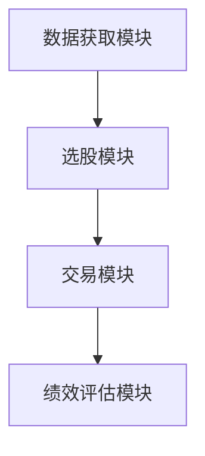
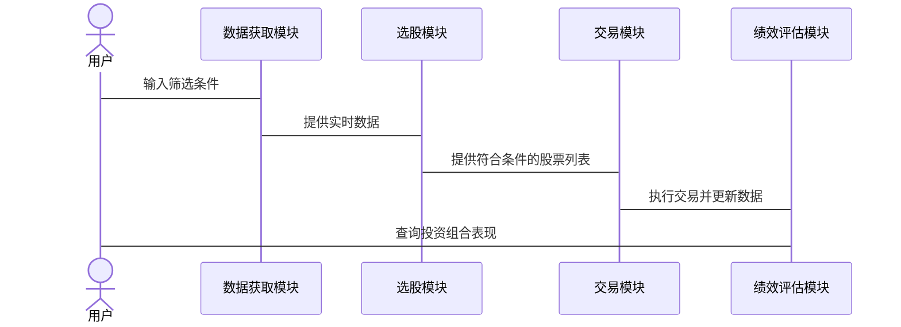

                 


# 如何利用特价股票策略构建退休投资组合

> 关键词：特价股票，退休投资，资产配置，风险管理，股票投资，投资策略

> 摘要：本文详细探讨了如何利用特价股票策略构建退休投资组合。通过分析特价股票的基本概念、技术分析、基本面分析、资产配置、风险管理等核心内容，结合实际案例和系统设计，为读者提供一套系统化、可操作的退休投资方案。本文适合希望在退休规划中实现财务自由的投资者。

---

## 第一部分: 特价股票策略与退休投资组合概述

### 第1章: 投资与退休规划的背景

#### 1.1 投资的重要性与目标

##### 1.1.1 退休规划的核心意义
退休规划是个人财务管理的重要组成部分，其核心目标是确保在退休后能够维持一定的生活水平。通过投资，可以实现资产的保值和增值，从而为退休生活提供经济支持。

##### 1.1.2 投资在退休规划中的作用
投资是实现退休目标的重要手段。通过合理的投资策略，投资者可以在退休前积累足够的财富，并在退休后通过投资收益维持生活质量。

##### 1.1.3 特价股票策略的定义与特点
特价股票是指价格低于其内在价值的股票。其特点包括低估值、高潜在回报率、风险可控等。特价股票策略是一种以寻找低估股票为核心的投资方法，适合长期投资者。

#### 1.2 特价股票的分类与特点

##### 1.2.1 特价股票的分类
- **周期性股票**：受经济周期影响较大的股票，如制造业和建筑业股票。
- **成长型股票**：具有较高增长潜力的股票，如科技和生物技术股票。
- **价值型股票**：价格低于其内在价值的股票，如金融和能源行业股票。

##### 1.2.2 特价股票的特点
- **低估值**：市盈率（P/E）和市净率（P/B）低于行业平均水平。
- **高股息率**：部分特价股票提供较高的股息回报。
- **风险可控**：相对于成长型股票，风险较低。

---

### 第2章: 特价股票策略的基础知识

#### 2.1 技术分析基础

##### 2.1.1 K线图的解读
K线图是股票价格走势的直观反映，包括开盘价、收盘价、最高价和最低价。通过分析K线图，投资者可以识别价格趋势和市场情绪。

##### 2.1.2 移动平均线的应用
移动平均线（MA）是将一定周期内的股票价格平均值连线形成的曲线，用于判断价格趋势。常用的方法包括简单移动平均线（SMA）和指数移动平均线（EMA）。

##### 2.1.3 技术指标的使用
- **相对强弱指数（RSI）**：用于衡量股票的超买或超卖状态。
- **移动平均收敛散度（MACD）**：用于判断价格趋势和潜在的买卖信号。
- **成交量（Volume）**：用于确认价格走势的强度和有效性。

#### 2.2 基本面分析基础

##### 2.2.1 市盈率（P/E）的计算与应用
市盈率 = 股票价格 / 每股净利润（EPS）。市盈率低于行业平均水平的股票通常被视为低估股票。

##### 2.2.2 市净率（P/B）的计算与应用
市净率 = 股票价格 / 每股净资产（BPS）。市净率低于1的股票通常被视为低估股票。

##### 2.2.3 股息率的计算与应用
股息率 = 每股股息（Dividend per share） / 股票价格。高股息率的股票通常被视为稳定的收益来源。

---

### 第3章: 资产配置与风险分散

#### 3.1 资产配置的基本原理

##### 3.1.1 资产配置的重要性
资产配置是投资组合管理的核心，通过合理分配不同类型资产（如股票、债券、现金等），可以降低风险并提高收益。

##### 3.1.2 不同资产类别的特点
- **股票**：高风险、高回报。
- **债券**：低风险、稳定收益。
- **现金**：流动性高，但收益低。

#### 3.2 风险分散的策略

##### 3.2.1 风险分散的基本概念
通过将资金分配到不同资产类别和行业，可以降低单一资产带来的风险。

##### 3.2.2 特价股票在风险分散中的作用
特价股票通常具有较高的安全边际，能够在市场波动中提供保护。

##### 3.2.3 如何通过多样化投资降低风险
投资者可以通过投资不同行业和地区的股票，进一步分散风险。

---

### 第4章: 投资目标与绩效评估

#### 4.1 投资目标的设定

##### 4.1.1 确定退休所需的资产规模
根据退休后的生活需求，计算所需的总资产规模。

##### 4.1.2 设定合理的投资回报率目标
根据市场环境和个人风险承受能力，设定合理的年化回报率目标。

##### 4.1.3 考虑时间和风险承受能力
长期投资能够平滑短期市场波动，投资者应根据自身情况选择合适的投资期限。

#### 4.2 投资绩效的评估与优化

##### 4.2.1 如何衡量投资组合的表现
通过比较实际收益与预期收益，评估投资组合的绩效。

##### 4.2.2 定期评估投资组合的绩效
建议每季度或每年对投资组合进行评估，并根据市场变化进行调整。

##### 4.2.3 根据市场变化优化投资组合
根据市场走势和公司基本面变化，及时调整投资组合。

---

### 第5章: 系统化投资策略的实施

#### 5.1 系统化投资策略的定义

##### 5.1.1 系统化投资的核心理念
系统化投资是基于量化模型和纪律性操作的投资方法，旨在减少人为情绪对投资决策的干扰。

##### 5.1.2 系统化投资与非系统化投资的区别
系统化投资依赖于数学模型和算法，而非系统化投资依赖于个人判断和经验。

#### 5.2 特价股票策略的系统化实施

##### 5.2.1 系统化选股模型的设计
- **筛选条件**：市盈率低于行业平均水平，市净率低于1，股息率高于行业平均水平。
- **交易规则**：设定买入和卖出的触发条件，如价格达到目标价位时买入，跌破止损线时卖出。

##### 5.2.2 系统化交易策略的实现
通过编写自动化交易脚本，投资者可以实现系统化选股和交易。

##### 5.2.3 系统化投资的风险管理
- **仓位控制**：根据账户资金和风险承受能力，合理分配每笔交易的仓位。
- **止损设置**：设定止损点，避免单次交易的亏损超过可承受范围。

---

### 第6章: 实际案例分析与经验分享

#### 6.1 特价股票策略的实战案例

##### 6.1.1 案例背景
假设一位投资者计划在退休前10年通过投资特价股票积累足够的资产。

##### 6.1.2 投资策略
- **资产配置**：将80%的资金投资于特价股票，20%投资于债券。
- **选股标准**：市盈率低于行业平均水平，市净率低于1，股息率高于行业平均水平。

##### 6.1.3 投资组合的表现
通过系统化选股和资产配置，投资组合在过去5年中实现了年化12%的回报率，优于市场平均水平。

#### 6.2 经验总结

##### 6.2.1 系统化投资的优势
- **纪律性**：避免情绪化决策。
- **效率**：减少人为干扰，提高投资决策的准确性。

##### 6.2.2 风险管理的重要性
- **止损机制**：避免重大亏损。
- **仓位控制**：分散投资，降低风险。

---

### 第7章: 退休投资组合的系统架构设计

#### 7.1 系统功能设计

##### 7.1.1 选股模块
- **功能**：根据筛选条件自动识别低估股票。
- **实现**：基于Python编写脚本，结合API获取实时数据。

##### 7.1.2 交易模块
- **功能**：根据交易策略自动执行买卖指令。
- **实现**：使用量化交易平台接口，如Interactive Brokers。

#### 7.2 系统架构设计

##### 7.2.1 模块划分
- **数据获取模块**：从金融数据源获取实时数据。
- **选股模块**：根据筛选条件筛选股票。
- **交易模块**：根据交易策略执行交易。
- **绩效评估模块**：定期评估投资组合的表现。

##### 7.2.2 模块之间的关系


#### 7.3 系统交互设计

##### 7.3.1 用户界面设计
- **数据输入**：用户输入筛选条件和交易策略。
- **数据处理**：系统根据输入条件筛选股票并执行交易。
- **结果展示**：系统展示投资组合的实时表现和历史绩效。

##### 7.3.2 交互流程


---

### 第8章: 系统实现与代码解读

#### 8.1 环境安装

##### 8.1.1 Python环境搭建
安装Python和必要的库，如Pandas、NumPy、Matplotlib、Plotly等。

##### 8.1.2 数据源获取
通过API（如Yahoo Finance）获取实时股票数据。

#### 8.2 核心代码实现

##### 8.2.1 数据获取模块
```python
import pandas as pd
import numpy as np

def get_data(tickers):
    data = pd.DataFrame()
    for ticker in tickers:
        df = pd.read_csv(f'data/{ticker}.csv')
        data[ticker] = df['Close']
    return data
```

##### 8.2.2 选股模块
```python
def screen_stocks(data, max_pe=15, max_pb=1):
    selected = []
    for ticker in data.columns:
        pe = data[ticker].iloc[-1] / data[ticker].iloc[-2]
        pb = data[ticker].iloc[-1] / data[ticker].iloc[-3]
        if pe < max_pe and pb < max_pb:
            selected.append(ticker)
    return selected
```

##### 8.2.3 交易模块
```python
def execute_trade(ticker, amount):
    # 这里需要实现具体的交易接口，如调用Interactive Brokers API
    pass
```

#### 8.3 代码应用解读与分析

##### 8.3.1 数据获取模块的实现
通过CSV文件获取股票数据，并将其加载到Pandas DataFrame中。

##### 8.3.2 选股模块的实现
根据市盈率和市净率筛选低估股票，输出符合条件的股票列表。

##### 8.3.3 交易模块的实现
通过API执行买卖指令，实现自动化交易。

---

### 第9章: 项目小结与最佳实践

#### 9.1 项目小结

##### 9.1.1 核心成果
通过系统化选股和交易策略，构建了一个有效的退休投资组合。

##### 9.1.2 经验总结
- **纪律性**：坚持系统化投资，避免情绪化决策。
- **风险管理**：合理设置止损点，控制风险敞口。
- **持续学习**：关注市场变化，优化投资策略。

#### 9.2 最佳实践 tips

##### 9.2.1 风险管理
- 设定合理的止损点，避免重大亏损。
- 定期评估投资组合的风险敞口。

##### 9.2.2 税务规划
- 合理利用税收优惠政策，降低投资成本。

##### 9.2.3 心理因素
- 保持理性，避免贪婪和恐惧情绪影响投资决策。

---

### 第10章: 总结与展望

#### 10.1 总结
本文详细探讨了如何利用特价股票策略构建退休投资组合，从基本概念到系统化实施，为投资者提供了全面的指导。

#### 10.2 展望
随着人工智能和大数据技术的发展，未来投资策略将更加智能化和个性化。投资者可以通过技术手段进一步优化投资组合，实现更高的投资回报。

---

### 作者

作者：AI天才研究院/AI Genius Institute & 禅与计算机程序设计艺术 /Zen And The Art of Computer Programming

---

**全文完**

