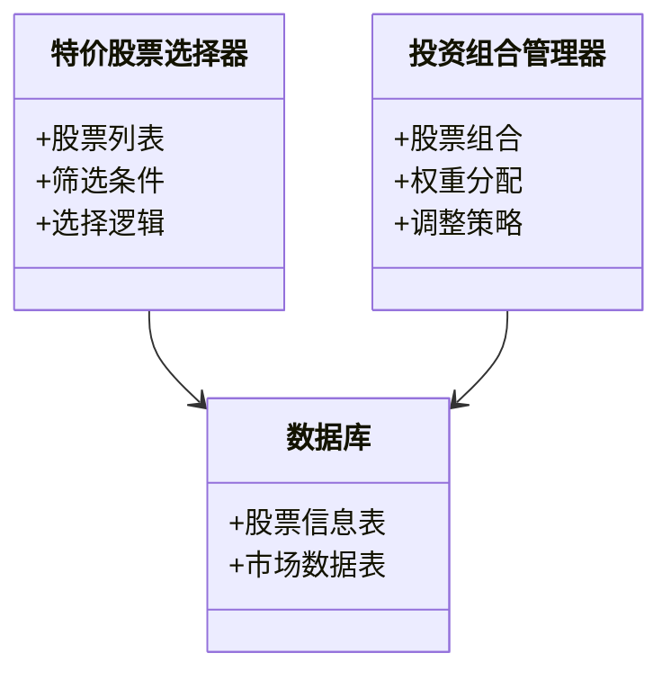
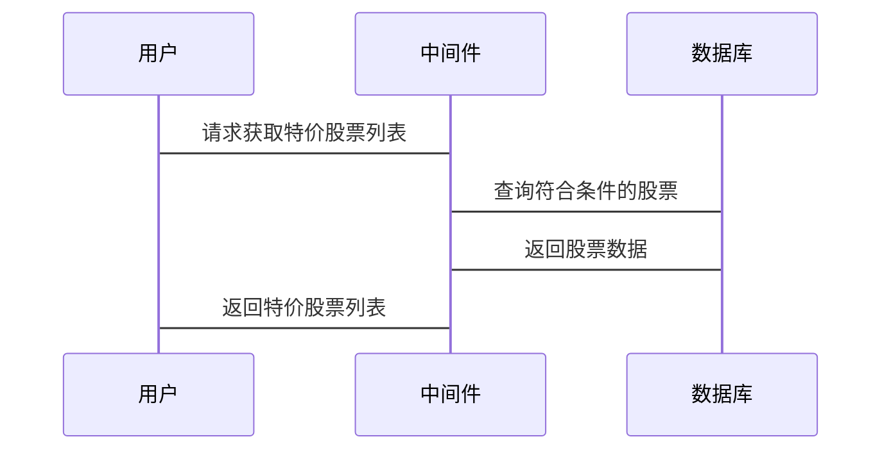

                 


# 如何利用特价股票策略构建长期价值投资组合

> 关键词：特价股票，价值投资，投资组合，股票策略，风险管理

> 摘要：本文系统地探讨了如何利用特价股票策略构建长期价值投资组合。首先介绍了特价股票的基本概念和长期价值投资的核心理念，分析了两者结合的必要性与优势。接着，详细阐述了特价股票策略的数学模型与算法原理，结合实际案例展示了如何将策略应用于投资组合管理。最后，总结了策略实施中的注意事项与最佳实践，为读者提供了一套完整的投资方法论。

---

# 第一部分: 特价股票策略与长期价值投资概述

## 第1章: 特价股票策略的基本概念

### 1.1 特价股票的定义与特点

#### 1.1.1 什么是特价股票
特价股票是指价格低于其内在价值的股票。这类股票通常被市场低估，具有较大的上涨潜力。我们可以将特价股票分为以下几类：
- **周期性特价股票**：受经济周期影响较大的股票，例如制造业和原材料行业的股票。
- **成长型特价股票**：虽然当前价格被低估，但具有较高成长潜力的股票。
- **价值型特价股票**：基本面良好，但市场价格被低估的股票。

#### 1.1.2 特价股票的类型与分类
- **低市盈率股票**：市盈率低于市场平均水平的股票。
- **低市净率股票**：市净率低于行业平均水平的股票。
- **高分红股票**：股息收益率较高的股票。

#### 1.1.3 特价股票的投资价值
特价股票的投资价值主要体现在以下几点：
1. **较高的安全边际**：价格低于内在价值，投资风险较低。
2. **潜在的上涨空间**：一旦市场重新认识到其价值，股价可能迅速回升。
3. **分散投资风险**：通过选择多个特价股票，可以降低单一股票的风险。

### 1.2 特价股票策略的背景与意义

#### 1.2.1 特价股票策略的起源与发展
价值投资理念最早由本杰明·格雷厄姆提出，他强调购买低于内在价值的股票。这一理念在后来被进一步发展，形成了现代的特价股票策略。

#### 1.2.2 特价股票策略在投资组合中的作用
特价股票策略可以帮助投资者在市场低迷时期寻找被低估的投资机会，同时在市场繁荣时期分散投资风险。

#### 1.2.3 特价股票策略的优势与局限性
- **优势**：
  1. 风险较低，适合保守型投资者。
  2. 投资回报潜力较大。
- **局限性**：
  1. 需要较长的投资周期。
  2. 需要较高的市场分析能力。

## 第2章: 长期价值投资的基本原理

### 2.1 长期价值投资的核心理念

#### 2.1.1 价值投资的定义与特点
价值投资是一种以股票的内在价值为导向的投资策略。投资者通过分析公司的基本面，寻找市场价格低于内在价值的股票。

#### 2.1.2 长期投资与短期交易的对比
- **长期投资**：
  - 投资周期长，注重公司基本面。
  - 风险较低，回报稳定。
- **短期交易**：
  - 投资周期短，注重市场波动。
  - 风险较高，回报不稳定。

#### 2.1.3 价值投资的基本原则
1. **注重公司基本面**：分析公司的财务状况、盈利能力和发展前景。
2. **安全边际**：购买价格低于内在价值的股票。
3. **长期持有**：耐心等待市场重新认识到公司价值。

### 2.2 特价股票与长期价值投资的关系

#### 2.2.1 长期投资中的特价股票选择标准
- **低市盈率**：市盈率低于行业平均水平。
- **低市净率**：市净率低于行业平均水平。
- **高分红率**：股息收益率较高。

#### 2.2.2 长期价值投资中的策略实施步骤
1. **筛选潜在股票**：根据公司基本面和市场估值筛选潜在股票。
2. **评估内在价值**：计算股票的内在价值，确定其是否被低估。
3. **构建投资组合**：根据风险承受能力和收益目标，选择合适的股票组合。
4. **长期持有**：定期跟踪股票表现，调整投资组合。

#### 2.2.3 长期价值投资中的风险管理
- **分散投资**：通过投资不同行业和不同公司的股票，降低投资风险。
- **定期调整**：根据市场变化和公司基本面，定期调整投资组合。
- **避免过度交易**：减少交易成本，保持长期持有的策略。

## 第3章: 特价股票策略与长期价值投资的结合

### 3.1 特价股票策略在长期投资中的应用

#### 3.1.1 长期投资中的特价股票选择标准
- **低市盈率**：市盈率低于市场平均水平。
- **低市净率**：市净率低于市场平均水平。
- **高分红率**：股息收益率较高。

#### 3.1.2 特价股票策略的实施步骤
1. **筛选潜在股票**：根据公司基本面和市场估值筛选潜在股票。
2. **评估内在价值**：计算股票的内在价值，确定其是否被低估。
3. **构建投资组合**：根据风险承受能力和收益目标，选择合适的股票组合。
4. **长期持有**：定期跟踪股票表现，调整投资组合。

#### 3.1.3 特价股票策略的风险管理
- **分散投资**：通过投资不同行业和不同公司的股票，降低投资风险。
- **定期调整**：根据市场变化和公司基本面，定期调整投资组合。
- **避免过度交易**：减少交易成本，保持长期持有的策略。

### 3.2 长期价值投资中的策略优化

#### 3.2.1 策略优化的基本原则
- **分散投资**：通过投资不同行业和不同公司的股票，降低投资风险。
- **定期调整**：根据市场变化和公司基本面，定期调整投资组合。
- **避免过度交易**：减少交易成本，保持长期持有的策略。

#### 3.2.2 长期价值投资中的动态调整
- **行业配置**：根据经济周期变化，动态调整行业配置。
- **个股调整**：根据公司基本面变化，动态调整个股权重。

#### 3.2.3 特价股票策略的长期效果评估
- **投资回报**：定期评估投资组合的收益和风险。
- **市场周期**：分析投资组合在不同市场周期中的表现。

---

# 第二部分: 特价股票策略的数学模型与算法原理

## 第4章: 特价股票策略的数学模型

### 4.1 特价股票选择的数学公式

#### 4.1.1 市盈率（P/E）计算公式
$$ P/E = \frac{Price}{Earnings} $$

#### 4.1.2 市净率（P/B）计算公式
$$ P/B = \frac{Price}{Book\ Value} $$

#### 4.1.3 市销率（P/S）计算公式
$$ P/S = \frac{Price}{Sales} $$

### 4.2 投资组合优化的数学模型

#### 4.2.1 马科维茨投资组合理论
$$ \text{最小方差} = \arg \min_w \left( w^T \Sigma w \right) $$

其中：
- \( w \)：投资组合权重向量。
- \( \Sigma \)：资产之间的协方差矩阵。

---

# 第三部分: 系统分析与架构设计方案

## 第5章: 投资组合管理系统设计

### 5.1 项目介绍
本项目旨在构建一个基于特价股票策略的长期价值投资组合管理系统，通过系统化的方法帮助投资者实现稳健投资。

### 5.2 系统功能设计

#### 5.2.1 领域模型（Mermaid 类图）


### 5.3 系统架构设计（Mermaid 架构图）


### 5.4 系统接口设计

#### 5.4.1 系统交互（Mermaid 序列图）


---

# 第四部分: 项目实战

## 第6章: 构建长期价值投资组合

### 6.1 环境安装
- **编程语言**：Python 3.8+
- **库的安装**：pandas, numpy, matplotlib, seaborn

### 6.2 系统核心实现源代码

#### 6.2.1 特价股票选择器实现
```python
import pandas as pd

def select_cheap_stocks(data, threshold=0.9):
    # 计算市盈率
    data['PE'] = data['Price'] / data['Earnings']
    # 计算市净率
    data['PB'] = data['Price'] / data['Book Value']
    # 筛选市盈率和市净率均低于阈值的股票
    cheap_stocks = data[(data['PE'] < threshold) & (data['PB'] < threshold)]
    return cheap_stocks
```

#### 6.2.2 投资组合管理器实现
```python
class PortfolioManager:
    def __init__(self, stocks, weights):
        self.stocks = stocks
        self.weights = weights

    def calculate_portfolio_value(self, prices):
        # 计算投资组合价值
        return (prices * self.weights).sum()

    def rebalance_portfolio(self, new_weights):
        self.weights = new_weights
```

### 6.3 代码应用解读与分析
- **数据收集**：从数据库中获取股票的基本面数据和市场数据。
- **数据处理**：计算市盈率、市净率等指标，筛选出符合条件的特价股票。
- **投资组合构建**：根据筛选结果，构建投资组合并计算其价值。

### 6.4 实际案例分析
假设我们有一个包含10只股票的投资组合，每只股票的权重相同。我们定期重新平衡投资组合，确保每只股票的权重保持一致。

---

# 第五部分: 最佳实践与总结

## 第7章: 投资策略的应用技巧

### 7.1 风险管理
- **分散投资**：通过投资不同行业和不同公司的股票，降低投资风险。
- **定期调整**：根据市场变化和公司基本面，定期调整投资组合。

### 7.2 长期投资心态
- **耐心等待**：市场可能会在短期内波动，但长期来看，价值总会回归。
- **避免频繁交易**：减少交易成本，保持长期持有的策略。

### 7.3 持续学习
- **关注市场动态**：定期关注市场变化和公司基本面。
- **学习先进理念**：不断学习价值投资的新理念和新方法。

---

# 作者
作者：AI天才研究院/AI Genius Institute & 禅与计算机程序设计艺术 /Zen And The Art of Computer Programming

---

以上是关于如何利用特价股票策略构建长期价值投资组合的完整技术博客文章。文章内容涵盖了特价股票的基本概念、长期价值投资的核心理念、数学模型与算法原理、系统分析与架构设计、项目实战以及最佳实践等多个方面，为读者提供了一套完整的投资方法论。

