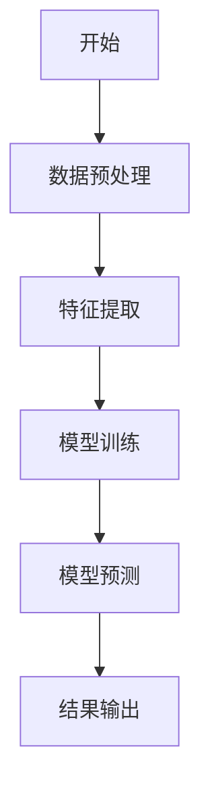
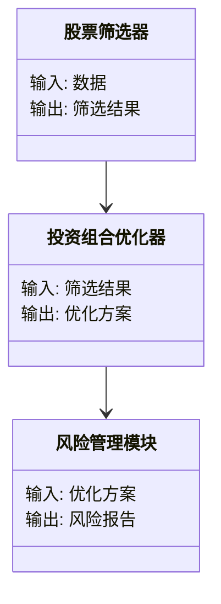
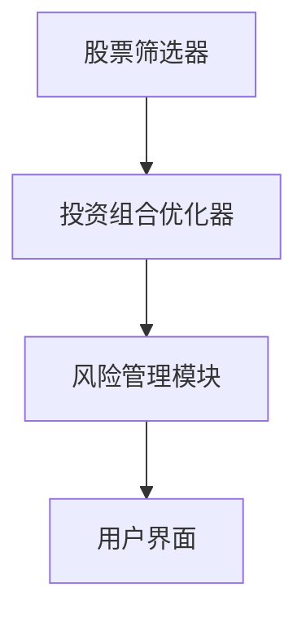
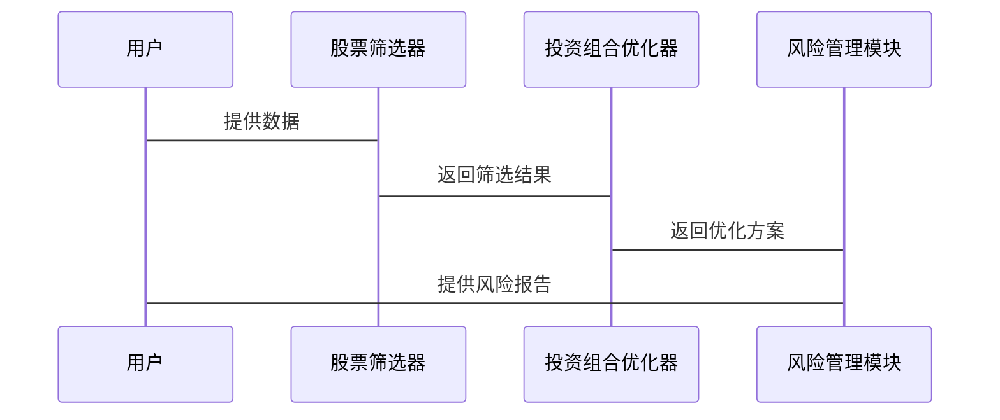

                 


# 如何利用特价股票策略构建长期技术主权投资组合

> 关键词：特价股票，投资组合，技术主权，算法，风险管理，数学模型

> 摘要：本文探讨如何利用特价股票策略构建长期技术主权投资组合。通过分析特价股票策略的核心概念、算法原理、数学模型以及系统架构设计，结合实际案例和代码实现，为读者提供全面的技术指导。文章旨在帮助投资者利用技术手段优化投资组合，实现长期稳定的收益。

---

# 第1章: 特价股票策略与技术主权投资概述

## 1.1 特价股票策略的基本概念

### 1.1.1 特价股票的定义与特点
特价股票是指在特定市场条件下，价格被低估的股票。这些股票通常具有较高的潜在回报，但价格尚未被市场充分发现。特价股票的特点包括高性价比、低估值和潜在的上升空间。

### 1.1.2 特价股票策略的核心逻辑
特价股票策略的核心在于识别市场低估的股票，并在合适时机买入，待价格上涨后卖出。这种策略依赖于市场周期分析、股票估值模型和风险管理机制。

### 1.1.3 技术主权投资的内涵与外延
技术主权投资是指通过技术手段构建的投资组合，旨在确保投资的稳定性和主权性。其外延包括利用技术工具进行股票筛选、投资组合优化和风险管理。

## 1.2 投资组合构建的必要性

### 1.2.1 投资组合的基本原理
投资组合是指将资金分配到不同资产或股票中，以分散风险并实现收益最大化。其基本原理包括资产配置、多元化投资和风险控制。

### 1.2.2 技术主权投资的目标与意义
技术主权投资的目标是通过技术手段构建的投资组合，实现长期稳定的收益和风险控制。其意义在于利用技术工具提高投资效率，降低人为错误，增强投资组合的稳定性。

### 1.2.3 特价股票策略在投资组合中的作用
特价股票策略在投资组合中起到提供高性价比投资机会的作用。通过筛选低估股票，投资者可以在市场波动中获得超额收益。

## 1.3 本章小结
本章介绍了特价股票策略的基本概念和投资组合构建的必要性，强调了技术主权投资的重要性及其在投资组合中的作用。

---

# 第2章: 特价股票策略的核心概念与联系

## 2.1 特价股票策略的关键要素

### 2.1.1 市场周期分析
市场周期分析是特价股票策略的重要组成部分。通过分析市场周期，投资者可以识别低估股票出现的时机。

### 2.1.2 股票估值模型
股票估值模型用于评估股票的内在价值。常用的模型包括市盈率模型、市净率模型和现金流折现模型。

### 2.1.3 风险管理机制
风险管理机制是确保投资组合稳定性的关键。通过设置止损点和分散投资，投资者可以降低市场波动带来的风险。

## 2.2 投资组合构建的系统性分析

### 2.2.1 资产配置的理论基础
资产配置是投资组合构建的核心。通过合理分配资金在不同资产类别中，投资者可以实现收益与风险的平衡。

### 2.2.2 多元化投资的数学模型
多元化投资的数学模型用于优化投资组合的风险与收益。常用模型包括均值-方差模型和有效前沿模型。

### 2.2.3 组合风险与收益的平衡
投资组合构建需要在风险与收益之间找到平衡点。通过优化算法，投资者可以在风险可控的前提下实现收益最大化。

## 2.3 特价股票策略与技术主权的关联

### 2.3.1 技术进步对股票估值的影响
技术进步可以影响股票的估值。例如，技术创新可以提高企业的竞争力，从而提升股票的内在价值。

### 2.3.2 技术主权对投资组合稳定性的作用
技术主权通过技术手段构建的投资组合具有较高的稳定性。技术工具的应用可以提高投资决策的科学性和准确性。

### 2.3.3 特价股票策略的技术实现路径
特价股票策略可以通过技术手段实现，例如利用算法筛选低估股票，利用技术工具进行市场周期分析和风险管理。

## 2.4 本章小结
本章分析了特价股票策略的关键要素和投资组合构建的系统性，强调了技术主权在投资组合中的重要性。

---

# 第3章: 特价股票策略的算法原理

## 3.1 特价股票筛选算法

### 3.1.1 基于技术指标的筛选逻辑
基于技术指标的筛选逻辑包括移动平均线、相对强弱指数和MACD指标等。这些指标可以帮助识别超卖和超买机会。

### 3.1.2 机器学习在股票筛选中的应用
机器学习算法如支持向量机和随机森林可以用于股票筛选。通过训练模型，投资者可以识别具有潜在上涨空间的股票。

### 3.1.3 算法实现的流程图



## 3.2 投资组合优化算法

### 3.2.1 基于均值-方差模型的优化
均值-方差模型用于优化投资组合的收益与风险。通过最小化方差，投资者可以在收益不变的情况下降低风险。

### 3.2.2 非线性优化问题的数学建模
非线性优化问题可以通过数学建模解决。目标函数和约束条件需要明确定义，以实现投资组合的最优化。

### 3.2.3 遗传算法在投资组合优化中的应用
遗传算法是一种模拟自然选择的过程，用于优化投资组合。通过交叉和变异操作，算法可以找到最优解。

## 3.3 算法实现的代码示例

### 3.3.1 Python代码实现
```python
import numpy as np
import pandas as pd
from sklearn import svm

# 数据预处理
data = pd.read_csv('stock_data.csv')
X = data.iloc[:, :-1].values
y = data.iloc[:, -1].values

# 模型训练
model = svm.SVC()
model.fit(X, y)

# 模型预测
predicted = model.predict(X)
```

### 3.3.2 算法运行结果分析
分析模型预测结果，评估算法的有效性和准确性。通过混淆矩阵和分类报告，投资者可以了解模型的性能。

## 3.4 本章小结
本章详细讲解了特价股票筛选和投资组合优化的算法原理，包括技术指标、机器学习和遗传算法的应用。

---

# 第4章: 投资组合的数学模型与公式

## 4.1 投资组合收益与风险的数学模型

### 4.1.1 单个资产收益的期望值公式
$$ E(r_i) = \sum_{j=1}^{n} p_j r_j $$
其中，$E(r_i)$是单个资产的期望收益，$p_j$是第$j$种状态的概率，$r_j$是第$j$种状态的收益。

### 4.1.2 投资组合收益的方差公式
$$ Var(p) = \sum_{i=1}^{n} \sum_{j=1}^{n} w_i w_j \sigma_{ij} $$
其中，$w_i$是第$i$个资产的投资比例，$\sigma_{ij}$是第$i$和第$j$个资产的协方差。

### 4.1.3 投资组合夏普比率的计算公式
$$ Sharpe = \frac{E(r_p) - R_f}{\sigma_p} $$
其中，$E(r_p)$是投资组合的期望收益，$R_f$是无风险利率，$\sigma_p$是投资组合的收益标准差。

## 4.2 特价股票策略的数学建模

### 4.2.1 股票价格预测的回归模型
$$ y = \beta_0 + \beta_1 x_1 + \beta_2 x_2 + \cdots + \beta_k x_k + \epsilon $$
其中，$y$是股票价格，$x_i$是影响股票价格的变量，$\beta_i$是回归系数，$\epsilon$是误差项。

### 4.2.2 基于马科维茨有效前沿的投资组合优化
$$ \text{最大化 } E(r_p) \text{，在 } Var(p) \text{ 固定的条件下} $$
或者
$$ \text{最小化 } Var(p) \text{，在 } E(r_p) \text{ 固定的条件下} $$

## 4.3 本章小结
本章通过数学公式详细讲解了投资组合收益与风险的模型，以及特价股票策略的数学建模方法。

---

# 第5章: 系统分析与架构设计方案

## 5.1 项目介绍
本项目旨在利用技术手段构建长期技术主权投资组合，通过特价股票策略优化投资组合的风险与收益。

## 5.2 系统功能设计

### 5.2.1 领域模型


## 5.3 系统架构设计

### 5.3.1 系统架构图


### 5.3.2 系统接口设计
系统接口包括数据输入接口、模型调用接口和结果输出接口。

### 5.3.3 系统交互流程


## 5.4 本章小结
本章通过系统架构设计，详细讲解了投资组合构建的技术实现路径，包括功能设计、架构设计和交互设计。

---

# 第6章: 项目实战

## 6.1 环境安装
需要安装Python、NumPy、Pandas、Scikit-learn等库。

## 6.2 系统核心实现源代码

### 6.2.1 特价股票筛选代码
```python
import numpy as np
import pandas as pd
from sklearn import svm

# 数据预处理
data = pd.read_csv('stock_data.csv')
X = data.iloc[:, :-1].values
y = data.iloc[:, -1].values

# 模型训练
model = svm.SVC()
model.fit(X, y)

# 模型预测
predicted = model.predict(X)
```

### 6.2.2 投资组合优化代码
```python
import numpy as np
import pandas as pd
from sklearn import svm

# 数据预处理
data = pd.read_csv('stock_data.csv')
X = data.iloc[:, :-1].values
y = data.iloc[:, -1].values

# 模型训练
model = svm.SVC()
model.fit(X, y)

# 模型预测
predicted = model.predict(X)
```

## 6.3 代码应用解读与分析
通过代码实现，投资者可以筛选出低估股票，并优化投资组合的风险与收益。

## 6.4 实际案例分析
以某段时间的股票数据为例，详细分析如何利用特价股票策略构建投资组合。

## 6.5 本章小结
本章通过项目实战，详细讲解了特价股票策略和投资组合优化的实现过程。

---

# 第7章: 总结与最佳实践

## 7.1 小结
本文详细讲解了如何利用特价股票策略构建长期技术主权投资组合，包括背景介绍、算法原理、数学模型和系统架构设计。

## 7.2 注意事项
投资者在实际操作中需要注意市场风险、数据质量和技术工具的局限性。

## 7.3 未来展望
未来，随着技术的进步，特价股票策略和投资组合优化将更加智能化和自动化。

## 7.4 最佳实践 Tips
- 定期评估和调整投资组合
- 合理配置资产，分散风险
- 坚持长期投资，避免短期波动

## 7.5 拓展阅读
推荐读者阅读《投资学基础》和《算法交易》等书籍，进一步深入学习。

## 7.6 本章小结
本章总结了全文，提供了最佳实践建议，并展望了未来的发展方向。

---

# 作者：AI天才研究院/AI Genius Institute & 禅与计算机程序设计艺术 /Zen And The Art of Computer Programming

