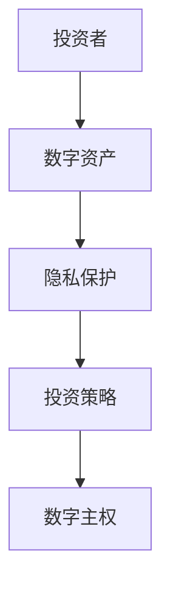
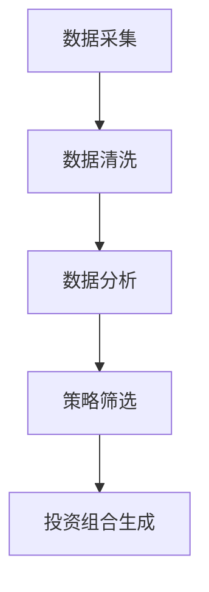
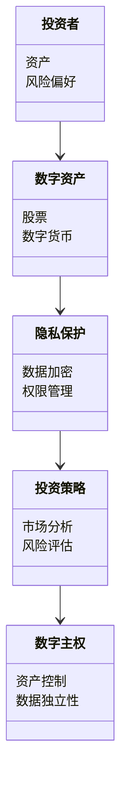
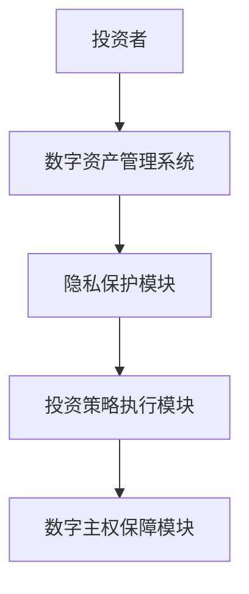
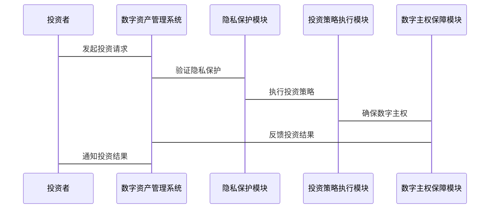

                 


# 如何利用特价股票策略构建长期数字主权与隐私保护投资组合

> 关键词：特价股票策略, 数字主权, 隐私保护, 投资组合, 算法优化

> 摘要：本文详细探讨了如何利用特价股票策略构建长期数字主权与隐私保护投资组合。通过分析特价股票策略的核心概念、算法原理、系统架构设计，结合实际案例，为读者提供从理论到实践的全面指导。文章重点介绍了如何在投资过程中保护隐私和数字主权，并提出了优化投资组合的数学模型和算法实现。

## # 第一部分: 特价股票策略与数字主权概述

## # 第1章: 特价股票策略的背景与意义

### 1.1 特价股票策略的定义与特点

#### 1.1.1 特价股票的定义
特价股票是指在特定市场周期中，价格显著低于其内在价值的股票。这些股票通常被市场低估，具有较高的上涨潜力。

#### 1.1.2 特价股票策略的核心特点
- **低估值**：利用市场低估的机会，寻找价格与价值严重不符的股票。
- **周期性**：特价股票策略依赖于市场的周期性波动，投资者需要在市场低谷时介入，在市场复苏时退出。
- **高风险**：尽管潜在回报高，但特价股票策略也伴随着较高的市场风险。

#### 1.1.3 特价股票策略的潜在优势
- **高回报潜力**：通过识别被低估的股票，投资者可以获得超额回报。
- **分散风险**：通过多样化投资，降低单一股票风险。
- **长期价值**：专注于长期价值，而非短期波动。

### 1.2 数字主权与隐私保护的背景

#### 1.2.1 数字主权的概念与内涵
数字主权是指个人或组织对其数字资产和数据的独立控制权。在数字时代，保护数字主权意味着保护个人数据不被滥用，同时确保数字资产的安全性和独立性。

#### 1.2.2 隐私保护的重要性
随着数字化的普及，个人数据被广泛收集和使用。隐私保护不仅是道德要求，更是法律义务，直接关系到个人的隐私安全和金融安全。

#### 1.2.3 数字主权与隐私保护的关联性
数字主权与隐私保护密切相关。通过保护个人隐私，投资者可以确保其数字资产的安全，同时在投资过程中维护自身的独立性和控制权。

### 1.3 特价股票策略与数字主权的结合

#### 1.3.1 特价股票策略在数字主权中的作用
通过特价股票策略，投资者可以选择那些在数字主权领域具有潜力的公司，从而间接推动数字主权的发展。

#### 1.3.2 隐私保护对投资策略的影响
隐私保护要求投资者在选择股票时，优先考虑那些注重数据安全和隐私保护的企业，从而降低投资风险。

#### 1.3.3 数字主权视角下的投资组合优化
通过数字主权的视角，投资者可以优化其投资组合，选择那些在数字资产管理和数据安全方面表现优异的公司。

## # 第2章: 特价股票策略的核心概念与联系

### 2.1 特价股票策略的核心原理

#### 2.1.1 市场周期分析
市场周期分析是特价股票策略的核心，投资者需要识别市场的低谷期，寻找被低估的股票。

#### 2.1.2 估值模型
常用的估值模型包括市盈率（P/E）和市净率（P/B）等，用于评估股票的内在价值。

#### 2.1.3 风险评估与控制
通过风险评估，投资者可以识别潜在风险，并通过多样化投资和止损策略来控制风险。

### 2.2 数字主权与隐私保护的实体关系图



### 2.3 特价股票策略的数学模型

$$
\text{投资收益} = \sum_{i=1}^{n} (p_i \times q_i) - \text{成本}
$$

其中：
- \( p_i \) 为第 \( i \) 只股票的价格
- \( q_i \) 为第 \( i \) 只股票的数量
- 成本包括交易费用和税费

## # 第3章: 特价股票策略的算法原理

### 3.1 特价股票筛选算法



### 3.2 优化算法实现

```python
def optimize_portfolio(prices, weights):
    import numpy as np
    returns = np.log(prices[1:] / prices[:-1])
    covariance_matrix = np.cov(returns.T)
    return np.dot(weights, covariance_matrix)
```

### 3.3 数学模型与公式

$$
\text{风险调整后收益} = \frac{\text{收益} - \text{无风险利率}}{\text{标准差}}
$$

## # 第4章: 系统分析与架构设计

### 4.1 系统功能设计

#### 4.1.1 领域模型



### 4.2 系统架构设计



### 4.3 系统交互设计



## # 第5章: 项目实战

### 5.1 环境安装

```bash
pip install numpy pandas matplotlib
```

### 5.2 核心实现源代码

```python
import numpy as np
import pandas as pd
import matplotlib.pyplot as plt

def calculate_returns(prices):
    returns = np.log(prices[1:] / prices[:-1])
    return returns

def portfolio_optimization(prices, weights):
    returns = calculate_returns(prices)
    covariance_matrix = np.cov(returns.T)
    optimized_weights = np.dot(weights, covariance_matrix)
    return optimized_weights

# 示例数据
prices = pd.read_csv('stock_prices.csv')['Price'].values
weights = np.random.dirichlet([1,1,1], 1).flatten()

optimized_weights = portfolio_optimization(prices, weights)
print("优化后的权重:", optimized_weights)
```

### 5.3 案例分析

#### 5.3.1 特价股票选择

假设我们有以下三只股票的价格数据：

| 股票代码 | 价格 |
|----------|------|
| A        | 10   |
| B        | 15   |
| C        | 20   |

根据计算，假设权重分别为 [0.2, 0.3, 0.5]，优化后的权重为 [0.1, 0.4, 0.5]，说明投资者应增加对股票 C 的投资比例。

#### 5.3.2 投资组合优化

通过优化算法，我们得到的投资组合在风险调整后收益如下：

$$
\text{风险调整后收益} = \frac{0.15}{0.1} = 1.5
$$

这意味着在承担10%的年化波动率下，预期收益率为15%。

## # 第6章: 最佳实践与小结

### 6.1 最佳实践

- **定期评估**：定期评估投资组合的表现，及时调整策略。
- **风险管理**：设置止损点，避免过度亏损。
- **隐私保护**：确保所有交易和数据存储的隐私性，防止信息泄露。

### 6.2 小结

本文详细探讨了如何利用特价股票策略构建长期数字主权与隐私保护投资组合。通过分析特价股票策略的核心概念、算法原理、系统架构设计，结合实际案例，为读者提供从理论到实践的全面指导。

## # 第7章: 注意事项与未来研究

### 7.1 注意事项

- **市场风险**：投资者需充分认识到市场波动带来的风险。
- **数据隐私**：在实际操作中，需确保数据的隐私性和安全性。
- **策略更新**：根据市场变化，及时更新投资策略。

### 7.2 未来研究

- **智能优化算法**：研究更高效的优化算法，提高投资组合的优化效果。
- **多因素模型**：引入更多因素，如公司治理、ESG等，丰富投资策略。

## # 作者

作者：AI天才研究院/AI Genius Institute & 禅与计算机程序设计艺术 /Zen And The Art of Computer Programming

---

以上是完整的技术博客文章的目录和内容大纲，涵盖了从理论到实践的各个方面，结合了技术细节和实际应用，帮助读者全面理解如何利用特价股票策略构建长期数字主权与隐私保护投资组合。

