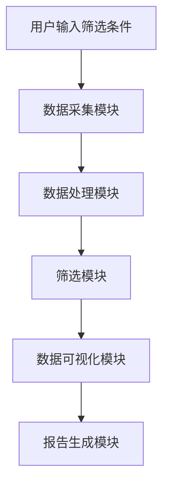
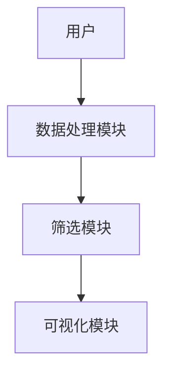

                 


```markdown
# 如何利用特价股票策略进行价值投资教育

> 关键词：特价股票策略，价值投资教育，股票分析，投资策略，教育方法

> 摘要：本文探讨了如何利用特价股票策略进行价值投资教育。通过分析特价股票策略的背景、核心概念、算法原理、系统架构设计及项目实战，本文详细讲解了如何将特价股票策略应用于价值投资教育中。文章从背景介绍到系统设计，再到项目实战，逐步展开，帮助读者理解并掌握相关知识。

---

## 第一部分: 特价股票策略与价值投资教育概述

### 第1章: 特价股票策略的背景与意义

#### 1.1 特价股票策略的定义与特点
##### 1.1.1 特价股票的定义
特价股票是指市场价格低于其内在价值的股票。这种股票通常被认为具有长期增值的潜力，是价值投资者的理想选择。

##### 1.1.2 特价股票策略的核心特点
- **低估性**：市场价格低于内在价值。
- **长期性**：关注长期增值，而非短期波动。
- **选择性**：基于基本面分析，筛选优质股票。

##### 1.1.3 特价股票策略在投资中的作用
- **风险控制**：通过低估价格降低投资风险。
- **价值发现**：挖掘被市场低估的优质公司。
- **长期收益**：通过持有低估股票实现资本增值。

#### 1.2 价值投资的基本概念
##### 1.2.1 价值投资的定义
价值投资是一种投资策略，强调以低于内在价值的价格购买优质股票，并长期持有，等待其价格回归内在价值。

##### 1.2.2 价值投资的核心理念
- **安全边际**：买入价格低于内在价值，以降低风险。
- **长期视角**：关注公司的长期价值，而非短期市场波动。
- **基本面分析**：通过分析公司财务状况、行业地位等因素，评估其内在价值。

##### 1.2.3 价值投资与特价股票策略的联系
- 特价股票策略是价值投资的重要工具。
- 通过筛选低估股票，价值投资者能够在市场波动中找到优质标的。

---

### 第2章: 特价股票策略的核心概念与联系

#### 2.1 特价股票策略的核心原理
##### 2.1.1 市场情绪与股票价格的关系
市场情绪影响股票价格，当市场情绪低落时，股票价格可能被低估，为投资者提供买入机会。

##### 2.1.2 市盈率与市净率的分析
- **市盈率（P/E）**：股价除以每股收益。
- **市净率（P/B）**：股价除以每股净资产。
- **分析方法**：通过比较市盈率和市净率，判断股票是否低估。

##### 2.1.3 股票价值的内在评估方法
- **现金流折现法（DCF）**：评估公司未来现金流的现值。
- **相对估值法**：比较同类公司的估值指标。

#### 2.2 价值投资与特价股票策略的联系
##### 2.2.1 价值投资中的特价股票选择
- 通过基本面分析，选择具有竞争优势的低估股票。
- 关注公司的财务健康状况、盈利能力、成长潜力等因素。

##### 2.2.2 特价股票策略在价值投资中的应用
- 通过筛选低估股票，构建优质的投资组合。
- 结合宏观经济分析，优化投资策略。

##### 2.2.3 特价股票策略与长期投资的关系
- 长期投资是价值投资的核心理念。
- 特价股票策略为长期投资者提供了寻找低估标的的有效方法。

---

### 第3章: 特价股票策略的算法原理

#### 3.1 特价股票筛选算法
##### 3.1.1 算法概述
特价股票筛选算法通过量化指标，筛选出市场价格低于内在价值的股票。

##### 3.1.2 算法步骤
1. 确定筛选指标（如市盈率、市净率、股息率等）。
2. 从数据库中获取相关股票数据。
3. 计算每只股票的估值指标。
4. 筛选出符合低估条件的股票。
5. 根据额外的筛选条件（如行业、规模等）进一步筛选。

##### 3.1.3 算法实现的Python代码示例
```python
import pandas as pd

# 假设data是包含股票信息的DataFrame
# 筛选条件：市盈率 < 行业平均市盈率，且市净率 < 2
selected_stocks = data[(data['PE'] < data['Industry_PE']) & (data['PB'] < 2)]
```

#### 3.2 数学模型与公式
##### 3.2.1 市盈率计算公式
$$ \text{市盈率} = \frac{\text{股价}}{\text{每股收益}} $$

##### 3.2.2 市净率计算公式
$$ \text{市净率} = \frac{\text{股价}}{\text{每股净资产}} $$

##### 3.2.3 股票内在价值的评估公式
$$ \text{内在价值} = \sum_{t=1}^{n} \frac{\text{现金流}_t}{(1 + r)^t} $$

---

### 第4章: 系统分析与架构设计

#### 4.1 系统功能设计
##### 4.1.1 用户需求分析
- 投资者需要筛选低估股票，进行价值投资。
- 教育机构需要工具辅助教学。

##### 4.1.2 系统功能模块划分
- 数据采集模块：获取股票数据。
- 筛选模块：根据筛选条件，筛选出低估股票。
- 数据可视化模块：展示筛选结果。
- 报告生成模块：生成投资建议报告。

##### 4.1.3 系统功能流程图


#### 4.2 系统架构设计
##### 4.2.1 系统架构图


##### 4.2.2 数据流图


---

### 第5章: 项目实战

#### 5.1 环境安装与配置
##### 5.1.1 开发环境搭建
- 安装Python、Jupyter Notebook、Pandas等工具。

##### 5.1.2 数据源获取与处理
- 使用Yahoo Finance API获取股票数据。
- 数据清洗与预处理。

##### 5.1.3 工具安装与配置
- 安装必要的库：`pip install pandas numpy matplotlib`

#### 5.2 核心代码实现
##### 5.2.1 特价股票筛选代码
```python
import pandas as pd
import numpy as np
import matplotlib.pyplot as plt

# 假设data是股票数据DataFrame
data = pd.read_csv('stock_data.csv')

# 筛选条件：市盈率 < 15，市净率 < 2，股息率 > 2%
selected_stocks = data[(data['PE'] < 15) & (data['PB'] < 2) & (data['Dividend Yield'] > 0.02)]

print(selected_stocks)
```

##### 5.2.2 价值评估模型代码
```python
def calculate_intrinsic_value(FCFF, discount_rate, horizon):
    # 现金流折现法计算内在价值
    intrinsic_value = 0
    for t in range(horizon):
        cash_flow = FCFF * (1 + growth_rate)**t
        intrinsic_value += cash_flow / (1 + discount_rate)**t
    return intrinsic_value

# 示例数据
FCFF = 100
discount_rate = 0.08
horizon = 5
growth_rate = 0.05

iv = calculate_intrinsic_value(FCFF, discount_rate, horizon)
print(f"内在价值：{iv}")
```

##### 5.2.3 系统功能实现代码
```python
import tkinter as tk
from tkinter import messagebox

def select_stocks():
    # 获取输入
    criteria = entry.get()
    # 筛选逻辑
    selected = data.query(criteria)
    # 显示结果
    result = selected.to_string()
    messagebox.showinfo("结果", result)

# 创建GUI界面
root = tk.Tk()
entry = tk.Entry(root)
button = tk.Button(root, text="筛选股票", command=select_stocks)
entry.pack()
button.pack()
root.mainloop()
```

---

### 第6章: 最佳实践与注意事项

#### 6.1 投资策略的小结
##### 6.1.1 特价股票策略的优缺点
- 优点：风险低，收益潜力大。
- 缺点：筛选过程复杂，需要长期关注。

##### 6.1.2 价值投资教育的关键点
- 强调基本面分析。
- 注重长期投资。

#### 6.2 投资中的注意事项
##### 6.2.1 风险管理的重要性
- 设置止损点。
- 分散投资。

##### 6.2.2 市场波动的应对策略
- 长期持有，忽略短期波动。
- 定期复评估投资组合。

##### 6.2.3 长期投资的纪律性
- 遵循投资策略，避免情绪化决策。
- 定期学习与调整。

---

### 第7章: 拓展阅读与案例

#### 7.1 拓展阅读
- 格雷厄姆的《 Intelligent Investor》。
- 彭博特的《价值投资实战》。

#### 7.2 案例分析
##### 7.2.1 案例一：某行业低估股票筛选
- 筛选条件：市盈率 < 15，市净率 < 2，股息率 > 2%。
- 筛选出某行业的低估股票，分析其投资价值。

##### 7.2.2 案例二：价值投资教育工具开发
- 开发一个基于特价股票策略的教育工具，帮助投资者学习价值投资。

---

## 作者：AI天才研究院 & 禅与计算机程序设计艺术

---

本文通过详细分析特价股票策略的核心概念、算法原理及系统架构设计，结合实际案例，展示了如何利用特价股票策略进行价值投资教育。希望读者能够通过本文，掌握相关知识，并在实际投资中灵活运用。
```

