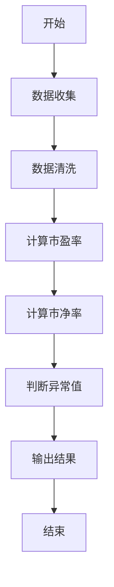

                 


# 如何利用特价股票策略进行价值陷阱规避

> 关键词：特价股票，价值陷阱，股票投资，投资策略，风险管理

> 摘要：本文详细探讨了如何利用特价股票策略进行投资，并重点分析了如何识别和规避价值陷阱。文章从特价股票的基本概念入手，分析了价值陷阱的类型和特征，通过数学模型和算法原理，结合实际案例，讲解了如何在投资过程中有效避免价值陷阱，实现稳健投资收益。

---

## 第一部分: 特价股票策略与价值陷阱概述

### 第1章: 特价股票策略的基本概念

#### 1.1 特价股票的定义与特征
##### 1.1.1 特价股票的定义
特价股票是指市场价格低于其内在价值的股票。通常，这类股票被市场低估，具有较高的投资潜力。投资者可以通过分析公司基本面，寻找那些市场价格低于其真实价值的股票进行投资。

##### 1.1.2 特价股票的特征分析
- **低市盈率（P/E）**：市盈率低于行业平均水平，表明股票价格相对较低。
- **低市净率（P/B）**：市净率低于行业平均水平，表明股票价格相对于账面价值较低。
- **高股息率**：股息率较高，表明公司愿意将利润分配给股东。

##### 1.1.3 特价股票与普通股票的区别
- **价值驱动**：特价股票的价格主要由其内在价值驱动，而普通股票的价格可能受市场情绪影响较大。
- **风险与收益**：特价股票通常具有较高的收益潜力，但也伴随着较高的风险。

#### 1.2 价值陷阱的定义与特征
##### 1.2.1 价值陷阱的定义
价值陷阱是指那些看似便宜，但实际上存在严重问题的股票。投资者误将价值陷阱视为特价股票，导致投资亏损。

##### 1.2.2 价值陷阱的表现形式
- **基本面恶化**：公司财务状况恶化，盈利能力下降。
- **行业衰退**：所在行业面临衰退，市场需求减少。
- **管理层问题**：公司管理层存在严重问题，影响公司运营。

##### 1.2.3 价值陷阱与投资风险的关系
价值陷阱是投资风险的主要来源之一。投资者在追求特价股票时，容易误入价值陷阱，导致投资失败。

### 第2章: 特价股票策略与价值陷阱的关系

#### 2.1 特价股票策略的潜在风险
##### 2.1.1 特价股票策略的局限性
- **低估的不确定性**：市场低估的原因可能复杂，难以准确判断。
- **短期波动**：市场价格可能因短期因素波动，影响投资决策。

##### 2.1.2 价值陷阱对投资者的影响
- **资金损失**：投资者可能因购买价值陷阱股票而蒙受资金损失。
- **信任危机**：连续的失败可能导致投资者对特价股票策略失去信心。

##### 2.1.3 特价股票策略与价值陷阱的关联性
特价股票策略的成功依赖于准确识别低估股票，而价值陷阱的存在增加了识别的难度，使得策略的实施更具挑战性。

#### 2.2 如何识别价值陷阱
##### 2.2.1 价值陷阱的识别方法
- **财务指标分析**：通过分析市盈率、市净率等指标，识别异常情况。
- **行业趋势分析**：研究行业发展趋势，判断公司前景。
- **公司基本面分析**：深入分析公司的财务状况、盈利能力等基本面因素。

##### 2.2.2 价值陷阱的常见类型
- **盈利下降型**：公司盈利能力持续下降，难以扭亏为盈。
- **行业衰退型**：所在行业面临衰退，市场需求减少。
- **管理问题型**：公司管理层存在严重问题，影响公司运营。

##### 2.2.3 价值陷阱的典型案例分析
- **案例一**：某公司因管理层问题导致股价持续下跌，投资者误以为是特价股票，结果亏损严重。
- **案例二**：某行业因政策变化导致需求下降，相关股票价格大幅下跌，投资者误认为是特价股票。

---

## 第二部分: 特价股票策略的核心原理

### 第3章: 特价股票策略的数学模型

#### 3.1 特价股票估值模型
##### 3.1.1 市盈率（P/E）模型
市盈率 = 股价 / 每股收益（EPS）

##### 3.1.2 市净率（P/B）模型
市净率 = 股价 / 每股净资产（BVPS）

##### 3.1.3 股息率（Dividend Yield）模型
股息率 = 每股股息（DIV） / 股价

#### 3.2 价值陷阱识别的数学公式
##### 3.2.1 市盈率异常值计算
$$ 异常市盈率 = |实际市盈率 - 行业平均市盈率| $$

##### 3.2.2 市净率与行业平均值的对比
$$ 异常市净率 = |实际市净率 - 行业平均市净率| $$

##### 3.2.3 股息率与历史数据的偏差分析
$$ 股息率偏差 = |实际股息率 - 历史股息率平均值| $$

### 第4章: 特价股票策略的算法原理

#### 4.1 特价股票识别算法
##### 4.1.1 数据收集与预处理
- **数据来源**：收集股票的历史价格、财务数据等。
- **数据清洗**：处理缺失值、异常值等。

##### 4.1.2 基于市盈率和市净率的异常值检测
- **市盈率检测**：计算市盈率，与行业平均值对比，判断是否异常。
- **市净率检测**：计算市净率，与行业平均值对比，判断是否异常。

##### 4.1.3 算法流程图（Mermaid）


#### 4.2 价值陷阱规避算法
##### 4.2.1 价值陷阱识别的逻辑判断
- **财务指标判断**：检查公司财务指标是否异常。
- **行业趋势判断**：分析行业发展趋势，判断公司前景。
- **管理层问题判断**：评估公司管理层是否存在问题。

##### 4.2.2 基于多指标的综合评估
- **多指标评分**：对市盈率、市净率、股息率等指标进行评分。
- **综合评分计算**：计算综合评分，判断是否为价值陷阱。

##### 4.2.3 算法实现的Python代码示例
```python
import pandas as pd

def is_value_trap(stock_data):
    industry_avg_pe = stock_data['industry_pe'].mean()
    industry_avg_pb = stock_data['industry_pb'].mean()
    
    stock_pe = stock_data['pe']
    stock_pb = stock_data['pb']
    
    pe_abnormal = abs(stock_pe - industry_avg_pe) > stock_data['pe'].std() * 2
    pb_abnormal = abs(stock_pb - industry_avg_pb) > stock_data['pb'].std() * 2
    
    return pe_abnormal or pb_abnormal
```

---

## 第三部分: 系统架构与项目实战

### 第5章: 系统架构设计

#### 5.1 系统功能模块
##### 5.1.1 数据获取模块
- **功能**：从数据源获取股票数据。
- **输入**：股票代码、时间段。
- **输出**：股票数据。

##### 5.1.2 数据分析模块
- **功能**：计算市盈率、市净率等指标。
- **输入**：股票数据。
- **输出**：分析结果。

##### 5.1.3 策略引擎模块
- **功能**：判断是否为特价股票或价值陷阱。
- **输入**：分析结果。
- **输出**：策略结果。

#### 5.2 系统架构设计（Mermaid）
```mermaid
classDiagram
    class 数据获取模块 {
        +股票代码: str
        +时间段: str
        -股票数据: DataFrame
        ++获取数据()
    }
    
    class 数据分析模块 {
        +股票数据: DataFrame
        -市盈率: float
        -市净率: float
        ++计算指标()
    }
    
    class 策略引擎模块 {
        +市盈率: float
        +市净率: float
        ++判断价值陷阱()
    }
    
    数据获取模块 -> 数据分析模块: 提供股票数据
    数据分析模块 -> 策略引擎模块: 提供指标数据
    策略引擎模块 --> 数据分析模块: 返回判断结果
```

---

## 第四部分: 项目实战

### 第6章: 项目实战与案例分析

#### 6.1 环境安装
- **Python**：安装Python 3.8+
- **库的安装**：安装pandas、numpy、scikit-learn等库。

#### 6.2 核心代码实现
##### 6.2.1 数据清洗
```python
import pandas as pd

# 加载数据
stock_data = pd.read_csv('stocks.csv')

# 删除缺失值
stock_data.dropna(inplace=True)
```

##### 6.2.2 特价股票识别
```python
# 计算市盈率和市净率
stock_data['pe'] = stock_data['price'] / stock_data['eps']
stock_data['pb'] = stock_data['price'] / stock_data['bvps']

# 判断异常值
stock_data['is_pe_abnormal'] = (stock_data['pe'] - stock_data['industry_pe'].mean()).abs() > stock_data['pe'].std() * 2
```

#### 6.3 实际案例分析
- **案例一**：某公司因行业衰退导致股价下跌，但市盈率和市净率均低于行业平均值，投资者误认为是特价股票，实际上属于价值陷阱。
- **案例二**：某公司因管理层问题导致股价下跌，市盈率和市净率均异常，投资者识别后避免了损失。

---

## 第五部分: 最佳实践与总结

### 第7章: 最佳实践

#### 7.1 小结
- 特价股票策略具有较高的收益潜力，但也伴随着较高的风险。
- 识别价值陷阱是成功实施特价股票策略的关键。

#### 7.2 注意事项
- **持续学习**：市场环境不断变化，投资者需要持续学习和更新知识。
- **分散投资**：避免将所有资金投入到单一股票，分散投资以降低风险。
- **长期关注**：定期关注股票动态，及时调整投资策略。

#### 7.3 拓展阅读
- 《投资学基础》：深入了解股票投资的基本原理。
- 《价值投资策略》：学习价值投资的基本理念和方法。

---

## 作者信息

作者：AI天才研究院/AI Genius Institute & 禅与计算机程序设计艺术 /Zen And The Art of Computer Programming

