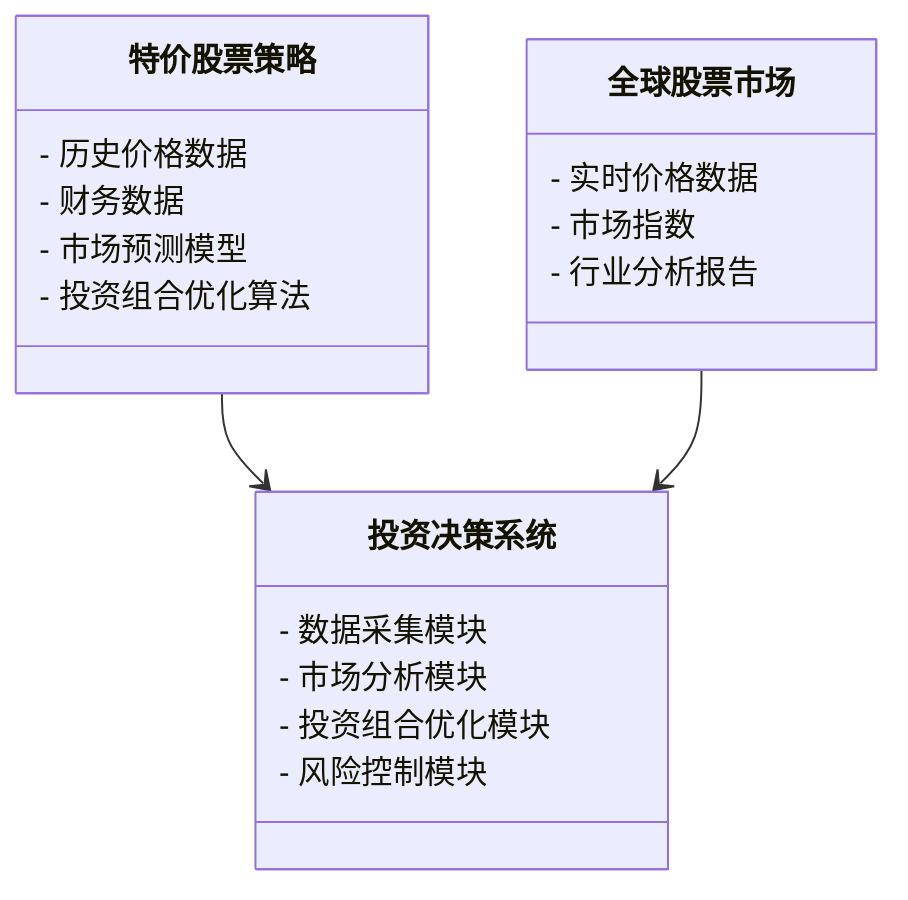
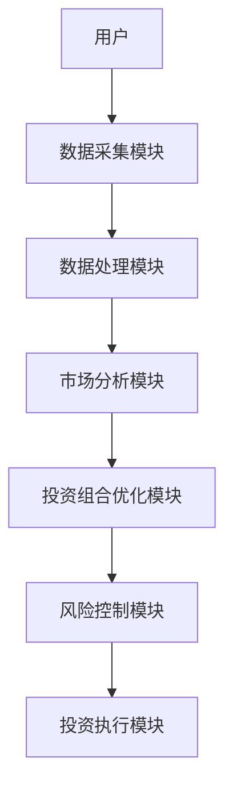

                 


# 如何利用特价股票策略进行全球产业链重构投资

## 关键词：特价股票，产业链重构，投资策略，全球市场，股票分析

## 摘要：本文详细探讨了如何利用特价股票策略在全球范围内进行产业链重构投资。通过分析特价股票的定义、特点及其在全球产业链重构中的作用，结合数学模型和算法原理，提供了一套系统化的投资策略。文章还通过实际案例分析，展示了如何将特价股票策略应用于具体的产业链重构投资中，帮助读者更好地理解和应用这些策略。

---

# 第一部分: 特价股票策略与全球产业链重构投资概述

## 第1章: 特价股票策略的基本概念

### 1.1 特价股票的定义与特点

#### 1.1.1 特价股票的定义
特价股票是指在特定市场环境下，由于市场波动、公司基本面变化或其他因素导致股票价格显著低于其内在价值的股票。这类股票通常被视为潜在的投资机会，因为它们可能被市场低估。

#### 1.1.2 特价股票的特点
- **低估值**：特价股票的价格通常低于其实际价值，具有较大的上涨潜力。
- **高波动性**：这类股票的价格波动较大，可能受到市场情绪和短期因素的影响。
- **风险与机会并存**：特价股票的投资风险较高，但潜在回报也较大。

#### 1.1.3 特价股票与普通股票的区别
| 特性 | 特价股票 | 普通股票 |
|------|----------|----------|
| 价格 | 低于内在价值 | 接近或高于内在价值 |
| 波动性 | 高 | 中等或低 |
| 投资风险 | 高 | 中等或低 |
| 投资机会 | 大 | 较小 |

### 1.2 全球产业链重构投资的背景

#### 1.2.1 全球产业链重构的背景
随着全球化进程的加速，全球产业链的分工与合作日益复杂。特别是在全球疫情、地缘政治冲突等外部因素的影响下，许多企业开始重新评估和调整其供应链布局，导致产业链重构的需求日益迫切。

#### 1.2.2 产业链重构对投资的影响
产业链重构通常伴随着行业的整合和重组，这为投资者提供了新的机会。例如，某些行业可能因产业链重构而出现新的市场领导者，或者某些公司因战略调整而释放出特价股票的投资机会。

#### 1.2.3 特价股票在产业链重构中的作用
在产业链重构过程中，许多公司可能因市场环境的变化而面临短期压力，导致其股票价格被低估。此时，特价股票策略可以通过投资这些被低估的股票，抓住产业链重构带来的投资机会。

---

## 第2章: 特价股票策略的核心原理

### 2.1 特价股票策略的核心原理

#### 2.1.1 市场波动与套利机会
市场波动是特价股票策略的核心驱动力。当市场出现短期波动时，某些股票的价格可能偏离其实际价值，为投资者提供了套利机会。

#### 2.1.2 特价股票的市场定位
特价股票通常位于市场中的低估值区域，投资者需要通过深入分析公司的基本面和市场环境，识别出具有潜在上涨空间的股票。

#### 2.1.3 特价股票的长期投资价值
尽管特价股票可能面临短期风险，但其长期投资价值取决于公司的基本面和行业前景。通过长期持有，投资者可以分享公司成长带来的收益。

### 2.2 全球产业链重构中的投资机会

#### 2.2.1 产业链重构的驱动因素
- **全球化分工调整**：企业在全球范围内的分工可能因成本、效率等因素而调整。
- **地缘政治风险**：地缘政治冲突可能导致企业重新评估其供应链布局。
- **技术进步**：技术进步可能改变产业链的分工和价值创造方式。

#### 2.2.2 特价股票在产业链重构中的应用
在产业链重构过程中，投资者可以通过分析行业的变化趋势，识别出那些因市场环境变化而被低估的股票，作为特价股票进行投资。

#### 2.2.3 特价股票策略的全球化视角
全球化的视角可以帮助投资者更全面地分析市场机会。通过关注不同国家和地区的市场环境，投资者可以找到更具吸引力的特价股票投资机会。

---

# 第二部分: 特价股票策略的数学模型与算法原理

## 第3章: 特价股票策略的数学模型

### 3.1 特价股票的定价模型

#### 3.1.1 市场定价模型
市场定价模型是基于市场供需关系的股票定价方法。通过分析市场的供需关系，可以预测股票价格的变化趋势。

#### 3.1.2 特价股票的估值公式
$$ P = \frac{E}{\text{P/E Ratio}} $$
其中，\( E \) 是公司每股收益，P/E Ratio 是市盈率。通过比较实际市盈率与行业平均市盈率，可以判断股票是否被低估。

#### 3.1.3 市场波动对股票价格的影响
市场波动可以通过时间序列分析模型（如ARIMA模型）进行预测。通过分析历史价格数据，可以预测未来的价格走势。

### 3.2 产业链重构中的数学模型

#### 3.2.1 产业链重构的数学建模
产业链重构的数学建模可以通过构建行业价值链模型来实现。通过分析产业链的各个环节，可以识别出具有投资价值的公司。

#### 3.2.2 产业链重构对股票价格的影响
通过构建行业指数模型，可以分析产业链重构对行业整体股价的影响。例如，可以通过回归分析的方法，确定产业链重构对股价的具体影响因素。

#### 3.2.3 特价股票在产业链重构中的数学分析
通过构建多因子模型，可以分析影响特价股票价格的主要因素，如市盈率、市净率、ROE等。

---

## 第4章: 特价股票策略的算法原理

### 4.1 特价股票策略的算法流程

#### 4.1.1 数据采集与处理
通过数据接口获取股票的历史价格、财务数据等信息，并进行清洗和预处理。

#### 4.1.2 市场分析与预测
使用时间序列分析模型（如LSTM）预测股票价格的未来走势。

#### 4.1.3 投资决策与执行
根据预测结果和投资策略，生成投资组合，并执行交易。

### 4.2 算法实现的数学模型

#### 4.2.1 时间序列分析
使用LSTM模型进行股票价格预测：
$$ y_t = \sigma(w_1 x_t + w_2 y_{t-1}) $$
其中，\( x_t \) 是输入数据，\( y_t \) 是预测结果，\( \sigma \) 是激活函数。

#### 4.2.2 风险评估与控制
通过VaR（Value at Risk）模型评估投资组合的风险，并制定相应的风险控制策略。

#### 4.2.3 投资组合优化
使用现代投资组合理论（MPT）优化投资组合，以实现收益与风险的最优平衡。

---

# 第三部分: 全球产业链重构投资的系统分析与架构设计

## 第5章: 全球产业链重构投资的系统分析

### 5.1 投资系统的需求分析

#### 5.1.1 投资目标与需求
- **目标**：实现全球产业链重构下的投资收益最大化。
- **需求**：提供实时数据采集、市场分析、投资决策支持等功能。

#### 5.1.2 系统功能需求
- **数据采集**：实时采集全球股票市场的数据。
- **市场分析**：提供市场趋势分析和预测功能。
- **投资决策支持**：基于分析结果，提供投资建议。

### 5.2 系统功能设计

#### 5.2.1 领域模型类图


#### 5.2.2 系统架构设计


---

## 第6章: 投资实战与案例分析

### 6.1 实战环境配置

#### 6.1.1 数据源选择
选择全球主要股票市场的数据源，如Yahoo Finance、 Bloomberg等。

#### 6.1.2 工具与技术选型
使用Python编程语言，结合Pandas、NumPy等数据分析库，以及TensorFlow、Keras等深度学习框架。

### 6.2 核心代码实现

#### 6.2.1 数据采集与预处理
```python
import pandas as pd
import requests

# 采集数据
url = "https://query1.finance.yahoo.com..."
data = requests.get(url).json()
df = pd.DataFrame(data)
```

#### 6.2.2 市场分析与预测
```python
from tensorflow.keras import layers

# 构建LSTM模型
model = tf.keras.Sequential()
model.add(layers.LSTM(64, input_shape=(timesteps, features)))
model.add(layers.Dense(1))
model.compile(optimizer='adam', loss='mse')
```

#### 6.2.3 投资组合优化
```python
import numpy as np

# 构建投资组合优化模型
def optimize_portfolio(returns):
    n = returns.shape[1]
    weights = np.ones(n) / n
    return weights
```

### 6.3 案例分析

#### 6.3.1 案例背景
分析某行业的产业链重构情况，选择具有潜力的特价股票进行投资。

#### 6.3.2 投资组合分析
通过多因子模型，识别出具有投资价值的股票，并构建投资组合。

#### 6.3.3 投资结果与反思
分析投资结果，总结经验教训，并优化投资策略。

---

## 第7章: 最佳实践与小结

### 7.1 投资策略的注意事项
- **风险控制**：避免过度集中投资，分散投资风险。
- **市场监测**：密切关注市场动态，及时调整投资策略。
- **长期视角**：坚持长期投资，避免短期波动的影响。

### 7.2 小结
本文通过分析特价股票策略的核心原理和全球产业链重构的投资机会，提供了一套系统化的投资策略。通过数学模型和算法原理的详细讲解，以及实际案例的分析，帮助投资者更好地理解和应用这些策略。

---

## 作者：AI天才研究院/AI Genius Institute & 禅与计算机程序设计艺术 /Zen And The Art of Computer Programming

