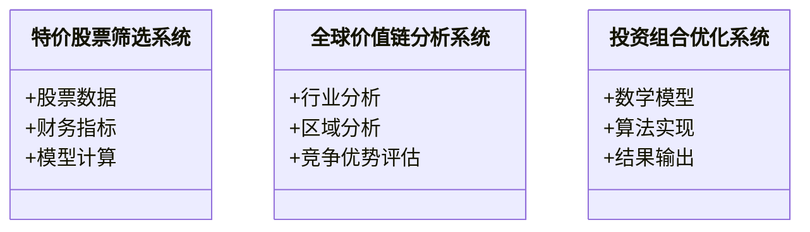
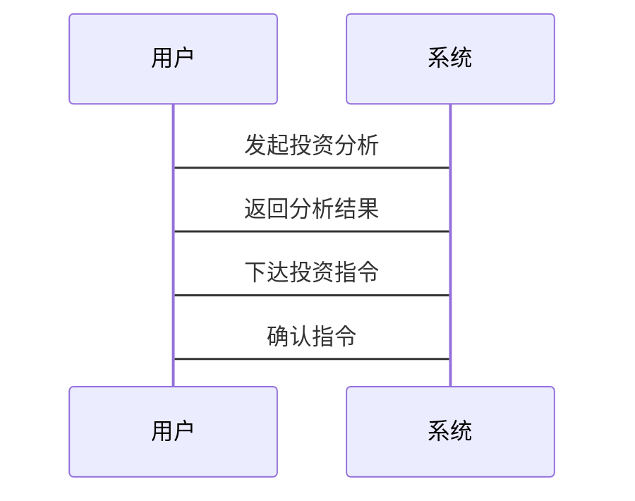

                 


# 如何利用特价股票策略进行全球价值链投资

> 关键词：特价股票策略，全球价值链，投资策略，算法优化，系统设计

> 摘要：本文将探讨如何利用特价股票策略在全球价值链中进行投资。通过分析特价股票策略的原理、全球价值链的结构，以及如何结合两者进行投资优化，提供详细的算法和系统设计方案，结合实际案例进行分析，总结最佳实践和注意事项。

---

## 第1章: 特价股票策略与全球价值链投资的背景介绍

### 1.1 特价股票策略的背景与概念

#### 1.1.1 特价股票的定义与特点
特价股票指的是市场价格低于其内在价值的股票。其特点包括价格低估、潜在上涨空间、风险较低等。投资者通常寻找那些被市场低估的股票，期望其价格回归合理价值。

#### 1.1.2 特价股票策略的起源与发展
价值投资理论由本杰明·格雷厄姆提出，强调购买低于内在价值的股票。特价股票策略在此基础上发展，结合现代金融工具和数据分析，成为投资的重要策略。

#### 1.1.3 特价股票策略的核心要素
- **内在价值计算**：通过DCF模型等方法评估股票的真实价值。
- **市场情绪分析**：识别市场低估时期。
- **风险管理**：控制投资组合的风险。

### 1.2 全球价值链投资的背景与概念

#### 1.2.1 全球价值链的定义与特点
全球价值链指跨国公司在全球范围内的生产、分配和销售过程。其特点包括全球化、分工协作、成本优化等。

#### 1.2.2 全球价值链投资的兴起
随着跨国公司的增多，投资者开始关注跨国企业的全球价值链条，寻找具有竞争优势的投资标的。

#### 1.2.3 全球价值链投资的核心要素
- **行业选择**：选择具有全球竞争力的行业。
- **区域分析**：分析不同地区的经济环境和政策。
- **竞争优势分析**：评估企业的核心竞争力。

### 1.3 特价股票策略与全球价值链投资的结合

#### 1.3.1 结合的背景与意义
通过结合特价股票策略和全球价值链投资，投资者可以在全球范围内寻找低估的优质企业，优化投资组合，分散风险。

#### 1.3.2 结合的逻辑与路径
- **识别低估企业**：在全球范围内筛选价格低于内在价值的企业。
- **分析竞争优势**：评估企业的全球竞争力和价值链地位。
- **构建投资组合**：根据分析结果，配置投资组合。

#### 1.3.3 结合的应用领域
包括科技、制造、能源等多个行业，寻找具有全球竞争优势且价格低估的企业。

## 第2章: 特价股票策略的原理与方法

### 2.1 特价股票策略的原理

#### 2.1.1 市场有效性的假设
假设市场存在非有效部分，存在低估股票。

#### 2.1.2 价值投资的理论基础
基于基本面分析，寻找价值被低估的股票。

#### 2.1.3 股价波动与投资机会
股价波动导致低估，投资者利用这种波动进行投资。

### 2.2 特价股票的筛选方法

#### 2.2.1 市盈率法
使用市盈率（P/E）指标，寻找低于行业平均水平的股票。

#### 2.2.2 市净率法
使用市净率（P/B）指标，评估资产价值是否被低估。

#### 2.2.3 股息率法
关注高股息率的股票，评估其收益能力。

#### 2.2.4 其他指标的综合运用
结合多种指标，如ROE、EPS等，进行多维度筛选。

### 2.3 特价股票策略的风险管理

#### 2.3.1 风险的来源与分类
市场风险、企业风险、流动性风险等。

#### 2.3.2 风险的量化与评估
使用VaR等方法量化风险，评估投资组合的稳定性。

#### 2.3.3 风险的控制与应对
分散投资、设置止损点、定期调整投资组合。

## 第3章: 全球价值链投资的原理与方法

### 3.1 全球价值链的构成与运作

#### 3.1.1 价值链的基本环节
包括设计、生产、分销、销售、售后等环节。

#### 3.1.2 价值链的全球化特征
企业在全球范围内优化资源配置，降低成本。

#### 3.1.3 价值链的优化与重构
通过技术创新和管理优化，提升价值链效率。

### 3.2 全球价值链投资的策略与选择

#### 3.2.1 行业选择的标准
选择具有全球竞争优势的行业，如科技、制造业等。

#### 3.2.2 区域选择的考量
分析不同地区的经济环境、政策、市场潜力等。

#### 3.2.3 企业选择的指标
评估企业的财务状况、管理团队、技术创新能力等。

### 3.3 全球价值链投资的风险与挑战

#### 3.3.1 政治经济风险
不同国家的政治经济环境变化可能影响投资。

#### 3.3.2 市场风险
全球经济波动可能导致股价大幅波动。

#### 3.3.3 竞争风险
全球竞争加剧可能导致企业利润下降。

## 第4章: 特价股票策略与全球价值链投资的结合

### 4.1 结合的逻辑与步骤

#### 4.1.1 识别低估企业
在全球范围内筛选价格低于内在价值的企业。

#### 4.1.2 分析竞争优势
评估企业的全球竞争力和价值链地位。

#### 4.1.3 构建投资组合
根据分析结果，配置投资组合，分散风险。

### 4.2 实际案例分析

#### 4.2.1 案例背景
选择一个具有全球竞争优势且价格低估的企业，如某跨国制造企业。

#### 4.2.2 分析过程
分析企业的财务状况、行业地位、竞争优势等。

#### 4.2.3 投资决策
基于分析结果，决定是否投资该企业。

### 4.3 系统性框架

#### 4.3.1 数据收集
收集全球范围内企业的财务数据、市场数据等。

#### 4.3.2 模型构建
建立数学模型，评估股票的内在价值。

#### 4.3.3 投资组合优化
使用优化算法，构建最优投资组合。

## 第5章: 算法原理与数学模型

### 5.1 特价股票筛选的数学模型

#### 5.1.1 基本原理
基于价值评估模型，如DCF模型，计算股票的内在价值。

#### 5.1.2 模型公式
$$ V = \frac{CF}{r - g} $$
其中，\( V \) 为内在价值，\( CF \) 为自由现金流，\( r \) 为折现率，\( g \) 为增长率。

### 5.2 投资组合优化算法

#### 5.2.1 遗传算法
- 初始化：生成初始种群。
- 适应度评估：计算每个个体的适应度。
- 选择：选择适应度高的个体。
- 交叉：生成新个体。
- 变异：随机改变部分基因。
- 重复：直到达到收敛条件。

#### 5.2.2 蒙特卡洛模拟
- 建立模型：模拟股票价格波动。
- 生成随机数：模拟多种市场情景。
- 计算结果：统计投资组合的表现。
- 分析结果：评估风险和收益。

## 第6章: 系统分析与架构设计

### 6.1 系统功能设计

#### 6.1.1 领域模型
使用mermaid类图展示系统的功能模块。



### 6.2 系统架构设计

#### 6.2.1 架构图
使用mermaid架构图展示系统的整体架构。


### 6.3 系统接口设计

#### 6.3.1 API接口
- 数据接口：获取股票数据。
- 分析接口：执行行业分析、竞争优势评估。
- 优化接口：进行投资组合优化。

#### 6.3.2 交互设计
- 用户输入：选择投资策略。
- 系统响应：返回分析结果。

### 6.4 系统交互流程

#### 6.4.1 序列图
使用mermaid序列图展示系统交互流程。



## 第7章: 项目实战与案例分析

### 7.1 项目环境安装

#### 7.1.1 安装工具
安装Python、Pandas、NumPy、Scipy等工具。

#### 7.1.2 安装算法库
安装遗传算法库（如DEAP）和蒙特卡洛模拟库。

### 7.2 核心实现代码

#### 7.2.1 特价股票筛选代码
```python
import pandas as pd
import numpy as np

def calculate_intrinsic_value(stock_data):
    # 假设stock_data包含财务数据
    CF = stock_data['自由现金流']
    r = stock_data['折现率']
    g = stock_data['增长率']
    return CF / (r - g)

# 示例数据
data = {'自由现金流': [100], '折现率': [0.08], '增长率': [0.05]}
df = pd.DataFrame(data)
intrinsic_value = calculate_intrinsic_value(df)
print(f"内在价值: {intrinsic_value[0]:.2f}")
```

#### 7.2.2 投资组合优化代码
```python
from deap import base, creator, tools, algorithms

creator.create("FitnessMax", base.Fitness, weights=(1.0, -1.0))
creator.create("Individual", list, fitness=creator.FitnessMax)

def evaluate(individual):
    # 计算收益和风险
    return (sum(individual), 0.0)

toolbox = base.Toolbox()
toolbox.register("attr_float", lambda: 1.0 if np.random.random() < 0.5 else 0.0)
toolbox.register("individual", tools.initIterate, creator.Individual, toolbox.attr_float)
toolbox.register("mate", tools.mateOX, indpb=0.5)
toolbox.register("mutate", tools.mutFlipBit, prob=0.1)
toolbox.register("select", tools.selTournament, tournsize=3)

algorithm = algorithms.eaSimple
pop = toolbox.population(n=100)
pop, logbook = algorithm(pop, toolbox, 100, 0.5, 0.0, evaluate)
```

### 7.3 案例分析与解读

#### 7.3.1 案例背景
选择某跨国科技公司，分析其在全球价值链中的地位。

#### 7.3.2 数据分析
分析公司的财务数据、行业地位、竞争优势等。

#### 7.3.3 投资决策
基于分析结果，决定是否投资该公司。

### 7.4 项目小结

## 第8章: 总结与展望

### 8.1 本章小结
总结全文内容，强调特价股票策略与全球价值链投资的结合的重要性。

### 8.2 最佳实践 tips
- 定期评估投资组合。
- 保持对全球经济形势的关注。
- 合理分散投资风险。

### 8.3 注意事项
- 风险控制是关键。
- 数据分析需准确。
- 投资决策需谨慎。

### 8.4 拓展阅读
推荐相关书籍和资源，供读者深入学习。

---

# 作者：AI天才研究院/AI Genius Institute & 禅与计算机程序设计艺术 /Zen And The Art of Computer Programming

