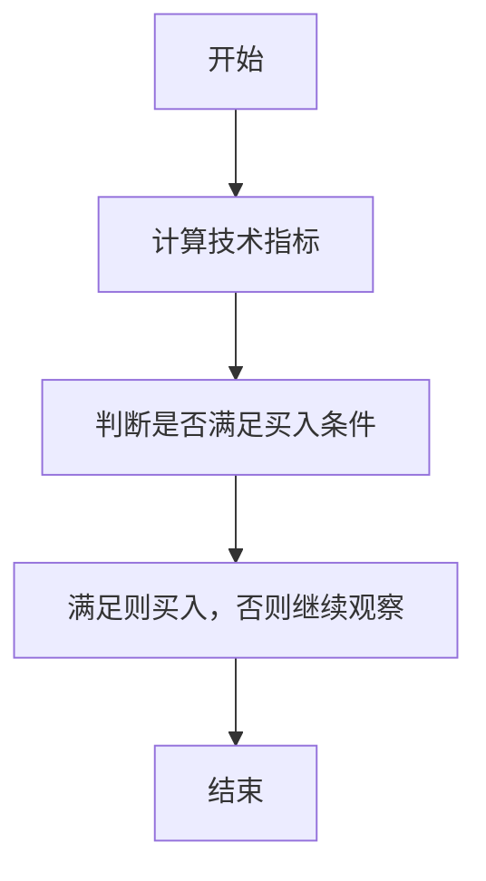
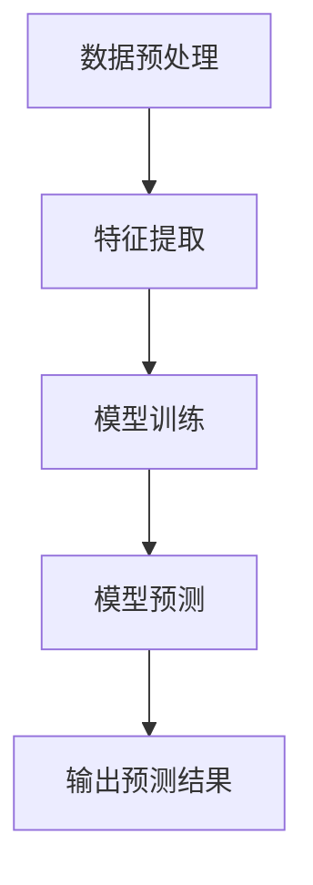
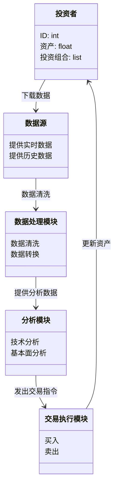
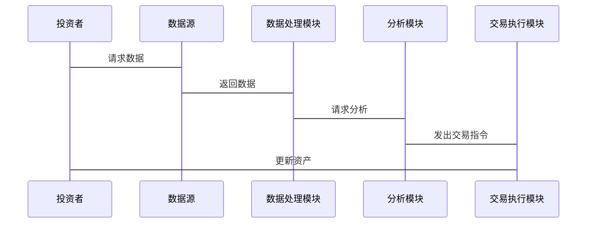

                 


# 如何利用特价股票策略进行全球数字价值链投资

## 关键词：特价股票策略、全球数字价值链、投资机会、技术分析、算法、数学模型

## 摘要：本文详细探讨了如何利用特价股票策略在全球数字价值链中进行有效投资。通过分析数字技术对企业价值的影响，结合技术分析、机器学习和大数据等方法，构建数学模型和算法，优化投资组合，降低风险。文章还通过实际案例展示了如何在数字价值链中识别投资机会，并提供系统架构设计和最佳实践建议。

---

# 第一部分: 特价股票策略与全球数字价值链投资基础

## 第1章: 特价股票策略与全球数字价值链概述

### 1.1 特价股票策略的定义与特点

#### 1.1.1 特价股票的定义
特价股票是指市场价格低于其内在价值的股票。这种股票通常因为市场波动、短期利空或投资者情绪影响而被低估，但具有长期增值潜力。

#### 1.1.2 特价股票策略的核心特点
- **低估值**：市场价格低于合理价值。
- **短期性**：通常是短期市场波动的结果。
- **高潜力**：具备长期增长潜力。
- **逆向投资**：在市场低谷时买入，市场高点时卖出。

#### 1.1.3 特价股票策略与传统投资策略的区别
| 投资策略 | 特价股票策略 | 传统投资策略 |
|----------|--------------|---------------|
| 投资逻辑 | 逆向投资，寻找低估机会 | 顺势而为，跟随市场趋势 |
| 风险承受 | 中高风险 | 中低风险 |
| 投资周期 | 中长期 | 短期至中长期 |

### 1.2 全球数字价值链的定义与重要性

#### 1.2.1 数字价值链的定义
数字价值链是指通过数字技术整合从生产、分配到消费的各个环节所形成的经济链条。它包括数据的产生、处理、分析和应用等过程。

#### 1.2.2 全球数字价值链的核心构成
- **数据生成**：通过传感器、社交媒体等收集数据。
- **数据处理**：利用云计算、大数据技术进行存储和分析。
- **数据应用**：通过AI、区块链等技术进行商业应用。
- **价值创造**：通过数据驱动的创新为企业和社会创造价值。

#### 1.2.3 数字价值链在全球经济中的作用
- **提升效率**：通过数字化转型提高生产效率。
- **降低成本**：利用数据优化资源配置。
- **创造新价值**：通过数据驱动的创新为企业和社会创造新价值。

### 1.3 特价股票策略在全球数字价值链投资中的应用前景

#### 1.3.1 数字经济时代投资的新机遇
- **技术创新**：数字技术推动新兴行业的发展。
- **市场扩展**：数字化转型为企业带来新的市场机会。
- **投资工具多样化**：大数据、AI等技术为投资分析提供了新工具。

#### 1.3.2 特价股票策略在数字价值链投资中的优势
- **低估值企业识别**：通过技术分析识别被低估的数字技术相关企业。
- **风险分散**：通过多样化投资降低风险。
- **高增长潜力**：数字技术驱动的行业具有较高的增长潜力。

#### 1.3.3 数字价值链投资的主要挑战与风险
- **技术风险**：技术更新换代快，企业可能面临技术落后风险。
- **市场波动风险**：数字技术相关股票波动较大，可能导致投资亏损。
- **政策风险**：政策变化可能影响数字技术企业的经营环境。

---

## 第2章: 特价股票策略的核心概念与理论基础

### 2.1 特价股票策略的核心概念

#### 2.1.1 市场时机选择
- **市场周期分析**：分析市场周期，选择合适的买入和卖出时机。
- **技术分析**：通过K线图、技术指标（如RSI、MACD）判断市场趋势。
- **情绪分析**：通过社交媒体、新闻等渠道分析市场情绪，判断市场超买超卖情况。

#### 2.1.2 公司基本面分析
- **财务分析**：分析企业的盈利能力、成长能力、偿债能力等。
- **行业地位**：分析企业在行业中的地位，是否具有竞争优势。
- **管理团队**：分析公司的管理团队是否具备战略眼光和执行力。

#### 2.1.3 技术分析与市场情绪
- **技术分析工具**：如K线图、移动平均线、成交量等。
- **市场情绪指标**：如恐慌指数、投资者情绪指数等。

### 2.2 全球数字价值链的核心要素

#### 2.2.1 数字技术的驱动作用
- **人工智能**：通过AI技术提升企业决策效率。
- **大数据分析**：通过数据挖掘发现商业机会。
- **云计算**：通过云服务优化资源配置。

#### 2.2.2 数字平台与生态系统
- **数字平台**：如电商平台、社交媒体平台等。
- **生态系统**：通过构建生态系统实现多方共赢。

#### 2.2.3 数据资源的价值链
- **数据采集**：通过传感器、问卷调查等方式采集数据。
- **数据分析**：通过数据挖掘、机器学习等技术分析数据。
- **数据应用**：将分析结果应用于商业决策。

### 2.3 特价股票策略与数字价值链的结合

#### 2.3.1 数字技术对股票市场的的影响
- **交易自动化**：通过算法交易提高交易效率。
- **数据驱动的决策**：通过大数据分析优化投资决策。
- **市场预测**：通过AI技术预测市场走势。

#### 2.3.2 数字价值链中的投资机会
- **技术创新型企业**：投资于具有技术创新能力的企业。
- **数据驱动型公司**：投资于依赖数据驱动业务的企业。
- **数字化转型企业**：投资于正在进行数字化转型的传统企业。

#### 2.3.3 数字价值链投资中的策略选择
- **行业选择**：选择数字技术应用广泛的行业。
- **企业筛选**：通过基本面和技术分析筛选优质企业。
- **风险控制**：通过多样化投资和止损策略控制风险。

---

## 第3章: 特价股票策略的算法原理与数学模型

### 3.1 特价股票选择的算法原理

#### 3.1.1 基于技术指标的股票筛选算法



#### 3.1.2 基于机器学习的股票预测模型



#### 3.1.3 基于大数据分析的市场情绪预测

```python
import pandas as pd
import numpy as np
from sklearn import linear_model

# 示例数据
data = pd.DataFrame({
    'Price': [100, 90, 80, 70, 60],
    'Volume': [1000, 2000, 1500, 2500, 3000]
})

# 计算相关系数
correlation = data.cov() / data.std().values
print(correlation)
```

### 3.2 数学模型与公式

#### 3.2.1 市场收益率计算公式

$$
R = \frac{P_{t+1} - P_t}{P_t} \times 100\%
$$

其中，\( R \) 是收益率，\( P_t \) 是第 \( t \) 天的价格，\( P_{t+1} \) 是第 \( t+1 \) 天的价格。

#### 3.2.2 风险评估模型

$$
\text{VaR} = \mu + z \times \sigma
$$

其中，\( \mu \) 是平均回报率，\( z \) 是标准正态分布的分位数，\( \sigma \) 是标准差。

---

## 第4章: 系统分析与架构设计方案

### 4.1 问题场景介绍

- **目标**：构建一个基于特价股票策略的全球数字价值链投资系统。
- **需求**：实时数据采集、智能分析、自动化交易、风险控制。

### 4.2 项目介绍

- **项目名称**：全球数字价值链投资系统。
- **项目目标**：利用特价股票策略进行投资，实现资产增值。
- **项目范围**：覆盖全球主要股票市场，涉及多个行业和企业。

### 4.3 系统功能设计



### 4.4 系统架构设计


### 4.5 系统接口设计

- **数据接口**：与数据源对接，获取实时和历史数据。
- **交易接口**：与交易所系统对接，执行买入和卖出指令。
- **用户接口**：提供给投资者使用的界面，展示分析结果和交易情况。

### 4.6 系统交互设计



---

## 第5章: 项目实战

### 5.1 环境配置

- **编程语言**：Python
- **开发工具**：Jupyter Notebook
- **数据源**：Yahoo Finance API
- **依赖库**：pandas、numpy、matplotlib、scikit-learn

### 5.2 系统核心实现源代码

```python
import pandas as pd
import numpy as np
import matplotlib.pyplot as plt
from sklearn.linear_model import LinearRegression

# 数据获取
data = pd.read_csv('stock_data.csv')

# 数据清洗
data = data.dropna()

# 技术分析：计算移动平均线
data['MA_50'] = data['Close'].rolling(50).mean()
data['MA_200'] = data['Close'].rolling(200).mean()

# 模型训练
model = LinearRegression()
model.fit(data[['MA_50', 'MA_200']], data['Close'])

# 预测
predictions = model.predict(data[['MA_50', 'MA_200']])

# 可视化
plt.plot(data['Close'], label='Actual Price')
plt.plot(predictions, label='Predicted Price')
plt.legend()
plt.show()
```

### 5.3 代码应用解读与分析

- **数据获取**：从CSV文件中读取股票数据。
- **数据清洗**：删除缺失值。
- **技术分析**：计算50天和200天的移动平均线。
- **模型训练**：使用线性回归模型训练价格预测模型。
- **预测与可视化**：绘制实际价格和预测价格的对比图。

### 5.4 实际案例分析

- **案例背景**：某科技公司股价近期因市场情绪波动出现大幅下跌，但公司基本面良好。
- **分析过程**：
  1. 通过技术分析判断股价是否被低估。
  2. 通过基本面分析验证公司的盈利能力。
  3. 利用模型预测未来股价走势。
- **投资决策**：判断股价具备上涨潜力，选择合适时机买入。

### 5.5 项目小结

- **成功经验**：通过技术分析和模型预测结合，提高了投资决策的科学性。
- **注意事项**：市场波动较大时，需要及时调整投资策略。
- **最佳实践**：定期复盘，优化模型参数，提高预测准确率。

---

## 第6章: 总结与展望

### 6.1 总结

- **核心内容回顾**：特价股票策略在全球数字价值链投资中的应用。
- **主要收获**：通过技术分析、机器学习和大数据分析，构建数学模型和算法，优化投资组合，降低风险。

### 6.2 未来展望

- **技术创新**：随着AI和大数据技术的发展，投资分析将更加精准。
- **市场变化**：数字技术的广泛应用将推动全球数字价值链的进一步发展。
- **投资策略优化**：未来将更加注重风险控制和投资组合的动态调整。

---

## 作者：AI天才研究院/AI Genius Institute & 禅与计算机程序设计艺术 /Zen And The Art of Computer Programming

---

以上是《如何利用特价股票策略进行全球数字价值链投资》的技术博客文章的完整内容。希望对您有所帮助！

