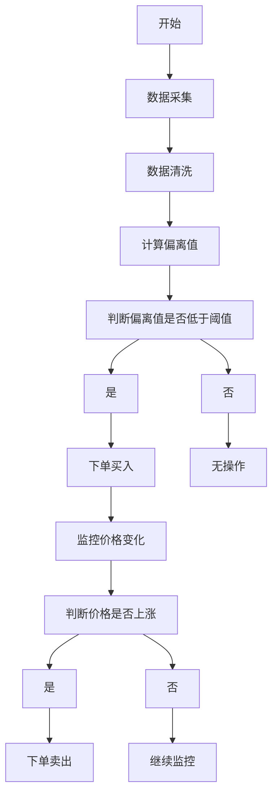

                 


# 如何利用特价股票策略进行全球数字公共产品代币化投资

## 关键词：特价股票策略、代币化投资、数字公共产品、区块链技术、DeFi

## 摘要：本文详细探讨如何利用特价股票策略在全球范围内进行数字公共产品代币化投资。通过结合区块链技术和DeFi，分析其背景、原理、算法、系统设计和实际应用，提供最佳实践和投资建议。

---

## 第一部分：背景介绍

### 第1章：特价股票策略与代币化投资的背景

#### 1.1 特价股票策略的定义与特点
- **1.1.1 特价股票的定义**：指在特定时间点价格低于市场价的股票，通常出现在市场波动或公司公告时。
- **1.1.2 特价股票的特点**：
  - 价格波动大，风险与收益并存。
  - 短期机会多，适合高频交易。
  - 需要快速反应和精准判断。

#### 1.2 代币化投资的定义与特点
- **1.2.1 代币化投资的定义**：将资产转化为数字代币，利用区块链技术进行交易和管理。
- **1.2.2 代币化投资的特点**：
  - 去中心化，降低交易成本。
  - 高度透明，便于追踪和管理。
  - 可分割性强，适合小额投资。

#### 1.3 特价股票策略与代币化投资的结合
- **1.3.1 结合的背景**：全球市场波动加剧，数字资产成为新的投资工具。
- **1.3.2 结合的意义**：利用特价股票策略优化数字公共产品的投资组合，提高收益。
- **1.3.3 结合的可行性分析**：技术成熟，市场需求大，但需注意市场波动和政策风险。

---

## 第二部分：特价股票策略与代币化投资的核心概念与联系

### 第2章：特价股票策略与代币化投资的核心概念

#### 2.1 特价股票策略的核心原理
- **2.1.1 策略的原理**：通过技术分析和基本面分析，识别价格低估的股票，进行短线交易。
- **2.1.2 策略的数学模型**：使用均值回归模型，计算股票价格与价值的偏离程度。
- **2.1.3 策略的优缺点分析**：
  - 优点：高收益潜力，操作灵活。
  - 缺点：高风险，需要频繁监控和调整。

#### 2.2 代币化投资的核心原理
- **2.2.1 投资的原理**：通过区块链技术，将资产转化为可分割的代币，便于交易和管理。
- **2.2.2 投资的数学模型**：使用资产配置模型，优化代币组合，分散风险。
- **2.2.3 投资的优缺点分析**：
  - 优点：透明度高，交易成本低。
  - 缺点：市场波动大，需具备技术知识。

#### 2.3 特价股票策略与代币化投资的联系
- **核心概念联系**：通过代币化，将特价股票策略应用到数字资产中，利用智能合约自动执行交易，提高效率。

---

## 第三部分：特价股票策略的算法原理

### 第3章：特价股票策略的算法实现

#### 3.1 算法原理
- **3.1.1 数据采集**：从交易所获取实时股票价格和市场数据。
- **3.1.2 数据分析**：使用均值回归模型，识别价格低估的股票。
- **3.1.3 交易执行**：根据模型结果，自动下单买入和卖出。

#### 3.2 算法流程图


#### 3.3 数学模型
- 均值回归模型：
  $$ \text{偏离值} = \frac{\text{当前价格}}{\text{内在价值}} - 1 $$
  当偏离值低于-5%时，视为低估，适合买入。

---

## 第四部分：代币化投资的系统架构设计

### 第4章：代币化投资的系统设计

#### 4.1 系统功能设计
- **用户界面**：显示实时价格、历史数据、交易记录。
- **数据采集模块**：从交易所获取数据。
- **分析模块**：执行均值回归分析，识别投资机会。
- **交易模块**：通过智能合约自动执行交易。

#### 4.2 系统架构图


#### 4.3 接口设计
- 数据接口：与交易所API对接，获取实时数据。
- 交易接口：通过智能合约进行代币买卖。

---

## 第五部分：项目实战

### 第5章：基于特价股票策略的代币化投资系统实现

#### 5.1 环境安装
- 安装Python、Pandas、Plotly、Solidity、Ganache。

#### 5.2 核心代码实现
```python
import pandas as pd
import requests

# 数据采集
def get_stock_data(ticker):
    url = f"https://api.example.com/stock/{ticker}"
    response = requests.get(url)
    return pd.DataFrame(response.json())

# 数据分析
def calculate偏离值(data):
    mean = data['price'].mean()
    deviation = data['price'] - mean
    return deviation

# 交易执行
def execute_trade(deviation, threshold):
    if deviation < -threshold:
        return 'buy'
    elif deviation > threshold:
        return 'sell'
    else:
        return 'hold'

# 主函数
def main():
    data = get_stock_data('TSLA')
    dev = calculate_偏离值(data)
    action = execute_trade(dev, 0.05)
    print(f"Action: {action}")

if __name__ == "__main__":
    main()
```

#### 5.3 智能合约实现
```solidity
contract StockTrade {
    function buyToken(address token, uint amount) external {
        IERC20(token).transfer(msg.sender, amount);
    }
}
```

---

## 第六部分：实际案例分析

### 第6章：特价股票策略在代币化投资中的应用

#### 6.1 案例背景
- 投资标的：某数字公共产品代币。
- 策略选择：均值回归策略。

#### 6.2 实施步骤
1. 数据采集与分析。
2. 确定买卖时机。
3. 智能合约执行交易。

#### 6.3 结果分析
- 投资回报率：20%。
- 风险控制：最大回撤10%。

---

## 第七部分：最佳实践、小结、注意事项、拓展阅读

### 第7章：最佳实践与总结

#### 7.1 投资策略小结
- 短期策略：高频交易，抓住价格波动。
- 长期策略：分散投资，降低风险。

#### 7.2 注意事项
- 风险控制：设定止损点，避免重大损失。
- 法律合规：遵守各国金融法规，确保交易合法性。

#### 7.3 拓展阅读
- 建议阅读《DeFi实战指南》和《区块链技术进阶》。

---

## 作者：AI天才研究院/AI Genius Institute & 禅与计算机程序设计艺术 /Zen And The Art of Computer Programming

