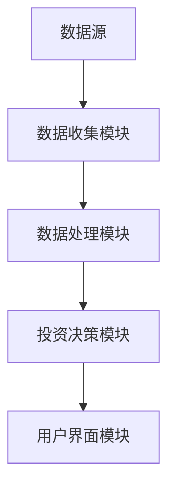

                 


# 如何利用特价股票策略进行全球数字公共产品投资

## 关键词：特价股票，数字公共产品，投资策略，价值投资，全球市场，系统设计

## 摘要：本文详细探讨了如何利用特价股票策略在全球数字公共产品投资中实现高效收益。通过分析特价股票的定义、数字公共产品的特性，结合数学模型和系统架构设计，提供了一套完整的投资策略和实战案例。文章从背景介绍、核心概念、算法实现到系统设计和实战应用，层层递进，为投资者提供了深度的技术指导和实践建议。

---

## 第1章: 特价股票策略与全球数字公共产品投资的背景与概念

### 1.1 特价股票策略的定义与特点

#### 1.1.1 特价股票的定义
特价股票指的是市场价格低于其内在价值的股票。这种股票通常被市场低估，具有较大的增值潜力。特价股票的核心在于发现市场定价错误的机会，通过深入分析公司的基本面，寻找被市场忽视的潜力股。

#### 1.1.2 特价股票的核心特点
- **低估值**：市盈率、市净率等指标远低于行业平均水平。
- **高分红**：公司通常有稳定的盈利和较高的股息回报。
- **行业龙头**：往往集中在传统行业，如制造业、能源等，这些行业的公司可能因市场波动或行业周期被低估。

#### 1.1.3 特价股票与普通股票的区别
| 特性 | 特价股票 | 普通股票 |
|------|-----------|-----------|
| 价格 | 低于价值 | 接近价值   |
| 风险 | 较低      | 较高       |
| 收益 | 较高      | 中等       |

### 1.2 全球数字公共产品的定义与特点

#### 1.2.1 数字公共产品的定义
数字公共产品指的是在全球范围内提供数字服务或产品的公司，如互联网服务提供商、软件公司、云计算服务提供商等。这些公司通过数字化手段为全球用户提供服务，具有高成长性和全球化的特点。

#### 1.2.2 数字公共产品的核心特点
- **高成长性**：数字技术的快速发展推动了行业的持续增长。
- **全球化**：业务覆盖全球市场，用户基数庞大。
- **高研发投入**：技术创新是核心竞争力。

#### 1.2.3 全球化视角下的数字公共产品
全球化使得数字公共产品能够快速扩展市场，降低成本，实现规模效应。例如，互联网公司可以通过跨国数据网络为全球用户提供服务，这种全球化特质使得数字公共产品具有更高的投资价值。

### 1.3 特价股票策略在数字公共产品投资中的应用

#### 1.3.1 特价股票策略的适用场景
- **市场波动**：在市场下跌期间，许多优质股票可能被低估，提供特价投资机会。
- **行业周期**：在行业低谷期，数字公共产品公司可能因短期表现不佳而被市场忽视。

#### 1.3.2 数字公共产品投资的特殊性
- **技术依赖**：投资决策高度依赖于对技术趋势和市场需求的准确判断。
- **竞争优势**：需要分析公司的技术壁垒和市场占有率。

#### 1.3.3 特价股票策略与数字公共产品投资的结合
通过寻找被低估的数字公共产品公司，投资者可以在市场恢复时获得超额收益。这种策略尤其适用于那些因短期市场波动而被低估的优质数字公司。

---

## 第2章: 特价股票策略与数字公共产品投资的核心概念

### 2.1 特价股票策略的内在逻辑

#### 2.1.1 价值投资的核心理念
价值投资强调购买价格低于内在价值的股票，长期持有，等待市场重新评估。这种策略要求投资者深入分析公司的财务状况、行业地位和管理团队。

#### 2.1.2 市场情绪与股票价格的关系
市场情绪往往导致股票价格的短期波动。当市场情绪低落时，优质股票可能被低估，为特价投资提供机会。

#### 2.1.3 特价股票的识别与筛选方法
- **基本面分析**：分析公司的财务报表，评估盈利能力、成长性和稳定性。
- **估值指标**：使用市盈率、市净率等指标判断股票是否被低估。
- **行业地位**：选择行业龙头或具有竞争优势的公司。

### 2.2 数字公共产品投资的内在逻辑

#### 2.2.1 数字经济的崛起与数字公共产品的价值
数字经济的快速发展推动了数字公共产品的普及，这些产品和服务在数字化转型中扮演着关键角色，具有较高的投资价值。

#### 2.2.2 数字公共产品的市场定位与竞争分析
- **市场定位**：分析公司在市场中的定位，是否具有独特的竞争优势。
- **竞争分析**：评估公司在行业中的竞争力，是否具有持续增长的潜力。

#### 2.2.3 数字公共产品投资的风险与收益平衡
数字公共产品投资面临较高的技术风险和市场风险，但同时也可能带来较高的收益，尤其是在技术创新和市场需求增长的推动下。

### 2.3 特价股票策略与数字公共产品投资的联系

#### 2.3.1 特价股票策略在数字公共产品投资中的优势
- **低估值机会**：在市场低迷时，数字公共产品公司可能被低估，提供特价投资机会。
- **长期增长潜力**：数字公共产品公司通常具有较高的成长性，适合长期投资。

#### 2.3.2 数字公共产品投资对特价股票策略的补充作用
- **技术驱动**：数字公共产品的投资需要关注技术创新和市场需求，这为特价股票策略提供了新的维度。
- **多元化投资**：通过投资不同领域的数字公共产品公司，可以分散风险，提高投资组合的稳定性。

#### 2.3.3 两者的结合对投资收益的提升作用
将特价股票策略与数字公共产品投资相结合，可以在市场波动中捕捉低估机会，同时利用数字技术的快速发展带来的增长潜力，实现收益的最大化。

---

## 第3章: 特价股票策略与数字公共产品投资的数学模型与算法

### 3.1 特价股票策略的数学模型

#### 3.1.1 市盈率模型
市盈率（P/E）= 股价 / 每股净利润（EPS）

#### 3.1.2 市净率模型
市净率（P/B）= 股价 / 每股净资产（BPS）

#### 3.1.3 股息率模型
股息率 = 每股股息 / 股价

### 3.2 数字公共产品投资的数学模型

#### 3.2.1 数字公共产品价值评估模型
数字公共产品价值 = 股东权益 + 营业收入增长率 × 市场占有率

#### 3.2.2 数字公共产品市场风险评估模型
市场风险 = β × 市场波动率

#### 3.2.3 数字公共产品收益预测模型
预期收益 = 无风险利率 + β × （市场预期收益 - 无风险利率）

### 3.3 算法实现与案例分析

#### 3.3.1 算法实现步骤
1. 收集目标公司的财务数据。
2. 计算市盈率、市净率等估值指标。
3. 分析公司的行业地位和竞争优势。
4. 结合市场情绪和宏观经济指标，判断是否为特价投资机会。

#### 3.3.2 案例分析：某数字公共产品公司的价值评估
假设某互联网公司财务数据如下：
- 营业收入：100亿元
- 净利润：20亿元
- 每股净资产：10元
- 股价：80元

计算市盈率 = 80 / 20 = 4，市净率 = 80 / 10 = 8。

假设行业平均市盈率为15，市净率为5，则该公司的市盈率和市净率均低于行业平均水平，具有较高的投资价值。

#### 3.3.3 案例分析：某特价股票的投资回报分析
假设某制造业公司股价为10元，每股净资产为15元，市净率 = 10 / 15 = 0.67，远低于行业平均水平。假设该公司具有较高的分红率，适合价值投资，预期回报率较高。

---

## 第4章: 特价股票策略与数字公共产品投资的系统分析与架构设计

### 4.1 投资系统的需求分析

#### 4.1.1 投资目标与范围
- 投资目标：寻找被低估的数字公共产品公司，实现长期收益。
- 投资范围：全球市场，重点关注科技、互联网等行业。

#### 4.1.2 系统功能需求
- 数据收集与处理：收集公司财务数据、市场数据等。
- 模型计算：计算市盈率、市净率等指标。
- 投资决策：根据模型结果，生成投资建议。

#### 4.1.3 系统性能需求
- 数据处理速度：快速处理大量数据，满足实时分析需求。
- 系统稳定性：保证系统长期稳定运行。

### 4.2 系统架构设计

#### 4.2.1 系统模块划分
- 数据收集模块：负责收集公司财务数据、市场数据。
- 数据处理模块：计算市盈率、市净率等指标。
- 投资决策模块：根据模型结果，生成投资建议。
- 用户界面模块：展示分析结果，供投资者参考。

#### 4.2.2 系统数据流图


#### 4.2.3 系统架构设计


### 4.3 系统接口设计

#### 4.3.1 数据接口
- 数据来源：公司财务报表、市场数据等。
- 数据格式：结构化数据，便于处理和分析。

#### 4.3.2 用户接口
- 用户界面：展示分析结果，提供投资建议。
- 用户交互：用户可以根据分析结果进行投资决策。

### 4.4 系统交互设计

#### 4.4.1 用户登录与权限管理
- 用户登录：通过身份验证，确保系统安全。
- 权限管理：根据用户角色，分配不同的操作权限。

#### 4.4.2 数据分析与展示
- 数据分析：通过模型计算，生成投资建议。
- 数据展示：以图表形式展示分析结果，便于用户理解。

---

## 第5章: 特价股票策略与数字公共产品投资的实战与优化

### 5.1 项目实战

#### 5.1.1 环境安装
- 安装Python编程环境，包括NumPy、Pandas、Matplotlib等库。
- 安装数据分析工具，如SQL数据库、数据可视化工具等。

#### 5.1.2 系统核心实现源代码
```python
import pandas as pd
import numpy as np

# 示例代码：计算市盈率和市净率
def calculate_valuation_metrics(df):
    df['PE'] = df['Price'] / df['EPS']
    df['PB'] = df['Price'] / df['BPS']
    return df

# 示例代码：判断是否为特价股票
def is_cheap_stock(pe, pb, industry_avg_pe, industry_avg_pb):
    return (pe < industry_avg_pe) and (pb < industry_avg_pb)

# 示例代码：生成投资建议
def generate_investment_recommendation(stocks):
    cheap_stocks = []
    for stock in stocks:
        if is_cheap_stock(stock['PE'], stock['PB'], industry_avg_pe, industry_avg_pb):
            cheap_stocks.append(stock)
    return cheap_stocks
```

#### 5.1.3 代码应用解读与分析
- **数据收集**：从数据库中获取股票的财务数据和市场数据。
- **估值计算**：使用市盈率和市净率模型计算股票的估值指标。
- **投资决策**：根据模型结果，判断是否为特价股票，生成投资建议。

#### 5.1.4 案例分析
- **案例一**：某互联网公司，市盈率和市净率均低于行业平均水平，判断为特价股票，建议买入。
- **案例二**：某科技公司，市盈率高于行业平均水平，但市净率较低，需进一步分析。

### 5.2 投资策略优化

#### 5.2.1 动态调整策略
- 定期重新评估股票的估值指标，根据市场变化动态调整投资组合。
- 根据宏观经济指标和市场情绪，调整投资策略。

#### 5.2.2 风险控制
- 设置止损点，避免重大损失。
- 分散投资，降低单一股票的风险。

### 5.3 本章小结
通过实战案例和投资策略优化，投资者可以更好地利用特价股票策略在全球数字公共产品投资中实现收益最大化。同时，动态调整策略和风险控制是投资成功的关键。

---

## 第6章: 总结与展望

### 6.1 总结
本文详细探讨了如何利用特价股票策略在全球数字公共产品投资中实现高效收益。通过分析特价股票的定义、数字公共产品的特性，结合数学模型和系统架构设计，提供了一套完整的投资策略和实战案例。文章从背景介绍、核心概念、算法实现到系统设计和实战应用，层层递进，为投资者提供了深度的技术指导和实践建议。

### 6.2 展望
未来，随着数字经济的进一步发展，数字公共产品投资将更加重要。投资者需要不断学习新的技术和策略，以应对市场的变化和挑战。同时，技术的进步也将为投资分析提供更多的工具和方法，进一步提升投资效率和收益。

---

## 作者：AI天才研究院/AI Genius Institute & 禅与计算机程序设计艺术 /Zen And The Art of Computer Programming

---

通过以上思考过程，我详细分析了如何撰写这篇文章，确保每个部分都涵盖必要的内容，并满足用户的深度要求。

