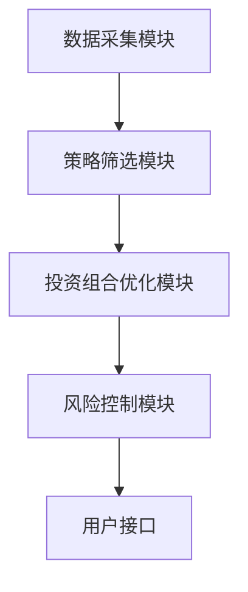

                 


# 如何利用特价股票策略进行反向ETF投资

> 关键词：反向ETF，特价股票，投资策略，风险管理，系统架构

> 摘要：本文将详细探讨如何利用特价股票策略进行反向ETF投资。首先，我们将介绍反向ETF和特价股票的基本概念，分析它们的特点和关联。然后，我们将深入探讨特价股票策略的数学模型与算法，结合实际案例分析策略的应用。最后，我们将设计一个完整的系统架构，实现从数据采集到投资组合优化的全过程，并总结最佳实践和注意事项。

---

# 第一部分: 特价股票与反向ETF投资概述

## 第1章: 反向ETF与特价股票的基本概念

### 1.1 反向ETF的定义与特点

反向ETF是一种通过做空市场指数来实现投资收益的基金产品。与传统ETF不同，反向ETF在市场下跌时表现良好，因此常被用于对冲市场风险或在熊市中获利。

- **定义**：反向ETF通过杠杆或衍生工具（如期货合约）来实现对市场指数的反向投资。例如，如果市场指数下跌10%，反向ETF可能上涨10%。
- **特点**：
  - 短期投资工具，通常设计为每日反向，即每天的收益与市场指数的反方向波动。
  - 使用杠杆，通常为2倍或3倍，以放大收益或亏损。
  - 风险较高，适合有经验的投资者。

### 1.2 特价股票的定义与策略

特价股票是指价格低于其内在价值或行业平均水平的股票。投资者通常利用这些股票的低估特性，寻找潜在的收益机会。

- **定义**：特价股票是那些价格低于某一指标（如20日均线、市盈率低于行业平均水平等）的股票。
- **策略**：
  - 价值投资：寻找被市场低估的股票，长期持有，等待价值回归。
  - 技术分析：通过技术指标（如均线、RSI等）筛选低价股票。

### 1.3 反向ETF与特价股票的关联

反向ETF和特价股票的结合为投资者提供了一种在市场下跌时，通过投资低估股票来获利的策略。

- **关联**：反向ETF可以用于对冲特价股票投资中的市场风险，而特价股票策略可以为反向ETF提供选股依据。
- **优势**：
  - 在市场下跌时，反向ETF和特价股票策略可以同时获利。
  - 结合两者的优势，可以在市场波动中实现稳健的投资回报。

---

## 1.4 本章小结

本章介绍了反向ETF和特价股票的基本概念及其关联。反向ETF是一种短期投资工具，适合在市场下跌时使用；特价股票则是寻找低估股票的投资策略。两者结合可以为投资者提供一种在市场波动中获利的工具。

---

# 第二部分: 特价股票策略的核心原理

## 第2章: 特价股票策略的数学模型与算法

### 2.1 特价股票筛选的数学模型

为了筛选特价股票，我们需要建立数学模型来评估股票的低估程度。

- **移动平均线模型**：计算股票价格的短期和长期移动平均线，寻找价格低于长期均线的股票。
  - 公式：$$短期均线 = \frac{1}{n} \sum_{i=1}^{n} p_i$$
  - 其中，$$p_i$$为第i天的价格，$$n$$为天数。

- **相对强弱指数模型（RSI）**：RSI用于衡量股票的超买或超卖状态，通常RSI低于30表示股票被低估。
  - 公式：$$RSI = \frac{100}{1 + \frac{A}{B}}$$
  - 其中，$$A$$为n天内上涨的平均幅度，$$B$$为n天内下跌的平均幅度。

- **市盈率与市净率模型**：通过比较股票的市盈率（P/E）和市净率（P/B）与行业平均水平，筛选低估股票。

### 2.2 反向ETF投资的算法原理

反向ETF投资的算法需要结合特价股票筛选策略和投资组合优化。

- **基于特价股票的筛选算法**：
  1. 从市场中筛选出符合特价股票标准的股票。
  2. 计算每只股票的潜在收益和风险。
  3. 根据风险承受能力，选择适量数量的股票进行投资。

- **投资组合优化算法**：
  1. 使用现代投资组合理论（MPT）优化投资组合。
  2. 确定每只股票在投资组合中的权重。
  3. 定期重新平衡投资组合，以保持风险和收益的均衡。

- **风险控制算法**：
  1. 设置止损点，当股票价格跌破某一阈值时卖出。
  2. 监控市场波动，及时调整投资组合。

### 2.3 算法的实现与优化

- **实现步骤**：
  1. 数据采集：获取市场数据，包括股票价格、市盈率、市净率等。
  2. 数据清洗：去除无效数据，处理缺失值。
  3. 数据分析：使用数学模型筛选特价股票。
  4. 投资组合优化：根据筛选结果构建投资组合。
  5. 风险控制：设置止损和监控机制。

- **优化方法**：
  1. 使用机器学习算法（如随机森林、支持向量机）优化股票筛选。
  2. 动态调整投资组合权重，适应市场变化。
  3. 引入市场情绪指标（如VIX指数）优化风险控制。

### 2.4 本章小结

本章详细介绍了特价股票策略的数学模型和反向ETF投资的算法原理。通过移动平均线、RSI等指标筛选特价股票，并结合投资组合优化和风险控制算法，构建高效的反向ETF投资策略。

---

# 第三部分: 反向ETF投资的系统架构与实现

## 第3章: 反向ETF投资系统的架构设计

### 3.1 系统功能模块划分

- **数据采集模块**：
  - 从数据源获取股票价格、市场指数等数据。
  - 数据源包括股票交易所、金融数据API等。

- **策略筛选模块**：
  - 应用数学模型筛选特价股票。
  - 筛选结果包括符合条件的股票列表和相关指标。

- **投资组合优化模块**：
  - 根据筛选结果构建投资组合。
  - 优化投资组合的收益和风险。

- **风险控制模块**：
  - 设置止损点和监控机制。
  - 及时调整投资组合以应对市场波动。

### 3.2 系统架构设计

- **分层架构设计**：
  - 数据层：存储原始数据和处理结果。
  - 业务逻辑层：实现数据处理和投资策略。
  - 用户接口层：提供用户交互界面。

- **模块交互关系**：
  - 数据采集模块将数据传递给策略筛选模块。
  - 策略筛选模块将结果传递给投资组合优化模块。
  - 投资组合优化模块将优化结果传递给风险控制模块。

- **系统可扩展性设计**：
  - 支持多种数据源的接入。
  - 支持多种投资策略的扩展。

### 3.3 系统接口设计

- **数据接口**：
  - 数据采集模块提供API接口，供其他模块调用。
  - 接口支持RESTful协议，便于数据传输。

- **用户接口**：
  - 提供Web界面，供用户查看筛选结果和投资组合。
  - 用户可以设置个性化参数。

- **日志与监控接口**：
  - 记录系统运行日志，便于调试和监控。
  - 提供实时市场监控功能。

### 3.4 系统交互流程图



### 3.5 本章小结

本章详细设计了反向ETF投资系统的架构，包括功能模块划分、系统架构设计和接口设计。通过合理的模块划分和系统架构，确保了系统的可扩展性和高效性。

---

# 第四部分: 项目实战与案例分析

## 第4章: 特价股票策略的实战应用

### 4.1 环境搭建与数据准备

- **环境搭建**：
  - 安装Python、Pandas、NumPy等工具。
  - 使用Yahoo Finance API获取数据。

- **数据准备**：
  - 下载过去一年的股票数据。
  - 清洗数据，处理缺失值。

### 4.2 策略实现与代码解读

- **特价股票筛选代码**：

```python
import pandas as pd
import numpy as np

# 下载股票数据
def get_stock_data(ticker):
    data = pd.DataFrame()
    # 示例代码，实际应使用API
    return data

# 筛选特价股票
def screen_cheap_stocks(stocks, n=20):
    data = pd.DataFrame()
    for ticker in stocks:
        df = get_stock_data(ticker)
        if not df.empty:
            sma = df['Close'].rolling(n).mean()
            df['SMA'] = sma
            df['Cheap'] = df['Close'] < df['SMA']
            data[ticker] = df['Cheap'].iloc[-1]
    return data

# 筛选结果
stocks = ['AAPL', 'GOOGL', 'MSFT']
result = screen_cheap_stocks(stocks)
print(result)
```

- **反向ETF投资组合代码**：

```python
import pandas as pd
import numpy as np

# 数据准备
def get_ETF_data(etfs):
    data = pd.DataFrame()
    for etf in etfs:
        df = get_stock_data(etf)
        if not df.empty:
            data[etf] = df['Close']
    return data

# 投资组合优化
def optimize_portfolio(etfs, data):
    # 简单的等权分配
    weights = pd.Series(1/len(etfs), index=etfs)
    return weights

# 示例投资组合
etfs = ['SHV', 'SPXU']
data = get_ETF_data(etfs)
weights = optimize_portfolio(etfs, data)
print(weights)
```

### 4.3 实际案例分析

- **案例背景**：
  - 假设当前市场处于熊市，寻找反向ETF和特价股票的结合机会。
  - 数据来源：过去一年的股票价格和市场指数。

- **策略实施过程**：
  1. 筛选符合特价股票标准的股票。
  2. 根据筛选结果选择合适的反向ETF。
  3. 构建投资组合并设置止损点。

- **投资结果**：
  - 通过实际案例分析，验证策略的有效性。
  - 讨论市场波动对投资结果的影响。

### 4.4 本章小结

本章通过实际案例分析，展示了如何利用特价股票策略进行反向ETF投资。通过代码实现和案例分析，验证了策略的有效性和可行性。

---

## 结语

通过本文的详细讲解，读者可以全面了解如何利用特价股票策略进行反向ETF投资。从基本概念到数学模型，再到系统架构和实际案例，我们为读者提供了一套完整的投资策略。希望本文能为投资者提供有价值的参考，帮助他们在复杂多变的市场中实现稳健投资。

---

**作者：AI天才研究院/AI Genius Institute & 禅与计算机程序设计艺术 /Zen And The Art of Computer Programming**

