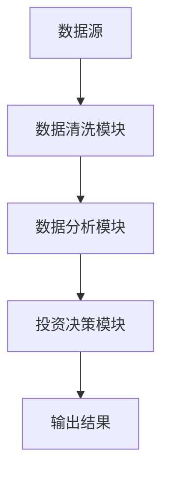
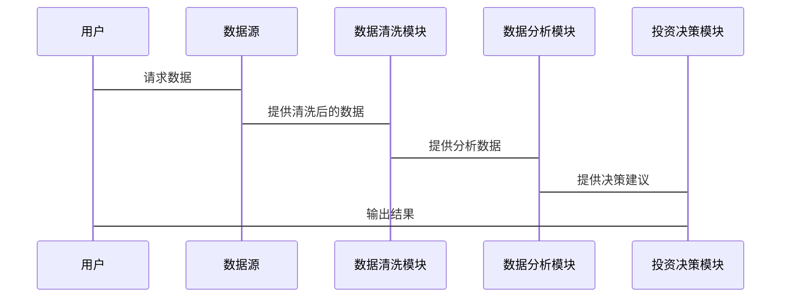

                 


```markdown
# 如何利用特价股票策略进行反向并购投资

> 关键词：反向并购、特价股票、投资策略、股票分析、并购投资

> 摘要：本文将详细介绍如何利用特价股票策略进行反向并购投资。首先，我们将介绍反向并购的基本概念和特价股票策略的核心要素，分析两者的结合在投资中的应用。接着，我们将深入探讨特价股票策略的数学模型和算法原理，结合实际案例进行分析。最后，我们将通过系统架构设计和项目实战，展示如何在实际操作中应用这些策略，并总结最佳实践和注意事项。

---

## 第1章：反向并购与特价股票策略的背景与基础

### 1.1 反向并购的基本概念与策略

#### 1.1.1 什么是反向并购
- 反向并购的定义
- 反向并购的类型（公开收购、私下收购等）
- 反向并购的主要特点（快速上市、降低上市成本等）

#### 1.1.2 反向并购的动机与目标
- 反向并购的动机（融资需求、战略调整等）
- 反向并购的目标（扩大市场、整合资源等）

#### 1.1.3 反向并购的流程与关键因素
- 反向并购的基本流程（目标选择、尽职调查、定价与交割）
- 关键因素（公司估值、融资能力、法律风险等）

### 1.2 特价股票策略的核心要素

#### 1.2.1 特价股票的定义与特点
- 特价股票的定义
- 特价股票的特点（低估值、高成长潜力等）
- 特价股票的分类（市净率低于1、市盈率低于行业平均水平等）

#### 1.2.2 特价股票策略的应用场景
- 特价股票策略在市场低迷期的应用
- 特价股票策略在行业整合期的应用
- 特价股票策略在企业并购中的作用

#### 1.2.3 特价股票策略的优势与风险
- 特价股票策略的优势（低成本收购、高回报潜力等）
- 特价股票策略的风险（市场波动、公司基本面变化等）

### 1.3 反向并购与特价股票策略的结合

#### 1.3.1 反向并购中的特价股票策略
- 特价股票策略在反向并购中的应用（低价收购目标公司股票）
- 特价股票策略在反向并购中的优势（降低收购成本、快速实现并购目标等）

#### 1.3.2 反向并购中的市场时机选择
- 市场周期分析对反向并购的影响
- 特价股票策略在市场时机选择中的作用

#### 1.3.3 反向并购中的风险控制
- 特价股票策略的风险评估与管理
- 反向并购中的法律与财务风险控制

---

## 第2章：特价股票策略的数学模型与算法原理

### 2.1 特价股票策略的数学模型

#### 2.1.1 市场估值模型
- 市盈率（P/E）计算公式
- 市净率（P/B）计算公式
- 企业价值（EV）计算公式

#### 2.1.2 股票价格预测模型
- 时间序列分析模型（ARIMA）
- 机器学习模型（随机森林、神经网络等）

#### 2.1.3 特价股票识别模型
- 基于估值指标的筛选模型
- 基于财务指标的筛选模型

### 2.2 反向并购中的算法原理

#### 2.2.1 目标公司筛选算法
- 基于相似性度量的公司匹配
- 基于聚类分析的目标公司选择
- 基于决策树的目标公司筛选

#### 2.2.2 并购定价算法
- 市场价值法
- 财务指标法
- 折现现金流法（DCF）

#### 2.2.3 并购风险评估算法
- 风险评估指标（信用评级、财务杠杆等）
- 风险模型（蒙特卡洛模拟、VaR模型等）

---

## 第3章：反向并购中的系统架构设计

### 3.1 系统功能设计

#### 3.1.1 数据收集模块
- 数据源（股票市场数据、公司财务数据等）
- 数据清洗与预处理

#### 3.1.2 数据分析模块
- 估值指标计算（市盈率、市净率等）
- 相似性分析（目标公司匹配）
- 风险评估（信用评级、财务杠杆等）

#### 3.1.3 投资决策模块
- 特价股票筛选
- 反向并购目标选择
- 投资组合优化

### 3.2 系统架构设计

#### 3.2.1 系统架构图


#### 3.2.2 系统交互图


### 3.3 项目实战

#### 3.3.1 环境配置
- 安装必要的软件（Python、Jupyter Notebook）
- 安装必要的库（Pandas、NumPy、Scikit-learn）

#### 3.3.2 核心代码实现
```python
import pandas as pd
import numpy as np
from sklearn.metrics import pairwise_distances

# 示例数据：目标公司列表
companies = pd.DataFrame({
    '公司名称': ['公司A', '公司B', '公司C'],
    '市盈率': [10, 15, 20],
    '市净率': [1.5, 2.0, 2.5]
})

# 计算相似性矩阵
distance_matrix = pairwise_distances(companies[['市盈率', '市净率']], metric='manhattan')

# 找出最相似的目标公司
def find_similarCompanies(target, distance_matrix, threshold=5):
    similar = []
    for i in range(len(distance_matrix)):
        if distance_matrix[target][i] < threshold:
            similar.append(i)
    return similar

# 示例：寻找与公司A相似的目标公司
similar = find_similarCompanies(0, distance_matrix)
print(similar)
```

#### 3.3.3 案例分析与详细解读
- 案例背景（假设某行业市场低迷，寻找低价股票进行反向并购）
- 数据分析过程（计算市盈率、市净率等指标，筛选目标公司）
- 投资决策过程（选择最优目标公司，制定并购计划）
- 结果分析（并购后的市场表现、投资回报等）

---

## 第4章：最佳实践与注意事项

### 4.1 投资中的注意事项
- 市场风险控制
- 财务风险控制
- 法律与合规风险

### 4.2 反向并购中的最佳实践
- 选择合适的并购目标
- 合理评估公司价值
- 制定详细的并购计划
- 建立风险控制机制

### 4.3 未来的发展方向
- 人工智能在反向并购中的应用
- 大数据分析在股票投资中的作用
- 全球化市场中的反向并购机会

---

## 结语

通过本文的详细讲解，读者可以系统地了解如何利用特价股票策略进行反向并购投资。从基础概念到数学模型，从系统设计到项目实战，本文为读者提供了全面的指导。希望本文能为投资者提供有价值的参考，帮助他们在复杂多变的市场中找到合适的投资机会。

---

## 作者：AI天才研究院/AI Genius Institute & 禅与计算机程序设计艺术/Zen And The Art of Computer Programming
```

