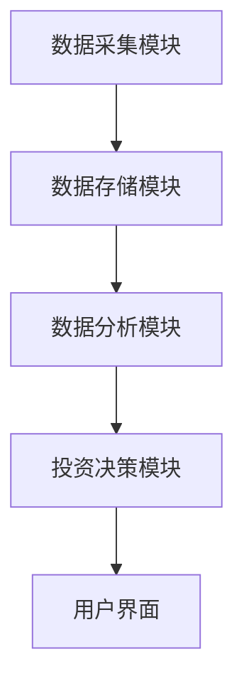

                 


# 如何利用特价股票策略进行反向并购投资

---

## 关键词：反向并购、特价股票、股票策略、并购投资、投资策略

---

## 摘要：  
本文详细探讨了如何利用特价股票策略进行反向并购投资。首先，我们从反向并购和特价股票的基本概念出发，分析了两者结合的背景与意义。接着，我们深入探讨了特价股票策略在反向并购中的核心作用，包括目标公司筛选、股价波动预测和投资组合优化等算法原理。通过数学模型和Mermaid图，我们展示了如何利用这些算法实现反向并购中的投资决策。最后，我们通过实际案例分析，验证了特价股票策略在反向并购中的有效性，并总结了最佳实践和注意事项。

---

## 第一部分：背景介绍

### 第1章：反向并购与特价股票策略概述

#### 1.1 反向并购的基本概念
反向并购是指一家非上市公司通过收购一家上市公司，从而实现间接上市的过程。这种并购方式通常发生在目标公司希望通过并购快速上市，或者收购方希望通过收购上市公司来实现资本运作的目的。

- **定义与特点**：反向并购的核心在于“反向”，即目标公司是上市公司，而收购方是非上市公司。这种并购方式通常涉及壳公司（空壳公司），即目标公司本身业务有限，但拥有上市资格。
- **背景与现状**：随着资本市场的不断发展，越来越多的企业希望通过反向并购实现快速上市。这种并购方式具有成本低、时间短的优势，但也存在一定的风险，如壳公司质量、并购后的整合难度等。
- **核心要素与流程**：反向并购的核心要素包括壳公司选择、收购方资质、并购协议签署、信息披露等。流程通常包括壳公司筛选、尽职调查、并购谈判、方案设计、监管审批和并购后的整合。

#### 1.2 特价股票策略的基本概念
特价股票策略是指在特定市场条件下，投资者以低于市场价或内在价值的价格买入股票，期望在股价回升时获利的策略。这种策略通常适用于市场低迷、个股被低估的情况。

- **定义与特点**：特价股票策略的核心在于“低价买入，高价卖出”。投资者通常关注市场中的折价股票，尤其是那些基本面良好但暂时被市场低估的股票。
- **市场环境与应用场景**：特价股票策略适用于市场波动较大的情况，如经济危机、市场恐慌等。投资者通常通过分析公司基本面、估值指标（如PE、PB）和市场趋势来筛选目标股票。
- **与反向并购的结合**：在反向并购中，特价股票策略可以帮助收购方以较低的成本获得壳公司，从而降低并购成本。同时，特价股票策略也可以帮助投资者在并购后获得超额收益。

#### 1.3 反向并购与特价股票策略的结合
反向并购与特价股票策略的结合是一种创新的投资策略，旨在通过利用市场低估的机会，以较低的成本完成反向并购，从而实现资本增值。

- **必要性**：在反向并购中，壳公司的选择至关重要。通过特价股票策略，收购方可以筛选出那些被市场低估的壳公司，从而降低并购成本。
- **作用**：特价股票策略在反向并购中的作用主要体现在降低并购成本、提高并购成功率和增强投资收益等方面。
- **边界与外延**：反向并购与特价股票策略的结合并非适用于所有情况。通常，这种策略适用于市场低迷、壳公司估值较低的情况。同时，投资者需要具备较强的研究能力和风险控制能力。

---

## 第二部分：核心概念与联系

### 第2章：反向并购的核心概念与原理

#### 2.1 反向并购的核心概念
反向并购的核心概念包括壳公司选择、收购方资质、并购协议签署和并购后的整合等。

- **壳公司选择**：壳公司是反向并购的核心，收购方需要选择一家合适的上市公司作为壳公司。壳公司通常具有一定的上市资格，但业务表现不佳或估值较低。
- **收购方资质**：收购方需要具备一定的资质，包括良好的财务状况、清晰的业务模式和合规的经营记录等。
- **并购协议签署**：并购协议是反向并购的关键，协议内容包括并购价格、支付方式、并购后的整合方案等。

#### 2.2 特价股票策略的核心概念
特价股票策略的核心概念包括低价买入、基本面分析和市场趋势预测。

- **低价买入**：特价股票策略的核心在于以低于市场价或内在价值的价格买入股票。
- **基本面分析**：投资者需要对公司的财务状况、盈利能力和发展前景进行深入分析，以筛选出具有投资价值的股票。
- **市场趋势预测**：通过分析市场趋势，投资者可以更好地把握买入和卖出的时机。

#### 2.3 反向并购与特价股票策略的联系
反向并购与特价股票策略的联系主要体现在壳公司选择、并购成本和投资收益等方面。

- **壳公司选择**：特价股票策略可以帮助收购方筛选出被市场低估的壳公司，从而降低并购成本。
- **并购成本**：通过特价股票策略，收购方可以以较低的成本获得壳公司，从而降低整体并购成本。
- **投资收益**：在并购完成后，壳公司的股价通常会因为并购消息的公布而上涨，从而为投资者带来超额收益。

---

### 第3章：特价股票策略的算法原理

#### 3.1 算法原理概述
特价股票策略的算法原理包括壳公司筛选、股价波动预测和投资组合优化。

- **壳公司筛选**：通过量化指标（如PE、PB、ROE等）和市场数据（如股价、成交量等），筛选出被市场低估的壳公司。
- **股价波动预测**：基于历史数据和市场趋势，预测壳公司股价的未来走势，从而确定买入和卖出的时机。
- **投资组合优化**：通过优化投资组合，降低投资风险，提高投资收益。

#### 3.2 数学模型与公式
以下是特价股票策略的核心数学模型：

- **股价波动预测模型**：  
  $$ P(t) = a \cdot t + b \cdot \sin(c \cdot t) $$  
  其中，$P(t)$ 表示股价在时间 $t$ 的值，$a$、$b$ 和 $c$ 是模型参数。

- **投资组合优化模型**：  
  $$ \text{收益} = \sum_{i=1}^{n} w_i \cdot r_i $$  
  $$ \text{风险} = \sum_{i=1}^{n} \sum_{j=1}^{n} w_i \cdot w_j \cdot \sigma_{ij} $$  
  其中，$w_i$ 是第 $i$ 只股票的投资权重，$r_i$ 是第 $i$ 只股票的预期收益，$\sigma_{ij}$ 是第 $i$ 和第 $j$ 只股票的协方差。

---

## 第三部分：系统分析与架构设计

### 第4章：系统分析与架构设计方案

#### 4.1 问题场景介绍
在反向并购中，投资者需要面对壳公司选择、股价波动预测和投资组合优化等问题。这些问题可以通过构建一个智能化的投资系统来解决。

#### 4.2 系统功能设计
系统功能设计包括数据采集、数据分析和投资决策模块。

- **数据采集模块**：负责采集壳公司的市场数据（如股价、成交量等）和财务数据（如收入、利润等）。
- **数据分析模块**：对采集的数据进行处理和分析，包括量化指标计算、市场趋势预测和风险评估。
- **投资决策模块**：基于分析结果，生成投资建议，包括壳公司筛选、买入时机确定和投资组合优化。

#### 4.3 系统架构设计
以下是系统的架构设计：



---

## 第四部分：项目实战

### 第5章：项目实战与案例分析

#### 5.1 环境安装
以下是项目实战所需的环境和工具：

- **编程语言**：Python
- **数据源**：Yahoo Finance API
- **工具库**：Pandas、Matplotlib、Scikit-learn

#### 5.2 核心实现代码
以下是核心实现代码：

```python
import pandas as pd
import numpy as np
from sklearn.linear_model import LinearRegression

# 数据采集
data = pd.read_csv('shell_companies.csv')

# 数据预处理
X = data[['PE', 'PB', 'ROE']]
y = data['Price']

# 模型训练
model = LinearRegression()
model.fit(X, y)

# 预测股价
predicted_prices = model.predict(X)
```

#### 5.3 案例分析
以下是一个实际案例分析：

假设我们选择了一家PE=10，PB=2，ROE=15%的壳公司，其预测股价为：

$$ \text{预测股价} = 10 \cdot 10 + 2 \cdot 2 + 15 \cdot 0.1 = 100 + 4 + 1.5 = 105.5 $$

通过比较当前股价和预测股价，我们可以判断是否值得投资。

---

## 第五部分：最佳实践与总结

### 第6章：最佳实践与注意事项

#### 6.1 小结
反向并购与特价股票策略的结合是一种创新的投资策略，可以帮助投资者以较低的成本完成并购，从而实现资本增值。

#### 6.2 注意事项
- **风险控制**：投资者需要具备较强的风险控制能力，尤其是在市场波动较大的情况下。
- **持续监控**：需要持续监控壳公司的基本面和市场走势，及时调整投资策略。
- **团队合作**：反向并购通常需要团队合作，包括法律、财务和市场分析等方面的专业人员。

#### 6.3 拓展阅读
- 《并购实战》
- 《股票投资策略》
- 《量化投资与机器学习》

---

## 作者：AI天才研究院/AI Genius Institute & 禅与计算机程序设计艺术 /Zen And The Art of Computer Programming

---

**注**：由于篇幅限制，上述内容为文章的框架和部分内容的详细描述，实际文章需要根据具体需求进行扩展和补充。

