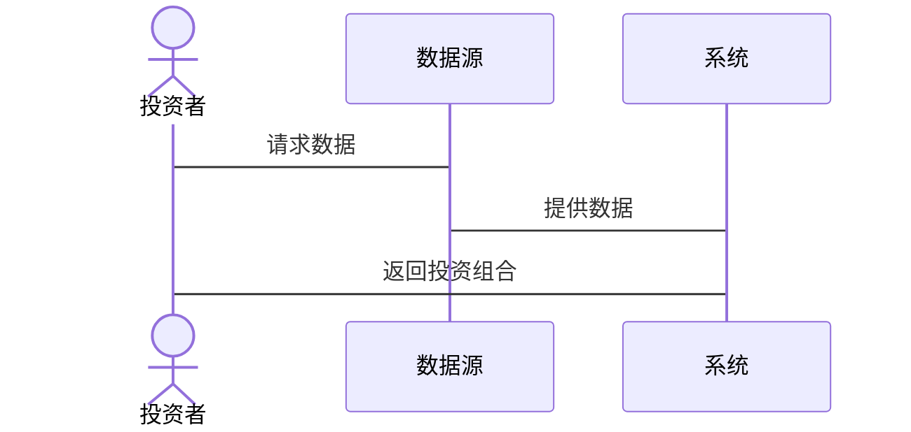

                 


# 如何利用特价股票策略进行数字合成衍生品投资

> 关键词：特价股票策略，数字合成衍生品，投资策略，数学模型，算法实现

> 摘要：本文将详细介绍如何利用特价股票策略进行数字合成衍生品投资。通过分析特价股票策略的基本原理、数字合成衍生品的概念与类型，以及它们之间的关系，结合数学模型与算法实现，探讨如何在实际投资中应用这些策略。文章还包括系统架构设计、项目实战案例和最佳实践等内容，为读者提供全面的指导。

---

## 第1章: 特价股票策略与数字合成衍生品概述

### 1.1 特价股票策略的定义与背景

#### 1.1.1 什么是特价股票
特价股票是指价格低于市场平均价格或行业标准价格的股票。这类股票通常被认为具有较高的投资潜力，因为它们可能被市场低估，或者存在短期的价格波动机会。

#### 1.1.2 特价股票策略的背景与现状
随着金融市场的发展，投资者越来越关注如何利用价格波动进行投资。特价股票策略作为一种基于价格差异的投资策略，近年来受到广泛关注。特别是在数字化和智能化的背景下，特价股票策略的应用更加广泛。

#### 1.1.3 特价股票策略的核心要素
- 价格波动分析
- 市场套利机会
- 风险控制

### 1.2 数字合成衍生品的基本概念

#### 1.2.1 什么是数字合成衍生品
数字合成衍生品是通过技术手段合成的金融工具，可以是股票、债券、期货等的组合，也可以是基于算法生成的虚拟资产。

#### 1.2.2 数字合成衍生品的类型
- 股票组合
- 期货组合
- 虚拟资产

#### 1.2.3 数字合成衍生品与传统金融衍生品的区别
| 特性                | 数字合成衍生品          | 传统金融衍生品        |
|---------------------|-------------------------|------------------------|
| 合成方式            | 技术合成                | 约定或法律合同          |
| 可定制性            | 高                     | 低                     |
| 透明度              | 高                     | 低                     |
| 风险控制            | 可通过算法优化          | 需要人工干预           |

### 1.3 特价股票策略与数字合成衍生品的关系

#### 1.3.1 特价股票策略在数字合成衍生品中的应用
- 利用特价股票构建组合衍生品
- 通过算法优化投资组合

#### 1.3.2 数字合成衍生品如何增强特价股票策略的效果
- 提供多样化的投资组合
- 降低投资风险

#### 1.3.3 两者的结合对投资的影响
通过结合特价股票策略和数字合成衍生品，投资者可以更好地捕捉市场机会，同时降低投资风险。

### 1.4 本章小结
本章介绍了特价股票策略和数字合成衍生品的基本概念，并探讨了两者之间的关系。接下来的章节将深入分析策略的核心原理和数学模型。

---

## 第2章: 特价股票策略的核心原理与数学模型

### 2.1 特价股票策略的核心原理

#### 2.1.1 市场套利机会的识别
通过分析市场价差，识别套利机会。

#### 2.1.2 价格波动与投资机会
利用股票价格波动，进行短期投资。

#### 2.1.3 特价股票的筛选与评估
- 筛选标准：低PE值、低PB值
- 评估方法：技术分析与基本面分析

### 2.2 数字合成衍生品的数学模型

#### 2.2.1 衍生品定价的基本公式
$$ P = S_0 + rT + \sigma \sqrt{T} Z $$

其中：
- \( P \)：衍生品价格
- \( S_0 \)：标的资产价格
- \( r \)：无风险利率
- \( T \)：时间
- \( \sigma \)：波动率
- \( Z \)：标准正态分布随机变量

#### 2.2.2 数字合成衍生品的组合优化模型
$$ \text{Maximize } \mu \text{ subject to } \sigma \leq \text{风险限制} $$

其中：
- \( \mu \)：预期收益
- \( \sigma \)：投资组合的波动率

#### 2.2.3 数学模型在投资决策中的应用
通过数学模型优化投资组合，降低风险，提高收益。

### 2.3 特价股票策略与数字合成衍生品的结合模型

#### 2.3.1 策略组合的数学表达
$$ \text{收益} = \sum_{i=1}^{n} w_i r_i $$

其中：
- \( w_i \)：投资比例
- \( r_i \)：资产的预期收益

#### 2.3.2 投资组合的风险与收益分析
通过夏普比率衡量投资组合的风险调整后收益。

$$ \text{夏普比率} = \frac{r_p - r_f}{\sigma_p} $$

其中：
- \( r_p \)：投资组合的收益
- \( r_f \)：无风险利率
- \( \sigma_p \)：投资组合的波动率

#### 2.3.3 数学模型在实际投资中的应用案例
通过具体案例分析，展示数学模型的应用过程和效果。

### 2.4 本章小结
本章详细讲解了特价股票策略和数字合成衍生品的核心原理，并通过数学模型展示了如何优化投资组合。

---

## 第3章: 数字合成衍生品的投资策略与算法实现

### 3.1 数字合成衍生品的投资策略

#### 3.1.1 投资策略的分类与选择
- 短期交易策略
- 长期持有策略
- 对冲策略

#### 3.1.2 投资策略的实施步骤
1. 数据采集与分析
2. 策略设计与优化
3. 风险控制与调整

### 3.2 数字合成衍生品的算法实现

#### 3.2.1 算法的基本原理
通过算法分析市场数据，识别投资机会。

#### 3.2.2 算法实现的步骤与流程
1. 数据预处理
2. 模型训练
3. 信号生成
4. 投资组合优化

#### 3.2.3 算法的优化与改进
- 参数优化
- 模型迭代

### 3.3 算法的数学模型与公式

#### 3.3.1 投资组合优化的数学模型
$$ \text{Maximize } \mu \text{ subject to } \sigma \leq \text{风险限制} $$

#### 3.3.2 算法实现的伪代码与流程图
```python
def invest_strategy(data):
    # 数据预处理
    preprocessed_data = preprocess(data)
    # 模型训练
    model = train_model(preprocessed_data)
    # 信号生成
    signals = generate_signals(model, preprocessed_data)
    # 投资组合优化
    portfolio = optimize_portfolio(signals)
    return portfolio
```

### 3.4 本章小结
本章通过具体算法实现，展示了如何利用数字合成衍生品进行投资策略的优化与实施。

---

## 第4章: 系统架构与项目实战

### 4.1 系统功能模块设计

#### 4.1.1 数据采集模块
- 采集市场数据
- 数据清洗

#### 4.1.2 策略执行模块
- 策略选择
- 信号生成

#### 4.1.3 风险控制模块
- 风险评估
- 风险控制

#### 4.1.4 投资组合管理模块
- 组合优化
- 性能监控

### 4.2 系统架构设计

#### 4.2.1 分层架构设计
- 数据层
- 业务逻辑层
- 表现层

#### 4.2.2 模块之间的交互
- 数据层与业务逻辑层交互
- 业务逻辑层与表现层交互

### 4.3 系统接口设计

#### 4.3.1 数据接口
- 数据输入接口
- 数据输出接口

#### 4.3.2 用户接口
- 界面设计
- 用户交互

### 4.4 系统交互的流程图


### 4.5 本章小结
本章通过系统架构设计和项目实战，展示了如何将理论应用于实际投资中。

---

## 第5章: 项目实战与案例分析

### 5.1 环境安装与配置
- 安装Python
- 安装相关库（如Pandas、NumPy）

### 5.2 系统核心实现源代码

#### 5.2.1 数据采集代码
```python
import pandas as pd
import numpy as np

def get_data(ticker):
    # 数据获取逻辑
    return pd.DataFrame()
```

#### 5.2.2 策略执行代码
```python
def execute_strategy(data):
    # 策略执行逻辑
    return signals
```

#### 5.2.3 风险控制代码
```python
def risk_management(signals, portfolio):
    # 风险控制逻辑
    return adjusted_portfolio
```

### 5.3 实际案例分析

#### 5.3.1 案例背景
- 投资标的：某只特价股票
- 投资时间：1个月

#### 5.3.2 案例分析
通过分析市场数据，制定投资策略，实现收益最大化。

#### 5.3.3 案例总结
- 收益情况
- 风险控制效果

### 5.4 本章小结
本章通过具体案例分析，展示了如何利用特价股票策略进行数字合成衍生品投资。

---

## 第6章: 最佳实践与小结

### 6.1 投资策略的关键点
- 价格波动分析
- 风险控制
- 算法优化

### 6.2 投资建议
- 多策略结合
- 风险管理优先
- 持续优化策略

### 6.3 未来展望
- 算法优化
- 新型衍生品开发
- 市场深度应用

### 6.4 本章小结
本文通过详细分析，为读者提供了如何利用特价股票策略进行数字合成衍生品投资的全面指导。

---

## 作者：AI天才研究院/AI Genius Institute & 禅与计算机程序设计艺术 /Zen And The Art of Computer Programming

---

这篇文章通过系统的分析与实际案例，深入探讨了如何利用特价股票策略进行数字合成衍生品投资。从理论到实践，从策略到算法，从系统架构到项目实战，为读者提供了全面的指导和参考。

