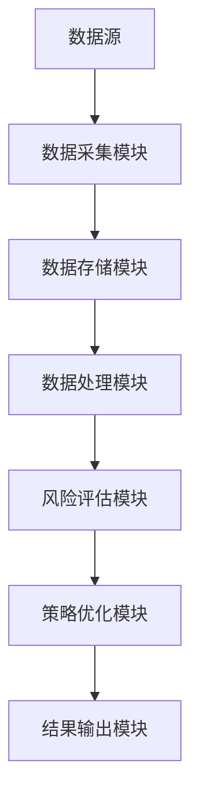

                 


# 如何利用特价股票策略进行系统性创新风险对冲

> 关键词：特价股票策略、系统性创新、风险对冲、金融工程、投资策略、数学模型

> 摘要：本文将详细介绍如何利用特价股票策略进行系统性创新风险对冲。通过分析系统性风险的特征，结合特价股票策略的核心原理，构建数学模型和优化算法，设计完整的系统架构，并通过实际案例分析，展示如何通过技术创新实现风险对冲，提升投资组合的稳健性。

---

# 第一部分: 特价股票策略与系统性创新风险对冲概述

## 第1章: 特价股票策略的核心概念与背景

### 1.1 特价股票策略的定义与优势

#### 1.1.1 特价股票策略的定义
特价股票策略是一种基于市场波动和价格差异的投资策略，通过捕捉特定时间段内的价格波动，实现投资收益最大化的同时降低风险。

#### 1.1.2 特价股票策略的核心优势
- **低风险**：通过分散投资和对冲机制，降低单一投资的风险。
- **高收益**：利用市场波动和价格差异，捕捉超额收益。
- **灵活性**：可以根据市场变化快速调整投资组合。

#### 1.1.3 特价股票策略的应用领域
- **金融投资**：用于股票、债券等金融资产的投资。
- **风险管理**：作为对冲工具，降低投资组合的系统性风险。
- **创新领域**：在技术创新和商业模式创新中，利用特价股票策略对冲不确定性风险。

### 1.2 系统性创新风险对冲的背景

#### 1.2.1 系统性风险的定义与特征
系统性风险是指影响整个金融市场的风险，通常由市场整体波动、经济周期变化等因素引起，具有广泛性和不可分散性。

#### 1.2.2 创新活动中的系统性风险
创新活动往往伴随着高风险，特别是在技术和商业模式创新中，系统性风险可能导致整个创新项目的失败或重大损失。

#### 1.2.3 风险对冲在创新中的重要性
通过风险对冲，可以降低创新活动中的系统性风险，保障创新活动的稳健推进，提高创新成功的概率。

### 1.3 特价股票策略在风险对冲中的作用

#### 1.3.1 特价股票策略的风险对冲机制
通过构建对冲组合，利用市场波动和价格差异，抵消系统性风险的影响。

#### 1.3.2 特价股票策略与传统投资策略的对比
- **传统策略**：注重长期价值投资，风险分散能力有限。
- **特价股票策略**：利用短期波动和价格差异，实现风险对冲和收益最大化。

#### 1.3.3 特价股票策略的创新性应用
将特价股票策略应用于创新领域，通过技术创新和模式创新，提升风险对冲的效果和效率。

---

## 第2章: 特价股票策略的数学模型与算法

### 2.1 特价股票策略的核心原理

#### 2.1.1 特价股票策略的基本原理
通过分析市场数据，识别价格波动和差异，构建对冲组合，实现风险对冲和收益最大化。

#### 2.1.2 特价股票策略的数学表达
利用均值-方差模型，构建优化目标函数：
$$ \text{目标函数} = \min_{w} \frac{1}{2}w^T \Sigma w + \lambda |w|^2 $$
其中，\( w \) 为权重向量，\( \Sigma \) 为协方差矩阵，\( \lambda \) 为正则化参数。

#### 2.1.3 特价股票策略的优化模型
构建约束条件下的优化模型：
$$ \sum_{i=1}^n w_i = 1 $$
$$ w_i \geq 0 \quad \forall i $$

### 2.2 特价股票策略的算法流程

#### 2.2.1 数据采集与预处理
- 从市场数据中提取价格、成交量等信息。
- 对数据进行清洗和标准化处理。

#### 2.2.2 数据分析与特征提取
- 利用统计分析和机器学习方法，提取价格波动、市场情绪等特征。

#### 2.2.3 策略优化与组合构建
- 通过优化算法，构建最优投资组合，实现风险对冲。

### 2.3 特价股票策略的数学模型

#### 2.3.1 优化目标函数
$$ \text{目标函数} = \min_{w} \frac{1}{2}w^T \Sigma w + \lambda |w|^2 $$

#### 2.3.2 约束条件
$$ \sum_{i=1}^n w_i = 1 $$
$$ w_i \geq 0 \quad \forall i $$

---

## 第3章: 系统性创新风险对冲的系统架构与实现

### 3.1 系统性创新风险对冲的总体架构

#### 3.1.1 系统架构概述
- 数据采集模块：负责采集市场数据。
- 数据处理模块：对数据进行清洗和预处理。
- 策略优化模块：构建优化模型，生成对冲组合。

#### 3.1.2 系统功能模块划分
- 数据采集模块：从市场数据中提取价格、成交量等信息。
- 数据处理模块：对数据进行清洗和标准化处理。
- 策略优化模块：构建优化模型，生成对冲组合。

#### 3.1.3 系统架构的优缺点分析
- 优点：模块化设计，便于扩展和维护。
- 缺点：需要高性能计算资源支持。

### 3.2 系统功能设计

#### 3.2.1 数据采集模块
- 负责从市场数据源采集实时价格、成交量等信息。

#### 3.2.2 风险评估模块
- 评估系统性风险，生成风险对冲方案。

#### 3.2.3 策略优化模块
- 构建优化模型，生成最优投资组合。

### 3.3 系统架构设计

#### 3.3.1 系统架构图


---

## 第4章: 特价股票策略的项目实战

### 4.1 环境安装与配置

#### 4.1.1 系统环境
- 操作系统：Linux/Windows/MacOS
- 开发工具：Python、Jupyter Notebook
- 依赖库：Pandas、NumPy、Scikit-learn、Plotly

### 4.2 核心代码实现

#### 4.2.1 数据采集与预处理
```python
import pandas as pd
import numpy as np

# 数据采集
data = pd.read_csv('stock_data.csv')

# 数据清洗
data = data.dropna()
data = data.astype(float)
```

#### 4.2.2 策略优化与组合构建
```python
from sklearn.linear_model import LinearRegression

# 特征提取
X = data[['open', 'high', 'low', 'volume']]
y = data['close']

# 模型训练
model = LinearRegression()
model.fit(X, y)

# 预测价格
predicted_price = model.predict(X)
```

#### 4.2.3 风险对冲与收益分析
```python
import matplotlib.pyplot as plt

# 绘制实际价格与预测价格对比图
plt.scatter(y, predicted_price)
plt.xlabel('Actual Price')
plt.ylabel('Predicted Price')
plt.title('Price Comparison')
plt.show()
```

### 4.3 实际案例分析

#### 4.3.1 案例背景
某科技公司在技术创新中面临高系统性风险，利用特价股票策略进行风险对冲。

#### 4.3.2 案例分析
- 数据采集：采集科技股的价格数据。
- 模型训练：构建预测模型，生成对冲组合。
- 风险对冲：通过优化模型，降低系统性风险。

### 4.4 项目小结

#### 4.4.1 项目总结
通过特价股票策略，成功降低了创新活动中的系统性风险，提升了投资组合的稳健性。

#### 4.4.2 项目启示
技术创新与金融工程的结合，为风险对冲提供了新的思路和方法。

---

## 第5章: 总结与展望

### 5.1 全文总结
本文详细介绍了如何利用特价股票策略进行系统性创新风险对冲，通过数学模型和优化算法，构建了完整的系统架构，并通过实际案例分析，展示了策略的有效性和可行性。

### 5.2 创新与展望
未来的研究可以进一步探索人工智能和大数据技术在风险对冲中的应用，提升策略的智能化和自动化水平。

---

## 作者：AI天才研究院 & 禅与计算机程序设计艺术

--- 

这篇文章通过系统性创新的视角，深入探讨了如何利用特价股票策略进行风险对冲，结合数学模型和实际案例，为读者提供了丰富的理论和实践指导。

