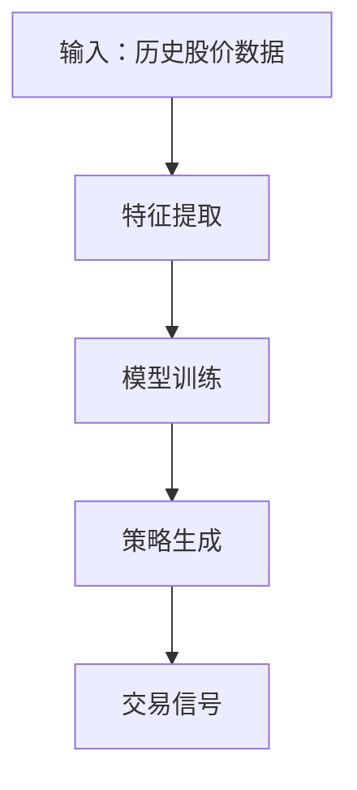
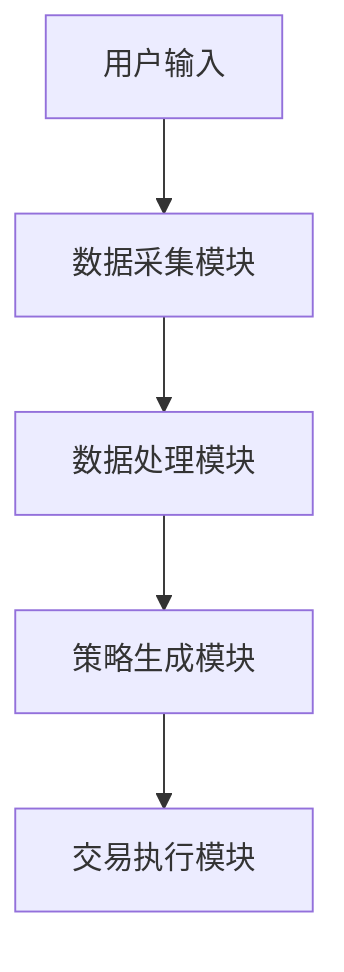
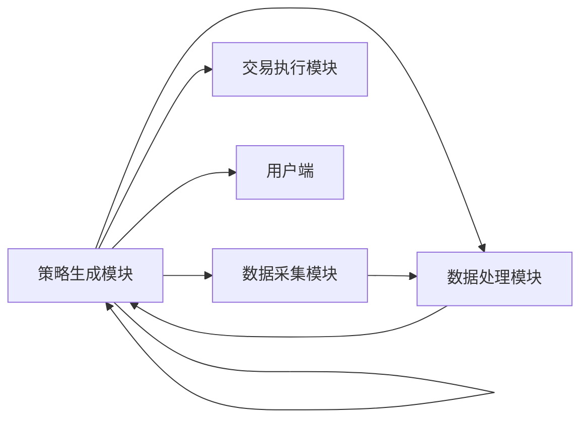

                 


# 如何利用特价股票策略进行系统性数字创新机会捕捉

> 关键词：特价股票策略，系统性数字创新，机会捕捉，股票交易，算法优化

> 摘要：本文系统性地探讨了如何利用特价股票策略捕捉数字创新机会，通过背景介绍、核心概念分析、算法原理、系统设计与实战案例，帮助读者掌握数字创新在股票交易中的应用。

---

## 目录

### 第1章: 特价股票策略的背景与概念

#### 1.1 特价股票的定义与特点
- 1.1.1 特价股票的定义
- 1.1.2 特价股票的特点
- 1.1.3 特价股票与普通股票的区别

#### 1.2 系统性数字创新机会捕捉的背景
- 1.2.1 数字化转型对企业的影响
- 1.2.2 特价股票策略在数字创新中的作用
- 1.2.3 系统性机会捕捉的必要性

#### 1.3 本章小结

---

### 第2章: 特价股票策略的核心概念分析

#### 2.1 特价股票策略的原理
- 2.1.1 特价股票的形成机制
- 2.1.2 市场供需关系对特价股票的影响
- 2.1.3 技术分析与基本面分析的结合

#### 2.2 特价股票策略与数字创新的联系
- 2.2.1 数字技术在股票交易中的应用
- 2.2.2 数据分析与算法优化
- 2.2.3 数字创新对特价股票策略的推动

#### 2.3 特价股票策略的核心要素对比
- 2.3.1 特价股票与普通股票的属性对比
- 2.3.2 不同特价股票策略的优缺点分析
- 2.3.3 特价股票策略的适用场景

#### 2.4 本章小结

---

### 第3章: 特价股票策略的算法原理

#### 3.1 特价股票策略的算法框架
- 3.1.1 算法输入与输出
- 3.1.2 算法流程图（Mermaid）



#### 3.2 算法原理的数学模型与公式
- 3.2.1 趋势分析模型：移动平均线（MA）
  $$ MA_t = \frac{1}{n} \sum_{i=1}^{n} P_{t-i} $$
- 3.2.2 波动率分析模型：标准差（Standard Deviation）
  $$ \sigma = \sqrt{\frac{1}{N} \sum_{i=1}^{N} (x_i - \mu)^2} $$
- 3.2.3 组合策略模型：RSI（相对强弱指数）
  $$ RSI_t = \frac{100 - \frac{N - 1}{N} \times \frac{A_t}{B_t}}{1 - \frac{N - 1}{N} \times \frac{A_t}{B_t}} \times 100 $$

#### 3.3 算法优化与实现
- 3.3.1 算法优化策略
- 3.3.2 Python核心代码实现

```python
def calculate_rsi(prices, period=14):
    # 计算RSI指标
    delta = prices.diff()
    up = delta.where(delta > 0, 0)
    down = delta.where(delta < 0, 0)
    avg_up = up.rolling(period).mean()
    avg_down = down.rolling(period).mean()
    rsi = 100 - (100 - (avg_up / avg_down))
    return rsi
```

#### 3.4 本章小结

---

### 第4章: 系统性数字创新机会捕捉的系统设计

#### 4.1 系统功能设计
- 4.1.1 系统目标与功能模块划分
- 4.1.2 系统功能流程图（Mermaid）



#### 4.2 系统架构设计
- 4.2.1 系统架构图（Mermaid）



#### 4.3 系统接口设计
- 4.3.1 数据接口
- 4.3.2 交易接口

#### 4.4 本章小结

---

### 第5章: 项目实战与案例分析

#### 5.1 环境安装与配置
- 5.1.1 Python环境搭建
- 5.1.2 第三方库安装（如Pandas、Matplotlib）

#### 5.2 核心代码实现
- 5.2.1 数据采集与处理
- 5.2.2 策略实现与回测

#### 5.3 实际案例分析
- 5.3.1 案例背景
- 5.3.2 数据分析与策略优化
- 5.3.3 实验结果与总结

#### 5.4 本章小结

---

### 第6章: 最佳实践与小结

#### 6.1 最佳实践
- 6.1.1 数据质量管理
- 6.1.2 策略优化技巧
- 6.1.3 风险控制策略

#### 6.2 本章小结

---

### 附录

- 附录A: 术语表
- 附录B: 参考文献
- 附录C: 代码库地址

---

### 作者

作者：AI天才研究院/AI Genius Institute & 禅与计算机程序设计艺术 /Zen And The Art of Computer Programming

---

# 结语

通过以上目录结构，您可以逐步展开每个部分，深入分析和撰写内容。希望这篇技术博客对您有所帮助！

